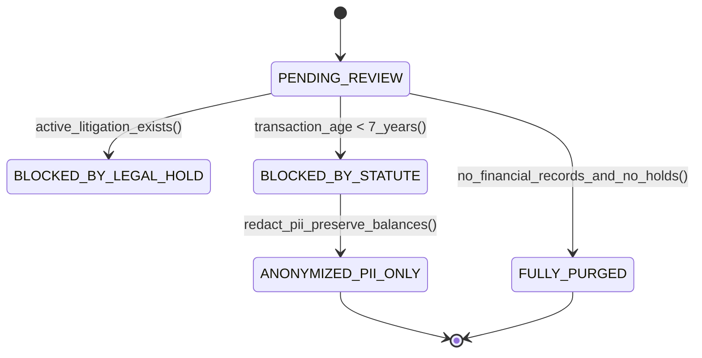

# Data Privacy vs Statutory Retention: GDPR Article 17, Legal Holds & PII Anonymization
> Based on **Data Privacy and GDPR: A Practical Guide for Enterprise Architects**

## 1. Canonical Enterprise Architecture & PostgreSQL Data Model (DDL)

```sql
-- Data Privacy, Legal Holds & Pseudonymization Schema
CREATE TABLE statutory_retention_rules (
    rule_id UUID PRIMARY KEY DEFAULT uuid_generate_v4(),
    document_type VARCHAR(50) NOT NULL UNIQUE, -- 'TAX_INVOICE', 'GENERAL_LEDGER', 'PAYROLL'
    retention_period_years INT NOT NULL CHECK (retention_period_years >= 1),
    governing_statute VARCHAR(100) NOT NULL -- e.g. 'IRS_IRC_6001', 'GERMAN_GOBD_SEC_147'
);

INSERT INTO statutory_retention_rules VALUES
    ('TAX_INVOICE', 7, 'IRS_IRC_6001'),
    ('GENERAL_LEDGER', 10, 'GERMAN_GOBD_SEC_147'),
    ('CUSTOMER_INQUIRY', 1, 'GDPR_DATA_MINIMIZATION');

CREATE TABLE legal_holds (
    hold_id UUID PRIMARY KEY DEFAULT uuid_generate_v4(),
    matter_name VARCHAR(150) NOT NULL,
    target_party_id UUID NOT NULL REFERENCES parties(party_id),
    is_active BOOLEAN NOT NULL DEFAULT TRUE,
    issued_at TIMESTAMPTZ NOT NULL DEFAULT NOW(),
    released_at TIMESTAMPTZ
);

CREATE TABLE gdpr_erasure_requests (
    request_id UUID PRIMARY KEY DEFAULT uuid_generate_v4(),
    party_id UUID NOT NULL REFERENCES parties(party_id),
    requested_at TIMESTAMPTZ NOT NULL DEFAULT NOW(),
    status VARCHAR(30) NOT NULL CHECK (status IN ('PENDING_REVIEW', 'BLOCKED_BY_LEGAL_HOLD', 'BLOCKED_BY_STATUTE', 'ANONYMIZED_PII_ONLY', 'FULLY_PURGED'))
);
```

## 2. Mathematical Foundations & Business Invariants

### 2.1 GDPR Art. 17(3)(b) vs Statutory Retention Invariant
Under GDPR Article 17, a data subject's Right to Erasure does NOT apply when processing is necessary for compliance with a legal obligation (e.g. tax/accounting retention mandates).
$$\text{Can Purge}(D) \iff \text{Age}(D) > \text{StatutoryPeriod}(D) \land \neg \text{LegalHold}(D)$$

### 2.2 Pseudonymization Invariant (Preserving Financial Integrity)
When an erasure request is executed on an active ledger participant:
$$\text{Anonymize}(\text{Name, Email, Address, Phone}) \to \text{HMAC}(\text{PII}, K_{\text{salt}})$$
**Invariant**: Debit and credit balances, transaction timestamps, and financial account numbers MUST remain strictly untouched and mathematically balanced.

## 3. Finite State Machine (FSM) & Lifecycle Invariants

### 3.1 GDPR Erasure Request Lifecycle


## 4. Production Implementation Guidelines (Rust / SQL / Python)

```rust
pub struct RetentionPolicy;

impl RetentionPolicy {
    pub fn can_delete_record(age_years: u32, statutory_requirement: u32, has_legal_hold: bool) -> bool {
        if has_legal_hold {
            return false; // Legal hold trumps all deletion
        }
        age_years >= statutory_requirement
    }
}
```

## 5. Actionable Prompt Recipes

### 5.1 Local Ollama Cheat Sheet (Actionable Constraints & Invariants)
```markdown
- Never delete posted financial ledger rows to comply with GDPR: invoke Art 17(3)(b) exemption.
- Anonymize PII (replace with cryptographic hash or '[REDACTED]') while preserving monetary balances.
- Legal holds immediately override all automated deletion or archiving schedules.
- Maintain a data retention schedule table defining minimum statutory retention per document type.
```

### 5.2 Cloud LLM Architectural Prompt (Comprehensive Engineering Blueprint)
```markdown
Design an enterprise data privacy and statutory retention engine:
1. Implement automated data lifecycle policies distinguishing marketing records from statutory accounting ledgers.
2. Build GDPR Article 17 erasure pipelines evaluating active legal holds and statutory tax retention constraints.
3. Cryptographically pseudonymize customer PII in historical orders while preserving General Ledger debits/credits.
4. Provide legal hold administration consoles capable of freezing document deletion across entire subsidiaries.
```
