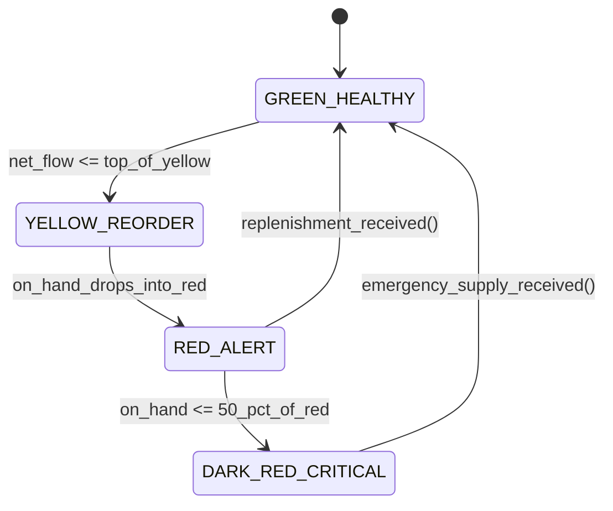

# Demand Driven MRP (DDMRP): Decoupled Lead Time, Dynamic Buffers & Net Flow Equation
> Based on **Demand Driven Material Requirements Planning (DDMRP) - Carol Ptak & Chad Smith**

## 1. Canonical Enterprise Architecture & PostgreSQL Data Model (DDL)

```sql
-- DDMRP Dynamic Buffer Profiles & Net Flow Calculations
CREATE TABLE ddmrp_buffers (
    buffer_id UUID PRIMARY KEY DEFAULT uuid_generate_v4(),
    product_id UUID NOT NULL REFERENCES products(product_id),
    warehouse_id UUID NOT NULL REFERENCES supply_chain_nodes(node_id),
    average_daily_usage NUMERIC(12, 4) NOT NULL CHECK (average_daily_usage > 0),
    decoupled_lead_time_days NUMERIC(6, 2) NOT NULL CHECK (decoupled_lead_time_days > 0),
    lead_time_factor NUMERIC(4, 3) NOT NULL CHECK (lead_time_factor BETWEEN 0.1 AND 1.0),
    variability_factor NUMERIC(4, 3) NOT NULL CHECK (variability_factor BETWEEN 0.1 AND 1.0),
    min_order_quantity NUMERIC(12, 4) NOT NULL DEFAULT 0.0000,
    -- Zones
    green_zone_qty NUMERIC(12, 4) NOT NULL,
    yellow_zone_qty NUMERIC(12, 4) NOT NULL,
    red_zone_qty NUMERIC(12, 4) NOT NULL,
    top_of_red NUMERIC(12, 4) GENERATED ALWAYS AS (red_zone_qty) STORED,
    top_of_yellow NUMERIC(12, 4) GENERATED ALWAYS AS (red_zone_qty + yellow_zone_qty) STORED,
    top_of_green NUMERIC(12, 4) GENERATED ALWAYS AS (red_zone_qty + yellow_zone_qty + green_zone_qty) STORED,
    updated_at TIMESTAMPTZ NOT NULL DEFAULT NOW(),
    CONSTRAINT uq_ddmrp_buffer UNIQUE (product_id, warehouse_id)
);

CREATE TABLE ddmrp_daily_net_flow (
    calc_id UUID PRIMARY KEY DEFAULT uuid_generate_v4(),
    buffer_id UUID NOT NULL REFERENCES ddmrp_buffers(buffer_id),
    calculation_date DATE NOT NULL,
    on_hand_qty NUMERIC(12, 4) NOT NULL,
    open_supply_qty NUMERIC(12, 4) NOT NULL,
    qualified_demand_spike_qty NUMERIC(12, 4) NOT NULL DEFAULT 0.0000,
    net_flow_position NUMERIC(12, 4) GENERATED ALWAYS AS (on_hand_qty + open_supply_qty - qualified_demand_spike_qty) STORED,
    order_recommended BOOLEAN NOT NULL,
    recommended_order_qty NUMERIC(12, 4) NOT NULL DEFAULT 0.0000
);
```

## 2. Mathematical Foundations & Business Invariants

### 2.1 DDMRP 3-Color Buffer Zone Sizing Formulas
For item with Average Daily Usage (ADU), Decoupled Lead Time (DLT), Lead Time Factor (LTF), and Variability Factor (VF):
1. **Yellow Zone**:
   $$\text{Yellow Zone} = \text{ADU} \times \text{DLT}$$
2. **Red Zone**:
   $$\text{Red Base} = \text{ADU} \times \text{DLT} \times \text{LTF}$$
   $$\text{Red Safety} = \text{Red Base} \times \text{VF}$$
   $$\text{Red Zone} = \text{Red Base} + \text{Red Safety}$$
3. **Green Zone**:
   $$\text{Green Zone} = \max\left(\text{MinOrderQty}, \text{ADU} \times \text{DLT} \times \text{LTF}\right)$$

### 2.2 The Net Flow Equation & Order Recommendation
$$\text{Net Flow Position} = \text{On-Hand} + \text{On-Order (Open Supply)} - \text{Qualified Demand Spikes}$$
*(A Qualified Demand Spike is any sales order due within the spike horizon that exceeds threshold, typically $50\% \text{ of Red Base}$)*.
**Replenishment Invariant**:
$$\text{If } \text{Net Flow Position} \le \text{Top of Yellow} \implies \text{Order Recommended}$$
$$\text{Recommended Order Quantity} = \text{Top of Green} - \text{Net Flow Position}$$

## 3. Finite State Machine (FSM) & Lifecycle Invariants

### 3.1 DDMRP Execution Priority State Machine


## 4. Production Implementation Guidelines (Rust / SQL / Python)

```rust
pub struct DdmrpBuffer {
    pub adu: f64,
    pub dlt: f64,
    pub ltf: f64,
    pub vf: f64,
    pub moq: f64,
}

pub struct DdmrpZones {
    pub red: f64,
    pub yellow: f64,
    pub green: f64,
    pub top_of_red: f64,
    pub top_of_yellow: f64,
    pub top_of_green: f64,
}

impl DdmrpBuffer {
    pub fn calculate_zones(&self) -> DdmrpZones {
        let yellow = self.adu * self.dlt;
        let red_base = self.adu * self.dlt * self.ltf;
        let red = red_base + (red_base * self.vf);
        let green = self.moq.max(self.adu * self.dlt * self.ltf);

        DdmrpZones {
            red,
            yellow,
            green,
            top_of_red: red,
            top_of_yellow: red + yellow,
            top_of_green: red + yellow + green,
        }
    }

    pub fn evaluate_net_flow(
        zones: &DdmrpZones,
        on_hand: f64,
        on_order: f64,
        demand_spikes: f64,
    ) -> (bool, f64) {
        let net_flow = on_hand + on_order - demand_spikes;
        if net_flow <= zones.top_of_yellow {
            let order_qty = zones.top_of_green - net_flow;
            (true, order_qty)
        } else {
            (false, 0.0)
        }
    }
}
```

## 5. Actionable Prompt Recipes

### 5.1 Local Ollama Cheat Sheet (Actionable Constraints & Invariants)
```markdown
- Net Flow Equation = On-Hand + Open Supply - Qualified Demand Spikes.
- Replenish whenever Net Flow <= Top of Yellow. Order Quantity = Top of Green - Net Flow.
- Size Yellow = ADU * DLT; Red = RedBase * (1 + VF); Green = max(MOQ, RedBase).
- Color-code execution priority by On-Hand percentage of Red Zone.
```

### 5.2 Cloud LLM Architectural Prompt (Comprehensive Engineering Blueprint)
```markdown
Architect an enterprise Demand Driven MRP (DDMRP) engine:
1. Dynamically recalculate Average Daily Usage (ADU) and Decoupled Lead Time (DLT) across decoupling points.
2. Maintain dynamic buffer zones adjusting automatically to seasonal or trend shifts in demand.
3. Implement the daily Net Flow equation execution generating purchase and work order recommendations up to Top of Green.
4. Construct visual priority boards ranking open orders by buffer penetration percentage.
```
