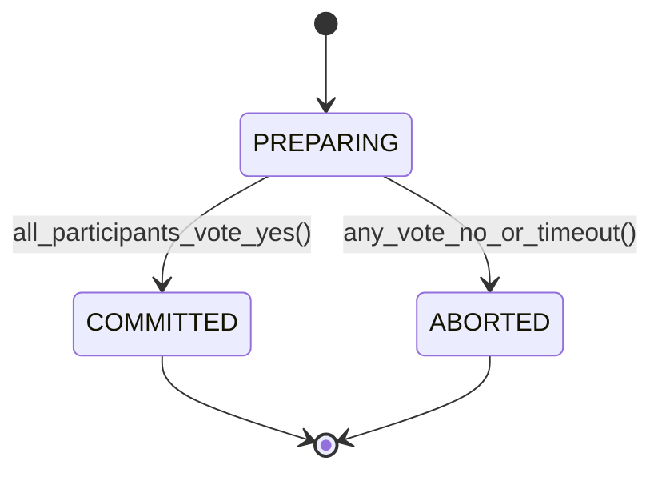

# Distributed ACID & Consensus: Serializability, 2PC & Kleppmann Enterprise Invariants
> Based on **Designing Data-Intensive Applications - Martin Kleppmann**

## 1. Canonical Enterprise Architecture & PostgreSQL Data Model (DDL)

```sql
-- Distributed Transaction Logging & Snapshot Isolation Validation
CREATE TABLE distributed_transactions (
    txn_id UUID PRIMARY KEY DEFAULT uuid_generate_v4(),
    coordinator_node_id VARCHAR(50) NOT NULL,
    isolation_level VARCHAR(30) NOT NULL CHECK (isolation_level IN ('READ_COMMITTED', 'REPEATABLE_READ', 'SNAPSHOT_ISOLATION', 'SERIALIZABLE')),
    status VARCHAR(20) NOT NULL CHECK (status IN ('PREPARING', 'PREPARED', 'COMMITTED', 'ABORTED')),
    start_time TIMESTAMPTZ NOT NULL DEFAULT NOW(),
    commit_time TIMESTAMPTZ
);

CREATE TABLE participant_votes (
    vote_id UUID PRIMARY KEY DEFAULT uuid_generate_v4(),
    txn_id UUID NOT NULL REFERENCES distributed_transactions(txn_id) ON DELETE CASCADE,
    participant_resource VARCHAR(100) NOT NULL,
    vote VARCHAR(10) NOT NULL CHECK (vote IN ('YES', 'NO')),
    voted_at TIMESTAMPTZ NOT NULL DEFAULT NOW(),
    CONSTRAINT uq_txn_participant UNIQUE (txn_id, participant_resource)
);
```

## 2. Mathematical Foundations & Business Invariants

### 2.1 Write Skew Invariant & Anti-Dependency Cycle
Write skew occurs under Snapshot Isolation when two concurrent transactions read overlapping datasets, verify invariant $P$, and update disjoint records such that $P$ is violated.
**Prevention Rule**:
$$\text{To prevent write skew: Use } \text{SELECT ... FOR UPDATE} \lor \text{SERIALIZABLE isolation}$$
Example (On-Call Shift Invariant): At least 1 doctor must be on call:
$$\sum_{d \in \text{Doctors}} \mathbf{1}_{\{\text{on\_call}(d)\}} \ge 1$$
If both active doctors concurrently check the sum ($= 2$) and each sets their own `on_call = false`, both commit under Snapshot Isolation, leaving 0 doctors on call (Write Skew!).

### 2.2 Two-Phase Commit (2PC) Unanimity Invariant
Let $P_1, \dots, P_k$ be the resource managers:
$$\text{Commit Decision} = \begin{cases} \text{COMMIT} & \text{iff } \bigwedge_{i=1}^k \text{Vote}(P_i) = \text{"YES"} \\ \text{ABORT} & \text{if } \exists i \text{ s.t. } \text{Vote}(P_i) = \text{"NO"} \lor \text{Timeout} \end{cases}$$

## 3. Finite State Machine (FSM) & Lifecycle Invariants

### 3.1 Two-Phase Commit (2PC) Coordinator FSM


## 4. Production Implementation Guidelines (Rust / SQL / Python)

```rust
pub enum TwoPhaseVote {
    Yes,
    No,
}

pub fn decide_2pc(votes: &[TwoPhaseVote]) -> &'static str {
    if votes.is_empty() {
        return "ABORT";
    }
    for vote in votes {
        if let TwoPhaseVote::No = vote {
            return "ABORT";
        }
    }
    "COMMIT"
}
```

## 5. Actionable Prompt Recipes

### 5.1 Local Ollama Cheat Sheet (Actionable Constraints & Invariants)
```markdown
- Prevent Write Skew: Use SELECT ... FOR UPDATE or SERIALIZABLE isolation when checking aggregate invariants.
- 2PC rule: All participants must vote YES to commit; a single NO or timeout aborts.
- Differentiate Read Committed, Repeatable Read, and Serializable levels.
- Beware of clock drift: do not rely on local wall-clock timestamps for total order.
```

### 5.2 Cloud LLM Architectural Prompt (Comprehensive Engineering Blueprint)
```markdown
Architect an enterprise data tier conforming to Martin Kleppmann's distributed principles:
1. Identify and eliminate potential write skew anomalies across critical business workflows (e.g. shift booking, credit limits).
2. Implement distributed transaction coordination with logging and crash-recovery state machines.
3. Replace blocking 2PC architectures with asynchronous Saga choreographies where high availability is required.
4. Test network partition scenarios validating consistency versus availability trade-offs.
```
