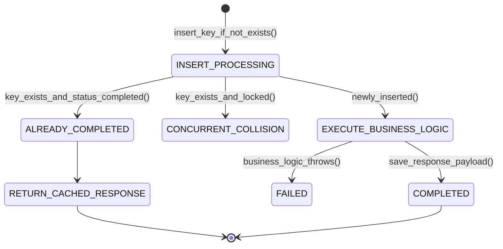

# Distributed Idempotency: Idempotency Keys, Deduplication & Atomic Execution
> Based on **Enterprise Integration Patterns / Distributed Systems Standards**

## 1. Canonical Enterprise Architecture & PostgreSQL Data Model (DDL)

```sql
-- Distributed Idempotency Key Storage Schema
CREATE TABLE idempotency_keys (
    key_id VARCHAR(255) NOT NULL,
    tenant_id UUID NOT NULL REFERENCES tenants(tenant_id),
    request_hash VARCHAR(64) NOT NULL, -- SHA-256 of request path + body
    status VARCHAR(20) NOT NULL CHECK (status IN ('PROCESSING', 'COMPLETED', 'FAILED')),
    response_code INT,
    response_headers JSONB,
    response_body JSONB,
    created_at TIMESTAMPTZ NOT NULL DEFAULT NOW(),
    locked_until TIMESTAMPTZ NOT NULL,
    PRIMARY KEY (tenant_id, key_id)
);
```

## 2. Mathematical Foundations & Business Invariants

### 2.1 Mathematical Idempotency Invariant
A function or operation $f$ is idempotent iff applying it multiple times yields the same result as a single invocation:
$$f(f(x)) = f(x) \quad \forall x$$
In API terms:
$$\text{Exec}(K, P) = \text{Exec}(K, P) \implies \text{SideEffects}(K, P) \text{ execute exactly once}$$

### 2.2 Payload Consistency Invariant
If a client sends the same idempotency key $K$ with conflicting payload $P' \ne P$:
$$\text{Hash}(P') \ne \text{Hash}(P) \implies \text{Throw 422 Unprocessable Entity ("Idempotency key payload mismatch")}$$

## 3. Finite State Machine (FSM) & Lifecycle Invariants

### 3.1 Idempotency Key Processing Lifecycle


## 4. Production Implementation Guidelines (Rust / SQL / Python)

```rust
use sha2::{Digest, Sha256};

pub fn hash_request_payload(path: &str, body: &[u8]) -> String {
    let mut hasher = Sha256::new();
    hasher.update(path.as_bytes());
    hasher.update(b"|");
    hasher.update(body);
    format!("{:x}", hasher.finalize())
}
```

## 5. Actionable Prompt Recipes

### 5.1 Local Ollama Cheat Sheet (Actionable Constraints & Invariants)
```markdown
- Accept Idempotency-Key header on all state-mutating HTTP requests (POST, PUT).
- Atomically insert key with status 'PROCESSING' before executing business logic.
- Return cached response immediately on duplicate requests with matching payload hash.
- Reject requests using the same idempotency key with modified payloads (HTTP 422).
```

### 5.2 Cloud LLM Architectural Prompt (Comprehensive Engineering Blueprint)
```markdown
Design an enterprise distributed idempotency middleware:
1. Implement IETF Idempotency-Key specification with PostgreSQL row-level locks or Redis atomic sets.
2. Guarantee exactly-once financial transaction semantics across retries from upstream clients.
3. Cache HTTP response headers and bodies, replaying them with identical status codes upon duplication.
4. Test concurrent duplicate requests validating that only one thread executes the side effect while others wait or replay.
```
