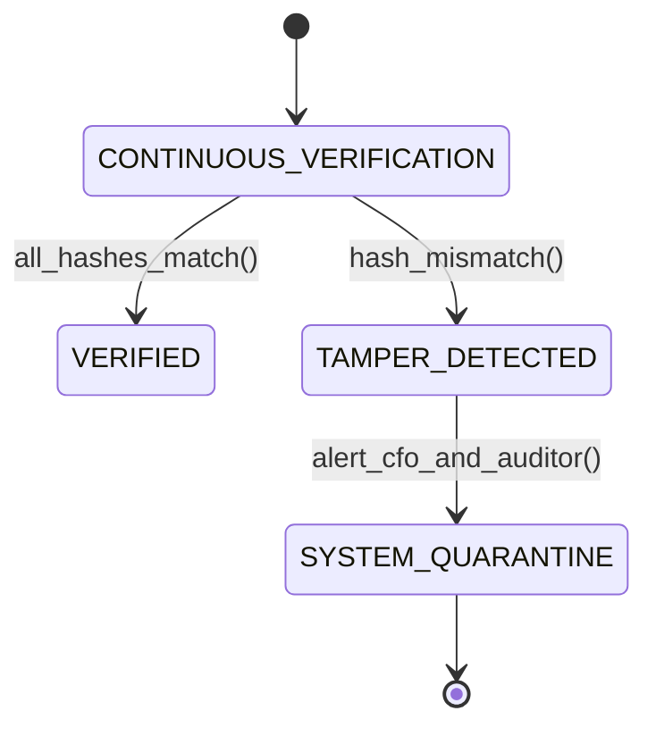

# Continuous Ledger Auditing: Tamper-Evident Hash Chains & Pacioli Audit Discipline
> Based on **Double Entry: How the Merchants of Venice Created Modern Capitalism - Jane Gleeson-White**

## 1. Canonical Enterprise Architecture & PostgreSQL Data Model (DDL)

```sql
-- Tamper-Evident Hash-Chained Audit Ledger
CREATE TABLE immutable_audit_ledger (
    sequence_number BIGSERIAL PRIMARY KEY,
    journal_entry_id UUID NOT NULL UNIQUE REFERENCES journal_entries(entry_id),
    posting_timestamp TIMESTAMPTZ NOT NULL,
    posted_by VARCHAR(50) NOT NULL,
    entry_payload_canonical_json TEXT NOT NULL,
    previous_hash VARCHAR(64) NOT NULL,
    current_hash VARCHAR(64) NOT NULL,
    merkle_root VARCHAR(64),
    CONSTRAINT chk_audit_hashes CHECK (current_hash <> previous_hash)
);

CREATE TABLE audit_verification_logs (
    check_id UUID PRIMARY KEY DEFAULT uuid_generate_v4(),
    verified_at TIMESTAMPTZ NOT NULL DEFAULT NOW(),
    last_verified_seq BIGINT NOT NULL,
    is_valid BOOLEAN NOT NULL,
    broken_sequence_id BIGINT
);
```

## 2. Mathematical Foundations & Business Invariants

### 2.1 Cryptographic Hash Chain Invariant
For entry sequence $n$:
$$H_0 = \text{GenesisHash} = \text{SHA256}(\text{"GENESIS\_LEDGER\_START"})$$
$$H_n = \text{SHA256}(H_{n-1} \parallel \text{Seq}_n \parallel \text{Timestamp}_n \parallel \text{CanonicalJSON}_n)$$

### 2.2 Immutability Proof
If any historical record $k < n$ is altered ($P_k \to P'_k$):
$$H_k' \ne H_k \implies H_{k+1}' \ne H_{k+1} \implies \dots \implies H_n' \ne H_n$$
Any single-bit perturbation invalidates the entire subsequent chain.

## 3. Finite State Machine (FSM) & Lifecycle Invariants

### 3.1 Audit Verification State Machine


## 4. Production Implementation Guidelines (Rust / SQL / Python)

```rust
use sha2::{Digest, Sha256};

pub struct AuditRecord {
    pub seq: u64,
    pub timestamp: String,
    pub payload_json: String,
    pub prev_hash: String,
}

impl AuditRecord {
    pub fn compute_hash(&self) -> String {
        let mut hasher = Sha256::new();
        hasher.update(self.prev_hash.as_bytes());
        hasher.update(self.seq.to_be_bytes());
        hasher.update(self.timestamp.as_bytes());
        hasher.update(self.payload_json.as_bytes());
        format!("{:x}", hasher.finalize())
    }

    pub fn verify_chain(records: &[AuditRecord]) -> Result<(), (usize, &'static str)> {
        for i in 1..records.len() {
            let prev = &records[i - 1];
            let curr = &records[i];
            if curr.prev_hash != prev.compute_hash() {
                return Err((i, "Hash chain link broken! Potential tamper detected."));
            }
        }
        Ok(())
    }
}
```

## 5. Actionable Prompt Recipes

### 5.1 Local Ollama Cheat Sheet (Actionable Constraints & Invariants)
```markdown
- Never allow SQL UPDATE or DELETE on ledger tables; enforce append-only policies.
- Cryptographically chain each journal entry to its immediate predecessor via SHA-256 / Blake3.
- Discard floating-point representations when hashing: use canonical integer or decimal strings.
- Voided entries must be appended as explicitly signed reversing entries, never deleted.
```

### 5.2 Cloud LLM Architectural Prompt (Comprehensive Engineering Blueprint)
```markdown
Implement a tamper-evident enterprise ledger auditing module:
1. Construct an append-only audit trail linking each posted journal entry in a cryptographic hash chain.
2. Build background verifiers that recursively traverse the chain to assert hash integrity.
3. Trigger automated incident response and accounting locks upon detection of hash discrepancies.
4. Implement exportable Merkle proofs for external auditors (SOX, PCAOB).
```
