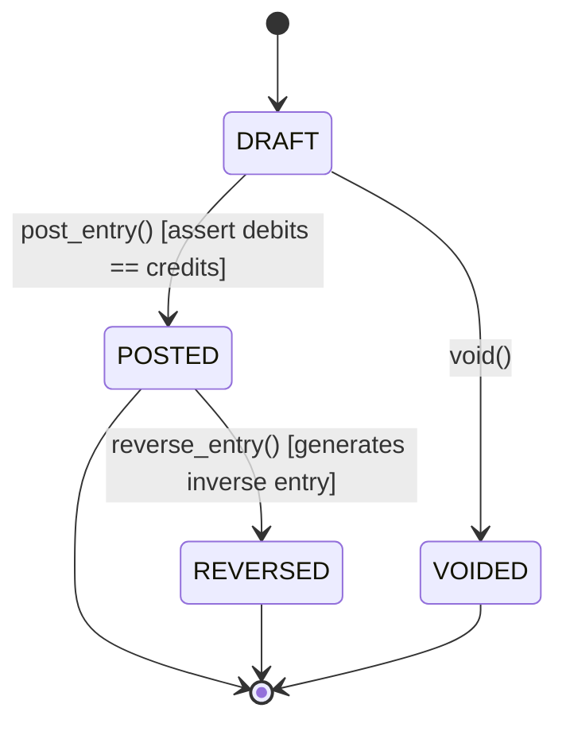

# Double-Entry Bookkeeping & General Ledger: Mathematical Accounting Invariants
> Based on **Accounting Made Simple - Mike Piper**

## 1. Canonical Enterprise Architecture & PostgreSQL Data Model (DDL)

```sql
-- Double-Entry General Ledger Schema
CREATE TABLE chart_of_accounts (
    account_code VARCHAR(20) PRIMARY KEY,
    name VARCHAR(100) NOT NULL,
    account_type VARCHAR(20) NOT NULL CHECK (account_type IN ('ASSET', 'LIABILITY', 'EQUITY', 'REVENUE', 'EXPENSE')),
    normal_balance VARCHAR(6) NOT NULL CHECK (normal_balance IN ('DEBIT', 'CREDIT')),
    is_reconciled BOOLEAN NOT NULL DEFAULT FALSE,
    is_active BOOLEAN NOT NULL DEFAULT TRUE
);

CREATE TABLE journal_entries (
    entry_id UUID PRIMARY KEY DEFAULT uuid_generate_v4(),
    entry_number VARCHAR(50) NOT NULL UNIQUE,
    posting_date DATE NOT NULL,
    period VARCHAR(7) NOT NULL, -- YYYY-MM
    description TEXT NOT NULL,
    status VARCHAR(20) NOT NULL CHECK (status IN ('DRAFT', 'POSTED', 'REVERSED', 'VOIDED')),
    created_by VARCHAR(50) NOT NULL,
    posted_at TIMESTAMPTZ,
    created_at TIMESTAMPTZ NOT NULL DEFAULT NOW()
);

CREATE TABLE journal_lines (
    line_id UUID PRIMARY KEY DEFAULT uuid_generate_v4(),
    entry_id UUID NOT NULL REFERENCES journal_entries(entry_id) ON DELETE CASCADE,
    line_number INT NOT NULL,
    account_code VARCHAR(20) NOT NULL REFERENCES chart_of_accounts(account_code),
    debit NUMERIC(18, 4) NOT NULL DEFAULT 0.0000 CHECK (debit >= 0),
    credit NUMERIC(18, 4) NOT NULL DEFAULT 0.0000 CHECK (credit >= 0),
    currency CHAR(3) NOT NULL,
    description VARCHAR(255),
    CONSTRAINT chk_debit_or_credit CHECK ((debit > 0 AND credit = 0) OR (credit > 0 AND debit = 0)),
    CONSTRAINT uq_entry_line UNIQUE (entry_id, line_number)
);

CREATE INDEX idx_journal_lines_entry ON journal_lines(entry_id);
CREATE INDEX idx_journal_lines_account ON journal_lines(account_code);
```

## 2. Mathematical Foundations & Business Invariants

### 2.1 Fundamental Accounting Invariant
The foundational equation of double-entry bookkeeping:
$$\text{Assets} = \text{Liabilities} + \text{Equity}$$
Expanded with nominal accounts (income statement):
$$\text{Assets} = \text{Liabilities} + \text{Equity} + (\text{Revenue} - \text{Expenses}) - \text{Dividends}$$
Rearranging into pure debit/credit parity:
$$\underbrace{\text{Assets} + \text{Expenses} + \text{Dividends}}_{\text{Normal Debit Balance}} = \underbrace{\text{Liabilities} + \text{Equity} + \text{Revenue}}_{\text{Normal Credit Balance}}$$

### 2.2 Strict Balance Invariant
For every posted journal entry $J$:
$$\sum_{l \in \text{Lines}(J)} \text{debit}_l - \sum_{l \in \text{Lines}(J)} \text{credit}_l = 0.0000$$
Any journal entry where $|\sum \text{debit} - \sum \text{credit}| > 10^{-4}$ MUST be rejected.

## 3. Finite State Machine (FSM) & Lifecycle Invariants

### 3.1 Journal Entry State Lifecycle

- **Invariant**: Once `POSTED`, a journal entry CANNOT be edited or deleted. Correction requires generating a compensating `REVERSED` entry.

## 4. Production Implementation Guidelines (Rust / SQL / Python)

```rust
use rust_decimal::Decimal;
use uuid::Uuid;

#[derive(Debug, Clone)]
pub struct JournalLine {
    pub account_code: String,
    pub debit: Decimal,
    pub credit: Decimal,
}

pub struct JournalEntry {
    pub entry_id: Uuid,
    pub lines: Vec<JournalLine>,
    pub is_posted: bool,
}

impl JournalEntry {
    pub fn validate_balance(&self) -> Result<(), &'static str> {
        if self.lines.len() < 2 {
            return Err("Journal entry must have at least 2 lines");
        }
        let total_debit: Decimal = self.lines.iter().map(|l| l.debit).sum();
        let total_credit: Decimal = self.lines.iter().map(|l| l.credit).sum();

        if total_debit != total_credit {
            return Err("Debits must strictly equal credits");
        }
        if total_debit == Decimal::ZERO {
            return Err("Zero-amount journal entries are forbidden");
        }
        Ok(())
    }

    pub fn post(&mut self) -> Result<(), &'static str> {
        self.validate_balance()?;
        self.is_posted = true;
        Ok(())
    }
}
```

## 5. Actionable Prompt Recipes

### 5.1 Local Ollama Cheat Sheet (Actionable Constraints & Invariants)
```markdown
- Enforce strict debit == credit invariant before saving any journal entry.
- Disallow single-line entries: minimum 2 lines required per journal voucher.
- Never update or delete a POSTED entry; issue a reversing debit/credit voucher instead.
- Require positive amounts: debit >= 0 and credit >= 0, mutually exclusive per line.
```

### 5.2 Cloud LLM Architectural Prompt (Comprehensive Engineering Blueprint)
```markdown
Implement a production double-entry general ledger service adhering to ASC/IFRS standards:
1. Ensure the PostgreSQL schema enforces debit/credit mutual exclusivity on every line.
2. Build a transaction posting orchestrator that locks account rows and asserts sum(debits) == sum(credits).
3. Implement an automated reversal engine that creates inverted offsetting entries for corrections.
4. Provide unit tests validating balance enforcement, trial balance summation, and prevention of post-commit tampering.
```
