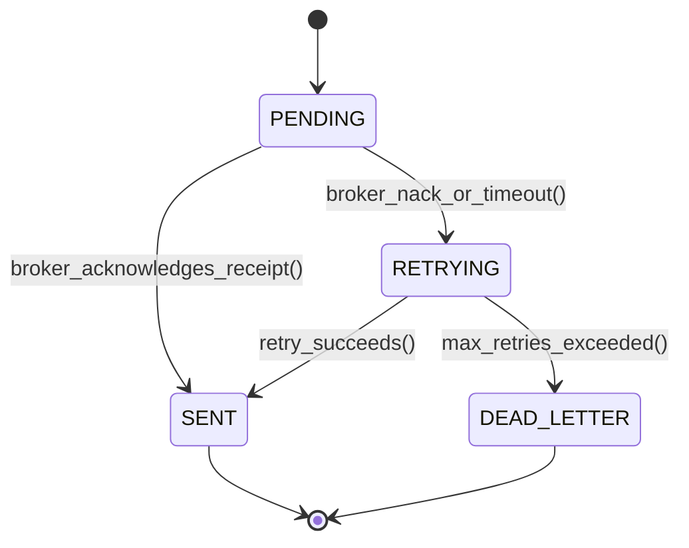

# Enterprise Integration Patterns: Messaging, Content-Based Routers & Transactional Outbox
> Based on **Enterprise Integration Patterns - Gregor Hohpe & Bobby Woolf**

## 1. Canonical Enterprise Architecture & PostgreSQL Data Model (DDL)

```sql
-- Enterprise Integration Patterns: Outbox, Routing & DLQ
CREATE TABLE transactional_outbox (
    outbox_id UUID PRIMARY KEY DEFAULT uuid_generate_v4(),
    aggregate_type VARCHAR(100) NOT NULL,
    aggregate_id UUID NOT NULL,
    event_type VARCHAR(100) NOT NULL,
    payload JSONB NOT NULL,
    headers JSONB NOT NULL DEFAULT '{}',
    status VARCHAR(20) NOT NULL DEFAULT 'PENDING' CHECK (status IN ('PENDING', 'SENT', 'FAILED')),
    retry_count INT NOT NULL DEFAULT 0,
    created_at TIMESTAMPTZ NOT NULL DEFAULT NOW(),
    sent_at TIMESTAMPTZ
);

CREATE TABLE dead_letter_queue (
    dlq_id UUID PRIMARY KEY DEFAULT uuid_generate_v4(),
    original_message_id UUID NOT NULL,
    channel_name VARCHAR(100) NOT NULL,
    error_message TEXT NOT NULL,
    stack_trace TEXT,
    payload JSONB NOT NULL,
    failed_at TIMESTAMPTZ NOT NULL DEFAULT NOW()
);

CREATE TABLE integration_claim_checks (
    claim_check_id UUID PRIMARY KEY DEFAULT uuid_generate_v4(),
    payload_uri TEXT NOT NULL,
    content_hash VARCHAR(64) NOT NULL,
    created_at TIMESTAMPTZ NOT NULL DEFAULT NOW()
);
```

## 2. Mathematical Foundations & Business Invariants

### 2.1 Transactional Outbox Atomic Guarantee
Let state transition be $T_{\text{state}}$ and event publication be $T_{\text{event}}$.
In distributed databases, writing to the message broker directly risks inconsistency (Dual-Write Problem).
**Outbox Invariant**:
$$\text{Transaction} = \{ \text{Mutate Aggregate Table}, \text{Insert into } \text{transactional\_outbox} \}$$
Atomicity is guaranteed by local relational ACID:
$$\text{State Mutated} \iff \text{Outbox Row Created}$$

### 2.2 Splitter-Aggregator Cardinality Invariant
When a composite order with $N$ lines is decomposed by a Splitter:
$$\text{Tokens Generated} = N$$
An Aggregator awaiting correlation key $K$ will not emit the consolidated batch until:
$$\text{Received Tokens}(K) = N$$

## 3. Finite State Machine (FSM) & Lifecycle Invariants

### 3.1 Outbox Message Publisher FSM


## 4. Production Implementation Guidelines (Rust / SQL / Python)

```rust
pub struct ContentBasedRouter;

impl ContentBasedRouter {
    pub fn route_order(order_type: &str, total_amount: f64) -> &'static str {
        match order_type {
            "SALES_ORDER" if total_amount > 100_000.0 => "high-value-fulfillment-queue",
            "SALES_ORDER" => "standard-fulfillment-queue",
            "RETURN_ORDER" => "reverse-logistics-queue",
            _ => "default-exception-channel",
        }
    }
}
```

## 5. Actionable Prompt Recipes

### 5.1 Local Ollama Cheat Sheet (Actionable Constraints & Invariants)
```markdown
- Never write to database and message broker independently: use Transactional Outbox.
- Insert outbox event in the same ACID transaction as the business aggregate update.
- Use Content-Based Routers to isolate routing rules from payload producers.
- Move unprocessable messages to Dead Letter Queue (DLQ) after exponential retries.
```

### 5.2 Cloud LLM Architectural Prompt (Comprehensive Engineering Blueprint)
```markdown
Design an enterprise messaging and integration backbone based on Hohpe & Woolf:
1. Implement Transactional Outbox pattern paired with Debezium CDC or background polling workers.
2. Build Splitter and Aggregator components handling concurrent item fulfillment routing.
3. Use Claim Check patterns offloading large payload attachments to object storage.
4. Construct Dead Letter Queue (DLQ) monitoring and manual reprocessing consoles.
```
