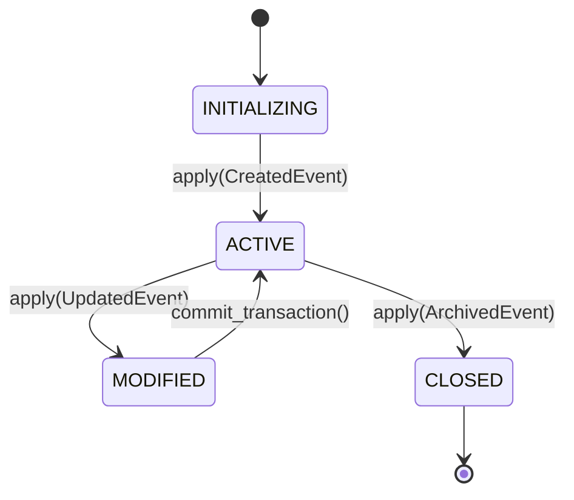

# Domain-Driven Design in ERP: Ubiquitous Language, Aggregates & Anti-Corruption Layers
> Based on **Domain-Driven Design: Tackling Complexity in the Heart of Software - Eric Evans**

## 1. Canonical Enterprise Architecture & PostgreSQL Data Model (DDL)

```sql
-- Evans Tactical DDD Infrastructure: Aggregates, Event Outbox & ACL
CREATE TABLE ddd_bounded_contexts (
    context_id VARCHAR(50) PRIMARY KEY,
    name VARCHAR(100) NOT NULL,
    description TEXT,
    created_at TIMESTAMPTZ NOT NULL DEFAULT NOW()
);

CREATE TABLE order_aggregates (
    aggregate_id UUID PRIMARY KEY,
    context_id VARCHAR(50) NOT NULL REFERENCES ddd_bounded_contexts(context_id),
    version BIGINT NOT NULL DEFAULT 1,
    status VARCHAR(30) NOT NULL,
    customer_id UUID NOT NULL,
    currency CHAR(3) NOT NULL,
    total_amount NUMERIC(18, 4) NOT NULL,
    payload_snapshot JSONB NOT NULL,
    created_at TIMESTAMPTZ NOT NULL DEFAULT NOW(),
    updated_at TIMESTAMPTZ NOT NULL DEFAULT NOW()
);

CREATE TABLE outbox_messages (
    message_id UUID PRIMARY KEY DEFAULT uuid_generate_v4(),
    aggregate_type VARCHAR(100) NOT NULL,
    aggregate_id UUID NOT NULL,
    event_type VARCHAR(100) NOT NULL,
    payload JSONB NOT NULL,
    occurred_at TIMESTAMPTZ NOT NULL DEFAULT NOW(),
    processed_at TIMESTAMPTZ
);

CREATE TABLE acl_translation_mappings (
    mapping_id UUID PRIMARY KEY DEFAULT uuid_generate_v4(),
    source_system VARCHAR(50) NOT NULL,
    target_context VARCHAR(50) NOT NULL REFERENCES ddd_bounded_contexts(context_id),
    external_entity_id VARCHAR(100) NOT NULL,
    internal_aggregate_id UUID NOT NULL,
    created_at TIMESTAMPTZ NOT NULL DEFAULT NOW(),
    CONSTRAINT uq_acl_source UNIQUE (source_system, external_entity_id)
);

CREATE INDEX idx_outbox_unprocessed ON outbox_messages(occurred_at) WHERE processed_at IS NULL;
```

## 2. Mathematical Foundations & Business Invariants

### 2.1 Aggregate Invariant Preservation
Let an Aggregate Root state be $S$, satisfying domain invariant predicate $\Phi(S) = \text{true}$.
A command $C$ produces state $S'$ and domain events $E$:
$$(S', E) = f(S, C)$$
$$\Phi(S') = \text{true} \quad \forall C \in \text{ValidCommands}$$
If $\Phi(S') = \text{false}$, command $C$ is rejected and transaction rolls back.

### 2.2 Optimistic Versioning Invariant
Let $V_t$ be the aggregate version at time of read:
$$\text{UPDATE} \iff V_{\text{current}} = V_t \implies V_{\text{new}} = V_t + 1$$
If $V_{\text{current}} \ne V_t$, throw `ConcurrencyException` to guarantee serializable consistency.

## 3. Finite State Machine (FSM) & Lifecycle Invariants

### 3.1 Aggregate Lifecycle State Machine


## 4. Production Implementation Guidelines (Rust / SQL / Python)

```rust
use uuid::Uuid;
use rust_decimal::Decimal;

pub trait DomainEvent {
    fn event_type(&self) -> &'static str;
}

pub struct OrderItemCreated {
    pub item_id: Uuid,
    pub price: Decimal,
    pub quantity: Decimal,
}
impl DomainEvent for OrderItemCreated {
    fn event_type(&self) -> &'static str { "Order.ItemCreated" }
}

pub struct OrderAggregate {
    id: Uuid,
    version: u64,
    items: Vec<OrderItemCreated>,
    uncommitted_events: Vec<Box<dyn DomainEvent>>,
}

impl OrderAggregate {
    pub fn new(id: Uuid) -> Self {
        Self {
            id,
            version: 0,
            items: Vec::new(),
            uncommitted_events: Vec::new(),
        }
    }

    pub fn add_item(&mut self, item_id: Uuid, price: Decimal, qty: Decimal) -> Result<(), &'static str> {
        if qty <= Decimal::ZERO {
            return Err("Quantity must be strictly positive");
        }
        if price < Decimal::ZERO {
            return Err("Price cannot be negative");
        }
        let evt = OrderItemCreated { item_id, price, quantity: qty };
        self.uncommitted_events.push(Box::new(OrderItemCreated { item_id, price, quantity: qty }));
        self.items.push(evt);
        self.version += 1;
        Ok(())
    }

    pub fn take_uncommitted_events(&mut self) -> Vec<Box<dyn DomainEvent>> {
        std::mem::take(&mut self.uncommitted_events)
    }
}
```

## 5. Actionable Prompt Recipes

### 5.1 Local Ollama Cheat Sheet (Actionable Constraints & Invariants)
```markdown
- Never reference entities across Aggregate Root boundaries by object reference; use IDs only.
- Ensure transactions update only a single Aggregate Root per request.
- Use Outbox Pattern table within the same database transaction to publish Domain Events.
- Prevent domain logic contamination from external legacy schemas via an Anti-Corruption Layer (ACL).
- Invariants must be enforced inside the Aggregate Root boundary, never in external UI controllers.
```

### 5.2 Cloud LLM Architectural Prompt (Comprehensive Engineering Blueprint)
```markdown
Architect an enterprise domain core following Eric Evans' Domain-Driven Design principles:
1. Define explicit Bounded Contexts with context maps (Customer-Supplier, ACL, Shared Kernel).
2. Model business entities inside Aggregate Root boundaries ensuring external consumers hold references only to the Root ID.
3. Guarantee transactional outbox pattern implementation for atomic state mutations and domain event emissions.
4. Implement an Anti-Corruption Layer (ACL) translator to sanitize incoming legacy enterprise payloads.
```
