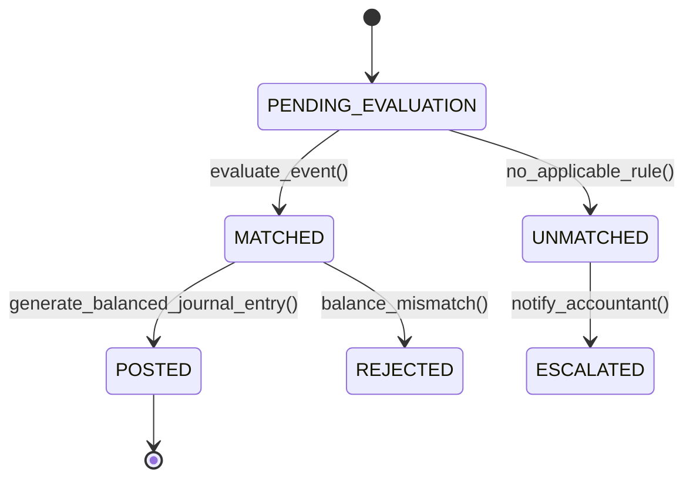

# Fowler Analysis Patterns: Accountability, Observation, Tiered Pricing & Accounting Rules
> Based on **Analysis Patterns: Reusable Object Models - Martin Fowler**

## 1. Canonical Enterprise Architecture & PostgreSQL Data Model (DDL)

```sql
-- Fowler Analysis Patterns: Knowledge Level vs Operational Level
CREATE TABLE accountability_types (
    accountability_type_id UUID PRIMARY KEY DEFAULT uuid_generate_v4(),
    name VARCHAR(100) NOT NULL UNIQUE,
    is_hierarchical BOOLEAN NOT NULL DEFAULT TRUE,
    description TEXT
);

CREATE TABLE accountabilities (
    accountability_id UUID PRIMARY KEY DEFAULT uuid_generate_v4(),
    accountability_type_id UUID NOT NULL REFERENCES accountability_types(accountability_type_id),
    commissioner_party_id UUID NOT NULL REFERENCES parties(party_id), -- Parent / Manager
    responsible_party_id UUID NOT NULL REFERENCES parties(party_id),  -- Child / Worker
    start_date DATE NOT NULL,
    end_date DATE,
    CONSTRAINT chk_acc_distinct CHECK (commissioner_party_id <> responsible_party_id),
    CONSTRAINT chk_acc_dates CHECK (end_date IS NULL OR end_date >= start_date)
);

CREATE TABLE units_of_measure (
    uom_id UUID PRIMARY KEY DEFAULT uuid_generate_v4(),
    symbol VARCHAR(10) NOT NULL UNIQUE,
    dimension VARCHAR(30) NOT NULL CHECK (dimension IN ('LENGTH', 'MASS', 'TIME', 'CURRENCY', 'VOLUME', 'DISCRETE')),
    conversion_factor_to_base NUMERIC(18, 8) NOT NULL CHECK (conversion_factor_to_base > 0)
);

CREATE TABLE phenomenon_types (
    phenomenon_type_id UUID PRIMARY KEY DEFAULT uuid_generate_v4(),
    name VARCHAR(100) NOT NULL UNIQUE,
    dimension VARCHAR(30) NOT NULL
);

CREATE TABLE observations (
    observation_id UUID PRIMARY KEY DEFAULT uuid_generate_v4(),
    target_party_id UUID NOT NULL REFERENCES parties(party_id),
    phenomenon_type_id UUID NOT NULL REFERENCES phenomenon_types(phenomenon_type_id),
    observed_value NUMERIC(18, 4) NOT NULL,
    uom_id UUID NOT NULL REFERENCES units_of_measure(uom_id),
    recorded_at TIMESTAMPTZ NOT NULL DEFAULT NOW()
);

CREATE TABLE tiered_pricing_rules (
    rule_id UUID PRIMARY KEY DEFAULT uuid_generate_v4(),
    product_id UUID NOT NULL REFERENCES products(product_id),
    min_quantity NUMERIC(14, 4) NOT NULL,
    max_quantity NUMERIC(14, 4), -- NULL means infinity
    unit_price NUMERIC(18, 4) NOT NULL CHECK (unit_price >= 0),
    CONSTRAINT chk_tier_range CHECK (max_quantity IS NULL OR max_quantity > min_quantity)
);

CREATE TABLE posting_rules (
    rule_id UUID PRIMARY KEY DEFAULT uuid_generate_v4(),
    event_type VARCHAR(100) NOT NULL,
    debit_account_code VARCHAR(50) NOT NULL,
    credit_account_code VARCHAR(50) NOT NULL,
    calculation_expression VARCHAR(255) NOT NULL,
    is_active BOOLEAN NOT NULL DEFAULT TRUE
);
```

## 2. Mathematical Foundations & Business Invariants

### 2.1 Unit of Measure Conversion Invariant
Let $Q_A$ be a quantity in unit $A$ and $Q_B$ in unit $B$ with conversion factors $C_A, C_B$ to the canonical dimension base unit:
$$Q_{\text{base}} = Q_A \times C_A$$
$$Q_B = \frac{Q_{\text{base}}}{C_B} = Q_A \times \frac{C_A}{C_B}$$

### 2.2 Tiered Pricing Function
For an order quantity $q$, pricing under tiered bands $[L_k, U_k)$ with rates $P_k$:
$$\text{TotalPrice}(q) = \sum_{k=1}^m \max(0, \min(q, U_k) - L_k) \times P_k$$
Ensuring monotonicity: $q_1 < q_2 \implies \text{TotalPrice}(q_1) \le \text{TotalPrice}(q_2)$.

## 3. Finite State Machine (FSM) & Lifecycle Invariants

### 3.1 Posting Rule Execution FSM


## 4. Production Implementation Guidelines (Rust / SQL / Python)

```rust
use rust_decimal::Decimal;

#[derive(Debug, Clone)]
pub struct Tier {
    pub min_qty: Decimal,
    pub max_qty: Option<Decimal>,
    pub unit_price: Decimal,
}

pub fn calculate_graduated_tiered_price(qty: Decimal, tiers: &[Tier]) -> Decimal {
    let mut total = Decimal::ZERO;
    for tier in tiers {
        if qty <= tier.min_qty {
            continue;
        }
        let upper = match tier.max_qty {
            Some(max) => qty.min(max),
            None => qty,
        };
        let applicable_qty = upper - tier.min_qty;
        total += applicable_qty * tier.unit_price;
    }
    total
}
```

## 5. Actionable Prompt Recipes

### 5.1 Local Ollama Cheat Sheet (Actionable Constraints & Invariants)
```markdown
- Differentiate Knowledge Level (AccountabilityType, PhenomenonType) from Operational Level (Accountability, Observation).
- Never mix dimension types in conversions (e.g. converting MASS to TIME must fail).
- Verify tiered pricing monotonicity: higher volume must not produce lower total invoice amount.
- Ensure all posting rules generate debits strictly equal to credits.
```

### 5.2 Cloud LLM Architectural Prompt (Comprehensive Engineering Blueprint)
```markdown
Implement Fowler's Analysis Patterns architecture in an enterprise microservice:
1. Model the separate Operational Level and Knowledge Level for accountability graphs and clinical/scientific observations.
2. Implement a dimension-safe Unit of Measure conversion engine supporting Length, Mass, Volume, and Currency.
3. Build a graduated tiered pricing engine with unit tests proving total cost monotonicity.
4. Implement a dynamic posting rule dispatcher that executes balanced double-entry journals for enterprise domain events.
```
