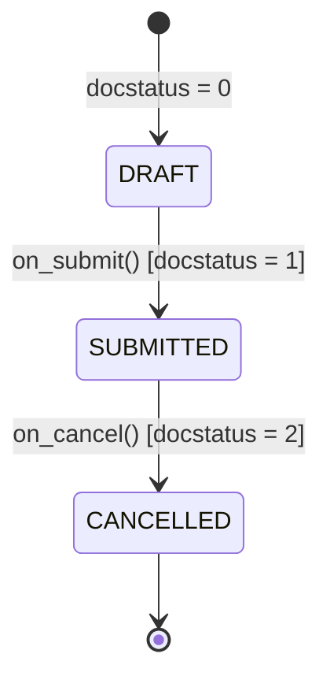

# Frappe Framework & ERPNext: DocType Engine, Submittable Docs & Hooks
> Based on **ERPNext: Open Source ERP - Rushabh Mehta**

## 1. Canonical Enterprise Architecture & PostgreSQL Data Model (DDL)

```sql
-- Frappe Framework DocType Metamodel Schema
CREATE TABLE tabDocType (
    name VARCHAR(140) PRIMARY KEY,
    module VARCHAR(140) NOT NULL,
    is_submittable SMALLINT NOT NULL DEFAULT 0 CHECK (is_submittable IN (0, 1)),
    is_tree SMALLINT NOT NULL DEFAULT 0,
    is_single SMALLINT NOT NULL DEFAULT 0,
    track_changes SMALLINT NOT NULL DEFAULT 1,
    creation TIMESTAMPTZ NOT NULL DEFAULT NOW(),
    modified TIMESTAMPTZ NOT NULL DEFAULT NOW()
);

CREATE TABLE tabDocField (
    name VARCHAR(140) PRIMARY KEY,
    parent VARCHAR(140) NOT NULL REFERENCES tabDocType(name) ON DELETE CASCADE,
    fieldname VARCHAR(140) NOT NULL,
    label VARCHAR(140) NOT NULL,
    fieldtype VARCHAR(50) NOT NULL CHECK (fieldtype IN ('Data', 'Int', 'Float', 'Currency', 'Link', 'Table', 'Select', 'Check', 'Date')),
    options VARCHAR(140), -- Target DocType for Link or Table
    reqd SMALLINT NOT NULL DEFAULT 0,
    idx INT NOT NULL DEFAULT 0
);
```

## 2. Mathematical Foundations & Business Invariants

### 2.1 Submittable Document State (DocStatus) Monotonicity Invariant
Frappe enforces strict monotonic state progression for accounting and inventory ledger documents:
$$\text{DocStatus} \in \{0, 1, 2\}$$
Where:
- $0$: Draft (Editable, non-posting).
- $1$: Submitted (Immutable, active General Ledger and Stock Ledger entries).
- $2$: Cancelled (Voided, creates inverse GL/SL balancing records).
**State Transition Invariant**:
$$0 \xrightarrow{\text{submit}} 1 \xrightarrow{\text{cancel}} 2$$
Transitions $1 \to 0$ or $2 \to 1$ are strictly forbidden. Direct deletion of a document with $\text{docstatus} = 1$ is an illegal operation.

## 3. Finite State Machine (FSM) & Lifecycle Invariants

### 3.1 Frappe DocStatus State Machine


## 4. Production Implementation Guidelines (Rust / SQL / Python)

```python
class FrappeDocument:
    def __init__(self, doctype: str, is_submittable: bool = False):
        self.doctype = doctype
        self.is_submittable = is_submittable
        self.docstatus = 0 # Draft

    def submit(self):
        if not self.is_submittable:
            raise ValueError(f"{self.doctype} is not submittable")
        if self.docstatus != 0:
            raise ValueError("Only draft documents can be submitted")
        self.docstatus = 1 # Submitted

    def cancel(self):
        if self.docstatus != 1:
            raise ValueError("Only submitted documents can be cancelled")
        self.docstatus = 2 # Cancelled
```

## 5. Actionable Prompt Recipes

### 5.1 Local Ollama Cheat Sheet (Actionable Constraints & Invariants)
```markdown
- DocStatus values: 0 = Draft, 1 = Submitted, 2 = Cancelled.
- Submitted documents (docstatus = 1) are strictly immutable; reverse them by cancelling.
- Wire business logic via hooks.py doc_events rather than editing core DocTypes.
- Child tables use fieldtype='Table' linked to sub-DocTypes.
```

### 5.2 Cloud LLM Architectural Prompt (Comprehensive Engineering Blueprint)
```markdown
Design an enterprise ERP core implementing Frappe / ERPNext framework paradigms:
1. Model metadata-driven DocTypes supporting Single, Standard, and Submittable document types.
2. Enforce immutable DocStatus progression with automated reverse GL/Stock ledger creation upon cancel.
3. Build server-side hooks intercepting before_insert, on_submit, and on_cancel lifecycle triggers.
4. Construct role-based permission controllers enforcing field-level read/write rules.
```
