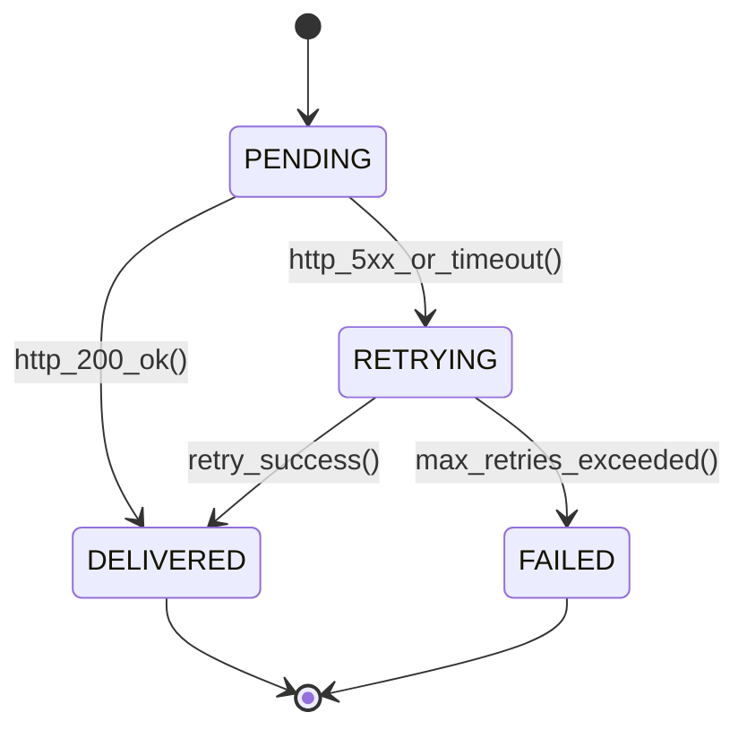

# Headless ERP Architecture: GraphQL, REST APIs, Webhooks & N+1 DataLoader Defense
> Based on **Designing Web APIs - Brenda Jin, Saurabh Sahni, Amir Shevat**

## 1. Canonical Enterprise Architecture & PostgreSQL Data Model (DDL)

```sql
-- API Keys, Webhook Subscriptions & Delivery Attempts
CREATE TABLE api_clients (
    client_id UUID PRIMARY KEY DEFAULT uuid_generate_v4(),
    client_name VARCHAR(100) NOT NULL,
    api_key_hash VARCHAR(64) NOT NULL UNIQUE,
    rate_limit_rpm INT NOT NULL DEFAULT 600,
    is_active BOOLEAN NOT NULL DEFAULT TRUE,
    created_at TIMESTAMPTZ NOT NULL DEFAULT NOW()
);

CREATE TABLE webhook_subscriptions (
    subscription_id UUID PRIMARY KEY DEFAULT uuid_generate_v4(),
    client_id UUID NOT NULL REFERENCES api_clients(client_id),
    event_topic VARCHAR(100) NOT NULL, -- e.g. 'order.shipped', 'invoice.paid'
    target_url TEXT NOT NULL,
    secret_token VARCHAR(128) NOT NULL,
    is_active BOOLEAN NOT NULL DEFAULT TRUE
);

CREATE TABLE webhook_deliveries (
    delivery_id UUID PRIMARY KEY DEFAULT uuid_generate_v4(),
    subscription_id UUID NOT NULL REFERENCES webhook_subscriptions(subscription_id),
    payload JSONB NOT NULL,
    signature_header VARCHAR(128) NOT NULL,
    http_status_code INT,
    status VARCHAR(20) NOT NULL CHECK (status IN ('PENDING', 'DELIVERED', 'RETRYING', 'FAILED')),
    attempt_count INT NOT NULL DEFAULT 0,
    created_at TIMESTAMPTZ NOT NULL DEFAULT NOW()
);
```

## 2. Mathematical Foundations & Business Invariants

### 2.1 DataLoader Batching Complexity Reduction
Without DataLoader, resolving child elements for $N$ parent objects results in:
$$\text{Queries} = 1 + N \implies O(N)$$
With DataLoader key batching:
$$\text{Queries} = 1 + 1 = 2 \implies O(1)$$

### 2.2 Webhook HMAC-SHA256 Signature Verification
To prevent spoofing and replay attacks:
$$\text{Signature} = \text{HMAC-SHA256}(\text{SecretToken}, \text{Timestamp} \parallel \text{"."} \parallel \text{PayloadBody})$$
The receiver must reject any webhook where computed signature $\ne$ header signature or where $|t_{\text{current}} - t_{\text{header}}| > 300\text{s}$.

## 3. Finite State Machine (FSM) & Lifecycle Invariants

### 3.1 Webhook Dispatcher State Machine


## 4. Production Implementation Guidelines (Rust / SQL / Python)

```rust
use hmac::{Hmac, Mac};
use sha2::Sha256;

pub fn compute_webhook_signature(secret: &[u8], payload: &[u8]) -> String {
    let mut mac = Hmac::<Sha256>::new_from_slice(secret).expect("HMAC can take key of any size");
    mac.update(payload);
    hex::encode(mac.finalize().into_bytes())
}
```

## 5. Actionable Prompt Recipes

### 5.1 Local Ollama Cheat Sheet (Actionable Constraints & Invariants)
```markdown
- Never write GraphQL resolvers that fetch children in a loop; always use DataLoader.
- Sign all outbound webhook payloads using HMAC-SHA256 with timestamp protection.
- Support Idempotency-Key headers on all POST/PUT endpoints.
- Enforce token bucket rate limiting on API keys.
```

### 5.2 Cloud LLM Architectural Prompt (Comprehensive Engineering Blueprint)
```markdown
Design an enterprise headless ERP API gateway:
1. Expose both high-performance RESTful resources and unified GraphQL endpoints.
2. Implement DataLoader batching defending against the N+1 query disaster.
3. Build reliable webhook dispatching with exponential backoff and HMAC-SHA256 cryptographic signatures.
4. Test API idempotency and rate limiting resilience under concurrent burst requests.
```
