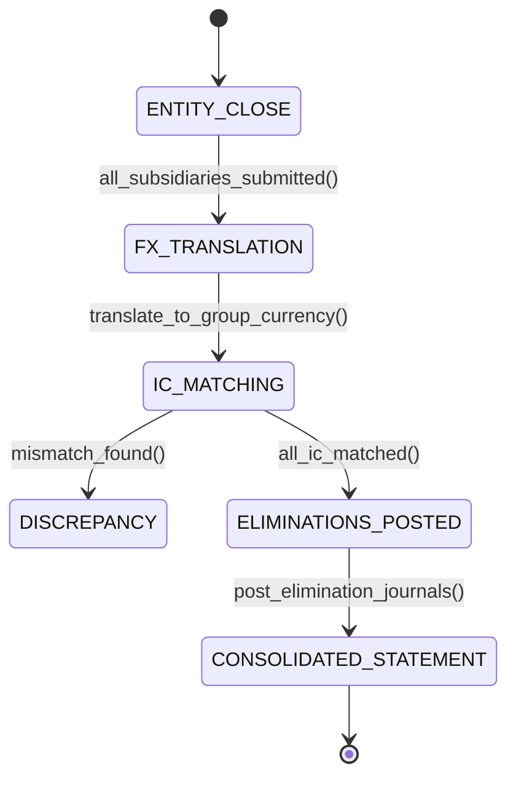

# Intercompany Accounting & Financial Consolidation: Eliminations, NCI & CTA
> Based on **Advanced Accounting - Hoyle, Schaefer, Doupnik**

## 1. Canonical Enterprise Architecture & PostgreSQL Data Model (DDL)

```sql
-- Multi-Entity Intercompany & Consolidation Schema
CREATE TABLE legal_entities (
    entity_id UUID PRIMARY KEY DEFAULT uuid_generate_v4(),
    code VARCHAR(20) NOT NULL UNIQUE,
    name VARCHAR(100) NOT NULL,
    functional_currency CHAR(3) NOT NULL,
    parent_entity_id UUID REFERENCES legal_entities(entity_id),
    ownership_percentage NUMERIC(5, 2) NOT NULL DEFAULT 100.00 CHECK (ownership_percentage BETWEEN 0 AND 100)
);

CREATE TABLE intercompany_transactions (
    ic_txn_id UUID PRIMARY KEY DEFAULT uuid_generate_v4(),
    originating_entity_id UUID NOT NULL REFERENCES legal_entities(entity_id),
    counterparty_entity_id UUID NOT NULL REFERENCES legal_entities(entity_id),
    txn_type VARCHAR(30) NOT NULL CHECK (txn_type IN ('SALE', 'SERVICE_FEE', 'LOAN', 'DIVIDEND')),
    amount_originating_currency NUMERIC(18, 4) NOT NULL,
    originating_currency CHAR(3) NOT NULL,
    status VARCHAR(20) NOT NULL CHECK (status IN ('PENDING_MATCH', 'MATCHED', 'DISCREPANCY', 'ELIMINATED')),
    created_at TIMESTAMPTZ NOT NULL DEFAULT NOW(),
    CONSTRAINT chk_ic_distinct_entities CHECK (originating_entity_id <> counterparty_entity_id)
);

CREATE TABLE elimination_journals (
    elimination_id UUID PRIMARY KEY DEFAULT uuid_generate_v4(),
    consolidation_period VARCHAR(7) NOT NULL,
    elimination_type VARCHAR(40) NOT NULL CHECK (elimination_type IN (
        'IC_RECEIVABLE_PAYABLE', 'IC_SALES_COGS', 'UNREALIZED_PROFIT_INVENTORY', 'INVESTMENT_IN_SUBSIDIARY'
    )),
    debit_account_code VARCHAR(20) NOT NULL,
    credit_account_code VARCHAR(20) NOT NULL,
    elimination_amount NUMERIC(18, 4) NOT NULL CHECK (elimination_amount > 0),
    created_at TIMESTAMPTZ NOT NULL DEFAULT NOW()
);
```

## 2. Mathematical Foundations & Business Invariants

### 2.1 Intercompany Balance Elimination Invariant
For legal entities $A$ and $B$:
$$\text{Receivable}_{A \to B} - \text{Payable}_{B \to A} = 0$$
Elimination Entry:
$$\text{Debit: Accounts Payable } (\text{Entity } B) \quad \text{Credit: Accounts Receivable } (\text{Entity } A)$$

### 2.2 Unrealized Intercompany Inventory Profit Elimination
If entity $A$ sells goods to entity $B$ at markup $M = \frac{\text{Profit}}{\text{Price}}$, and fraction $F$ remains unsold in $B$'s inventory at period-end:
$$\text{Unrealized Profit} = F \times \text{IC Sales Amount} \times M$$
Elimination Entry:
$$\text{Debit: Consolidated COGS} \quad \text{Credit: Consolidated Inventory (Asset)}$$

### 2.3 Non-Controlling Interest (NCI)
For subsidiary $S$ with ownership fraction $\alpha \in (0, 1)$:
$$\text{NCI Share of Net Income} = (1 - \alpha) \times \text{Net Income}_S$$
$$\text{NCI Share of Equity} = (1 - \alpha) \times \text{Ending Equity}_S$$

## 3. Finite State Machine (FSM) & Lifecycle Invariants

### 3.1 Financial Consolidation Run FSM


## 4. Production Implementation Guidelines (Rust / SQL / Python)

```rust
use rust_decimal::Decimal;

pub struct IntercompanyMatch {
    pub ar_amount: Decimal,
    pub ap_amount: Decimal,
    pub tolerance: Decimal,
}

impl IntercompanyMatch {
    pub fn is_matched(&self) -> bool {
        (self.ar_amount - self.ap_amount).abs() <= self.tolerance
    }

    pub fn compute_unrealized_profit(
        ic_sales: Decimal,
        markup_ratio: Decimal,
        unsold_inventory_ratio: Decimal,
    ) -> Decimal {
        ic_sales * unsold_inventory_ratio * markup_ratio
    }
}
```

## 5. Actionable Prompt Recipes

### 5.1 Local Ollama Cheat Sheet (Actionable Constraints & Invariants)
```markdown
- Never report consolidated financials without netting intercompany receivables against payables.
- Eliminate intercompany sales and cost of goods sold in full.
- Remove unrealized markup from ending inventory balances for goods remaining within the group.
- Allocate minority share of subsidiary net income to Non-Controlling Interest (NCI).
```

### 5.2 Cloud LLM Architectural Prompt (Comprehensive Engineering Blueprint)
```markdown
Build a multi-entity financial consolidation engine following Hoyle's Advanced Accounting:
1. Implement intercompany transaction matching with currency translation and discrepancy alerting.
2. Automate elimination journal creation for IC AR/AP, IC Revenue/COGS, and unrealized inventory profits.
3. Calculate Non-Controlling Interest (NCI) and Cumulative Translation Adjustment (CTA) equity accounts.
4. Provide audit-ready consolidated Trial Balance and Balance Sheet generation with drill-down to elimination entries.
```
