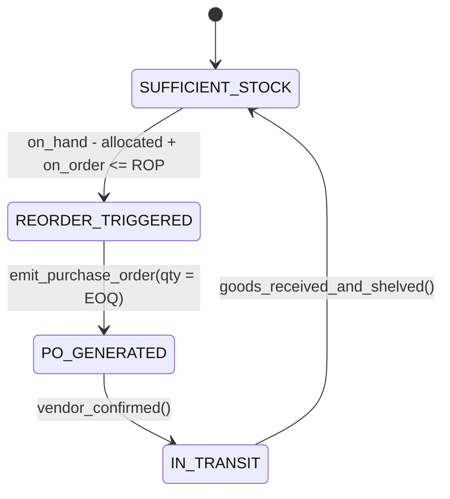

# Inventory Math & Replenishment: EOQ, Safety Stock, Reorder Point & ABC/XYZ Classification
> Based on **Inventory Management and Production Planning and Scheduling - Silver, Pyke, Peterson**

## 1. Canonical Enterprise Architecture & PostgreSQL Data Model (DDL)

```sql
-- Inventory Parameters & Replenishment Policies
CREATE TABLE item_inventory_parameters (
    parameter_id UUID PRIMARY KEY DEFAULT uuid_generate_v4(),
    product_id UUID NOT NULL REFERENCES products(product_id),
    warehouse_id UUID NOT NULL REFERENCES supply_chain_nodes(node_id),
    annual_demand NUMERIC(14, 4) NOT NULL CHECK (annual_demand >= 0),
    order_cost_s NUMERIC(12, 4) NOT NULL CHECK (order_cost_s > 0),
    holding_cost_unit_year_h NUMERIC(12, 4) NOT NULL CHECK (holding_cost_unit_year_h > 0),
    lead_time_days NUMERIC(6, 2) NOT NULL CHECK (lead_time_days > 0),
    demand_std_dev_daily NUMERIC(12, 4) NOT NULL DEFAULT 0.0000,
    lead_time_std_dev_days NUMERIC(6, 2) NOT NULL DEFAULT 0.00,
    service_level_target NUMERIC(5, 4) NOT NULL DEFAULT 0.9500 CHECK (service_level_target BETWEEN 0.5 AND 0.9999),
    calculated_eoq NUMERIC(14, 4),
    calculated_safety_stock NUMERIC(14, 4),
    calculated_rop NUMERIC(14, 4),
    abc_class CHAR(1) CHECK (abc_class IN ('A', 'B', 'C')),
    xyz_class CHAR(1) CHECK (xyz_class IN ('X', 'Y', 'Z')),
    updated_at TIMESTAMPTZ NOT NULL DEFAULT NOW(),
    CONSTRAINT uq_prod_warehouse UNIQUE (product_id, warehouse_id)
);

CREATE TABLE inventory_stock_levels (
    stock_id UUID PRIMARY KEY DEFAULT uuid_generate_v4(),
    product_id UUID NOT NULL REFERENCES products(product_id),
    warehouse_id UUID NOT NULL REFERENCES supply_chain_nodes(node_id),
    on_hand_qty NUMERIC(14, 4) NOT NULL DEFAULT 0.0000 CHECK (on_hand_qty >= 0),
    allocated_qty NUMERIC(14, 4) NOT NULL DEFAULT 0.0000,
    on_order_qty NUMERIC(14, 4) NOT NULL DEFAULT 0.0000,
    net_available_qty NUMERIC(14, 4) GENERATED ALWAYS AS (on_hand_qty - allocated_qty + on_order_qty) STORED,
    last_count_date TIMESTAMPTZ
);
```

## 2. Mathematical Foundations & Business Invariants

### 2.1 Economic Order Quantity (EOQ) Formula
For annual demand $D$, fixed order setup cost $S$, and annual holding cost per unit $H$:
$$\text{Total Annual Cost } C(Q) = \frac{D}{Q} S + \frac{Q}{2} H$$
Taking $\frac{dC}{dQ} = 0$:
$$\text{EOQ} = Q^* = \sqrt{\frac{2 D S}{H}}$$
At EOQ: $\text{Annual Ordering Cost} = \text{Annual Holding Cost}$.

### 2.2 Safety Stock with Variable Demand and Variable Lead Time
For daily demand mean $d$ and standard deviation $\sigma_d$, lead time mean $L$ and standard deviation $\sigma_L$, and normal inverse service level $Z$:
$$\sigma_{\text{lead time demand}} = \sqrt{L \cdot \sigma_d^2 + d^2 \cdot \sigma_L^2}$$
$$\text{Safety Stock (SS)} = Z \times \sigma_{\text{lead time demand}} = Z \sqrt{L \sigma_d^2 + d^2 \sigma_L^2}$$
$$\text{Reorder Point (ROP)} = (d \times L) + \text{SS}$$

### 2.3 ABC/XYZ Classification
- **ABC (Revenue/Value Volume)**: A = Top 80% value (~20% items), B = Next 15% value (~30% items), C = Bottom 5% value (~50% items).
- **XYZ (Demand Predictability)**: Coefficient of Variation $CV = \frac{\sigma_d}{\mu_d}$:
  - X: $CV \le 0.5$ (constant, highly predictable).
  - Y: $0.5 < CV \le 1.0$ (variable demand, trend/seasonality).
  - Z: $CV > 1.0$ (sporadic, erratic demand).

## 3. Finite State Machine (FSM) & Lifecycle Invariants

### 3.1 Continuous Inventory Replenishment (s, Q) FSM


## 4. Production Implementation Guidelines (Rust / SQL / Python)

```rust
pub struct InventoryOptimizer;

impl InventoryOptimizer {
    pub fn calculate_eoq(annual_demand: f64, order_cost: f64, holding_cost: f64) -> f64 {
        if holding_cost <= 0.0 || annual_demand <= 0.0 || order_cost <= 0.0 {
            return 0.0;
        }
        (2.0 * annual_demand * order_cost / holding_cost).sqrt()
    }

    pub fn calculate_safety_stock(
        z_score: f64,
        lead_time_days: f64,
        daily_demand_std_dev: f64,
        daily_demand_mean: f64,
        lead_time_std_dev: f64,
    ) -> f64 {
        let variance = lead_time_days * daily_demand_std_dev.powi(2)
            + daily_demand_mean.powi(2) * lead_time_std_dev.powi(2);
        z_score * variance.sqrt()
    }

    pub fn calculate_rop(daily_demand: f64, lead_time_days: f64, safety_stock: f64) -> f64 {
        (daily_demand * lead_time_days) + safety_stock
    }
}
```

## 5. Actionable Prompt Recipes

### 5.1 Local Ollama Cheat Sheet (Actionable Constraints & Invariants)
```markdown
- EOQ formula: sqrt(2 * D * S / H).
- Safety Stock accounts for both demand variance and lead time variance: Z * sqrt(L * sigma_D^2 + D^2 * sigma_L^2).
- Reorder Point formula: ROP = (daily_demand * lead_time) + safety_stock.
- Net Available Stock = On-Hand - Allocated + On-Order.
- Trigger purchase order generation when Net Available Stock falls to or below ROP.
```

### 5.2 Cloud LLM Architectural Prompt (Comprehensive Engineering Blueprint)
```markdown
Architect an enterprise inventory optimization engine based on Silver, Pyke, and Peterson:
1. Ingest daily transactional demand logs to compute moving mean and standard deviation of consumption.
2. Implement automated EOQ, Safety Stock, and ROP recalculation batch pipelines.
3. Classify materials into the 9-cell ABC/XYZ matrix to set differentiated service level targets (e.g. AX=98%, CZ=85%).
4. Provide unit tests validating exact equality of ordering and holding costs at calculated EOQ.
```
