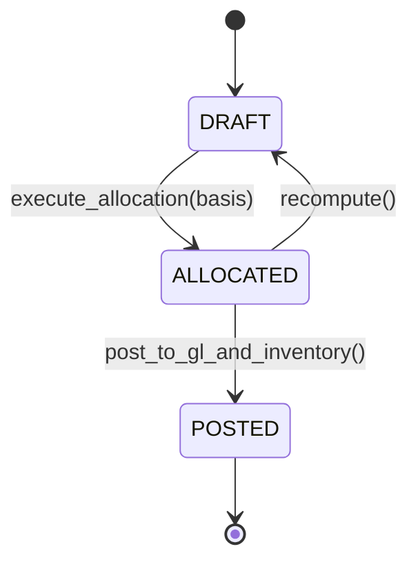

# Landed Cost Allocation: Absorption of Freight, Tariffs & Demurrage into Inventory Valuation
> Based on **Warehouse Management: A Complete Guide to Improving Efficiency and Minimizing Costs - Gwynne Richards**

## 1. Canonical Enterprise Architecture & PostgreSQL Data Model (DDL)

```sql
-- Landed Cost Vouchers & Allocation Layers Schema
CREATE TABLE landed_cost_vouchers (
    voucher_id UUID PRIMARY KEY DEFAULT uuid_generate_v4(),
    voucher_number VARCHAR(50) NOT NULL UNIQUE,
    status VARCHAR(20) NOT NULL CHECK (status IN ('DRAFT', 'ALLOCATED', 'POSTED', 'CANCELLED')),
    allocation_basis VARCHAR(20) NOT NULL CHECK (allocation_basis IN ('BY_VALUE', 'BY_NET_WEIGHT', 'BY_VOLUME', 'BY_QUANTITY')),
    total_additional_cost NUMERIC(18, 4) NOT NULL CHECK (total_additional_cost >= 0),
    currency CHAR(3) NOT NULL,
    created_at TIMESTAMPTZ NOT NULL DEFAULT NOW()
);

CREATE TABLE landed_cost_lines (
    line_id UUID PRIMARY KEY DEFAULT uuid_generate_v4(),
    voucher_id UUID NOT NULL REFERENCES landed_cost_vouchers(voucher_id) ON DELETE CASCADE,
    receipt_line_id UUID NOT NULL,
    product_id UUID NOT NULL REFERENCES products(product_id),
    received_quantity NUMERIC(14, 4) NOT NULL CHECK (received_quantity > 0),
    original_item_cost NUMERIC(18, 4) NOT NULL CHECK (original_item_cost >= 0),
    line_weight_kg NUMERIC(14, 4) DEFAULT 0.0000,
    line_volume_cbm NUMERIC(14, 4) DEFAULT 0.0000,
    allocated_additional_cost NUMERIC(18, 4) NOT NULL DEFAULT 0.0000,
    final_unit_cost NUMERIC(18, 4) GENERATED ALWAYS AS (
        original_item_cost + (allocated_additional_cost / received_quantity)
    ) STORED
);
```

## 2. Mathematical Foundations & Business Invariants

### 2.1 Landed Cost Allocation Invariant (Conservation of Cost)
Let $C_{\text{total}}$ be the additional landed expense (e.g. shipping invoice total) and $n$ receipt lines:
$$\sum_{i=1}^n \text{AllocatedCost}_i = C_{\text{total}}$$
Where for allocation basis metric $M_i \in \{\text{Value}_i, \text{Weight}_i, \text{Volume}_i, \text{Qty}_i\}$:
$$\text{AllocatedCost}_i = C_{\text{total}} \times \frac{M_i}{\sum_{j=1}^n M_j}$$

### 2.2 Inventory Cost Layer Absorption
The new unit inventory valuation layer $U_i$ absorbed into perpetual inventory (FIFO / Moving Average):
$$U_i = U_i^{\text{original}} + \frac{\text{AllocatedCost}_i}{Q_i}$$

## 3. Finite State Machine (FSM) & Lifecycle Invariants

### 3.1 Landed Cost Voucher Lifecycle FSM


## 4. Production Implementation Guidelines (Rust / SQL / Python)

```rust
use rust_decimal::Decimal;

pub struct LandedCostInput {
    pub id: uuid::Uuid,
    pub basis_value: Decimal,
    pub qty: Decimal,
}

pub struct AllocatedOutput {
    pub id: uuid::Uuid,
    pub allocated_cost: Decimal,
    pub unit_cost_increase: Decimal,
}

pub fn allocate_landed_costs(
    total_cost: Decimal,
    items: &[LandedCostInput],
) -> Result<Vec<AllocatedOutput>, &'static str> {
    let sum_basis: Decimal = items.iter().map(|i| i.basis_value).sum();
    if sum_basis <= Decimal::ZERO {
        return Err("Sum of allocation basis must be strictly positive");
    }

    let mut outputs = Vec::new();
    let mut sum_allocated = Decimal::ZERO;

    for (idx, item) in items.iter().enumerate() {
        let is_last = idx == items.len() - 1;
        let alloc = if is_last {
            total_cost - sum_allocated // Plug rounding diff
        } else {
            (total_cost * item.basis_value / sum_basis).round_dp(4)
        };
        sum_allocated += alloc;
        let unit_increase = alloc / item.qty;
        outputs.push(AllocatedOutput {
            id: item.id,
            allocated_cost: alloc,
            unit_cost_increase: unit_increase,
        });
    }
    Ok(outputs)
}
```

## 5. Actionable Prompt Recipes

### 5.1 Local Ollama Cheat Sheet (Actionable Constraints & Invariants)
```markdown
- Never discard landed cost fractions; allocate exactly 100% of freight and customs expenses.
- Support allocation bases: By Value, By Net Weight, By Volume, By Quantity.
- Use the final line item as a plug to ensure sum(allocated_costs) == total_landed_invoice.
- Absorb allocated costs into inventory balance if stock is unsold; expense to COGS if already sold.
```

### 5.2 Cloud LLM Architectural Prompt (Comprehensive Engineering Blueprint)
```markdown
Implement an enterprise landed cost allocation service based on Gwynne Richards:
1. Build landed cost voucher workflows linking goods receipts to carrier and customs invoices.
2. Provide proportional distribution algorithms across multiple allocation dimensions.
3. Automatically update perpetual inventory layers and generate double-entry inventory adjustment vouchers.
4. Verify landed cost conservation invariant via automated unit tests.
```
