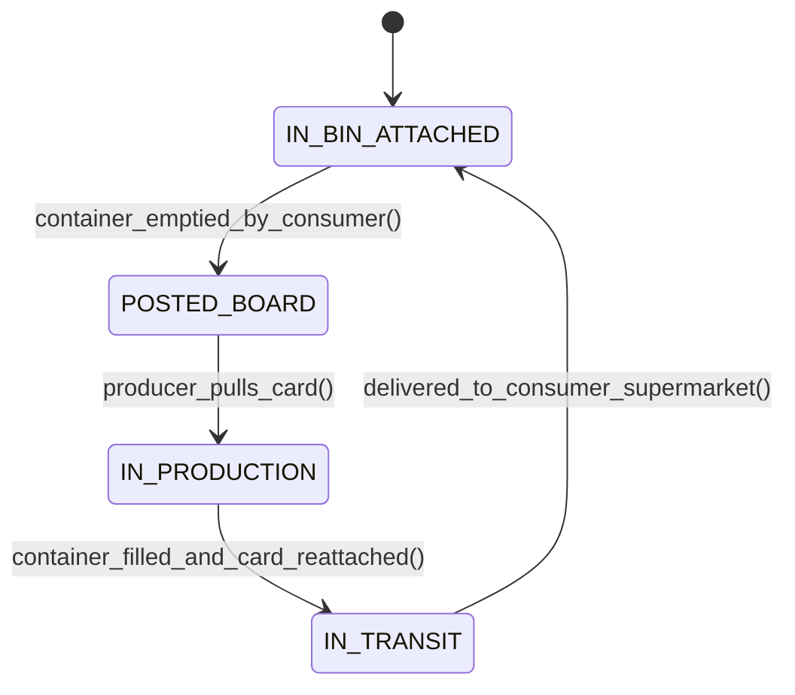

# Toyota Production System (TPS): Lean Manufacturing, Kanban Math & Jidoka
> Based on **Toyota Production System: Beyond Large-Scale Production - Taiichi Ohno**

## 1. Canonical Enterprise Architecture & PostgreSQL Data Model (DDL)

```sql
-- Lean Manufacturing, Kanban Loops & Andon Events
CREATE TABLE kanban_loops (
    loop_id UUID PRIMARY KEY DEFAULT uuid_generate_v4(),
    product_id UUID NOT NULL REFERENCES products(product_id),
    supplying_work_center_id UUID NOT NULL REFERENCES work_centers(work_center_id),
    consuming_work_center_id UUID NOT NULL REFERENCES work_centers(work_center_id),
    container_capacity NUMERIC(10, 2) NOT NULL CHECK (container_capacity > 0),
    total_cards_in_circulation INT NOT NULL CHECK (total_cards_in_circulation > 0),
    safety_factor_alpha NUMERIC(4, 3) NOT NULL DEFAULT 0.100 CHECK (safety_factor_alpha BETWEEN 0 AND 1.0)
);

CREATE TABLE kanban_cards (
    card_id UUID PRIMARY KEY DEFAULT uuid_generate_v4(),
    loop_id UUID NOT NULL REFERENCES kanban_loops(loop_id),
    card_number INT NOT NULL,
    current_status VARCHAR(20) NOT NULL CHECK (current_status IN ('IN_BIN_ATTACHED', 'POSTED_BOARD', 'IN_PRODUCTION', 'IN_TRANSIT')),
    last_scanned_at TIMESTAMPTZ NOT NULL DEFAULT NOW(),
    CONSTRAINT uq_loop_card UNIQUE (loop_id, card_number)
);

CREATE TABLE andon_events (
    event_id UUID PRIMARY KEY DEFAULT uuid_generate_v4(),
    work_center_id UUID NOT NULL REFERENCES work_centers(work_center_id),
    operator_party_id UUID NOT NULL REFERENCES parties(party_id),
    issue_type VARCHAR(30) NOT NULL CHECK (issue_type IN ('QUALITY_DEFECT', 'MACHINE_BREAKDOWN', 'PART_SHORTAGE', 'SAFETY_HAZARD')),
    line_stopped BOOLEAN NOT NULL DEFAULT TRUE,
    triggered_at TIMESTAMPTZ NOT NULL DEFAULT NOW(),
    resolved_at TIMESTAMPTZ
);
```

## 2. Mathematical Foundations & Business Invariants

### 2.1 Kanban Card Calculation Invariant
To support pull production without overproducing, the total number of circulating kanban containers $K$ is strictly fixed:
$$K = \left\lceil \frac{D \times L \times (1 + \alpha)}{C} \right\rceil$$
Where:
- $D$: Demand rate (units per time unit).
- $L$: Replenishment lead time (production + conveyance + wait).
- $\alpha$: Safety factor (typically $0.05 \le \alpha \le 0.20$).
- $C$: Container standard batch capacity.

### 2.2 Takt Time Invariant
$$\text{Takt Time} = \frac{\text{Net Available Working Time per Day}}{\text{Customer Daily Demand Quantity}}$$
If line cycle time $> \text{Takt Time}$, overtime or bottlenecks occur. If cycle time $< \text{Takt Time}$, waste of overproduction occurs.

## 3. Finite State Machine (FSM) & Lifecycle Invariants

### 3.1 Kanban Card State Cycle


## 4. Production Implementation Guidelines (Rust / SQL / Python)

```rust
pub struct KanbanMath;

impl KanbanMath {
    pub fn calculate_kanban_cards(
        demand_rate: f64,
        lead_time: f64,
        safety_factor: f64,
        container_cap: f64,
    ) -> usize {
        if container_cap <= 0.0 { return 0; }
        let total_wip = demand_rate * lead_time * (1.0 + safety_factor);
        (total_wip / container_cap).ceil() as usize
    }

    pub fn calculate_takt_time_seconds(
        available_seconds: f64,
        customer_units_needed: f64,
    ) -> f64 {
        if customer_units_needed <= 0.0 { return 0.0; }
        available_seconds / customer_units_needed
    }
}
```

## 5. Actionable Prompt Recipes

### 5.1 Local Ollama Cheat Sheet (Actionable Constraints & Invariants)
```markdown
- Kanban formula: K = ceil((Demand * LeadTime * (1 + SafetyFactor)) / ContainerCapacity).
- Number of Kanban cards in circulation must remain strictly constant.
- Takt Time = Net Available Operating Time / Daily Customer Demand.
- Stop-the-line on defect (Jidoka): An Andon event must immediately pause downstream feed.
```

### 5.2 Cloud LLM Architectural Prompt (Comprehensive Engineering Blueprint)
```markdown
Build a Lean Manufacturing and Electronic Kanban (e-Kanban) platform:
1. Implement automated Kanban loop sizing adjusting dynamically to rolling average customer demand.
2. Build digital Heijunka boxes scheduling mixed-model production sequences leveling pitch and volume.
3. Manage Andon line-stop events tracking Mean Time to Respond (MTTR) and defect pareto distributions.
4. Enforce strict pull production rules preventing shop floor work centers from manufacturing without an authorized Kanban card.
```
