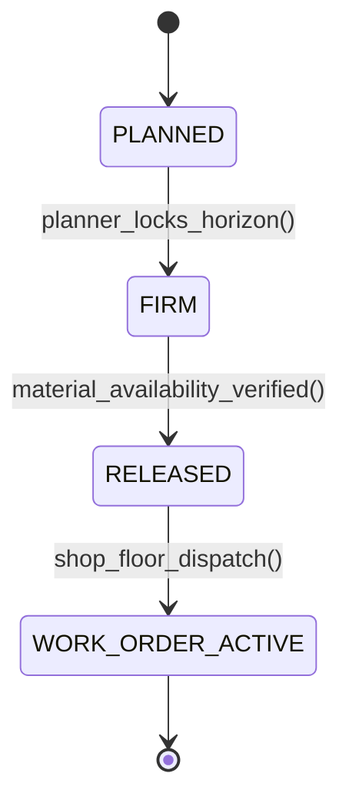

# Manufacturing Planning & Control: MPS, MRP I & Capacity Requirements Planning (CRP)
> Based on **Manufacturing Planning and Control for Supply Chain Management - Jacobs, Berry, Whybark, Vollmann**

## 1. Canonical Enterprise Architecture & PostgreSQL Data Model (DDL)

```sql
-- Manufacturing Planning: Work Centers, MPS & MRP Planned Orders
CREATE TABLE work_centers (
    work_center_id UUID PRIMARY KEY DEFAULT uuid_generate_v4(),
    code VARCHAR(50) NOT NULL UNIQUE,
    name VARCHAR(100) NOT NULL,
    daily_available_hours NUMERIC(6, 2) NOT NULL CHECK (daily_available_hours > 0),
    efficiency_factor NUMERIC(5, 4) NOT NULL DEFAULT 1.0000 CHECK (efficiency_factor BETWEEN 0.1 AND 2.0),
    utilization_factor NUMERIC(5, 4) NOT NULL DEFAULT 1.0000 CHECK (utilization_factor BETWEEN 0.1 AND 1.0),
    rated_daily_capacity_hours NUMERIC(6, 2) GENERATED ALWAYS AS (daily_available_hours * efficiency_factor * utilization_factor) STORED
);

CREATE TABLE master_production_schedules (
    mps_id UUID PRIMARY KEY DEFAULT uuid_generate_v4(),
    product_id UUID NOT NULL REFERENCES products(product_id),
    planning_bucket_date DATE NOT NULL,
    forecasted_demand NUMERIC(14, 4) NOT NULL DEFAULT 0.0000,
    customer_orders_qty NUMERIC(14, 4) NOT NULL DEFAULT 0.0000,
    planned_production_qty NUMERIC(14, 4) NOT NULL DEFAULT 0.0000,
    available_to_promise NUMERIC(14, 4) NOT NULL DEFAULT 0.0000,
    CONSTRAINT uq_mps_product_date UNIQUE (product_id, planning_bucket_date)
);

CREATE TABLE mrp_planned_orders (
    order_id UUID PRIMARY KEY DEFAULT uuid_generate_v4(),
    product_id UUID NOT NULL REFERENCES products(product_id),
    order_type VARCHAR(20) NOT NULL CHECK (order_type IN ('MANUFACTURE', 'PURCHASE')),
    due_date DATE NOT NULL,
    release_date DATE NOT NULL,
    gross_requirements NUMERIC(14, 4) NOT NULL,
    scheduled_receipts NUMERIC(14, 4) NOT NULL DEFAULT 0.0000,
    projected_available NUMERIC(14, 4) NOT NULL,
    net_requirements NUMERIC(14, 4) NOT NULL,
    planned_order_receipt NUMERIC(14, 4) NOT NULL,
    status VARCHAR(20) NOT NULL CHECK (status IN ('PLANNED', 'FIRM', 'RELEASED'))
);
```

## 2. Mathematical Foundations & Business Invariants

### 2.1 Net Requirements Formulation
For product $i$ in planning period $t$:
$$\text{Net Requirements}_t = \max\left(0, \text{Gross Requirements}_t - \text{Projected Available}_{t-1} - \text{Scheduled Receipts}_t + \text{Safety Stock}\right)$$
$$\text{Projected Available}_t = \text{Projected Available}_{t-1} + \text{Scheduled Receipts}_t + \text{Planned Order Receipts}_t - \text{Gross Requirements}_t$$

### 2.2 Capacity Requirements Planning (CRP) Loading Invariant
For work center $W$ on day $t$ with operations $j \in \text{ScheduledOps}(W, t)$:
$$\text{Required Load Hours}(W, t) = \sum_{j} \left(\text{SetupTime}_j + \text{RunTimePerUnit}_j \times \text{BatchSize}_j\right)$$
**Finite Capacity Constraint**:
$$\text{Required Load Hours}(W, t) \le \text{Rated Capacity Hours}(W, t)$$
If load exceeds rated capacity, work must be shifted forward or backward.

## 3. Finite State Machine (FSM) & Lifecycle Invariants

### 3.1 MRP Order Status Lifecycle FSM


## 4. Production Implementation Guidelines (Rust / SQL / Python)

```rust
use rust_decimal::Decimal;

pub struct MrpBucket {
    pub gross_req: Decimal,
    pub sched_receipts: Decimal,
    pub on_hand_prior: Decimal,
    pub safety_stock: Decimal,
}

pub struct MrpResult {
    pub net_req: Decimal,
    pub projected_available: Decimal,
}

pub fn compute_mrp_bucket(b: &MrpBucket) -> MrpResult {
    let available_before_net = b.on_hand_prior + b.sched_receipts;
    let net = if b.gross_req + b.safety_stock > available_before_net {
        (b.gross_req + b.safety_stock) - available_before_net
    } else {
        Decimal::ZERO
    };
    let planned_receipt = net; // Lot-for-lot
    let proj_avail = available_before_net + planned_receipt - b.gross_req;

    MrpResult {
        net_req: net,
        projected_available: proj_avail,
    }
}
```

## 5. Actionable Prompt Recipes

### 5.1 Local Ollama Cheat Sheet (Actionable Constraints & Invariants)
```markdown
- Calculate net requirements: Net = max(0, Gross - OnHand - SchedReceipts + SafetyStock).
- Work center capacity: RatedCapacity = AvailableHours * Efficiency * Utilization.
- Reject infinite capacity overloads when operating under finite scheduling constraints.
- Offset planned order release date from due date using manufacturing lead time.
```

### 5.2 Cloud LLM Architectural Prompt (Comprehensive Engineering Blueprint)
```markdown
Implement an enterprise Manufacturing Planning and Control (MPC) engine:
1. Model multi-level Master Production Scheduling (MPS) with Available-to-Promise (ATP) calculations.
2. Build an iterative MRP explosion engine computing time-phased net requirements.
3. Implement Capacity Requirements Planning (CRP) calculating work center queue, setup, and run loads.
4. Provide finite scheduling heuristics (earliest due date, critical ratio) to level overloaded work centers.
```
