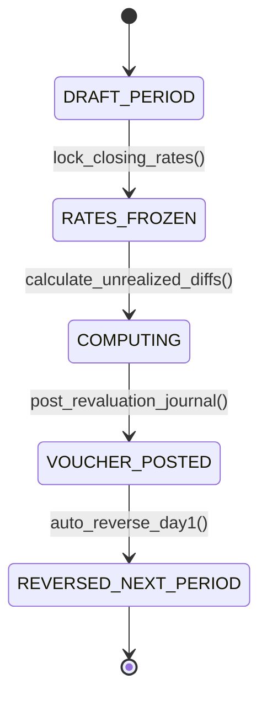

# Multi-Currency Accounting: Functional Currency, Triangulation & FX Revaluation
> Based on **Financial Accounting: An Integrated Approach - Kenneth Trotman**

## 1. Canonical Enterprise Architecture & PostgreSQL Data Model (DDL)

```sql
-- Multi-Currency Rates & Revaluation Schema
CREATE TABLE currencies (
    currency_code CHAR(3) PRIMARY KEY,
    name VARCHAR(50) NOT NULL,
    decimal_places INT NOT NULL DEFAULT 2 CHECK (decimal_places BETWEEN 0 AND 4),
    is_base_currency BOOLEAN NOT NULL DEFAULT FALSE
);

CREATE TABLE fx_rates (
    rate_id UUID PRIMARY KEY DEFAULT uuid_generate_v4(),
    from_currency CHAR(3) NOT NULL REFERENCES currencies(currency_code),
    to_currency CHAR(3) NOT NULL REFERENCES currencies(currency_code),
    rate_date DATE NOT NULL,
    rate_type VARCHAR(20) NOT NULL CHECK (rate_type IN ('SPOT', 'CLOSING', 'AVERAGE', 'HISTORICAL')),
    conversion_rate NUMERIC(18, 8) NOT NULL CHECK (conversion_rate > 0),
    CONSTRAINT uq_fx_rate UNIQUE (from_currency, to_currency, rate_date, rate_type)
);

CREATE TABLE fx_revaluations (
    revaluation_id UUID PRIMARY KEY DEFAULT uuid_generate_v4(),
    period VARCHAR(7) NOT NULL,
    account_code VARCHAR(20) NOT NULL REFERENCES chart_of_accounts(account_code),
    currency CHAR(3) NOT NULL,
    foreign_balance NUMERIC(18, 4) NOT NULL,
    book_base_balance NUMERIC(18, 4) NOT NULL,
    closing_rate NUMERIC(18, 8) NOT NULL,
    revalued_base_balance NUMERIC(18, 4) NOT NULL,
    unrealized_gain_loss NUMERIC(18, 4) GENERATED ALWAYS AS (revalued_base_balance - book_base_balance) STORED,
    journal_entry_id UUID REFERENCES journal_entries(entry_id),
    created_at TIMESTAMPTZ NOT NULL DEFAULT NOW()
);
```

## 2. Mathematical Foundations & Business Invariants

### 2.1 Currency Triangulation Invariant
If a direct exchange rate between currency $A$ and currency $B$ is not published, it must be triangulated via base currency $C$:
$$R_{A \to B} = \frac{R_{A \to C}}{R_{B \to C}}$$

### 2.2 Realized FX Gain/Loss Calculation
When an invoice booked at rate $R_{\text{orig}}$ is settled at payment rate $R_{\text{settle}}$:
$$\text{Base Amount}_{\text{orig}} = \text{Amount}_{\text{txn}} \times R_{\text{orig}}$$
$$\text{Base Amount}_{\text{settle}} = \text{Amount}_{\text{txn}} \times R_{\text{settle}}$$
$$\text{Realized FX Gain/Loss} = \text{Base Amount}_{\text{settle}} - \text{Base Amount}_{\text{orig}}$$
For AR: positive is Gain, negative is Loss. For AP: positive is Loss, negative is Gain.

### 2.3 Unrealized FX Balance Sheet Revaluation (IAS 21 / ASC 830)
At accounting period close date $T$:
$$\text{Unrealized Gain/Loss} = B_{\text{foreign}} \times R_{\text{closing}} - B_{\text{book, base}}$$

## 3. Finite State Machine (FSM) & Lifecycle Invariants

### 3.1 FX Month-End Revaluation FSM


## 4. Production Implementation Guidelines (Rust / SQL / Python)

```rust
use rust_decimal::Decimal;

pub struct FxSettlement {
    pub txn_amount: Decimal,
    pub original_rate: Decimal,
    pub settlement_rate: Decimal,
    pub is_receivable: bool,
}

impl FxSettlement {
    pub fn calculate_realized_gain_loss(&self) -> Decimal {
        let original_base = self.txn_amount * self.original_rate;
        let settlement_base = self.txn_amount * self.settlement_rate;
        let diff = settlement_base - original_base;
        if self.is_receivable {
            diff // Positive = Gain, Negative = Loss
        } else {
            -diff // For Payables: Paying more base currency is a Loss
        }
    }
}
```

## 5. Actionable Prompt Recipes

### 5.1 Local Ollama Cheat Sheet (Actionable Constraints & Invariants)
```markdown
- Never mix transaction currency amounts with base currency amounts in the same column.
- Always record exchange rate alongside both foreign amount and converted base amount.
- Auto-reverse month-end unrealized FX revaluation entries on day 1 of the subsequent period.
- Handle triangular cross-rate calculations cleanly via base currency anchor.
```

### 5.2 Cloud LLM Architectural Prompt (Comprehensive Engineering Blueprint)
```markdown
Build an enterprise multi-currency and FX revaluation microservice:
1. Implement exchange rate tables supporting historical, spot, average, and month-end closing rates.
2. Build an invoice settlement listener that computes realized FX gain/loss and writes balanced posting vouchers.
3. Construct a period-end revaluation batch job that revalues open monetary assets/liabilities under IAS 21.
4. Provide comprehensive unit tests verifying triangulation accuracy and gain/loss signage for both AR and AP.
```
