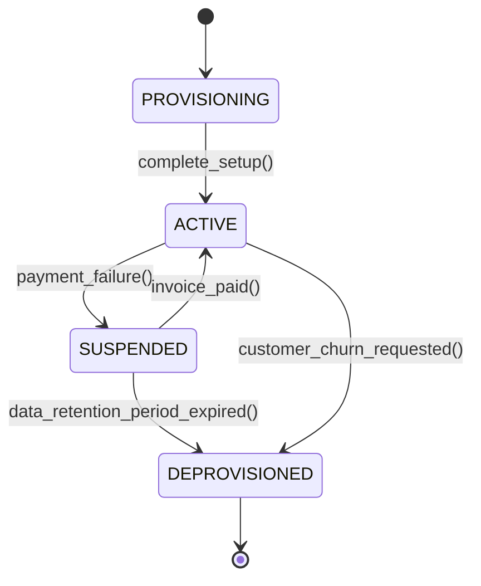

# Multi-Tenant Data Architecture: Row-Level Security, Schema-per-Tenant & Cross-Tenant Isolation
> Based on **Multi-Tenant Architecture - Guy Harrison**

## 1. Canonical Enterprise Architecture & PostgreSQL Data Model (DDL)

```sql
-- Multi-Tenant Schema with PostgreSQL Row-Level Security (RLS)
CREATE TABLE tenants (
    tenant_id UUID PRIMARY KEY DEFAULT uuid_generate_v4(),
    tenant_slug VARCHAR(50) NOT NULL UNIQUE,
    company_name VARCHAR(150) NOT NULL,
    status VARCHAR(20) NOT NULL CHECK (status IN ('ACTIVE', 'SUSPENDED', 'DEPROVISIONED')),
    created_at TIMESTAMPTZ NOT NULL DEFAULT NOW()
);

CREATE TABLE tenant_users (
    user_id UUID PRIMARY KEY DEFAULT uuid_generate_v4(),
    tenant_id UUID NOT NULL REFERENCES tenants(tenant_id) ON DELETE CASCADE,
    email VARCHAR(255) NOT NULL,
    role VARCHAR(50) NOT NULL,
    CONSTRAINT uq_tenant_user_email UNIQUE (tenant_id, email)
);

CREATE TABLE multi_tenant_orders (
    order_id UUID PRIMARY KEY DEFAULT uuid_generate_v4(),
    tenant_id UUID NOT NULL REFERENCES tenants(tenant_id) ON DELETE CASCADE,
    order_number VARCHAR(50) NOT NULL,
    total_amount NUMERIC(18, 4) NOT NULL,
    CONSTRAINT uq_tenant_order UNIQUE (tenant_id, order_number)
);

-- Enable Row-Level Security
ALTER TABLE multi_tenant_orders ENABLE ROW LEVEL SECURITY;

-- Tenant Isolation Policy
CREATE POLICY tenant_isolation_policy ON multi_tenant_orders
    FOR ALL
    USING (tenant_id = NULLIF(current_setting('app.current_tenant_id', true), '')::uuid);
```

## 2. Mathematical Foundations & Business Invariants

### 2.1 Multi-Tenant Separation Invariant
Let $T_A$ and $T_B$ be distinct tenants ($T_A \ne T_B$).
For any query $Q$ executed in context of $T_A$, the result set $R(Q, T_A)$ must satisfy:
$$\forall r \in R(Q, T_A), \quad \text{tenant\_id}(r) = T_A$$
$$\text{Probability of cross-tenant data leak } P(r \in R \mid \text{tenant\_id}(r) = T_B) = 0$$

## 3. Finite State Machine (FSM) & Lifecycle Invariants

### 3.1 Tenant Lifecycle State Machine


## 4. Production Implementation Guidelines (Rust / SQL / Python)

```rust
pub struct TenantContext {
    pub tenant_id: uuid::Uuid,
}

impl TenantContext {
    pub fn build_scoped_sql(&self, base_table: &str) -> String {
        format!("SELECT * FROM {} WHERE tenant_id = '{}'", base_table, self.tenant_id)
    }
}
```

## 5. Actionable Prompt Recipes

### 5.1 Local Ollama Cheat Sheet (Actionable Constraints & Invariants)
```markdown
- Every table in a shared-schema architecture MUST contain a tenant_id column.
- Enable PostgreSQL Row-Level Security (RLS) on all tenant-specific tables.
- Set session variable before executing queries: SET LOCAL app.current_tenant_id = '...'.
- Prevent SQL injection into tenant routing logic via parameterized prepared statements.
```

### 5.2 Cloud LLM Architectural Prompt (Comprehensive Engineering Blueprint)
```markdown
Architect an enterprise multi-tenant data tier for SaaS ERP:
1. Implement Row-Level Security (RLS) across all application tables with mandatory tenant_id foreign keys.
2. Build connection pool wrappers that automatically set session tenant variables on connection acquisition.
3. Provide automated tenant provisioning, backup, and de-provisioning workflows.
4. Brutally test cross-tenant query isolation verifying that queries under Tenant A never reveal Tenant B records.
```
