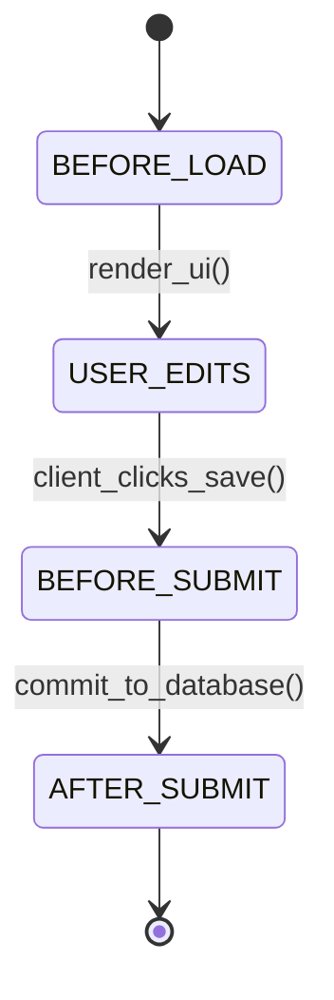

# NetSuite SuiteCloud & SuiteScript 2.1: Custom Records, SuiteFlow & Governance
> Based on **NetSuite ERP Architecture - David Geilhufe**

## 1. Canonical Enterprise Architecture & PostgreSQL Data Model (DDL)

```sql
-- NetSuite Metamodel & Governance Budget Tracking
CREATE TABLE suitescript_governance_limits (
    script_type VARCHAR(50) PRIMARY KEY,
    max_governance_units INT NOT NULL CHECK (max_governance_units > 0),
    timeout_seconds INT NOT NULL
);

INSERT INTO suitescript_governance_limits VALUES
    ('USER_EVENT', 1000, 30),
    ('CLIENT_SCRIPT', 1000, 30),
    ('RESTLET', 5000, 300),
    ('SCHEDULED_SCRIPT', 10000, 3600),
    ('MAP_REDUCE', 10000, 3600);

CREATE TABLE suitescript_execution_logs (
    log_id UUID PRIMARY KEY DEFAULT uuid_generate_v4(),
    script_id VARCHAR(100) NOT NULL,
    script_type VARCHAR(50) NOT NULL REFERENCES suitescript_governance_limits(script_type),
    units_consumed INT NOT NULL CHECK (units_consumed >= 0),
    status VARCHAR(20) NOT NULL CHECK (status IN ('SUCCESS', 'FAILED', 'GOVERNANCE_EXCEEDED')),
    executed_at TIMESTAMPTZ NOT NULL DEFAULT NOW()
);
```

## 2. Mathematical Foundations & Business Invariants

### 2.1 NetSuite Governance Budget Invariant
Every SuiteScript execution context has a strict governance usage budget $B$:
$$\sum_{k=1}^m U(\text{API\_Operation}_k) \le B$$
Where operations consume units (e.g., `record.load`: 5 units, `record.save`: 20 units, `search.run`: 10 units).
**Governance Invariant**: If cumulative units exceed $B$, the engine immediately aborts with `SSS_USAGE_LIMIT_EXCEEDED`.

## 3. Finite State Machine (FSM) & Lifecycle Invariants

### 3.1 SuiteScript UserEvent Pipeline


## 4. Production Implementation Guidelines (Rust / SQL / Python)

```rust
pub struct GovernanceMonitor {
    pub max_units: u32,
    pub consumed: u32,
}

impl GovernanceMonitor {
    pub fn consume(&mut self, units: u32) -> Result<(), &'static str> {
        if self.consumed + units > self.max_units {
            return Err("SSS_USAGE_LIMIT_EXCEEDED");
        }
        self.consumed += units;
        Ok(())
    }
}
```

## 5. Actionable Prompt Recipes

### 5.1 Local Ollama Cheat Sheet (Actionable Constraints & Invariants)
```markdown
- Monitor governance usage: UserEvent scripts have strict 1,000 unit limits; MapReduce has 10,000 units.
- UserEvent lifecycle: beforeLoad (UI customization) -> beforeSubmit (validation) -> afterSubmit (cascade updates).
- Offload long-running mass updates from UserEvent to MapReduce scripts.
- Structure custom records to maintain parent-child relationships using custom record links.
```

### 5.2 Cloud LLM Architectural Prompt (Comprehensive Engineering Blueprint)
```markdown
Design an enterprise extension service conforming to NetSuite SuiteCloud / SuiteScript 2.1:
1. Implement a governance monitor tracking and throttling script API consumption.
2. Build UserEvent and ClientScript execution pipelines with beforeLoad, beforeSubmit, and afterSubmit hooks.
3. Design SuiteFlow state machines supporting entry actions, transition triggers, and exit handlers.
4. Provide unit tests validating governance budget enforcement under high-volume load.
```
