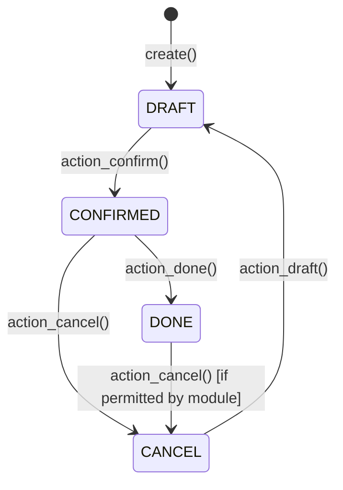

# Odoo Technical Architecture: ORM Models, Inheritance, Domain Rules & Automated Views
> Based on **Working with Odoo - Greg Moss / Daniel Reis**

## 1. Canonical Enterprise Architecture & PostgreSQL Data Model (DDL)

```sql
-- Odoo Technical Framework Schema (Metamodel Representation)
CREATE TABLE ir_model (
    id SERIAL PRIMARY KEY,
    model VARCHAR(64) NOT NULL UNIQUE,
    name VARCHAR(128) NOT NULL,
    state VARCHAR(16) NOT NULL DEFAULT 'base',
    info TEXT
);

CREATE TABLE ir_model_fields (
    id SERIAL PRIMARY KEY,
    model_id INT NOT NULL REFERENCES ir_model(id) ON DELETE CASCADE,
    name VARCHAR(64) NOT NULL,
    field_description VARCHAR(256),
    ttype VARCHAR(32) NOT NULL CHECK (ttype IN ('char', 'integer', 'float', 'boolean', 'many2one', 'one2many', 'many2many', 'selection', 'binary')),
    relation VARCHAR(64),
    required BOOLEAN NOT NULL DEFAULT FALSE,
    readonly BOOLEAN NOT NULL DEFAULT FALSE,
    CONSTRAINT uq_model_field UNIQUE (model_id, name)
);

CREATE TABLE ir_rule (
    id SERIAL PRIMARY KEY,
    name VARCHAR(128) NOT NULL,
    model_id INT NOT NULL REFERENCES ir_model(id) ON DELETE CASCADE,
    domain_force TEXT NOT NULL, -- Python domain tuple string e.g. [('company_id', 'in', company_ids)]
    perm_read BOOLEAN NOT NULL DEFAULT TRUE,
    perm_write BOOLEAN NOT NULL DEFAULT TRUE,
    perm_create BOOLEAN NOT NULL DEFAULT TRUE,
    perm_unlink BOOLEAN NOT NULL DEFAULT TRUE,
    active BOOLEAN NOT NULL DEFAULT TRUE
);
```

## 2. Mathematical Foundations & Business Invariants

### 2.1 Odoo Domain Polish Notation Invariant
Odoo evaluates record filtering domains in prefix notation (Polish Notation):
$$\text{Domain} = [\&, ('\text{stage\_id}', '=', 1), ('\text{user\_id}', '=', \text{uid})]$$
Unary operator: $!$ (NOT). Binary operators: $\&$ (AND - default), $|$ (OR).
**Evaluation Invariant**: Every operator of arity $k$ must be followed by exactly $k$ valid operands or sub-expressions.

### 2.2 Computed Fields & Depends Invalidation
A field $F$ marked with `@api.depends('line_ids.price_subtotal')` must recompute whenever:
$$\Delta(\text{line\_ids}) \ne \emptyset \lor \Delta(\text{price\_subtotal}) \ne \emptyset$$

## 3. Finite State Machine (FSM) & Lifecycle Invariants

### 3.1 Odoo Standard Document Workflow State


## 4. Production Implementation Guidelines (Rust / SQL / Python)

```python
from typing import List, Dict, Any

class MockOdooModel:
    def __init__(self):
        self._records: List[Dict[str, Any]] = []

    def search(self, domain_func) -> List[Dict[str, Any]]:
        # Evaluate record rule domain in-memory
        return [rec for rec in self._records if domain_func(rec)]

    def create(self, values: Dict[str, Any]) -> Dict[str, Any]:
        rec = dict(values)
        rec["id"] = len(self._records) + 1
        self._records.append(rec)
        return rec
```

## 5. Actionable Prompt Recipes

### 5.1 Local Ollama Cheat Sheet (Actionable Constraints & Invariants)
```markdown
- Models inherit via _inherit for in-place extension and _inherits for delegation inheritance.
- Use @api.depends for computed fields; declare all source dependencies to prevent stale cache.
- Filter multi-company data using Record Rules: [('company_id', 'in', company_ids)].
- Always call super() in overridden model methods (create, write, unlink).
```

### 5.2 Cloud LLM Architectural Prompt (Comprehensive Engineering Blueprint)
```markdown
Architect an enterprise ERP application conforming to Odoo 17/18 Technical Architecture:
1. Model relational data using Odoo ORM conventions with proper Many2one, One2many, and Many2many relations.
2. Implement automated computed fields with cache dependency tracking and stored indexing.
3. Build declarative security layers utilizing ir.model.access.csv and multi-tenant ir.rule domains.
4. Construct clean view XML schemas with automated Kanban, Tree, and Form view inheritance.
```
