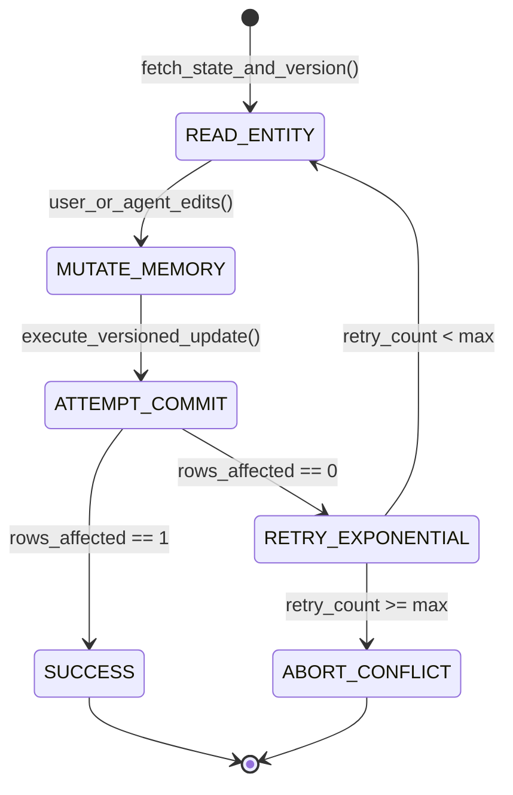

# Concurrency Control in ERP: Optimistic Offline Lock, Pessimistic Locking & Lost Updates
> Based on **Patterns of Enterprise Application Architecture - Martin Fowler**

## 1. Canonical Enterprise Architecture & PostgreSQL Data Model (DDL)

```sql
-- Optimistic Locking & Pessimistic Concurrency Schema
CREATE TABLE inventory_balances_versioned (
    balance_id UUID PRIMARY KEY DEFAULT uuid_generate_v4(),
    warehouse_id UUID NOT NULL REFERENCES supply_chain_nodes(node_id),
    product_id UUID NOT NULL REFERENCES products(product_id),
    available_qty NUMERIC(14, 4) NOT NULL CHECK (available_qty >= 0),
    version BIGINT NOT NULL DEFAULT 1,
    updated_at TIMESTAMPTZ NOT NULL DEFAULT NOW(),
    CONSTRAINT uq_wh_prod_versioned UNIQUE (warehouse_id, product_id)
);

CREATE TABLE pessimistic_locks (
    lock_id UUID PRIMARY KEY DEFAULT uuid_generate_v4(),
    resource_type VARCHAR(50) NOT NULL,
    resource_id UUID NOT NULL,
    locked_by VARCHAR(50) NOT NULL,
    acquired_at TIMESTAMPTZ NOT NULL DEFAULT NOW(),
    expires_at TIMESTAMPTZ NOT NULL,
    CONSTRAINT uq_resource_lock UNIQUE (resource_type, resource_id)
);
```

## 2. Mathematical Foundations & Business Invariants

### 2.1 Optimistic Offline Lock SQL Invariant
To prevent the Lost Update anomaly without holding long-lived database locks:
$$\text{UPDATE table SET col} = v, \text{version} = \text{version} + 1 \quad \text{WHERE id} = \text{target\_id} \land \text{version} = v_{\text{expected}}$$
**Rows Affected Invariant**:
$$\text{RowsAffected} = \begin{cases} 1 & \text{Update Succeeded} \\ 0 & \text{OptimisticLockConflictException (Abort / Retry)} \end{cases}$$

### 2.2 High-Contention Atomic Decrement
For high-frequency inventory reservations, avoid select-then-update:
$$\text{UPDATE inventory SET qty} = \text{qty} - \Delta \quad \text{WHERE product\_id} = P \land \text{qty} \ge \Delta$$

## 3. Finite State Machine (FSM) & Lifecycle Invariants

### 3.1 Optimistic Concurrency Retry Loop


## 4. Production Implementation Guidelines (Rust / SQL / Python)

```rust
pub fn build_optimistic_update_query(
    table: &str,
    id: uuid::Uuid,
    expected_version: u64,
    new_qty: f64,
) -> String {
    format!(
        "UPDATE {} SET available_qty = {}, version = version + 1 WHERE balance_id = '{}' AND version = {};",
        table, new_qty, id, expected_version
    )
}
```

## 5. Actionable Prompt Recipes

### 5.1 Local Ollama Cheat Sheet (Actionable Constraints & Invariants)
```markdown
- Add a version BIGINT NOT NULL DEFAULT 1 column to all mutable enterprise entities.
- Execute updates checking WHERE id = :id AND version = :expected_version.
- If rows affected == 0, throw OptimisticLockConflictException and retry with jittered exponential backoff.
- Use atomic conditional updates (WHERE qty >= :requested) for inventory deductions.
```

### 5.2 Cloud LLM Architectural Prompt (Comprehensive Engineering Blueprint)
```markdown
Design an enterprise concurrency control layer eliminating lost updates:
1. Implement Optimistic Offline Locking across all transactional domain entities.
2. Build an automated retry interceptor handling transient concurrency exceptions with jittered backoff.
3. Implement Pessimistic Offline Locks with automated lease expirations for interactive long-running user forms.
4. Brutally stress-test concurrent inventory deductions across 50 threads validating zero stock oversell.
```
