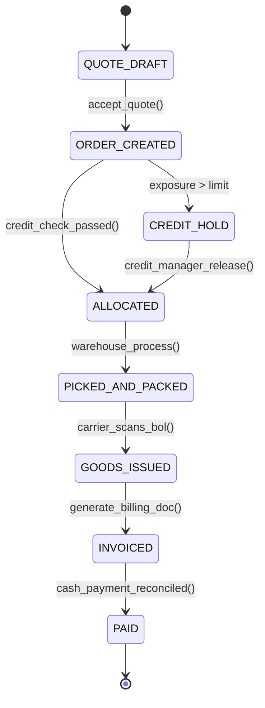

# Order-to-Cash (O2C) End-to-End: Quotation, Credit Limits, Shipping & Reconciliation
> Based on **Essentials of Business Processes and Information Systems - Simha Magal & Jeffrey Word**

## 1. Canonical Enterprise Architecture & PostgreSQL Data Model (DDL)

```sql
-- Order-to-Cash (O2C) End-to-End Tables
CREATE TABLE customer_credit_profiles (
    profile_id UUID PRIMARY KEY DEFAULT uuid_generate_v4(),
    customer_party_id UUID NOT NULL UNIQUE REFERENCES parties(party_id),
    credit_limit NUMERIC(18, 2) NOT NULL CHECK (credit_limit >= 0),
    current_ar_balance NUMERIC(18, 2) NOT NULL DEFAULT 0.00,
    open_orders_value NUMERIC(18, 2) NOT NULL DEFAULT 0.00,
    available_credit NUMERIC(18, 2) GENERATED ALWAYS AS (credit_limit - (current_ar_balance + open_orders_value)) STORED,
    is_credit_hold BOOLEAN NOT NULL DEFAULT FALSE
);

CREATE TABLE customer_invoices (
    invoice_id UUID PRIMARY KEY DEFAULT uuid_generate_v4(),
    invoice_number VARCHAR(50) NOT NULL UNIQUE,
    order_id UUID NOT NULL REFERENCES orders(order_id),
    customer_party_id UUID NOT NULL REFERENCES parties(party_id),
    subtotal NUMERIC(18, 4) NOT NULL,
    tax_amount NUMERIC(18, 4) NOT NULL,
    total_amount NUMERIC(18, 4) GENERATED ALWAYS AS (subtotal + tax_amount) STORED,
    amount_paid NUMERIC(18, 4) NOT NULL DEFAULT 0.0000,
    open_balance NUMERIC(18, 4) GENERATED ALWAYS AS ((subtotal + tax_amount) - amount_paid) STORED,
    status VARCHAR(20) NOT NULL CHECK (status IN ('ISSUED', 'PARTIALLY_PAID', 'PAID', 'DISPUTED', 'CANCELLED')),
    due_date DATE NOT NULL
);

CREATE TABLE customer_payments (
    payment_id UUID PRIMARY KEY DEFAULT uuid_generate_v4(),
    customer_party_id UUID NOT NULL REFERENCES parties(party_id),
    payment_date DATE NOT NULL,
    payment_amount NUMERIC(18, 4) NOT NULL CHECK (payment_amount > 0),
    unallocated_amount NUMERIC(18, 4) NOT NULL,
    payment_method VARCHAR(30) NOT NULL CHECK (payment_method IN ('WIRE', 'ACH', 'CHECK', 'CREDIT_CARD'))
);
```

## 2. Mathematical Foundations & Business Invariants

### 2.1 Customer Credit Limit Check Invariant
Before order $O$ can transition from `PLACED` to `APPROVED`:
$$\text{Total Exposure} = \text{Current AR Balance} + \text{Open Orders Value} + \text{Total}(O)$$
$$\text{Invariant: } \text{Total Exposure} \le \text{Credit Limit}$$
If total exposure exceeds credit limit, the order is automatically placed on `CREDIT_HOLD`.

### 2.2 Cash Application Conservation
$$\text{Payment Amount} = \sum_{k} \text{AppliedToInvoice}_k + \text{Unallocated Cash}$$
$$\text{Invoice Open Balance} = \text{Total Amount} - \sum \text{Applied Payments} \ge 0.0000$$

## 3. Finite State Machine (FSM) & Lifecycle Invariants

### 3.1 Order-to-Cash (O2C) State Machine


## 4. Production Implementation Guidelines (Rust / SQL / Python)

```rust
use rust_decimal::Decimal;

pub struct CreditVerification {
    pub credit_limit: Decimal,
    pub current_ar: Decimal,
    pub open_orders: Decimal,
}

impl CreditVerification {
    pub fn can_approve_order(&self, new_order_amount: Decimal) -> bool {
        let total_exposure = self.current_ar + self.open_orders + new_order_amount;
        total_exposure <= self.credit_limit
    }
}
```

## 5. Actionable Prompt Recipes

### 5.1 Local Ollama Cheat Sheet (Actionable Constraints & Invariants)
```markdown
- Never release an order without automated credit limit verification.
- Credit check formula: Current AR + Open Orders + New Order <= Credit Limit.
- Post Goods Issue (PGI) triggers inventory reduction and COGS recognition in General Ledger.
- Invoice Open Balance = Invoice Total - Payments Applied (must never be negative).
```

### 5.2 Cloud LLM Architectural Prompt (Comprehensive Engineering Blueprint)
```markdown
Implement an enterprise Order-to-Cash (O2C) orchestration pipeline:
1. Model the complete lifecycle: Quote -> Sales Order -> Credit Check -> Fulfillment -> PGI -> Invoicing -> Cash App.
2. Build real-time customer credit exposure evaluation halting high-risk orders.
3. Generate balanced double-entry vouchers upon Goods Issue and Customer Invoicing.
4. Provide cash application matching rules linking incoming bank payments to open AR invoices.
```
