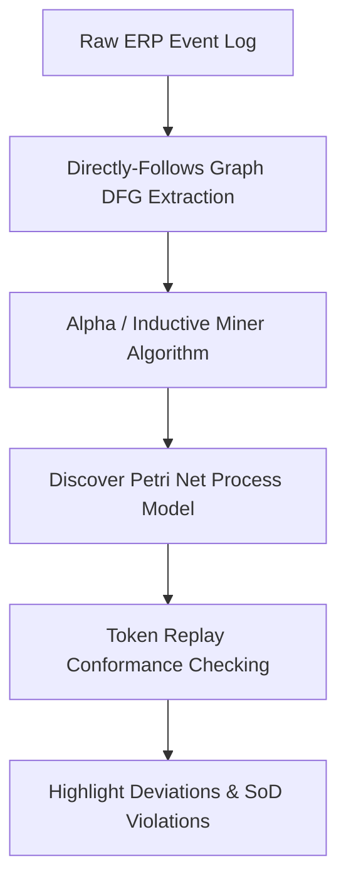

# Process Mining & Conformance: XES Event Logs, Alpha Miner & Bottleneck Discovery
> Based on **Process Mining: Data Science in Action - Wil van der Aalst**

## 1. Canonical Enterprise Architecture & PostgreSQL Data Model (DDL)

```sql
-- IEEE XES Process Event Logs Schema
CREATE TABLE xes_process_logs (
    event_id UUID PRIMARY KEY DEFAULT uuid_generate_v4(),
    case_id VARCHAR(100) NOT NULL,
    activity_name VARCHAR(150) NOT NULL,
    lifecycle_transition VARCHAR(20) NOT NULL DEFAULT 'complete' CHECK (lifecycle_transition IN ('start', 'complete', 'suspend', 'resume', 'abort')),
    timestamp TIMESTAMPTZ NOT NULL,
    resource_id VARCHAR(100),
    cost_amount NUMERIC(12, 4) DEFAULT 0.0000,
    attributes JSONB NOT NULL DEFAULT '{}'
);

CREATE INDEX idx_xes_case_time ON xes_process_logs(case_id, timestamp);

CREATE TABLE process_variants (
    variant_id UUID PRIMARY KEY DEFAULT uuid_generate_v4(),
    activity_trace_hash VARCHAR(64) NOT NULL UNIQUE,
    trace_representation TEXT NOT NULL,
    case_count INT NOT NULL DEFAULT 1,
    avg_duration_seconds NUMERIC(12, 2) NOT NULL
);
```

## 2. Mathematical Foundations & Business Invariants

### 2.1 Directly-Follows Relation ($\succ$) Invariant
Let $L$ be an event log. Activity $a$ directly follows $b$ ($b \succ_L a$) iff there exists a trace $\sigma = \langle t_1, t_2, \dots, t_n \rangle \in L$ and index $i$ such that $t_i = b$ and $t_{i+1} = a$.
1. **Causality ($a \to_L b$)**: $a \succ_L b \land b \not\succ_L a$.
2. **Parallelism ($a \parallel_L b$)**: $a \succ_L b \land b \succ_L a$.
3. **Choice/Unrelated ($a \ \#_L\ b$)**: $a \not\succ_L b \land b \not\succ_L a$.

### 2.2 Conformance Checking Fitness Metric
Fitness ($f$) measures the fraction of event log behavior that can be replayed by the Petri net model without error:
$$f = \frac{1}{2} \left(1 - \frac{m}{c}\right) + \frac{1}{2} \left(1 - \frac{r}{p}\right)$$
Where $m$ is missing tokens, $c$ is consumed tokens, $r$ is remaining tokens, and $p$ is produced tokens. Perfect conformance $\implies f = 1.0$.

## 3. Finite State Machine (FSM) & Lifecycle Invariants

### 3.1 Process Mining Analytics Pipeline


## 4. Production Implementation Guidelines (Rust / SQL / Python)

```rust
use std::collections::{HashMap, HashSet};

pub struct TraceAnalyzer;

impl TraceAnalyzer {
    pub fn extract_directly_follows(
        traces: &[Vec<&'static str>],
    ) -> HashMap<(&'static str, &'static str), usize> {
        let mut dfg = HashMap::new();
        for trace in traces {
            for window in trace.windows(2) {
                *dfg.entry((window[0], window[1])).or_insert(0) += 1;
            }
        }
        dfg
    }
}
```

## 5. Actionable Prompt Recipes

### 5.1 Local Ollama Cheat Sheet (Actionable Constraints & Invariants)
```markdown
- Parse event logs by mandatory fields: Case ID, Activity, and Timestamp.
- Extract Directly-Follows relations: a -> b iff a occurs immediately before b in trace.
- Conformance fitness: penalize models for missing tokens during alignment replay.
- Identify process deviations: highlight traces bypassing mandatory credit or approval steps.
```

### 5.2 Cloud LLM Architectural Prompt (Comprehensive Engineering Blueprint)
```markdown
Design an enterprise process mining and conformance discovery service:
1. Ingest real-time ERP transaction event logs conforming to IEEE XES standard.
2. Implement Alpha Miner and Heuristic Miner graph construction to discover process variants.
3. Build token-replay conformance checking highlighting unauthorized step skipping.
4. Calculate stage transition dwell times to locate organizational and resource bottlenecks.
```
