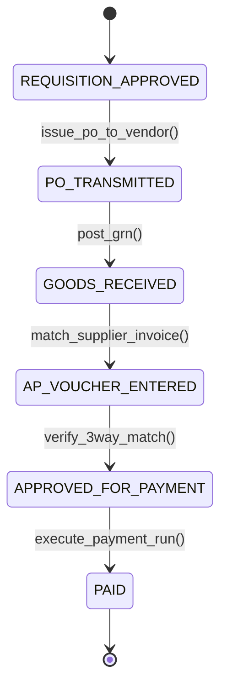

# Procure-to-Pay (P2P) End-to-End: Requisitions, Purchase Orders, Goods Receipt & AP Vouchers
> Based on **Integrated Business Processes with ERP Systems - Simha Magal & Jeffrey Word**

## 1. Canonical Enterprise Architecture & PostgreSQL Data Model (DDL)

```sql
-- Procure-to-Pay (P2P) End-to-End Tables
CREATE TABLE ap_vouchers (
    voucher_id UUID PRIMARY KEY DEFAULT uuid_generate_v4(),
    voucher_number VARCHAR(50) NOT NULL UNIQUE,
    po_id UUID NOT NULL REFERENCES purchase_orders(po_id),
    vendor_id UUID NOT NULL REFERENCES vendors(vendor_id),
    invoice_amount NUMERIC(18, 4) NOT NULL CHECK (invoice_amount > 0),
    is_3way_matched BOOLEAN NOT NULL DEFAULT FALSE,
    approval_status VARCHAR(20) NOT NULL CHECK (approval_status IN ('PENDING_MATCH', 'APPROVED_FOR_PAYMENT', 'REJECTED', 'PAID')),
    due_date DATE NOT NULL,
    discount_date DATE,
    early_discount_pct NUMERIC(4, 2) DEFAULT 0.00
);

CREATE TABLE p2p_disbursement_runs (
    run_id UUID PRIMARY KEY DEFAULT uuid_generate_v4(),
    run_date DATE NOT NULL,
    bank_account_code VARCHAR(20) NOT NULL REFERENCES chart_of_accounts(account_code),
    total_disbursed_amount NUMERIC(18, 4) NOT NULL DEFAULT 0.0000,
    status VARCHAR(20) NOT NULL CHECK (status IN ('PROPOSED', 'APPROVED', 'EXECUTED', 'CANCELLED')),
    created_at TIMESTAMPTZ NOT NULL DEFAULT NOW()
);
```

## 2. Mathematical Foundations & Business Invariants

### 2.1 Early Payment Cash Discount Invariant (e.g., 2/10 Net 30)
If payment is disbursed on date $T_{\text{pay}} \le T_{\text{discount\_date}}$:
$$\text{Discount Amount} = \text{Invoice Amount} \times \frac{\text{DiscountPct}}{100}$$
$$\text{Net Disbursed Amount} = \text{Invoice Amount} - \text{Discount Amount}$$
Otherwise:
$$\text{Net Disbursed Amount} = \text{Invoice Amount}$$

### 2.2 Cost of Forgoing Cash Discount
$$\text{Effective Annual Rate} = \frac{\text{DiscountPct}}{100 - \text{DiscountPct}} \times \frac{365}{\text{Total Term Days} - \text{Discount Days}}$$
For 2/10 Net 30: $\frac{2}{98} \times \frac{365}{20} = 37.24\%$ annual cost of capital.

## 3. Finite State Machine (FSM) & Lifecycle Invariants

### 3.1 P2P Lifecycle State Machine


## 4. Production Implementation Guidelines (Rust / SQL / Python)

```rust
use rust_decimal::Decimal;

pub struct EarlyPaymentTerms {
    pub invoice_amount: Decimal,
    pub discount_pct: Decimal, // e.g. 2.0%
}

impl EarlyPaymentTerms {
    pub fn compute_payment(&self, is_within_discount_window: bool) -> (Decimal, Decimal) {
        if is_within_discount_window {
            let discount = self.invoice_amount * (self.discount_pct / Decimal::from(100));
            (self.invoice_amount - discount, discount)
        } else {
            (self.invoice_amount, Decimal::ZERO)
        }
    }
}
```

## 5. Actionable Prompt Recipes

### 5.1 Local Ollama Cheat Sheet (Actionable Constraints & Invariants)
```markdown
- Never pay an AP voucher without 3-Way Match confirmation.
- Calculate early settlement discounts (e.g. 2/10 net 30) dynamically based on payment execution date.
- Goods receipt increases inventory asset and credits GR/IR clearing liability.
- Payment run debits Accounts Payable and credits Cash/Bank account.
```

### 5.2 Cloud LLM Architectural Prompt (Comprehensive Engineering Blueprint)
```markdown
Architect an integrated Procure-to-Pay (P2P) automation engine:
1. Implement the entire pipeline: PR -> Approval -> PO -> GRN -> 3-Way Match -> AP Voucher -> Disbursement.
2. Build an automated payment run optimizer prioritizing cash discounts when working capital allows.
3. Enforce segregation of duties separating requisition approvers from disbursement signers.
4. Integrate with bank statement feeds for automated end-of-day bank reconciliations.
```
