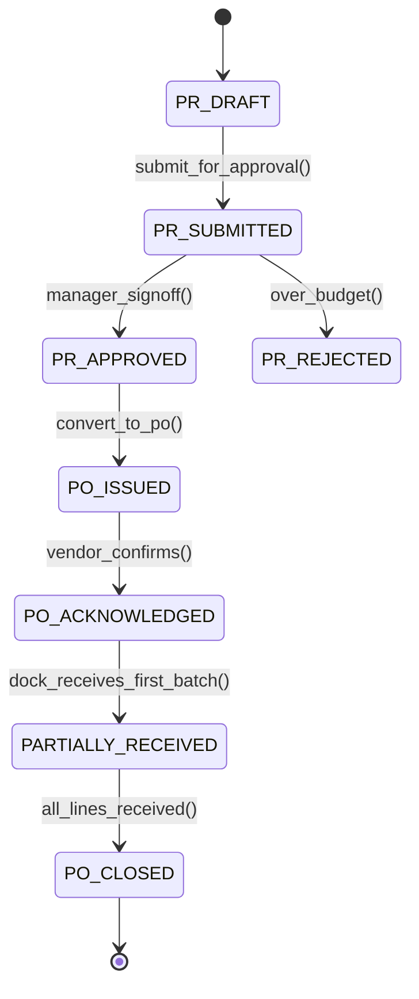

# Procurement & Vendor Lifecycle: Strategic Sourcing, RFQ, PR-to-PO & Scorecards
> Based on **Purchasing and Supply Chain Management - Robert Monczka**

## 1. Canonical Enterprise Architecture & PostgreSQL Data Model (DDL)

```sql
-- Procurement, Requisitions & Vendor Scorecards Schema
CREATE TABLE vendors (
    vendor_id UUID PRIMARY KEY DEFAULT uuid_generate_v4(),
    party_id UUID NOT NULL REFERENCES parties(party_id),
    vendor_number VARCHAR(50) NOT NULL UNIQUE,
    payment_terms VARCHAR(30) NOT NULL DEFAULT 'NET_30',
    currency CHAR(3) NOT NULL,
    status VARCHAR(20) NOT NULL CHECK (status IN ('PROSPECT', 'UNDER_AUDIT', 'APPROVED', 'SUSPENDED', 'BLOCKED')),
    rating_score NUMERIC(5, 2) DEFAULT 100.00,
    created_at TIMESTAMPTZ NOT NULL DEFAULT NOW()
);

CREATE TABLE purchase_requisitions (
    pr_id UUID PRIMARY KEY DEFAULT uuid_generate_v4(),
    pr_number VARCHAR(50) NOT NULL UNIQUE,
    requester_party_id UUID NOT NULL REFERENCES parties(party_id),
    department VARCHAR(50) NOT NULL,
    estimated_total NUMERIC(18, 4) NOT NULL CHECK (estimated_total >= 0),
    status VARCHAR(20) NOT NULL CHECK (status IN ('DRAFT', 'SUBMITTED', 'APPROVED', 'REJECTED', 'CONVERTED_TO_PO')),
    created_at TIMESTAMPTZ NOT NULL DEFAULT NOW()
);

CREATE TABLE purchase_orders (
    po_id UUID PRIMARY KEY DEFAULT uuid_generate_v4(),
    po_number VARCHAR(50) NOT NULL UNIQUE,
    pr_id UUID REFERENCES purchase_requisitions(pr_id),
    vendor_id UUID NOT NULL REFERENCES vendors(vendor_id),
    total_amount NUMERIC(18, 4) NOT NULL CHECK (total_amount >= 0),
    status VARCHAR(20) NOT NULL CHECK (status IN ('DRAFT', 'ISSUED', 'ACKNOWLEDGED', 'PARTIALLY_RECEIVED', 'CLOSED', 'CANCELLED')),
    order_date DATE NOT NULL,
    promised_delivery_date DATE NOT NULL
);

CREATE TABLE vendor_scorecards (
    scorecard_id UUID PRIMARY KEY DEFAULT uuid_generate_v4(),
    vendor_id UUID NOT NULL REFERENCES vendors(vendor_id),
    period VARCHAR(7) NOT NULL,
    orders_placed INT NOT NULL,
    otif_percentage NUMERIC(5, 2) NOT NULL CHECK (otif_percentage BETWEEN 0 AND 100),
    quality_ppm NUMERIC(10, 2) NOT NULL, -- Parts Per Million defective
    price_competitiveness_score NUMERIC(5, 2) NOT NULL
);
```

## 2. Mathematical Foundations & Business Invariants

### 2.1 On-Time In-Full (OTIF) Quality Metric
A shipment is successful under OTIF iff it meets both delivery window and quantity criteria:
$$\text{OTIF} = \frac{\sum_{i=1}^N \mathbf{1}_{\{\text{OnTime}_i \land \text{InFull}_i\}}}{N} \times 100\%$$
Where:
- $\text{OnTime}_i \iff \text{ActualDate}_i \le \text{PromisedDate}_i$
- $\text{InFull}_i \iff \text{ReceivedQuantity}_i \ge \text{OrderedQuantity}_i$

### 2.2 Composite Vendor Rating Invariant
$$\text{Score} = w_1 \cdot \text{OTIF} + w_2 \cdot \left(100 - \frac{\text{PPM}}{100}\right) + w_3 \cdot \text{PriceScore}$$
With weights $\sum w_i = 1.0$.

## 3. Finite State Machine (FSM) & Lifecycle Invariants

### 3.1 Purchase Requisition to PO State Machine


## 4. Production Implementation Guidelines (Rust / SQL / Python)

```rust
pub struct OtifEvaluation {
    pub total_deliveries: usize,
    pub successful_otif: usize,
}

impl OtifEvaluation {
    pub fn score(&self) -> f64 {
        if self.total_deliveries == 0 {
            return 100.0;
        }
        (self.successful_otif as f64 / self.total_deliveries as f64) * 100.0
    }

    pub fn is_vendor_acceptable(&self) -> bool {
        self.score() >= 95.0 // Standard automotive/pharma OTIF threshold
    }
}
```

## 5. Actionable Prompt Recipes

### 5.1 Local Ollama Cheat Sheet (Actionable Constraints & Invariants)
```markdown
- Never issue a Purchase Order without an approved Purchase Requisition.
- Calculate OTIF: Only deliveries that are BOTH On-Time AND In-Full count toward the numerator.
- Suspend vendors whose quarterly OTIF score drops below threshold (e.g. 90%).
- Enforce segregation of duties: Requester cannot approve their own Purchase Requisition.
```

### 5.2 Cloud LLM Architectural Prompt (Comprehensive Engineering Blueprint)
```markdown
Design an enterprise strategic procurement and vendor performance management platform:
1. Implement PR-to-PO workflows with multi-tier Delegation of Authority (DoA) approval routing.
2. Build supplier portal integration for RFQs, purchase order acknowledgments, and ASNs.
3. Compute rolling monthly vendor scorecards based on OTIF, quality PPM, and invoice accuracy.
4. Add automated alerts triggering supplier audits upon scorecard degradation.
```
