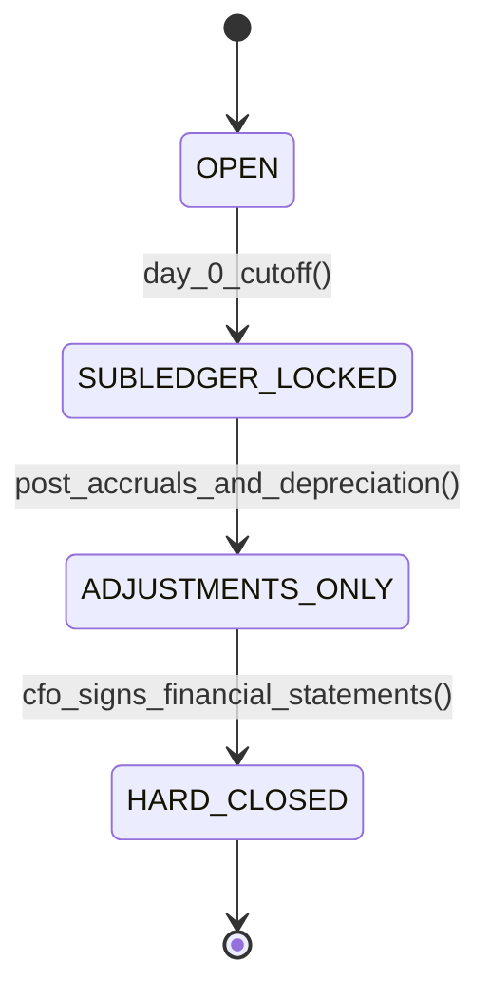

# Record-to-Report (R2R) & Fast Close: Closing Cutoffs, Accruals & Consolidation
> Based on **Fast Close: A Guide to Closing the Books Quickly - Steven Bragg**

## 1. Canonical Enterprise Architecture & PostgreSQL Data Model (DDL)

```sql
-- Record-to-Report (R2R) Closing Checklists & Period Locks
CREATE TABLE closing_periods (
    period_code VARCHAR(7) PRIMARY KEY, -- YYYY-MM
    start_date DATE NOT NULL,
    end_date DATE NOT NULL,
    status VARCHAR(20) NOT NULL CHECK (status IN ('OPEN', 'SUBLEDGER_LOCKED', 'ADJUSTMENTS_ONLY', 'HARD_CLOSED')),
    ap_locked_at TIMESTAMPTZ,
    ar_locked_at TIMESTAMPTZ,
    inventory_locked_at TIMESTAMPTZ,
    gl_hard_closed_at TIMESTAMPTZ
);

CREATE TABLE closing_checklist_tasks (
    task_id UUID PRIMARY KEY DEFAULT uuid_generate_v4(),
    period_code VARCHAR(7) NOT NULL REFERENCES closing_periods(period_code),
    task_sequence INT NOT NULL,
    task_name VARCHAR(150) NOT NULL,
    assigned_role VARCHAR(50) NOT NULL,
    status VARCHAR(20) NOT NULL CHECK (status IN ('NOT_STARTED', 'IN_PROGRESS', 'COMPLETED', 'BLOCKED')),
    completed_at TIMESTAMPTZ,
    CONSTRAINT uq_period_task UNIQUE (period_code, task_sequence)
);

CREATE TABLE automated_accruals (
    accrual_id UUID PRIMARY KEY DEFAULT uuid_generate_v4(),
    period_code VARCHAR(7) NOT NULL REFERENCES closing_periods(period_code),
    expense_account_code VARCHAR(20) NOT NULL REFERENCES chart_of_accounts(account_code),
    accrual_liability_account VARCHAR(20) NOT NULL REFERENCES chart_of_accounts(account_code),
    amount NUMERIC(18, 4) NOT NULL CHECK (amount > 0),
    auto_reversal_date DATE NOT NULL,
    is_reversed BOOLEAN NOT NULL DEFAULT FALSE
);
```

## 2. Mathematical Foundations & Business Invariants

### 2.1 Fast Close Critical Path Invariant
Let the financial close consist of tasks $T_i$ with durations $d_i$ and dependency graph $G$.
$$\text{Total Close Days} = \max_{\text{paths } P} \sum_{i \in P} d_i$$
To achieve a "Fast Close" ($T_{\text{close}} \le 3 \text{ days}$), subledger locks must execute concurrently:
$$\text{Lock}(\text{AP}) \parallel \text{Lock}(\text{AR}) \parallel \text{Lock}(\text{Inventory})$$

### 2.2 Balance Sheet Roll-Forward Invariant
For Retained Earnings (Equity):
$$\text{Ending RE}_t = \text{Beginning RE}_t + \text{Net Income}_t - \text{Dividends Declared}_t$$

## 3. Finite State Machine (FSM) & Lifecycle Invariants

### 3.1 Financial Close Period Lifecycle FSM


## 4. Production Implementation Guidelines (Rust / SQL / Python)

```rust
pub struct FastCloseCoordinator {
    pub is_ap_locked: bool,
    pub is_ar_locked: bool,
    pub is_inv_locked: bool,
}

impl FastCloseCoordinator {
    pub fn can_post_closing_adjustments(&self) -> bool {
        self.is_ap_locked && self.is_ar_locked && self.is_inv_locked
    }
}
```

## 5. Actionable Prompt Recipes

### 5.1 Local Ollama Cheat Sheet (Actionable Constraints & Invariants)
```markdown
- Enforce strict cutoff: lock subledgers (AP, AR, Inventory) before posting GL adjustments.
- Auto-reverse month-end accruals on Day 1 of the following period.
- Depreciation and amortization schedules must run prior to financial statement generation.
- Hard Closed periods reject any subsequent posting transactions without exception.
```

### 5.2 Cloud LLM Architectural Prompt (Comprehensive Engineering Blueprint)
```markdown
Design an enterprise Record-to-Report (R2R) Fast Close automation suite:
1. Implement automated subledger cutoffs locking transactional data entry.
2. Build recurring journal engines executing fixed asset depreciation, loan amortization, and expense accruals.
3. Manage close checklist tasks tracking critical path milestones toward a 3-day close target.
4. Generate GAAP/IFRS balance sheet roll-forward reports and cash flow statement reconciliations.
```
