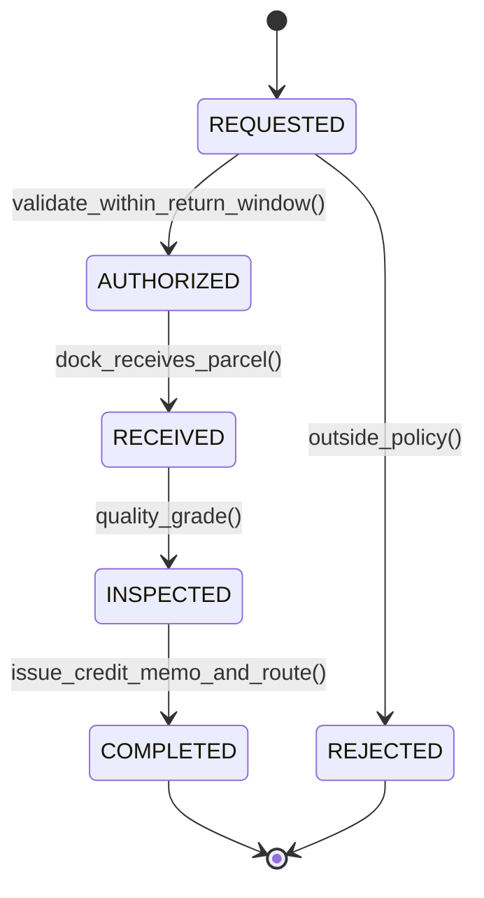

# Reverse Logistics & Returns: RMA Workflows, Disposition Routing & Salvage Accounting
> Based on **Going Backwards: Reverse Logistics Trends and Practices - Dale Rogers & Ronald Lembke**

## 1. Canonical Enterprise Architecture & PostgreSQL Data Model (DDL)

```sql
-- Reverse Logistics, RMA & Disposition Schema
CREATE TABLE rma_requests (
    rma_id UUID PRIMARY KEY DEFAULT uuid_generate_v4(),
    rma_number VARCHAR(50) NOT NULL UNIQUE,
    original_order_id UUID NOT NULL REFERENCES orders(order_id),
    customer_party_id UUID NOT NULL REFERENCES parties(party_id),
    status VARCHAR(20) NOT NULL CHECK (status IN ('REQUESTED', 'AUTHORIZED', 'RECEIVED', 'INSPECTED', 'COMPLETED', 'REJECTED')),
    return_reason VARCHAR(100) NOT NULL,
    restocking_fee_pct NUMERIC(5, 2) NOT NULL DEFAULT 0.00 CHECK (restocking_fee_pct BETWEEN 0 AND 100),
    created_at TIMESTAMPTZ NOT NULL DEFAULT NOW()
);

CREATE TABLE rma_items (
    item_id UUID PRIMARY KEY DEFAULT uuid_generate_v4(),
    rma_id UUID NOT NULL REFERENCES rma_requests(rma_id) ON DELETE CASCADE,
    product_id UUID NOT NULL REFERENCES products(product_id),
    authorized_quantity NUMERIC(14, 4) NOT NULL CHECK (authorized_quantity > 0),
    received_quantity NUMERIC(14, 4) NOT NULL DEFAULT 0.0000,
    disposition VARCHAR(30) CHECK (disposition IN ('RETURN_TO_STOCK', 'REWORK_REFURBISH', 'SCRAP', 'RETURN_TO_VENDOR', 'LIQUIDATION')),
    refund_unit_price NUMERIC(18, 4) NOT NULL CHECK (refund_unit_price >= 0)
);

CREATE TABLE customer_credit_memos (
    memo_id UUID PRIMARY KEY DEFAULT uuid_generate_v4(),
    rma_id UUID NOT NULL REFERENCES rma_requests(rma_id),
    memo_number VARCHAR(50) NOT NULL UNIQUE,
    gross_refund_amount NUMERIC(18, 4) NOT NULL,
    restocking_fee_amount NUMERIC(18, 4) NOT NULL DEFAULT 0.0000,
    net_credit_amount NUMERIC(18, 4) GENERATED ALWAYS AS (gross_refund_amount - restocking_fee_amount) STORED,
    journal_entry_id UUID REFERENCES journal_entries(entry_id),
    issued_at TIMESTAMPTZ NOT NULL DEFAULT NOW()
);
```

## 2. Mathematical Foundations & Business Invariants

### 2.1 Customer Credit Memo Calculation Invariant
For RMA with accepted items $i$, unit price $P_i$, received quantity $Q_i$, and restocking fee percentage $R$:
$$\text{Gross Refund} = \sum_{i} (Q_i \times P_i)$$
$$\text{Restocking Fee} = \text{Gross Refund} \times \frac{R}{100}$$
$$\text{Net Credit Amount} = \text{Gross Refund} - \text{Restocking Fee}$$

### 2.2 Quantity Return Limit Invariant
$$\sum \text{AuthorizedQuantity}_{\text{RMA}} \le Q_{\text{Shipped}}(\text{Original Order})$$

## 3. Finite State Machine (FSM) & Lifecycle Invariants

### 3.1 RMA Lifecycle State Machine


## 4. Production Implementation Guidelines (Rust / SQL / Python)

```rust
use rust_decimal::Decimal;

pub struct CreditMemoCalculation {
    pub gross_amount: Decimal,
    pub restocking_fee: Decimal,
    pub net_refund: Decimal,
}

pub fn compute_credit_memo(
    items: &[(Decimal, Decimal)], // (qty, price)
    restocking_fee_pct: Decimal,
) -> CreditMemoCalculation {
    let gross: Decimal = items.iter().map(|(q, p)| q * p).sum();
    let fee = gross * (restocking_fee_pct / Decimal::from(100));
    let net = gross - fee;

    CreditMemoCalculation {
        gross_amount: gross,
        restocking_fee: fee,
        net_refund: net,
    }
}
```

## 5. Actionable Prompt Recipes

### 5.1 Local Ollama Cheat Sheet (Actionable Constraints & Invariants)
```markdown
- Never issue a refund without an approved RMA and inspection receipt.
- Restocking fee must be deducted from gross refund: Net Credit = Gross - Fee.
- Verify return quantity never exceeds originally shipped order quantity.
- Route inspected returns strictly by disposition: Restock, Refurbish, Scrap, or Return-to-Vendor.
```

### 5.2 Cloud LLM Architectural Prompt (Comprehensive Engineering Blueprint)
```markdown
Architect an enterprise Reverse Logistics and RMA management microservice:
1. Implement RMA authorization rules verifying warranty status and return policy windows.
2. Build warehouse dock inspection interfaces capturing return condition and disposition routing.
3. Automate customer credit memo generation with restocking fee calculations and GL posting vouchers.
4. Track salvage yield recovery percentages and supplier return-to-vendor claims.
```
