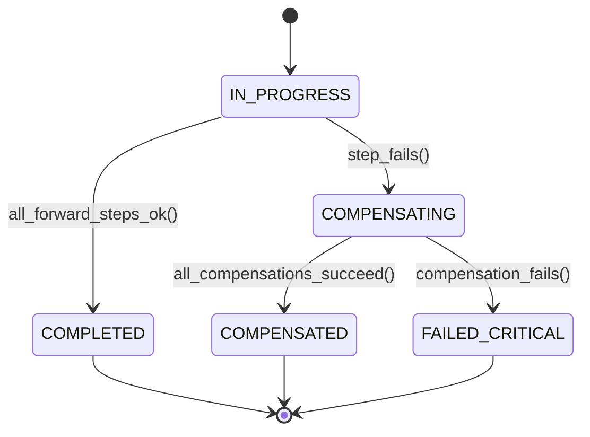

# Saga Distributed Transactions: Orchestration, Compensation & Semantic Rollbacks
> Based on **Microservices Patterns: With Examples in Java - Chris Richardson**

## 1. Canonical Enterprise Architecture & PostgreSQL Data Model (DDL)

```sql
-- Saga Orchestrator & Compensation Log Schema
CREATE TABLE saga_execution_traces (
    saga_id UUID PRIMARY KEY DEFAULT uuid_generate_v4(),
    saga_name VARCHAR(100) NOT NULL,
    current_step INT NOT NULL DEFAULT 0,
    status VARCHAR(20) NOT NULL CHECK (status IN ('IN_PROGRESS', 'COMPLETED', 'COMPENSATING', 'COMPENSATED', 'FAILED_CRITICAL')),
    payload JSONB NOT NULL,
    created_at TIMESTAMPTZ NOT NULL DEFAULT NOW(),
    updated_at TIMESTAMPTZ NOT NULL DEFAULT NOW()
);

CREATE TABLE saga_step_actions (
    step_id UUID PRIMARY KEY DEFAULT uuid_generate_v4(),
    saga_id UUID NOT NULL REFERENCES saga_execution_traces(saga_id) ON DELETE CASCADE,
    step_number INT NOT NULL,
    service_name VARCHAR(100) NOT NULL,
    forward_action VARCHAR(100) NOT NULL,
    compensating_action VARCHAR(100) NOT NULL,
    status VARCHAR(20) NOT NULL CHECK (status IN ('PENDING', 'EXECUTED', 'COMPENSATED', 'FAILED')),
    CONSTRAINT uq_saga_step UNIQUE (saga_id, step_number)
);
```

## 2. Mathematical Foundations & Business Invariants

### 2.1 Saga Forward & Backward Recovery Invariant
A Saga consists of $n$ steps: $T_1, T_2, \dots, T_n$ with corresponding compensations $C_1, C_2, \dots, C_{n-1}$.
If step $T_k$ fails ($k \le n$):
$$\text{Execution Sequence} = [T_1, T_2, \dots, T_{k-1}, T_k (\text{Fail}), C_{k-1}, C_{k-2}, \dots, C_1]$$
**Compensation Invariant**:
Compensating transactions MUST be idempotent and guaranteed to succeed (or alert human operations for manual intervention).

## 3. Finite State Machine (FSM) & Lifecycle Invariants

### 3.1 Saga Orchestration State Machine


## 4. Production Implementation Guidelines (Rust / SQL / Python)

```rust
pub struct SagaStep {
    pub name: &'static str,
    pub is_executed: bool,
}

pub fn execute_saga(
    steps: &mut [SagaStep],
    fail_at_step: Option<usize>,
) -> Result<(), Vec<&'static str>> {
    for (i, step) in steps.iter_mut().enumerate() {
        if Some(i) == fail_at_step {
            // Trigger backward rollback
            let mut compensated = Vec::new();
            for s in steps[..i].iter().rev() {
                compensated.push(s.name);
            }
            return Err(compensated);
        }
        step.is_executed = true;
    }
    Ok(())
}
```

## 5. Actionable Prompt Recipes

### 5.1 Local Ollama Cheat Sheet (Actionable Constraints & Invariants)
```markdown
- Compensating transactions must be idempotent: C(C(x)) == C(x).
- Execute compensations in reverse order of forward operations (LIFO).
- Identify the Pivot Transaction: Once the pivot commits, subsequent steps must be retriable and cannot fail.
- Store saga state in persistent storage to survive coordinator crashes.
```

### 5.2 Cloud LLM Architectural Prompt (Comprehensive Engineering Blueprint)
```markdown
Build an enterprise distributed Saga orchestration engine:
1. Implement a persistent Saga Coordinator tracking step execution state and payloads.
2. Build reverse compensation routing with automatic exponential retries and dead-letter escalation.
3. Pair with transactional outbox patterns to achieve reliable message delivery between microservices.
4. Brutally test partial failure scenarios verifying that failed sagas always leave the system in a consistent state.
```
