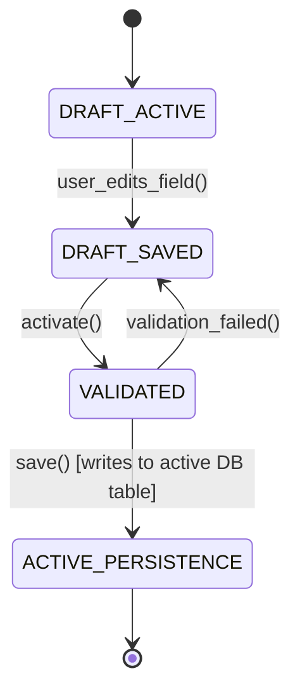

# SAP S/4HANA Clean Core: Side-by-Side Extensibility, BTP & ABAP Cloud (RAP)
> Based on **SAP S/4HANA Architecture - Thomas Saueressig**

## 1. Canonical Enterprise Architecture & PostgreSQL Data Model (DDL)

```sql
-- Clean Core Metadata & API Release Contracts Schema
CREATE TABLE released_sap_apis (
    api_id UUID PRIMARY KEY DEFAULT uuid_generate_v4(),
    api_name VARCHAR(100) NOT NULL UNIQUE,
    release_contract VARCHAR(20) NOT NULL CHECK (release_contract IN ('C1_SYSTEM_INTERNAL', 'C2_EXTENDED_SYSTEM', 'C3_PUBLIC_CLOUD')),
    protocol VARCHAR(20) NOT NULL CHECK (protocol IN ('ODATA_V2', 'ODATA_V4', 'REST', 'EVENT_MESH')),
    is_deprecated BOOLEAN NOT NULL DEFAULT FALSE
);

CREATE TABLE clean_core_extensions (
    extension_id UUID PRIMARY KEY DEFAULT uuid_generate_v4(),
    extension_name VARCHAR(100) NOT NULL UNIQUE,
    extension_type VARCHAR(30) NOT NULL CHECK (extension_type IN ('IN_APP_KEY_USER', 'ON_STACK_ABAP_CLOUD', 'SIDE_BY_SIDE_BTP')),
    target_sap_api_id UUID NOT NULL REFERENCES released_sap_apis(api_id),
    compliance_score NUMERIC(5, 2) NOT NULL CHECK (compliance_score BETWEEN 0 AND 100)
);
```

## 2. Mathematical Foundations & Business Invariants

### 2.1 Clean Core Compliance Ratio Invariant
For an enterprise SAP landscape with extensions $E$:
$$\text{Clean Core Index} = \frac{\sum_{e \in E} \mathbf{1}_{\{e \text{ uses released public APIs}\}}}{|E|} \times 100\%$$
**Clean Core Rule**: Upgradeability invariant requires $\text{Clean Core Index} = 100\%$. Any modification to SAP standard core objects (SSCR key hacks) violates the Clean Core contract.

### 2.2 CDS View Association Join Minimization
CDS Views with associations execute deferred (lazy) on-demand SQL joins:
$$Q(V) = \text{Base Projection} \cup (\text{Association} \iff \text{Field Accessed})$$

## 3. Finite State Machine (FSM) & Lifecycle Invariants

### 3.1 ABAP RAP Draft-Enabled Business Object Lifecycle


## 4. Production Implementation Guidelines (Rust / SQL / Python)

```rust
pub struct CleanCoreValidator;

impl CleanCoreValidator {
    pub fn is_extension_compliant(
        uses_released_apis_only: bool,
        modifies_standard_tables: bool,
    ) -> bool {
        uses_released_apis_only && !modifies_standard_tables
    }
}
```

## 5. Actionable Prompt Recipes

### 5.1 Local Ollama Cheat Sheet (Actionable Constraints & Invariants)
```markdown
- Never modify standard core tables or programs: keep core clean.
- Build extensions side-by-side on SAP BTP or using on-stack ABAP Cloud (RAP).
- Consume only released SAP APIs with C1 release contract.
- Use draft-enabled Core Data Services (CDS) views for stateful Fiori UX.
```

### 5.2 Cloud LLM Architectural Prompt (Comprehensive Engineering Blueprint)
```markdown
Design an enterprise architecture conforming to the SAP S/4HANA Clean Core paradigm:
1. Enforce strict isolation between core transactional modules and custom customer enhancements.
2. Model ABAP RESTful Application Programming Model (RAP) Business Objects with Draft handling.
3. Build side-by-side integration patterns utilizing SAP Event Mesh and OData v4 APIs.
4. Establish governance metrics auditing extension code against released public API whitelists.
```
