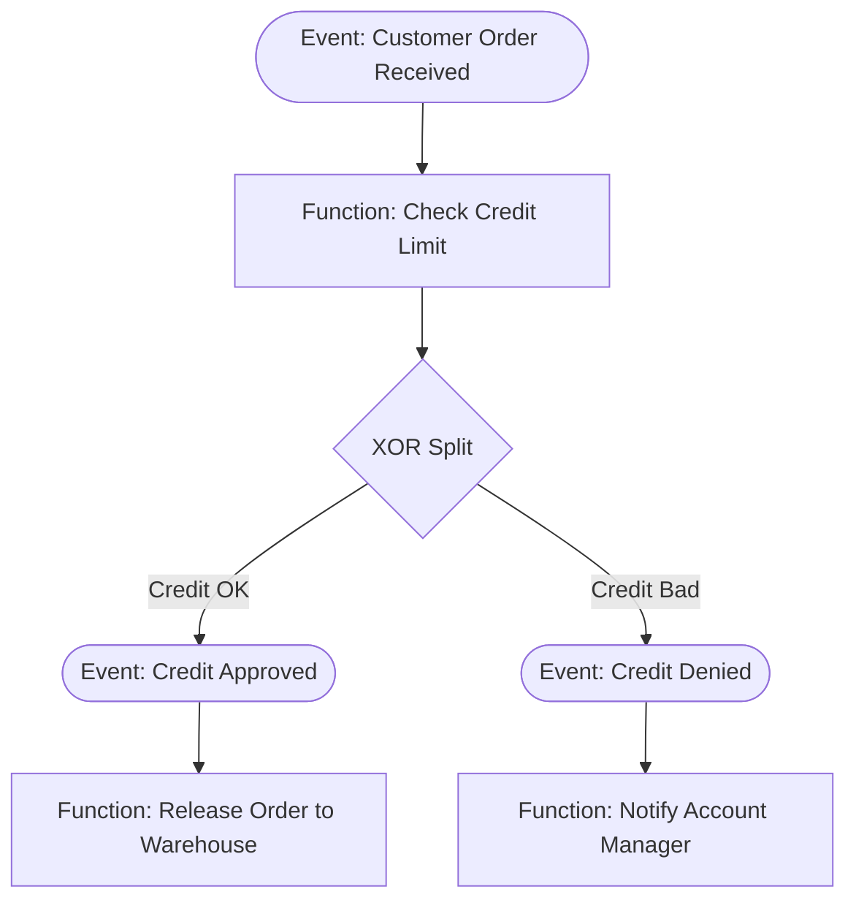

# ARIS Architecture of Integrated Information Systems: EPC Workflows & Process-to-Data Alignment
> Based on **ARIS - Business Process Modeling - August-Wilhelm Scheer**

## 1. Canonical Enterprise Architecture & PostgreSQL Data Model (DDL)

```sql
-- ARIS Framework: House of Business Engineering Metamodel
CREATE TABLE aris_views (
    view_code VARCHAR(20) PRIMARY KEY, -- 'FUNCTION', 'DATA', 'ORGANIZATION', 'OUTPUT', 'CONTROL'
    name VARCHAR(100) NOT NULL,
    description TEXT
);

CREATE TABLE aris_org_units (
    org_unit_id UUID PRIMARY KEY DEFAULT uuid_generate_v4(),
    code VARCHAR(50) NOT NULL UNIQUE,
    name VARCHAR(100) NOT NULL,
    parent_org_unit_id UUID REFERENCES aris_org_units(org_unit_id)
);

CREATE TABLE epc_nodes (
    node_id UUID PRIMARY KEY DEFAULT uuid_generate_v4(),
    node_type VARCHAR(20) NOT NULL CHECK (node_type IN ('EVENT', 'FUNCTION', 'AND_SPLIT', 'AND_JOIN', 'XOR_SPLIT', 'XOR_JOIN', 'OR_SPLIT', 'OR_JOIN')),
    label VARCHAR(255) NOT NULL,
    responsible_org_unit_id UUID REFERENCES aris_org_units(org_unit_id),
    created_at TIMESTAMPTZ NOT NULL DEFAULT NOW()
);

CREATE TABLE epc_edges (
    edge_id UUID PRIMARY KEY DEFAULT uuid_generate_v4(),
    source_node_id UUID NOT NULL REFERENCES epc_nodes(node_id),
    target_node_id UUID NOT NULL REFERENCES epc_nodes(node_id),
    condition_expression VARCHAR(255),
    CONSTRAINT chk_epc_no_self_edge CHECK (source_node_id <> target_node_id),
    CONSTRAINT uq_epc_edge UNIQUE (source_node_id, target_node_id)
);

CREATE TABLE epc_function_data_inputs (
    mapping_id UUID PRIMARY KEY DEFAULT uuid_generate_v4(),
    function_node_id UUID NOT NULL REFERENCES epc_nodes(node_id),
    entity_name VARCHAR(100) NOT NULL,
    access_mode VARCHAR(20) NOT NULL CHECK (access_mode IN ('READ', 'CREATE', 'UPDATE', 'DELETE'))
);
```

## 2. Mathematical Foundations & Business Invariants

### 2.1 EPC Grammar & Syntax Invariants
Let an EPC graph be $G = (V, E)$ where $V = V_{\text{Event}} \cup V_{\text{Function}} \cup V_{\text{Connector}}$:
1. **Alternation Principle**: An Event must not be immediately followed by another Event:
   $$(u, v) \in E \land u \in V_{\text{Event}} \implies v \notin V_{\text{Event}}$$
2. **Decision Authority**: An Event cannot make decisions; XOR/OR connectors cannot immediately follow an Event:
   $$(u, v) \in E \land u \in V_{\text{Event}} \implies v \notin \{ \text{XOR\_SPLIT}, \text{OR\_SPLIT} \}$$
   Only a `FUNCTION` possesses organizational agency to route decisions.

### 2.2 Token Game Net Soundness
A workflow net is sound iff:
- **Option to Complete**: $\forall M \in [M_0\rangle, \exists M' \in [M\rangle \text{ s.t. } M' \ge M_{\text{final}}$.
- **Proper Completion**: $M \ge M_{\text{final}} \implies M = M_{\text{final}}$.
- **No Dead Transitions**: $\forall t \in T, \exists M \in [M_0\rangle \text{ s.t. } M \xrightarrow{t}$.

## 3. Finite State Machine (FSM) & Lifecycle Invariants

### 3.1 EPC Process Execution Flow


## 4. Production Implementation Guidelines (Rust / SQL / Python)

```rust
pub enum EpcNodeType {
    Event,
    Function,
    XorSplit,
    XorJoin,
    AndSplit,
    AndJoin,
}

pub struct EpcEdge {
    pub from_type: EpcNodeType,
    pub to_type: EpcNodeType,
}

impl EpcEdge {
    pub fn validate_grammar(&self) -> Result<(), &'static str> {
        match (self.from_type, self.to_type) {
            (EpcNodeType::Event, EpcNodeType::Event) => {
                Err("Grammar violation: Event cannot directly trigger another Event without an intervening Function")
            }
            (EpcNodeType::Event, EpcNodeType::XorSplit) => {
                Err("Grammar violation: Events have no decision-making power; XOR split must follow a Function")
            }
            _ => Ok(()),
        }
    }
}
```

## 5. Actionable Prompt Recipes

### 5.1 Local Ollama Cheat Sheet (Actionable Constraints & Invariants)
```markdown
- Enforce Scheer's EPC grammar: Never allow an Event to directly connect to an Event.
- Prevent XOR splits immediately after an Event; decisions require a Function.
- Map every EPC Function to responsible Organizational Unit and CRUD Data Objects.
- Enforce Petri net soundness (no deadlocks, no dangling execution tokens).
```

### 5.2 Cloud LLM Architectural Prompt (Comprehensive Engineering Blueprint)
```markdown
Design an enterprise process modeling engine implementing August-Wilhelm Scheer's ARIS framework:
1. Model the five ARIS views: Function, Data, Organization, Output, and Control.
2. Implement an EPC validator verifying grammar invariants (alternation, decision authority).
3. Provide a token-based execution simulator capable of detecting deadlocks and improper completions.
```
