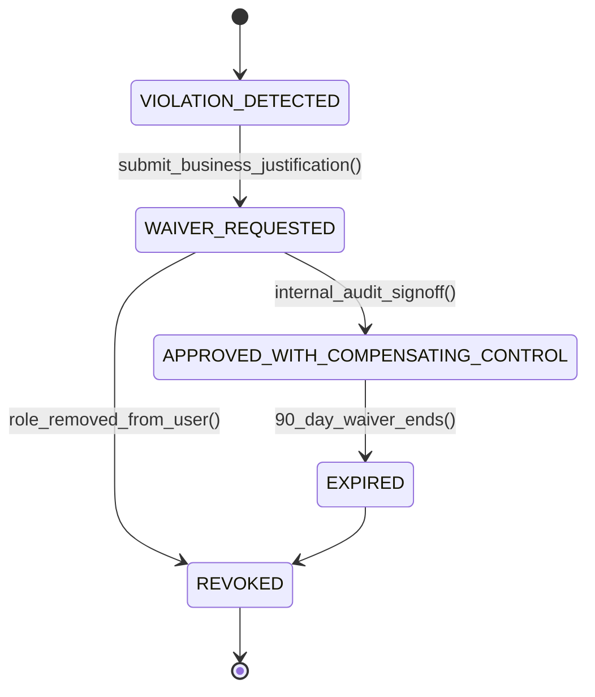

# Segregation of Duties (SoD): Incompatible Role Matrices & Fraud Prevention
> Based on **Accounting Information Systems - Marshall Romney & Paul Steinbart**

## 1. Canonical Enterprise Architecture & PostgreSQL Data Model (DDL)

```sql
-- Segregation of Duties (SoD) Rules & Violation Auditing
CREATE TABLE sod_functions (
    function_id VARCHAR(50) PRIMARY KEY,
    name VARCHAR(100) NOT NULL,
    category VARCHAR(20) NOT NULL CHECK (category IN ('AUTHORIZATION', 'CUSTODY', 'RECORDING', 'RECONCILIATION')),
    description TEXT
);

CREATE TABLE sod_conflicting_rules (
    rule_id UUID PRIMARY KEY DEFAULT uuid_generate_v4(),
    function_a VARCHAR(50) NOT NULL REFERENCES sod_functions(function_id),
    function_b VARCHAR(50) NOT NULL REFERENCES sod_functions(function_id),
    risk_level VARCHAR(20) NOT NULL CHECK (risk_level IN ('CRITICAL', 'HIGH', 'MEDIUM')),
    fraud_risk_description TEXT NOT NULL,
    CONSTRAINT chk_distinct_functions CHECK (function_a <> function_b),
    CONSTRAINT uq_sod_pair UNIQUE (function_a, function_b)
);

CREATE TABLE user_function_assignments (
    assignment_id UUID PRIMARY KEY DEFAULT uuid_generate_v4(),
    user_id UUID NOT NULL,
    function_id VARCHAR(50) NOT NULL REFERENCES sod_functions(function_id),
    granted_at TIMESTAMPTZ NOT NULL DEFAULT NOW(),
    CONSTRAINT uq_user_function UNIQUE (user_id, function_id)
);

CREATE TABLE sod_violation_audits (
    audit_id UUID PRIMARY KEY DEFAULT uuid_generate_v4(),
    user_id UUID NOT NULL,
    function_a VARCHAR(50) NOT NULL,
    function_b VARCHAR(50) NOT NULL,
    rule_id UUID NOT NULL REFERENCES sod_conflicting_rules(rule_id),
    detected_at TIMESTAMPTZ NOT NULL DEFAULT NOW(),
    has_active_mitigation_waiver BOOLEAN NOT NULL DEFAULT FALSE
);
```

## 2. Mathematical Foundations & Business Invariants

### 2.1 The ACRR Segregation Invariant
In any internal control system, the four primary responsibilities must be segregated:
$$\text{Func}(A) \cap \text{Func}(C) \cap \text{Func}(R) \cap \text{Func}(\text{Rec}) = \emptyset$$
Where:
- $A$: Authorization (e.g. approving a purchase order or disbursement).
- $C$: Custody (e.g. physical handling of cash, checks, or warehouse inventory).
- $R$: Recording (e.g. posting general ledger entries or creating invoices).
- $\text{Rec}$: Reconciliation (e.g. performing bank or inventory reconciliations).

### 2.2 Toxic Role Combination Rule
Let user $u$ have active function set $F(u)$.
$$\forall (f_1, f_2) \in \text{ConflictingRules}, \quad \{f_1, f_2\} \subseteq F(u) \implies \text{SoD Violation!}$$
Example: Cannot both `CREATE_VENDOR` and `DISBURSE_PAYMENT`.

## 3. Finite State Machine (FSM) & Lifecycle Invariants

### 3.1 SoD Exception Waiver Lifecycle


## 4. Production Implementation Guidelines (Rust / SQL / Python)

```rust
use std::collections::HashSet;

pub fn check_sod_conflict(
    user_functions: &HashSet<&'static str>,
    conflicting_pairs: &[(&'static str, &'static str)],
) -> Vec<(&'static str, &'static str)> {
    let mut violations = Vec::new();
    for &(f1, f2) in conflicting_pairs {
        if user_functions.contains(f1) && user_functions.contains(f2) {
            violations.push((f1, f2));
        }
    }
    violations
}
```

## 5. Actionable Prompt Recipes

### 5.1 Local Ollama Cheat Sheet (Actionable Constraints & Invariants)
```markdown
- Enforce ACRR: Authorization, Custody, Recording, and Reconciliation must be segregated.
- Prevent toxic combinations: User who creates vendor cannot authorize vendor payments.
- User who counts inventory cannot authorize inventory write-off adjustments.
- Require dual-authorization (four-eyes principle) for all transactions exceeding authority limits.
```

### 5.2 Cloud LLM Architectural Prompt (Comprehensive Engineering Blueprint)
```markdown
Architect an enterprise Segregation of Duties (SoD) governance engine:
1. Model comprehensive SoD conflicting rule matrices across financial, procurement, and inventory modules.
2. Build pre-assignment check interceptors blocking role additions that introduce toxic combinations.
3. Manage temporary audit exception waivers backed by mandatory compensating supervisory controls.
4. Export continuous compliance evidence reports for internal and external auditors.
```
