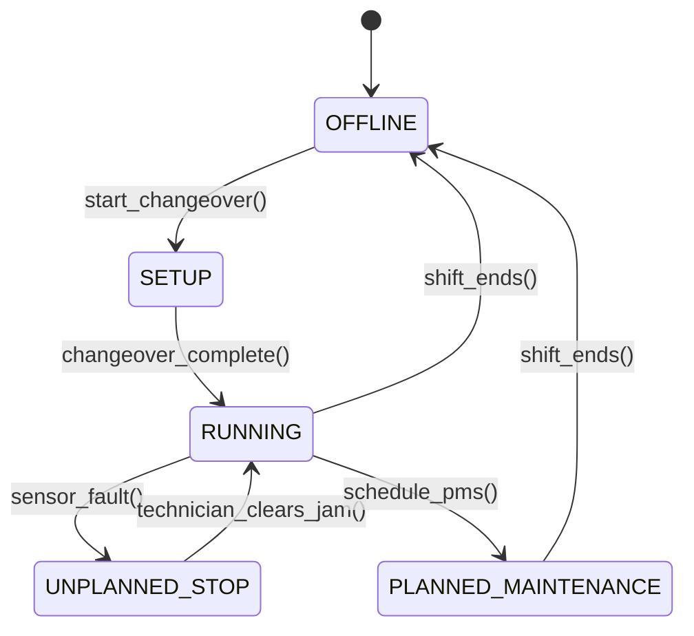

# Manufacturing Execution Systems (MES): ISA-95 Shop Floor Control & OEE Tracking
> Based on **MES: Manufacturing Execution Systems - Jürgen Kletti**

## 1. Canonical Enterprise Architecture & PostgreSQL Data Model (DDL)

```sql
-- MES Shop Floor Execution & OEE Shift Logging
CREATE TABLE mes_work_orders (
    order_id UUID PRIMARY KEY DEFAULT uuid_generate_v4(),
    work_order_number VARCHAR(50) NOT NULL UNIQUE,
    product_id UUID NOT NULL REFERENCES products(product_id),
    target_quantity NUMERIC(14, 4) NOT NULL CHECK (target_quantity > 0),
    completed_quantity NUMERIC(14, 4) NOT NULL DEFAULT 0.0000,
    scrapped_quantity NUMERIC(14, 4) NOT NULL DEFAULT 0.0000,
    status VARCHAR(20) NOT NULL CHECK (status IN ('DISPATCHED', 'SETUP', 'RUNNING', 'PAUSED', 'COMPLETED', 'ABORTED')),
    start_time TIMESTAMPTZ,
    end_time TIMESTAMPTZ
);

CREATE TABLE oee_shift_records (
    record_id UUID PRIMARY KEY DEFAULT uuid_generate_v4(),
    work_center_id UUID NOT NULL REFERENCES work_centers(work_center_id),
    shift_date DATE NOT NULL,
    planned_production_time_min NUMERIC(8, 2) NOT NULL CHECK (planned_production_time_min > 0),
    unplanned_downtime_min NUMERIC(8, 2) NOT NULL DEFAULT 0.00,
    operating_time_min NUMERIC(8, 2) GENERATED ALWAYS AS (planned_production_time_min - unplanned_downtime_min) STORED,
    ideal_cycle_time_seconds NUMERIC(8, 2) NOT NULL CHECK (ideal_cycle_time_seconds > 0),
    total_parts_produced INT NOT NULL CHECK (total_parts_produced >= 0),
    good_parts_produced INT NOT NULL CHECK (good_parts_produced >= 0),
    -- Ratios
    availability_ratio NUMERIC(5, 4),
    performance_ratio NUMERIC(5, 4),
    quality_ratio NUMERIC(5, 4),
    overall_oee NUMERIC(5, 4)
);
```

## 2. Mathematical Foundations & Business Invariants

### 2.1 Overall Equipment Effectiveness (OEE) Decomposition
$$\text{OEE} = \text{Availability} \times \text{Performance} \times \text{Quality}$$
Where:
1. **Availability ($A$)**:
   $$A = \frac{\text{Operating Time}}{\text{Planned Production Time}} = \frac{\text{Planned Time} - \text{Downtime}}{\text{Planned Time}}$$
2. **Performance ($P$)**:
   $$P = \frac{\text{Ideal Cycle Time} \times \text{Total Parts Produced}}{\text{Operating Time (seconds)}}$$
3. **Quality ($Q$)**:
   $$Q = \frac{\text{Good Parts Produced}}{\text{Total Parts Produced}}$$
**OEE Invariant**: $0.0 \le \text{OEE} \le 1.0$. World class benchmark is $\text{OEE} \ge 85\%$ ($A \ge 90\%, P \ge 95\%, Q \ge 99.9\%$).

## 3. Finite State Machine (FSM) & Lifecycle Invariants

### 3.1 Work Center Machine Operational FSM


## 4. Production Implementation Guidelines (Rust / SQL / Python)

```rust
pub struct OeeMetrics {
    pub availability: f64,
    pub performance: f64,
    pub quality: f64,
    pub oee: f64,
}

pub fn calculate_oee(
    planned_minutes: f64,
    downtime_minutes: f64,
    ideal_cycle_time_secs: f64,
    total_parts: usize,
    good_parts: usize,
) -> Result<OeeMetrics, &'static str> {
    if planned_minutes <= 0.0 || ideal_cycle_time_secs <= 0.0 {
        return Err("Invalid baseline time or cycle time");
    }
    let operating_mins = (planned_minutes - downtime_minutes).max(0.0);
    let availability = (operating_mins / planned_minutes).clamp(0.0, 1.0);

    let operating_secs = operating_mins * 60.0;
    let performance = if operating_secs > 0.0 {
        ((ideal_cycle_time_secs * total_parts as f64) / operating_secs).clamp(0.0, 1.0)
    } else {
        0.0
    };

    let quality = if total_parts > 0 {
        (good_parts as f64 / total_parts as f64).clamp(0.0, 1.0)
    } else {
        1.0
    };

    let oee = availability * performance * quality;

    Ok(OeeMetrics { availability, performance, quality, oee })
}
```

## 5. Actionable Prompt Recipes

### 5.1 Local Ollama Cheat Sheet (Actionable Constraints & Invariants)
```markdown
- OEE formula: Availability * Performance * Quality.
- Availability = (Planned Time - Downtime) / Planned Time.
- Performance = (Ideal Cycle Time * Total Count) / Operating Time.
- Quality = Good Count / Total Count.
- Target world-class OEE benchmark of 85%.
```

### 5.2 Cloud LLM Architectural Prompt (Comprehensive Engineering Blueprint)
```markdown
Design an ISA-95 compliant Manufacturing Execution System (MES):
1. Ingest real-time machine PLC telemetry to record production counts and fault codes.
2. Automate shift OEE calculation decomposing the Six Big Losses across Availability, Performance, and Quality.
3. Build shop floor dispatching terminals allowing operators to clock on/off work orders.
4. Provide unit tests validating OEE calculation across various production downtime and defect scenarios.
```
