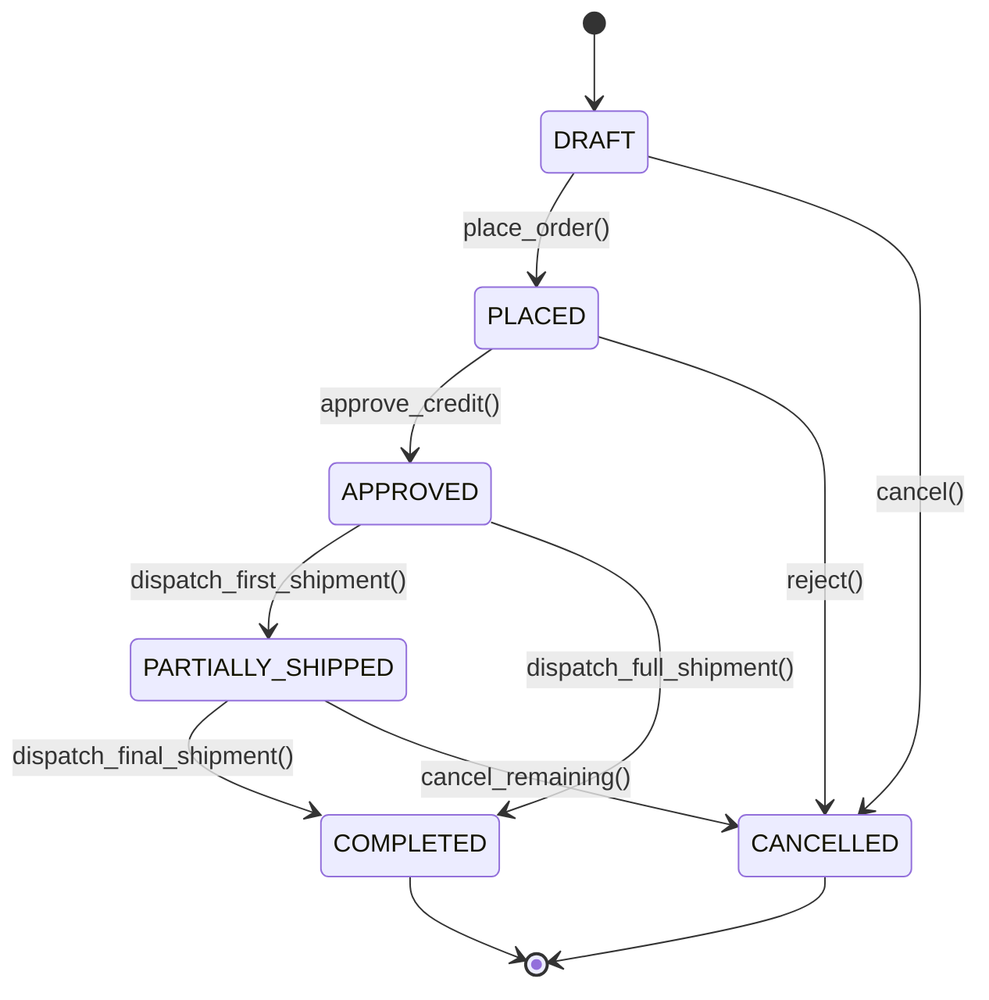

# Canonical Enterprise Data Modeling: Universal Party, Product, Order & Account Patterns
> Based on **The Data Model Resource Book, Vol 1 & 2 - Len Silverston**

## 1. Canonical Enterprise Architecture & PostgreSQL Data Model (DDL)

```sql
-- Silverston Universal Party, Role, Order & Shipment Patterns
CREATE EXTENSION IF NOT EXISTS "uuid-ossp";

CREATE TABLE parties (
    party_id UUID PRIMARY KEY DEFAULT uuid_generate_v4(),
    party_type VARCHAR(20) NOT NULL CHECK (party_type IN ('PERSON', 'ORGANIZATION', 'AUTOMATED_AGENT')),
    legal_name VARCHAR(255) NOT NULL,
    tax_identifier VARCHAR(64),
    created_at TIMESTAMPTZ NOT NULL DEFAULT NOW(),
    updated_at TIMESTAMPTZ NOT NULL DEFAULT NOW()
);

CREATE TABLE party_roles (
    role_id UUID PRIMARY KEY DEFAULT uuid_generate_v4(),
    party_id UUID NOT NULL REFERENCES parties(party_id) ON DELETE CASCADE,
    role_type VARCHAR(50) NOT NULL CHECK (role_type IN (
        'CUSTOMER', 'SUPPLIER', 'INTERNAL_ORGANIZATION', 'EMPLOYEE', 'CARRIER', 'REGULATOR'
    )),
    from_date DATE NOT NULL,
    thru_date DATE,
    CONSTRAINT chk_role_dates CHECK (thru_date IS NULL OR thru_date >= from_date)
);

CREATE TABLE party_relationships (
    relationship_id UUID PRIMARY KEY DEFAULT uuid_generate_v4(),
    from_party_id UUID NOT NULL REFERENCES parties(party_id),
    to_party_id UUID NOT NULL REFERENCES parties(party_id),
    relationship_type VARCHAR(50) NOT NULL CHECK (relationship_type IN (
        'SUBSIDIARY_OF', 'EMPLOYMENT', 'CUSTOMER_RELATION', 'SUPPLIER_RELATION', 'PARTNERSHIP'
    )),
    from_date DATE NOT NULL,
    thru_date DATE,
    CONSTRAINT chk_rel_distinct CHECK (from_party_id <> to_party_id),
    CONSTRAINT chk_rel_dates CHECK (thru_date IS NULL OR thru_date >= from_date)
);

CREATE TABLE products (
    product_id UUID PRIMARY KEY DEFAULT uuid_generate_v4(),
    product_type VARCHAR(20) NOT NULL CHECK (product_type IN ('GOOD', 'SERVICE', 'RAW_MATERIAL', 'ASSEMBLY')),
    sku VARCHAR(100) NOT NULL UNIQUE,
    name VARCHAR(255) NOT NULL,
    base_uom VARCHAR(20) NOT NULL DEFAULT 'UNIT',
    is_virtual BOOLEAN NOT NULL DEFAULT FALSE,
    is_active BOOLEAN NOT NULL DEFAULT TRUE,
    created_at TIMESTAMPTZ NOT NULL DEFAULT NOW()
);

CREATE TABLE orders (
    order_id UUID PRIMARY KEY DEFAULT uuid_generate_v4(),
    order_number VARCHAR(50) NOT NULL UNIQUE,
    order_type VARCHAR(20) NOT NULL CHECK (order_type IN ('SALES_ORDER', 'PURCHASE_ORDER')),
    placed_by_party_id UUID NOT NULL REFERENCES parties(party_id),
    taking_party_id UUID NOT NULL REFERENCES parties(party_id),
    status VARCHAR(30) NOT NULL CHECK (status IN ('DRAFT', 'PLACED', 'APPROVED', 'PARTIALLY_SHIPPED', 'COMPLETED', 'CANCELLED')),
    currency_code CHAR(3) NOT NULL,
    subtotal NUMERIC(18, 4) NOT NULL DEFAULT 0.0000,
    tax_amount NUMERIC(18, 4) NOT NULL DEFAULT 0.0000,
    total_amount NUMERIC(18, 4) NOT NULL DEFAULT 0.0000,
    order_date TIMESTAMPTZ NOT NULL DEFAULT NOW()
);

CREATE TABLE order_items (
    item_id UUID PRIMARY KEY DEFAULT uuid_generate_v4(),
    order_id UUID NOT NULL REFERENCES orders(order_id) ON DELETE CASCADE,
    product_id UUID NOT NULL REFERENCES products(product_id),
    line_number INT NOT NULL,
    ordered_quantity NUMERIC(14, 4) NOT NULL CHECK (ordered_quantity > 0),
    unit_price NUMERIC(18, 4) NOT NULL CHECK (unit_price >= 0),
    discount_amount NUMERIC(18, 4) NOT NULL DEFAULT 0.0000,
    line_total NUMERIC(18, 4) GENERATED ALWAYS AS (ordered_quantity * unit_price - discount_amount) STORED,
    CONSTRAINT uq_order_line UNIQUE (order_id, line_number)
);

CREATE TABLE shipments (
    shipment_id UUID PRIMARY KEY DEFAULT uuid_generate_v4(),
    shipment_number VARCHAR(50) NOT NULL UNIQUE,
    carrier_party_id UUID REFERENCES parties(party_id),
    status VARCHAR(30) NOT NULL CHECK (status IN ('CREATED', 'PICKED', 'PACKED', 'IN_TRANSIT', 'DELIVERED', 'RETURNED')),
    estimated_ship_date TIMESTAMPTZ,
    actual_ship_date TIMESTAMPTZ
);

CREATE TABLE shipment_items (
    shipment_item_id UUID PRIMARY KEY DEFAULT uuid_generate_v4(),
    shipment_id UUID NOT NULL REFERENCES shipments(shipment_id) ON DELETE CASCADE,
    order_item_id UUID NOT NULL REFERENCES order_items(item_id),
    shipped_quantity NUMERIC(14, 4) NOT NULL CHECK (shipped_quantity > 0)
);

CREATE INDEX idx_party_roles_party ON party_roles(party_id, role_type);
CREATE INDEX idx_party_rel_from_to ON party_relationships(from_party_id, to_party_id);
CREATE INDEX idx_order_items_order ON order_items(order_id);
CREATE INDEX idx_shipment_items_order_item ON shipment_items(order_item_id);
```

## 2. Mathematical Foundations & Business Invariants

### 2.1 Order Line & Aggregation Invariants
For any order $O$ with line items $i \in \{1, \dots, n\}$:
$$\text{LineTotal}_i = Q_i \times P_i - D_i$$
$$\text{Subtotal}(O) = \sum_{i=1}^n \text{LineTotal}_i$$
$$\text{TotalAmount}(O) = \text{Subtotal}(O) + \text{TaxAmount}(O) + \text{ShippingFee}(O)$$

### 2.2 Shipment Quantity Conservation
Let $Q_i^{\text{ordered}}$ be the ordered quantity of line item $i$. The cumulative shipped quantity across all shipments $S_k$ must satisfy:
$$\sum_{k} Q_{i, k}^{\text{shipped}} \le Q_i^{\text{ordered}}$$
If $\sum_k Q_{i, k}^{\text{shipped}} = Q_i^{\text{ordered}}$ for all $i$, the order transitions to `COMPLETED`.

### 2.3 Party Hierarchy Directed Acyclic Graph (DAG) Invariant
Let $G = (V, E)$ be the graph formed by party relationships where $V$ are `parties` and $E$ are `SUBSIDIARY_OF` relationships.
$$\forall v \in V, \quad v \notin \text{Ancestors}(v) \iff \text{Cycles}(G) = \emptyset$$

## 3. Finite State Machine (FSM) & Lifecycle Invariants

### 3.1 Order Lifecycle FSM


### 3.2 Invariant Enforcement Rules
- **Rule 1**: A `CANCELLED` order cannot receive shipments or accept further modifications.
- **Rule 2**: Transition from `DRAFT` to `PLACED` requires at least 1 line item with positive quantity.
- **Rule 3**: `COMPLETED` is an immutable terminal state.

## 4. Production Implementation Guidelines (Rust / SQL / Python)

```rust
use rust_decimal::Decimal;
use uuid::Uuid;

#[derive(Debug, Clone, PartialEq, Eq)]
pub enum OrderStatus {
    Draft,
    Placed,
    Approved,
    PartiallyShipped,
    Completed,
    Cancelled,
}

#[derive(Debug, Clone)]
pub struct OrderItem {
    pub item_id: Uuid,
    pub product_id: Uuid,
    pub ordered_quantity: Decimal,
    pub unit_price: Decimal,
    pub discount_amount: Decimal,
    pub shipped_quantity: Decimal,
}

impl OrderItem {
    pub fn line_total(&self) -> Decimal {
        self.ordered_quantity * self.unit_price - self.discount_amount
    }

    pub fn remaining_quantity(&self) -> Decimal {
        self.ordered_quantity - self.shipped_quantity
    }
}

pub struct Order {
    pub order_id: Uuid,
    pub status: OrderStatus,
    pub items: Vec<OrderItem>,
    pub tax_amount: Decimal,
}

impl Order {
    pub fn subtotal(&self) -> Decimal {
        self.items.iter().map(|i| i.line_total()).sum()
    }

    pub fn total_amount(&self) -> Decimal {
        self.subtotal() + self.tax_amount
    }

    pub fn record_shipment(&mut self, item_id: Uuid, qty: Decimal) -> Result<(), &'static str> {
        if self.status != OrderStatus::Approved && self.status != OrderStatus::PartiallyShipped {
            return Err("Cannot ship order not in Approved or PartiallyShipped state");
        }
        let item = self.items.iter_mut().find(|i| i.item_id == item_id)
            .ok_or("Order item not found")?;
        if item.shipped_quantity + qty > item.ordered_quantity {
            return Err("Shipped quantity exceeds ordered quantity");
        }
        item.shipped_quantity += qty;
        
        let all_fulfilled = self.items.iter().all(|i| i.remaining_quantity() == Decimal::ZERO);
        self.status = if all_fulfilled {
            OrderStatus::Completed
        } else {
            OrderStatus::PartiallyShipped
        };
        Ok(())
    }
}
```

## 5. Actionable Prompt Recipes

### 5.1 Local Ollama Cheat Sheet (Actionable Constraints & Invariants)
```markdown
- Enforce Party-Role-Relationship decoupling: Never put 'is_customer' boolean on party table; use party_roles with date ranges.
- Validate Order Line Total invariant: line_total = quantity * unit_price - discount.
- Enforce cumulative shipment check: sum(shipped_quantity) <= ordered_quantity.
- Prevent cyclical party hierarchies with recursive CTE validation before insert.
- Ensure terminal states (COMPLETED, CANCELLED) reject any subsequent update mutations.
```

### 5.2 Cloud LLM Architectural Prompt (Comprehensive Engineering Blueprint)
```markdown
Implement an enterprise canonical data modeling module following Len Silverston's Data Model Resource Book patterns:
1. Model Party, PartyRole, and PartyRelationship as pure relational abstractions.
2. Structure Order, OrderItem, Shipment, and ShipmentItem with strict foreign key cascading and generated line totals.
3. Provide a Rust/TypeScript domain entity with methods for line item additions, tax recalculation, and shipment recording.
4. Guarantee that order state transitions adhere strictly to the provided state machine diagram.
5. Provide comprehensive unit tests verifying that over-shipment raises an error and that full shipment automatically completes the order.
```
