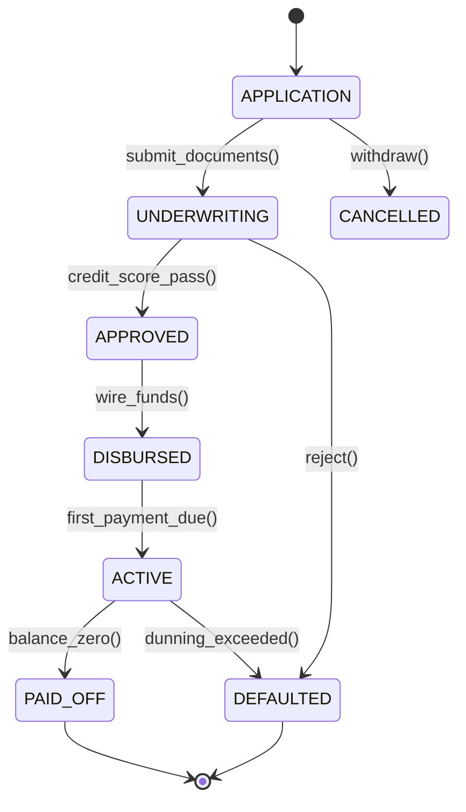

# Industry-Specific Enterprise Data Models: Manufacturing, Telecom, Healthcare & Financial Services
> Based on **The Data Model Resource Book, Vol 3 - Len Silverston & Paul Agnew**

## 1. Canonical Enterprise Architecture & PostgreSQL Data Model (DDL)

```sql
-- Industry Specialized Data Patterns: Telecom, Healthcare & Financial Services
CREATE TABLE telecom_service_points (
    service_point_id UUID PRIMARY KEY DEFAULT uuid_generate_v4(),
    party_id UUID NOT NULL REFERENCES parties(party_id),
    msisdn VARCHAR(32) NOT NULL UNIQUE,
    imsi VARCHAR(32) NOT NULL UNIQUE,
    plan_code VARCHAR(50) NOT NULL,
    status VARCHAR(20) NOT NULL CHECK (status IN ('ACTIVE', 'SUSPENDED', 'TERMINATED')),
    activated_at TIMESTAMPTZ NOT NULL DEFAULT NOW()
);

CREATE TABLE call_detail_records (
    cdr_id UUID PRIMARY KEY DEFAULT uuid_generate_v4(),
    service_point_id UUID NOT NULL REFERENCES telecom_service_points(service_point_id),
    call_type VARCHAR(20) NOT NULL CHECK (call_type IN ('VOICE', 'SMS', 'DATA', 'ROAMING_DATA')),
    destination_number VARCHAR(32),
    start_time TIMESTAMPTZ NOT NULL,
    duration_seconds INT NOT NULL DEFAULT 0 CHECK (duration_seconds >= 0),
    data_bytes BIGINT NOT NULL DEFAULT 0 CHECK (data_bytes >= 0),
    rated_amount NUMERIC(12, 4) NOT NULL DEFAULT 0.0000,
    is_billed BOOLEAN NOT NULL DEFAULT FALSE
);

CREATE TABLE clinical_encounters (
    encounter_id UUID PRIMARY KEY DEFAULT uuid_generate_v4(),
    patient_party_id UUID NOT NULL REFERENCES parties(party_id),
    practitioner_party_id UUID NOT NULL REFERENCES parties(party_id),
    encounter_type VARCHAR(30) NOT NULL CHECK (encounter_type IN ('INPATIENT', 'OUTPATIENT', 'EMERGENCY', 'TELEHEALTH')),
    admit_time TIMESTAMPTZ NOT NULL,
    discharge_time TIMESTAMPTZ,
    primary_diagnosis_code VARCHAR(20),
    status VARCHAR(20) NOT NULL CHECK (status IN ('PLANNED', 'ARRIVED', 'IN_PROGRESS', 'DISCHARGED', 'CANCELLED')),
    CONSTRAINT chk_encounter_dates CHECK (discharge_time IS NULL OR discharge_time >= admit_time)
);

CREATE TABLE loan_accounts (
    loan_id UUID PRIMARY KEY DEFAULT uuid_generate_v4(),
    borrower_party_id UUID NOT NULL REFERENCES parties(party_id),
    principal_amount NUMERIC(18, 2) NOT NULL CHECK (principal_amount > 0),
    interest_rate_annual NUMERIC(6, 4) NOT NULL CHECK (interest_rate_annual >= 0),
    term_months INT NOT NULL CHECK (term_months > 0),
    current_principal_balance NUMERIC(18, 2) NOT NULL,
    accrued_interest NUMERIC(18, 2) NOT NULL DEFAULT 0.00,
    loan_status VARCHAR(20) NOT NULL CHECK (loan_status IN ('APPLICATION', 'UNDERWRITING', 'APPROVED', 'DISBURSED', 'ACTIVE', 'PAID_OFF', 'DEFAULTED')),
    origination_date DATE
);

CREATE TABLE professional_engagements (
    engagement_id UUID PRIMARY KEY DEFAULT uuid_generate_v4(),
    client_party_id UUID NOT NULL REFERENCES parties(party_id),
    contract_value NUMERIC(18, 2) NOT NULL DEFAULT 0.00,
    pricing_model VARCHAR(20) NOT NULL CHECK (pricing_model IN ('TIME_AND_MATERIALS', 'FIXED_FEE', 'RETAINER')),
    status VARCHAR(20) NOT NULL CHECK (status IN ('PROPOSAL', 'ACTIVE', 'ON_HOLD', 'COMPLETED', 'CLOSED'))
);

CREATE TABLE time_entries (
    entry_id UUID PRIMARY KEY DEFAULT uuid_generate_v4(),
    engagement_id UUID NOT NULL REFERENCES professional_engagements(engagement_id),
    consultant_party_id UUID NOT NULL REFERENCES parties(party_id),
    work_date DATE NOT NULL,
    hours_worked NUMERIC(5, 2) NOT NULL CHECK (hours_worked > 0 AND hours_worked <= 24),
    hourly_billing_rate NUMERIC(12, 2) NOT NULL CHECK (hourly_billing_rate >= 0),
    is_billable BOOLEAN NOT NULL DEFAULT TRUE,
    billable_amount NUMERIC(14, 2) GENERATED ALWAYS AS (
        CASE WHEN is_billable THEN hours_worked * hourly_billing_rate ELSE 0.00 END
    ) STORED
);
```

## 2. Mathematical Foundations & Business Invariants

### 2.1 Loan Principal Amortization
For a loan with principal $P$, monthly interest rate $r = \frac{R_{\text{annual}}}{12}$, and term $n$ months:
$$\text{Monthly Payment } M = P \cdot \frac{r(1+r)^n}{(1+r)^n - 1}$$
At month $k$:
$$\text{Interest Payment } I_k = B_{k-1} \cdot r$$
$$\text{Principal Payment } P_k = M - I_k$$
$$\text{Remaining Balance } B_k = B_{k-1} - P_k$$

### 2.2 Telecom Usage Rating Invariant
For a CDR with duration $t$ seconds and rating increment $\Delta t = 60\text{s}$ with rate $R_{\text{minute}}$:
$$\text{Billable Minutes} = \left\lceil \frac{t}{60} \right\rceil$$
$$\text{Rated Amount} = \text{Billable Minutes} \times R_{\text{minute}}$$

## 3. Finite State Machine (FSM) & Lifecycle Invariants

### 3.1 Loan Account Lifecycle FSM


## 4. Production Implementation Guidelines (Rust / SQL / Python)

```rust
use rust_decimal::Decimal;
use rust_decimal_macros::dec;

pub struct AmortizationSchedule {
    pub month: usize,
    pub payment: Decimal,
    pub principal_portion: Decimal,
    pub interest_portion: Decimal,
    pub remaining_balance: Decimal,
}

pub fn calculate_fixed_loan_schedule(
    principal: Decimal,
    annual_rate: Decimal,
    term_months: usize,
) -> Vec<AmortizationSchedule> {
    let monthly_rate = annual_rate / dec!(12.0);
    // M = P * [r(1+r)^n] / [(1+r)^n - 1]
    // For exact decimal calculation:
    let one = dec!(1.0);
    let mut factor = one;
    for _ in 0..term_months {
        factor *= one + monthly_rate;
    }
    let monthly_payment = principal * (monthly_rate * factor) / (factor - one);

    let mut balance = principal;
    let mut schedule = Vec::with_capacity(term_months);

    for m in 1..=term_months {
        let interest = balance * monthly_rate;
        let mut principal_part = monthly_payment - interest;
        if m == term_months || principal_part > balance {
            principal_part = balance;
        }
        balance -= principal_part;
        schedule.push(AmortizationSchedule {
            month: m,
            payment: principal_part + interest,
            principal_portion: principal_part,
            interest_portion: interest,
            remaining_balance: balance,
        });
    }
    schedule
}
```

## 5. Actionable Prompt Recipes

### 5.1 Local Ollama Cheat Sheet (Actionable Constraints & Invariants)
```markdown
- Never calculate billing amounts client-side; use STORED generated columns or database triggers.
- Enforce positive CDR duration and data bytes (duration >= 0, data_bytes >= 0).
- Loan balance invariant: balance_k = balance_{k-1} - principal_repayment.
- Guard against zero-rate division in amortization equations.
- Healthcare encounter admit_time must precede or equal discharge_time.
```

### 5.2 Cloud LLM Architectural Prompt (Comprehensive Engineering Blueprint)
```markdown
Design an industry-vertical data model service implementing Silverston Vol 3 blueprints:
1. Provide schema DDL and domain services for Telecom CDR rating, Healthcare patient encounters, and Financial loan amortizations.
2. Implement exact fixed-rate loan amortization calculation in Rust using rust_decimal to avoid floating-point inaccuracies.
3. Enforce loan lifecycle transitions (APPLICATION -> UNDERWRITING -> APPROVED -> DISBURSED -> ACTIVE -> PAID_OFF/DEFAULTED).
4. Add unit test suites verifying monthly amortization sums match the initial principal exactly.
```
