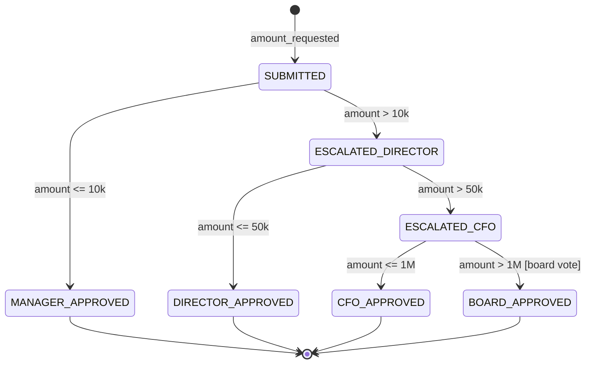

# SOX 404 Internal Controls & Audit Trails: ITGC, COSO Framework & Delegation of Authority
> Based on **Executive's Guide to IT Governance: Improving Systems Processes with COSO, COBIT, and Sarbanes-Oxley - Robert Moeller**

## 1. Canonical Enterprise Architecture & PostgreSQL Data Model (DDL)

```sql
-- SOX Delegation of Authority (DoA) & ITGC Audit Trails
CREATE TABLE doa_approval_tiers (
    tier_id UUID PRIMARY KEY DEFAULT uuid_generate_v4(),
    role_title VARCHAR(100) NOT NULL UNIQUE,
    max_approval_limit NUMERIC(18, 2) NOT NULL CHECK (max_approval_limit >= 0),
    requires_board_approval BOOLEAN NOT NULL DEFAULT FALSE
);

INSERT INTO doa_approval_tiers (role_title, max_approval_limit, requires_board_approval) VALUES
    ('DEPARTMENT_MANAGER', 10000.00, FALSE),
    ('DIRECTOR', 50000.00, FALSE),
    ('VP', 250000.00, FALSE),
    ('CFO', 1000000.00, FALSE),
    ('CEO_BOARD', 999999999.99, TRUE);

CREATE TABLE sox_financial_audit_trail (
    event_id BIGSERIAL PRIMARY KEY,
    entity_name VARCHAR(100) NOT NULL,
    entity_id UUID NOT NULL,
    action_type VARCHAR(20) NOT NULL CHECK (action_type IN ('INSERT', 'UPDATE', 'DELETE', 'SIGN_OFF')),
    user_id UUID NOT NULL,
    ip_address INET,
    old_state JSONB,
    new_state JSONB,
    timestamp TIMESTAMPTZ NOT NULL DEFAULT NOW()
);
```

## 2. Mathematical Foundations & Business Invariants

### 2.1 Delegation of Authority (DoA) Approval Threshold Invariant
For expenditure request $R$ with amount $A$:
$$\text{Required Approval Role} = \min \{ \text{Role} \mid \text{MaxLimit}(\text{Role}) \ge A \}$$
**Compliance Invariant**:
Any transaction where:
$$\text{ApproverLimit} < A$$
MUST be rejected as a SOX deficiency.

## 3. Finite State Machine (FSM) & Lifecycle Invariants

### 3.1 DoA Tiered Approval Escalation Workflow


## 4. Production Implementation Guidelines (Rust / SQL / Python)

```rust
use rust_decimal::Decimal;

pub fn find_required_doa_role(amount: Decimal) -> &'static str {
    if amount <= Decimal::from(10_000) {
        "DEPARTMENT_MANAGER"
    } else if amount <= Decimal::from(50_000) {
        "DIRECTOR"
    } else if amount <= Decimal::from(250_000) {
        "VP"
    } else if amount <= Decimal::from(1_000_000) {
        "CFO"
    } else {
        "CEO_BOARD"
    }
}
```

## 5. Actionable Prompt Recipes

### 5.1 Local Ollama Cheat Sheet (Actionable Constraints & Invariants)
```markdown
- Never allow approval of transactions exceeding the user's Delegation of Authority limit.
- Audit trail entries must capture: Who, What, When, Why, Old State, and New State.
- Disallow hard deletions of financial documents; require auditable soft-delete / status updates.
- ITGC rule: Separate production deployment access from development privileges.
```

### 5.2 Cloud LLM Architectural Prompt (Comprehensive Engineering Blueprint)
```markdown
Design an enterprise internal controls and SOX 404 compliance architecture:
1. Implement automated Delegation of Authority (DoA) routing matching expenditure limits to corporate hierarchy.
2. Build tamper-resistant CDC audit logging capturing before-and-after snapshots for all financial tables.
3. Manage IT General Controls (ITGC) access certification reviews and privileged account usage tracking.
4. Provide unit tests proving that approval attempts exceeding authorized limits are strictly blocked.
```
