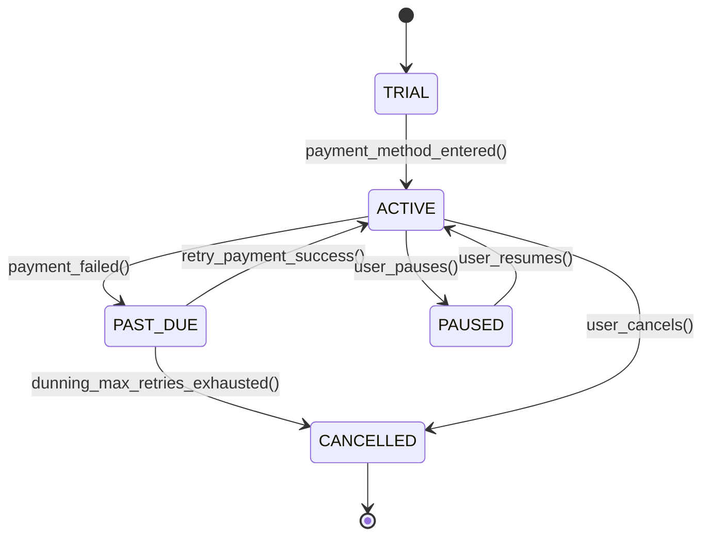

# Subscription Economy & Recurring Billing: MRR/ARR, Usage Metering & Dunning
> Based on **Subscribed: Why the Subscription Model Will Be Your Company's Future - Tien Tzuo**

## 1. Canonical Enterprise Architecture & PostgreSQL Data Model (DDL)

```sql
-- Subscriptions, Recurring Billing & Usage Metering Schema
CREATE TABLE subscription_plans (
    plan_id UUID PRIMARY KEY DEFAULT uuid_generate_v4(),
    code VARCHAR(50) NOT NULL UNIQUE,
    name VARCHAR(100) NOT NULL,
    billing_interval VARCHAR(20) NOT NULL CHECK (billing_interval IN ('MONTHLY', 'ANNUAL', 'QUARTERLY')),
    recurring_price NUMERIC(14, 4) NOT NULL CHECK (recurring_price >= 0),
    currency CHAR(3) NOT NULL
);

CREATE TABLE subscriptions (
    subscription_id UUID PRIMARY KEY DEFAULT uuid_generate_v4(),
    customer_party_id UUID NOT NULL REFERENCES parties(party_id),
    plan_id UUID NOT NULL REFERENCES subscription_plans(plan_id),
    status VARCHAR(20) NOT NULL CHECK (status IN ('TRIAL', 'ACTIVE', 'PAST_DUE', 'PAUSED', 'CANCELLED', 'EXPIRED')),
    current_period_start DATE NOT NULL,
    current_period_end DATE NOT NULL,
    cancel_at_period_end BOOLEAN NOT NULL DEFAULT FALSE,
    mrr_value NUMERIC(14, 4) NOT NULL DEFAULT 0.0000
);

CREATE TABLE usage_meter_events (
    meter_event_id UUID PRIMARY KEY DEFAULT uuid_generate_v4(),
    subscription_id UUID NOT NULL REFERENCES subscriptions(subscription_id),
    metric_name VARCHAR(100) NOT NULL,
    quantity NUMERIC(14, 4) NOT NULL CHECK (quantity > 0),
    timestamp TIMESTAMPTZ NOT NULL DEFAULT NOW(),
    is_billed BOOLEAN NOT NULL DEFAULT FALSE
);

CREATE TABLE dunning_attempts (
    attempt_id UUID PRIMARY KEY DEFAULT uuid_generate_v4(),
    subscription_id UUID NOT NULL REFERENCES subscriptions(subscription_id),
    attempt_number INT NOT NULL,
    failure_reason VARCHAR(255),
    attempted_at TIMESTAMPTZ NOT NULL DEFAULT NOW(),
    next_retry_at TIMESTAMPTZ
);
```

## 2. Mathematical Foundations & Business Invariants

### 2.1 MRR Waterfall Equation
For month $t$:
$$\text{Ending MRR}_t = \text{Beginning MRR}_t + \text{New MRR}_t + \text{Expansion MRR}_t - \text{Contraction MRR}_t - \text{Churned MRR}_t$$
$$\text{Annual Recurring Revenue (ARR)} = \text{Ending MRR} \times 12$$

### 2.2 Mid-Cycle Plan Upgrade Proration Invariant
If a customer switches from plan with rate $P_1$ to plan with rate $P_2$ ($P_2 > P_1$) on day $d$ of an $N$-day period:
$$\text{Unused Credit} = P_1 \times \frac{N - d}{N}$$
$$\text{New Charge} = P_2 \times \frac{N - d}{N}$$
$$\text{Prorated Immediate Invoice} = \text{New Charge} - \text{Unused Credit} = (P_2 - P_1) \times \frac{N - d}{N}$$

## 3. Finite State Machine (FSM) & Lifecycle Invariants

### 3.1 Subscription State Machine & Dunning


## 4. Production Implementation Guidelines (Rust / SQL / Python)

```rust
use rust_decimal::Decimal;

pub struct ProrationCalculation {
    pub net_prorated_charge: Decimal,
}

pub fn compute_upgrade_proration(
    old_price: Decimal,
    new_price: Decimal,
    days_remaining: Decimal,
    total_days: Decimal,
) -> ProrationCalculation {
    let fraction = days_remaining / total_days;
    let net = (new_price - old_price) * fraction;
    ProrationCalculation { net_prorated_charge: net }
}
```

## 5. Actionable Prompt Recipes

### 5.1 Local Ollama Cheat Sheet (Actionable Constraints & Invariants)
```markdown
- Calculate MRR strictly on normalized monthly basis: ARR = MRR * 12.
- Compute mid-cycle proration using exact active day fractions: (P2 - P1) * (RemainingDays / TotalDays).
- Smart Dunning: Retry failed recurring card charges on days 1, 3, 5, and 7 before cancelling.
- Track usage-based consumption with idempotent deduplicated meter events.
```

### 5.2 Cloud LLM Architectural Prompt (Comprehensive Engineering Blueprint)
```markdown
Architect a high-volume subscription billing and recurring revenue engine:
1. Model complex recurring subscriptions supporting seat-based, flat-fee, and usage-metered pricing models.
2. Implement mid-cycle upgrade/downgrade proration with credit adjustment memos.
3. Build automated dunning state machines integrating with payment gateways (Stripe, Adyen).
4. Construct real-time SaaS analytics dashboards tracking MRR movements (New, Expansion, Churn).
```
