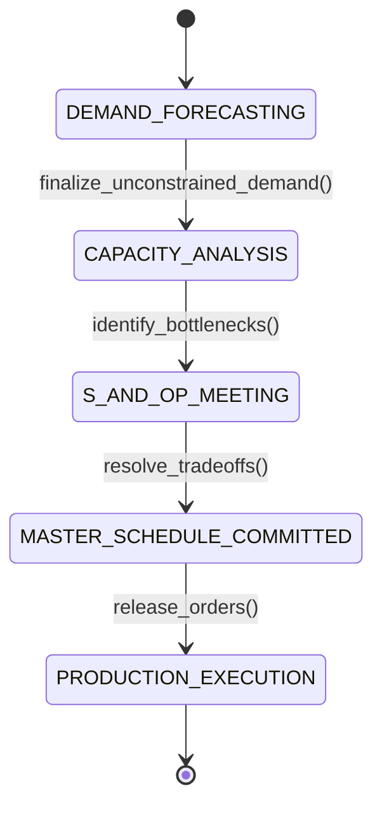

# Supply Chain Strategy & Network Design: SCOR Framework, Bullwhip & Safety Buffers
> Based on **Supply Chain Management: Strategy, Planning, and Operation - Sunil Chopra & Peter Meindl**

## 1. Canonical Enterprise Architecture & PostgreSQL Data Model (DDL)

```sql
-- Supply Chain Network Topology & SCOR Performance Metrics
CREATE TABLE supply_chain_nodes (
    node_id UUID PRIMARY KEY DEFAULT uuid_generate_v4(),
    node_code VARCHAR(50) NOT NULL UNIQUE,
    node_type VARCHAR(30) NOT NULL CHECK (node_type IN ('SUPPLIER', 'MANUFACTURING_PLANT', 'CENTRAL_DC', 'REGIONAL_DC', 'RETAIL_STORE')),
    location_name VARCHAR(150) NOT NULL,
    lead_time_days INT NOT NULL DEFAULT 1 CHECK (lead_time_days >= 0),
    holding_cost_per_unit_year NUMERIC(12, 4) NOT NULL DEFAULT 0.0000
);

CREATE TABLE network_transport_lanes (
    lane_id UUID PRIMARY KEY DEFAULT uuid_generate_v4(),
    origin_node_id UUID NOT NULL REFERENCES supply_chain_nodes(node_id),
    destination_node_id UUID NOT NULL REFERENCES supply_chain_nodes(node_id),
    transport_mode VARCHAR(20) NOT NULL CHECK (transport_mode IN ('AIR', 'OCEAN', 'RAIL', 'ROAD')),
    transit_time_days INT NOT NULL CHECK (transit_time_days >= 0),
    cost_per_kg NUMERIC(12, 4) NOT NULL CHECK (cost_per_kg >= 0),
    CONSTRAINT chk_distinct_nodes CHECK (origin_node_id <> destination_node_id)
);

CREATE TABLE scor_metrics_monthly (
    metric_id UUID PRIMARY KEY DEFAULT uuid_generate_v4(),
    node_id UUID NOT NULL REFERENCES supply_chain_nodes(node_id),
    period VARCHAR(7) NOT NULL,
    perfect_order_fulfillment_pct NUMERIC(5, 2) NOT NULL CHECK (perfect_order_fulfillment_pct BETWEEN 0 AND 100),
    order_fulfillment_cycle_time_days NUMERIC(6, 2) NOT NULL,
    upside_supply_chain_flexibility_days INT NOT NULL,
    total_supply_chain_cost_pct NUMERIC(5, 2) NOT NULL,
    cash_to_cash_cycle_time_days NUMERIC(6, 2) NOT NULL
);
```

## 2. Mathematical Foundations & Business Invariants

### 2.1 Bullwhip Effect Quantification Invariant
The Bullwhip Measure $B$ measures demand variance amplification across tier $k$ to tier $k+1$:
$$B = \frac{\sigma_{\text{orders}}^2 / \mu_{\text{orders}}}{\sigma_{\text{demand}}^2 / \mu_{\text{demand}}}$$
If $B > 1.0$, information distortion and phantom demand amplification are present.

### 2.2 Centralized Inventory Pooling Benefit (Square Root Law)
Consolidating inventory from $N$ decentralized distribution centers into 1 central warehouse reduces aggregate safety stock:
$$\text{Safety Stock}_{\text{centralized}} = \frac{1}{\sqrt{N}} \sum_{i=1}^N \text{Safety Stock}_i$$

## 3. Finite State Machine (FSM) & Lifecycle Invariants

### 3.1 S&OP (Sales and Operations Planning) State Machine


## 4. Production Implementation Guidelines (Rust / SQL / Python)

```rust
pub struct BullwhipCalculator;

impl BullwhipCalculator {
    pub fn calculate_bullwhip_ratio(
        order_var: f64,
        order_mean: f64,
        demand_var: f64,
        demand_mean: f64,
    ) -> f64 {
        if demand_var <= 1e-6 || order_mean <= 1e-6 || demand_mean <= 1e-6 {
            return 1.0;
        }
        (order_var / order_mean) / (demand_var / demand_mean)
    }

    pub fn centralized_pooling_reduction(num_locations: f64) -> f64 {
        if num_locations <= 1.0 { 0.0 } else { 1.0 - (1.0 / num_locations.sqrt()) }
    }
}
```

## 5. Actionable Prompt Recipes

### 5.1 Local Ollama Cheat Sheet (Actionable Constraints & Invariants)
```markdown
- Measure Bullwhip Effect: Ratio of variance of orders to variance of end-customer demand.
- Apply the Square Root Law when evaluating warehouse consolidation.
- Set Push-Pull Decoupling points based on lead times versus customer order tolerance.
- Track SCOR metrics: Perfect Order Fulfillment, Order Cycle Time, Cash-to-Cash.
```

### 5.2 Cloud LLM Architectural Prompt (Comprehensive Engineering Blueprint)
```markdown
Design an enterprise supply chain strategy and network optimization service:
1. Model multi-echelon network topology (Suppliers, Central DCs, Regional DCs, Stores) and lanes.
2. Implement SCOR framework metric aggregators tracking delivery reliability, responsiveness, and agility.
3. Build risk algorithms detecting Bullwhip spikes in ordering behavior across tier-1 and tier-2 nodes.
4. Calculate inventory pooling trade-offs using the square root law.
```
