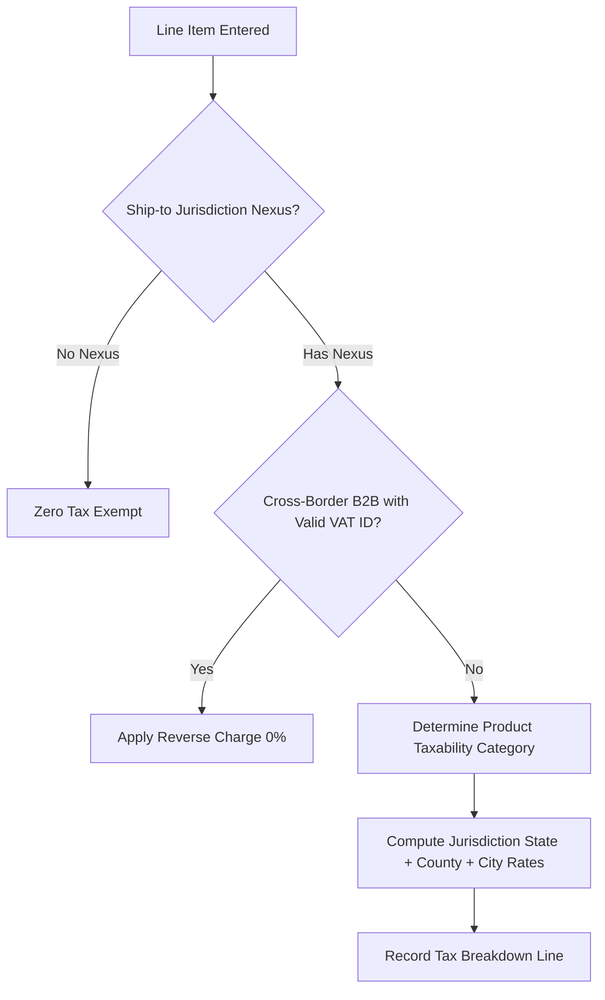

# International Tax Engine: VAT, GST, US Sales Tax Nexus & Reverse Charge
> Based on **International Taxation in a Nutshell - Richard Doernberg**

## 1. Canonical Enterprise Architecture & PostgreSQL Data Model (DDL)

```sql
-- Multi-Jurisdiction Tax Configuration & Invoice Lines Schema
CREATE TABLE tax_jurisdictions (
    jurisdiction_id UUID PRIMARY KEY DEFAULT uuid_generate_v4(),
    code VARCHAR(30) NOT NULL UNIQUE, -- e.g. 'US_CA', 'EU_DE', 'UK'
    name VARCHAR(100) NOT NULL,
    tax_type VARCHAR(20) NOT NULL CHECK (tax_type IN ('SALES_TAX', 'VAT', 'GST')),
    standard_rate NUMERIC(6, 4) NOT NULL CHECK (standard_rate >= 0),
    is_reverse_charge_supported BOOLEAN NOT NULL DEFAULT FALSE
);

CREATE TABLE tax_nexus_registrations (
    nexus_id UUID PRIMARY KEY DEFAULT uuid_generate_v4(),
    jurisdiction_id UUID NOT NULL REFERENCES tax_jurisdictions(jurisdiction_id),
    nexus_type VARCHAR(20) NOT NULL CHECK (nexus_type IN ('PHYSICAL', 'ECONOMIC')),
    registered_tax_id VARCHAR(64) NOT NULL,
    economic_threshold_amount NUMERIC(18, 2) DEFAULT 100000.00,
    economic_threshold_transactions INT DEFAULT 200,
    is_active BOOLEAN NOT NULL DEFAULT TRUE
);

CREATE TABLE tax_invoice_line_breakdowns (
    breakdown_id UUID PRIMARY KEY DEFAULT uuid_generate_v4(),
    invoice_line_id UUID NOT NULL,
    jurisdiction_id UUID NOT NULL REFERENCES tax_jurisdictions(jurisdiction_id),
    taxable_base NUMERIC(18, 4) NOT NULL,
    applied_tax_rate NUMERIC(6, 4) NOT NULL,
    calculated_tax_amount NUMERIC(18, 4) NOT NULL,
    is_reverse_charge BOOLEAN NOT NULL DEFAULT FALSE
);
```

## 2. Mathematical Foundations & Business Invariants

### 2.1 Tax Inclusive vs Tax Exclusive Arithmetic
Let $P_{\text{net}}$ be the net unit price, $P_{\text{gross}}$ be the gross price, and $r$ be the tax rate:
1. **Tax Exclusive (Standard US B2B)**:
   $$\text{Tax} = P_{\text{net}} \times r$$
   $$P_{\text{gross}} = P_{\text{net}} + \text{Tax} = P_{\text{net}} \times (1 + r)$$
2. **Tax Inclusive (EU B2C VAT)**:
   $$P_{\text{net}} = \frac{P_{\text{gross}}}{1 + r}$$
   $$\text{Tax} = P_{\text{gross}} - P_{\text{net}} = P_{\text{gross}} \times \left(1 - \frac{1}{1 + r}\right) = P_{\text{gross}} \times \frac{r}{1 + r}$$

### 2.2 VAT Net Payable / Refundable Invariant
$$\text{Net VAT Payable to Government} = \sum \text{Output VAT (Collected on Sales)} - \sum \text{Input VAT (Paid on Purchases)}$$
If $\text{Net VAT} < 0$, the enterprise is entitled to a tax refund.

## 3. Finite State Machine (FSM) & Lifecycle Invariants

### 3.1 Tax Determination Workflow


## 4. Production Implementation Guidelines (Rust / SQL / Python)

```rust
use rust_decimal::Decimal;

pub struct TaxCalculationResult {
    pub net_amount: Decimal,
    pub tax_amount: Decimal,
    pub gross_amount: Decimal,
}

pub fn compute_tax(
    amount: Decimal,
    rate: Decimal,
    is_tax_inclusive: bool,
) -> TaxCalculationResult {
    if is_tax_inclusive {
        let one = Decimal::ONE;
        let net = (amount / (one + rate)).round_dp(4);
        let tax = amount - net;
        TaxCalculationResult { net_amount: net, tax_amount: tax, gross_amount: amount }
    } else {
        let tax = (amount * rate).round_dp(4);
        let gross = amount + tax;
        TaxCalculationResult { net_amount: amount, tax_amount: tax, gross_amount: gross }
    }
}
```

## 5. Actionable Prompt Recipes

### 5.1 Local Ollama Cheat Sheet (Actionable Constraints & Invariants)
```markdown
- Tax Exclusive: Tax = Net * rate; Gross = Net + Tax.
- Tax Inclusive: Net = Gross / (1 + rate); Tax = Gross - Net.
- Check Economic Nexus thresholds (e.g. $100k sales or 200 txns in US state) before charging sales tax.
- Intra-EU B2B with verified VAT ID triggers Reverse Charge mechanism (0% output tax, buyer accounts for tax).
```

### 5.2 Cloud LLM Architectural Prompt (Comprehensive Engineering Blueprint)
```markdown
Design an enterprise international tax calculation engine:
1. Model multi-level tax jurisdictions (Country, State/Province, County, Municipality).
2. Implement tax-inclusive and tax-exclusive pricing with exact 4-decimal rounding.
3. Manage US economic nexus tracking alerting when threshold criteria are crossed.
4. Support EU VAT Reverse Charge validation against European Commission VIES database.
```
