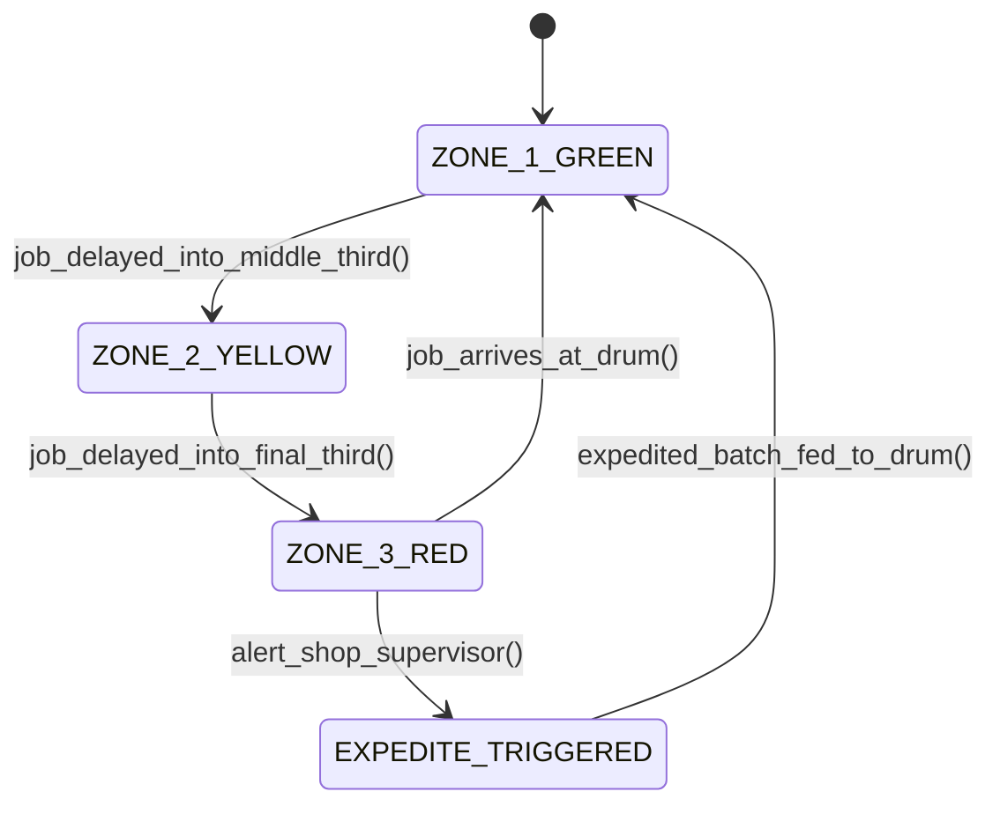

# Theory of Constraints & Drum-Buffer-Rope: Bottleneck Scheduling & Throughput Accounting
> Based on **The Goal: A Process of Ongoing Improvement - Eliyahu Goldratt & Jeff Cox**

## 1. Canonical Enterprise Architecture & PostgreSQL Data Model (DDL)

```sql
-- Theory of Constraints (TOC) & Drum-Buffer-Rope (DBR) Schema
CREATE TABLE toc_bottlenecks (
    bottleneck_id UUID PRIMARY KEY DEFAULT uuid_generate_v4(),
    work_center_id UUID NOT NULL REFERENCES work_centers(work_center_id),
    name VARCHAR(100) NOT NULL,
    max_throughput_units_per_hour NUMERIC(10, 2) NOT NULL CHECK (max_throughput_units_per_hour > 0),
    is_active_constraint BOOLEAN NOT NULL DEFAULT TRUE,
    identified_at TIMESTAMPTZ NOT NULL DEFAULT NOW()
);

CREATE TABLE dbr_buffer_monitors (
    buffer_id UUID PRIMARY KEY DEFAULT uuid_generate_v4(),
    bottleneck_id UUID NOT NULL REFERENCES toc_bottlenecks(bottleneck_id),
    buffer_type VARCHAR(20) NOT NULL CHECK (buffer_type IN ('DRUM_BUFFER', 'SHIPPING_BUFFER', 'ASSEMBLY_BUFFER')),
    buffer_time_hours NUMERIC(6, 2) NOT NULL CHECK (buffer_time_hours > 0),
    zone_1_green_hours NUMERIC(6, 2) GENERATED ALWAYS AS (buffer_time_hours * 0.3333) STORED,
    zone_2_yellow_hours NUMERIC(6, 2) GENERATED ALWAYS AS (buffer_time_hours * 0.3333) STORED,
    zone_3_red_hours NUMERIC(6, 2) GENERATED ALWAYS AS (buffer_time_hours * 0.3334) STORED
);

CREATE TABLE throughput_accounting_ledgers (
    entry_id UUID PRIMARY KEY DEFAULT uuid_generate_v4(),
    period VARCHAR(7) NOT NULL,
    total_revenue NUMERIC(18, 4) NOT NULL,
    truly_variable_costs NUMERIC(18, 4) NOT NULL,
    throughput_t NUMERIC(18, 4) GENERATED ALWAYS AS (total_revenue - truly_variable_costs) STORED,
    investment_inventory_i NUMERIC(18, 4) NOT NULL,
    operating_expense_oe NUMERIC(18, 4) NOT NULL,
    net_profit NUMERIC(18, 4) GENERATED ALWAYS AS ((total_revenue - truly_variable_costs) - operating_expense_oe) STORED,
    return_on_investment_pct NUMERIC(6, 4) GENERATED ALWAYS AS (
        CASE WHEN investment_inventory_i > 0 THEN ((total_revenue - truly_variable_costs) - operating_expense_oe) / investment_inventory_i ELSE 0 END
    ) STORED
);
```

## 2. Mathematical Foundations & Business Invariants

### 2.1 Goldratt's Throughput Accounting Definitions
1. **Throughput ($T$)**: The rate at which the system generates money through sales:
   $$T = \text{Revenue} - \text{Truly Variable Costs (TVC)}$$
   *(Direct labor is generally considered part of Operating Expense, NOT TVC)*.
2. **Investment/Inventory ($I$)**: All the money tied up in the system (raw materials, WIP, plant assets).
3. **Operating Expense ($\text{OE}$)**: All the money spent to turn Inventory into Throughput (labor, rent, electricity).
$$\text{Net Profit (NP)} = T - \text{OE}$$
$$\text{Return on Investment (ROI)} = \frac{T - \text{OE}}{I}$$

### 2.2 Drum-Buffer-Rope (DBR) Synchronization Invariant
Let $C_{\text{drum}}$ be the capacity of the bottleneck resource. The rate of material release at the gateway operation (the Rope) must be synchronized strictly to the Drum:
$$\text{ReleaseRate}_{\text{rope}} \le C_{\text{drum}}$$
Releasing material faster than $C_{\text{drum}}$ does not increase throughput; it merely swells WIP inventory and elongates lead time.

## 3. Finite State Machine (FSM) & Lifecycle Invariants

### 3.1 DBR Buffer Management Zone FSM


## 4. Production Implementation Guidelines (Rust / SQL / Python)

```rust
pub struct ThroughputAccounting {
    pub revenue: f64,
    pub truly_variable_costs: f64,
    pub operating_expense: f64,
    pub investment: f64,
}

impl ThroughputAccounting {
    pub fn throughput(&self) -> f64 {
        self.revenue - self.truly_variable_costs
    }

    pub fn net_profit(&self) -> f64 {
        self.throughput() - self.operating_expense
    }

    pub fn roi(&self) -> f64 {
        if self.investment <= 0.0 { 0.0 } else { self.net_profit() / self.investment }
    }
}
```

## 5. Actionable Prompt Recipes

### 5.1 Local Ollama Cheat Sheet (Actionable Constraints & Invariants)
```markdown
- Throughput = Revenue - Truly Variable Costs (TVC). Direct labor is part of OE.
- Never run non-bottlenecks at 100% capacity; subordinate non-bottlenecks to the Drum.
- Choke release of materials at the Rope to match bottleneck consumption rate.
- Color code DBR buffers: Green (OK), Yellow (Plan), Red (Expedite immediately).
```

### 5.2 Cloud LLM Architectural Prompt (Comprehensive Engineering Blueprint)
```markdown
Build a Theory of Constraints (TOC) and Drum-Buffer-Rope scheduling engine:
1. Identify manufacturing bottlenecks by tracking utilization and queue wait times across work centers.
2. Implement DBR finite scheduling choking material release upstream via the Rope.
3. Construct buffer status boards with 3-zone color management alerting managers to starvation risk.
4. Replace traditional cost allocation reports with Throughput Accounting metrics (T, I, OE, Net Profit, ROI).
```
