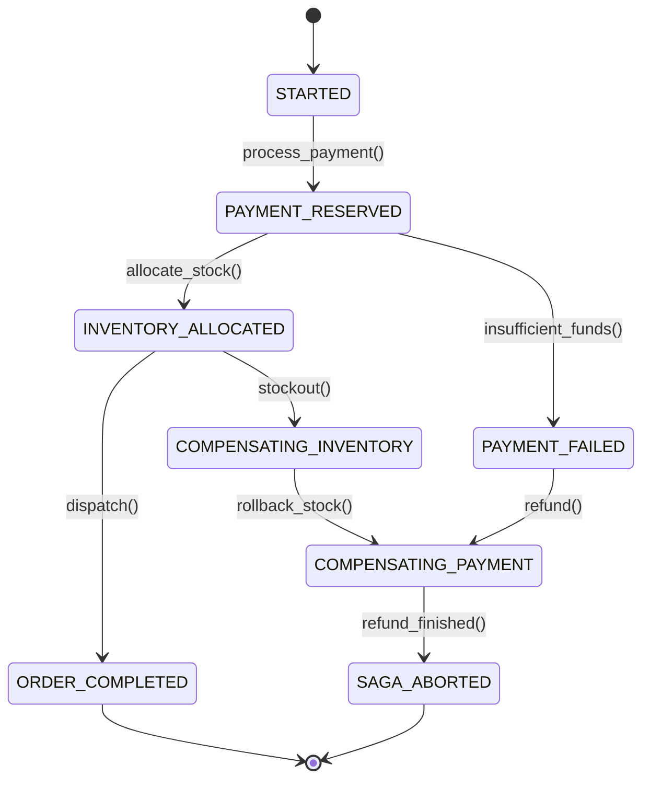

# Implementing DDD: Event Sourcing, Sagas & CQRS Enterprise Patterns
> Based on **Implementing Domain-Driven Design - Vaughn Vernon**

## 1. Canonical Enterprise Architecture & PostgreSQL Data Model (DDL)

```sql
-- Vernon IDDD: Append-Only Event Store & Saga State Storage
CREATE TABLE event_streams (
    stream_id UUID PRIMARY KEY,
    aggregate_type VARCHAR(100) NOT NULL,
    current_version BIGINT NOT NULL DEFAULT 0,
    created_at TIMESTAMPTZ NOT NULL DEFAULT NOW()
);

CREATE TABLE event_store (
    event_id UUID PRIMARY KEY DEFAULT uuid_generate_v4(),
    stream_id UUID NOT NULL REFERENCES event_streams(stream_id),
    stream_version BIGINT NOT NULL,
    event_type VARCHAR(100) NOT NULL,
    payload JSONB NOT NULL,
    metadata JSONB NOT NULL DEFAULT '{}',
    recorded_at TIMESTAMPTZ NOT NULL DEFAULT NOW(),
    CONSTRAINT uq_stream_version UNIQUE (stream_id, stream_version)
);

CREATE TABLE aggregate_snapshots (
    snapshot_id UUID PRIMARY KEY DEFAULT uuid_generate_v4(),
    stream_id UUID NOT NULL REFERENCES event_streams(stream_id),
    version BIGINT NOT NULL,
    state_payload JSONB NOT NULL,
    taken_at TIMESTAMPTZ NOT NULL DEFAULT NOW(),
    CONSTRAINT uq_stream_snapshot UNIQUE (stream_id, version)
);

CREATE TABLE saga_instances (
    saga_id UUID PRIMARY KEY DEFAULT uuid_generate_v4(),
    saga_type VARCHAR(100) NOT NULL,
    current_state VARCHAR(50) NOT NULL,
    correlation_id UUID NOT NULL,
    payload JSONB NOT NULL,
    started_at TIMESTAMPTZ NOT NULL DEFAULT NOW(),
    updated_at TIMESTAMPTZ NOT NULL DEFAULT NOW(),
    completed_at TIMESTAMPTZ
);

CREATE INDEX idx_event_store_stream ON event_store(stream_id, stream_version);
```

## 2. Mathematical Foundations & Business Invariants

### 2.1 Event Fold Invariant
An aggregate state at version $n$ is a deterministic left-fold over its historic event stream:
$$S_n = \text{foldl}(\text{apply}, S_0, [e_1, e_2, \dots, e_n])$$
Given snapshot $S_k$ at version $k < n$:
$$S_n = \text{foldl}(\text{apply}, S_k, [e_{k+1}, \dots, e_n])$$

### 2.2 Strict Monotonicity of Event Stream
$$\text{Version}(e_{i}) = \text{Version}(e_{i-1}) + 1$$
Any gap or duplicate aborts append with `ConcurrencyConflictException`.

## 3. Finite State Machine (FSM) & Lifecycle Invariants

### 3.1 Saga Orchestration State Machine


## 4. Production Implementation Guidelines (Rust / SQL / Python)

```rust
use serde::{Deserialize, Serialize};
use uuid::Uuid;

#[derive(Debug, Serialize, Deserialize)]
pub struct OrderPlacedEvent {
    pub order_id: Uuid,
    pub customer_id: Uuid,
    pub total: f64,
}

#[derive(Debug, Default)]
pub struct OrderState {
    pub order_id: Option<Uuid>,
    pub total: f64,
    pub is_placed: bool,
}

impl OrderState {
    pub fn apply(&mut self, event_type: &str, payload: &str) -> Result<(), &'static str> {
        match event_type {
            "OrderPlaced" => {
                let evt: OrderPlacedEvent = serde_json::from_str(payload).map_err(|_| "JSON error")?;
                self.order_id = Some(evt.order_id);
                self.total = evt.total;
                self.is_placed = true;
            }
            _ => return Err("Unknown event type"),
        }
        Ok(())
    }
}
```

## 5. Actionable Prompt Recipes

### 5.1 Local Ollama Cheat Sheet (Actionable Constraints & Invariants)
```markdown
- Never execute UPDATE or DELETE statements against the event_store; it is strictly append-only.
- Verify unique constraint on (stream_id, stream_version) to prevent concurrent write collisions.
- Reconstruct aggregate state using left-fold over ordered events.
- Compensating transactions in Sagas must be strictly idempotent.
```

### 5.2 Cloud LLM Architectural Prompt (Comprehensive Engineering Blueprint)
```markdown
Implement an enterprise Event Sourcing and CQRS framework based on Vaughn Vernon's IDDD:
1. Provide an append-only event store schema with aggregate snapshotting every N events.
2. Implement an optimistic concurrency mechanism using stream version checks.
3. Build a saga orchestrator supporting forward execution and backward compensating transactions.
4. Implement a projection engine that updates read-side relational queries asynchronously.
```
