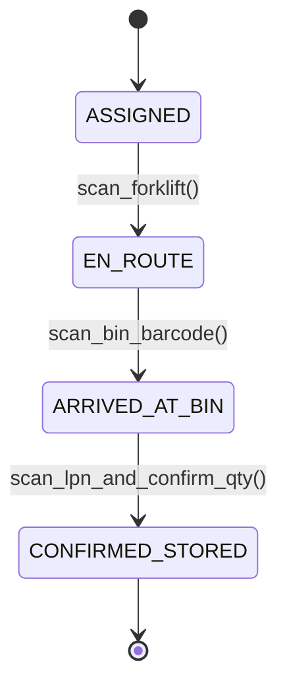

# Warehouse Management Topology: Directed Putaway, Wave Picking & Slotting Optimization
> Based on **World Class Warehousing and Material Handling - Edward Frazelle**

## 1. Canonical Enterprise Architecture & PostgreSQL Data Model (DDL)

```sql
-- WMS Topology, Bins & License Plate Numbers (LPN)
CREATE TABLE warehouse_zones (
    zone_id UUID PRIMARY KEY DEFAULT uuid_generate_v4(),
    warehouse_id UUID NOT NULL REFERENCES supply_chain_nodes(node_id),
    zone_code VARCHAR(20) NOT NULL,
    zone_type VARCHAR(30) NOT NULL CHECK (zone_type IN ('RECEIVING', 'BULK_STORAGE', 'FORWARD_PICK', 'COLD_CHAIN', 'HAZMAT', 'PACK_AND_SHIP')),
    CONSTRAINT uq_wh_zone UNIQUE (warehouse_id, zone_code)
);

CREATE TABLE warehouse_bins (
    bin_id UUID PRIMARY KEY DEFAULT uuid_generate_v4(),
    zone_id UUID NOT NULL REFERENCES warehouse_zones(zone_id),
    bin_barcode VARCHAR(50) NOT NULL UNIQUE,
    aisle VARCHAR(10) NOT NULL,
    bay VARCHAR(10) NOT NULL,
    level VARCHAR(10) NOT NULL,
    position VARCHAR(10) NOT NULL,
    max_weight_kg NUMERIC(10, 2) NOT NULL CHECK (max_weight_kg > 0),
    max_volume_cbm NUMERIC(10, 4) NOT NULL CHECK (max_volume_cbm > 0),
    pick_priority INT NOT NULL DEFAULT 100,
    is_blocked BOOLEAN NOT NULL DEFAULT FALSE
);

CREATE TABLE license_plate_numbers (
    lpn_id UUID PRIMARY KEY DEFAULT uuid_generate_v4(),
    lpn_code VARCHAR(50) NOT NULL UNIQUE,
    bin_id UUID REFERENCES warehouse_bins(bin_id),
    product_id UUID NOT NULL REFERENCES products(product_id),
    quantity NUMERIC(14, 4) NOT NULL CHECK (quantity > 0),
    lot_number VARCHAR(50),
    created_at TIMESTAMPTZ NOT NULL DEFAULT NOW()
);
```

## 2. Mathematical Foundations & Business Invariants

### 2.1 Cube-Per-Order Index (COI) Slotting Invariant
To minimize travel distance, items are slotted into forward pick locations based on the Cube-Per-Order Index:
$$\text{COI}_i = \frac{\text{Required Storage Space (Cube)}_i}{\text{Order Frequency (Picks)}_i}$$
**Slotting Invariant**: Items with the lowest COI MUST be assigned to bins closest to the packing/shipping dock.

### 2.2 Bin Volumetric & Weight Capacity Invariant
For any bin $B$ containing LPNs $k$:
$$\sum_k \text{Weight}(\text{LPN}_k) \le B_{\text{max\_weight}}$$
$$\sum_k \text{Volume}(\text{LPN}_k) \le B_{\text{max\_volume}}$$

## 3. Finite State Machine (FSM) & Lifecycle Invariants

### 3.1 Putaway Task Lifecycle FSM


## 4. Production Implementation Guidelines (Rust / SQL / Python)

```rust
pub struct WarehouseBin {
    pub bin_id: uuid::Uuid,
    pub max_weight: f64,
    pub current_weight: f64,
    pub max_volume: f64,
    pub current_volume: f64,
}

impl WarehouseBin {
    pub fn can_accommodate(&self, weight: f64, volume: f64) -> bool {
        (self.current_weight + weight <= self.max_weight)
            && (self.current_volume + volume <= self.max_volume)
    }

    pub fn deposit(&mut self, weight: f64, volume: f64) -> Result<(), &'static str> {
        if !self.can_accommodate(weight, volume) {
            return Err("Bin capacity exceeded");
        }
        self.current_weight += weight;
        self.current_volume += volume;
        Ok(())
    }
}
```

## 5. Actionable Prompt Recipes

### 5.1 Local Ollama Cheat Sheet (Actionable Constraints & Invariants)
```markdown
- Structure bin hierarchy: Warehouse -> Zone -> Aisle -> Bay -> Level -> Position.
- Enforce strict bin capacity checks on both weight (kg) and volume (cbm) before putaway.
- Track warehouse inventory via unique License Plate Numbers (LPN).
- Order pick lists using S-shape or optimal traveling salesman routing through aisles.
```

### 5.2 Cloud LLM Architectural Prompt (Comprehensive Engineering Blueprint)
```markdown
Build a World-Class Warehouse Management System (WMS) engine:
1. Model warehouse spatial topologies with zone categories (Bulk, Pick, Cold, Hazmat).
2. Implement directed putaway engines assigning incoming goods to optimal bins based on velocity and compatibility.
3. Build wave release planners optimizing picker routes to minimize total travel time.
4. Support mobile scanner workflows with double-scan verification (Bin barcode + LPN).
```
