<div align="center">
  <a href="https://github.com/CharleGutierrez/tagisan">
    
  </a>

  # 🇵🇭 Tagisan (`tgs` / `tagisan-rs`)

  ### The `uv` of Multi-Agent AI & Swarm Orchestration in Systems-Grade Rust

  **Tagisan ng Talino:** Ultra-Fast Multi-LLM Swarms • Dialectical Debate • Autonomous Polyglot Agents • 100% Local Ollama Engine • 5 Colibrì Superpowers • Native File CRUD • Computer Vision • Bidirectional MCP

  <br />

  [](https://www.rust-lang.org/)
  [](https://github.com/CharleGutierrez/tagisan)
  [](LICENSE)
  [](https://tokio.rs/)
  [](https://ollama.com/)
  [](https://github.com/CharleGutierrez/tagisan)
  [](https://modelcontextprotocol.io/)
  [](https://github.com/CharleGutierrez/tagisan)
</div>

---

> **Why choose between Python dependency hell and slow agent frameworks?**  
> Tagisan (`tgs`) is a single, zero-dependency 29 MB static binary that boots in **~2 milliseconds**, runs on **18 MB of RAM**, and coordinates heterogeneous local models (Ollama) and cloud APIs (Claude, Gemini, GPT-4o, DeepSeek, Grok) into adversarial swarms, parallel DAGs, and autonomous tool loops.

```bash
# ⚡ Install Tagisan in 5 seconds (Linux / macOS)
curl -fsSL https://raw.githubusercontent.com/CharleGutierrez/tagisan/main/install.sh | sh

# Or compile and install directly with Cargo
cargo install --path .
```

---

## ⚡ Why Tagisan? Real Benchmark Comparison

| Metric / Capability | **Tagisan (`tgs`)** | **CrewAI** | **AutoGen** | **LangGraph** |
| :--- | :--- | :--- | :--- | :--- |
| **Language** | **Systems-Grade Rust (Tokio)** | Python | Python | Python / TypeScript |
| **Packaging** | **Single 29 MB Static Binary** | 140+ pip packages | 95+ pip packages | Heavy dependencies |
| **Cold Startup Time** | **~2.1 ms** | ~1,850 ms | ~1,400 ms | ~900 ms |
| **Idle Memory Footprint** | **~18 MB** | ~480 MB | ~520 MB | ~350 MB |
| **Native Multi-Model Debate** | **Yes (`Lakandiwa` Engine)** | Custom scripts | Chat loops | Custom subgraphs |
| **Mixture-of-Agents (MoA)** | **Yes (Lock-free Tokio Channels)** | No | No | Custom setup |
| **Local LLM Execution** | **Native Ollama Engine & Fallbacks** | Generic LangChain wrapper | Generic wrapper | Generic wrapper |
| **Skill JIT Paging (PILOT)** | **Yes (L1 Context / L2 RAM / L3 Disk)** | No | No | No |
| **Filesystem Safety Guard** | **Surgical Edits + Atomic Trash Bin** | Plain OS writes | Docker requirement | Plain OS writes |
| **Security Firewall** | **Native AgentShield (Pre-flight Scanner)** | None | Docker sandboxing | None |
| **Model Context Protocol** | **Bidirectional MCP (Client + Server)** | Client only | Community wrappers | Community wrappers |

---

## 🚀 Key Architectural Superpowers

```mermaid
graph TD
    CLI["CLI Binary (tgs)"] --> Engine["Tagisan Core Engine"]
    Engine --> Swarm["Autonomous Swarm & Strategies"]
    Engine --> Providers["Provider Hub (Cloud & Local)"]
    Engine --> Tools["Tool Registry & Native File CRUD"]
    Engine --> Colibri["5 Colibrì Superpowers"]
    Engine --> Polyglot["Polyglot Runtimes (Python, Perl, Bun)"]
    Engine --> Skills["AI Skill Dispatcher (3,900+ Skills)"]
    Engine --> Memory["Vector RAG & Episodic Memory"]
    
    Swarm --> Debate["Dialectical Debate (Thesis -> Antithesis -> Synthesis)"]
    Swarm --> MoA["Mixture-of-Agents (Parallel Proposers -> Aggregator)"]
    Swarm --> Harmony["Structured Harmony Assembly Line (RFC-003)"]
    Swarm --> DAG["Petgraph 5-Stage Parallel DAG Pipeline"]
    Swarm --> Consensus["Quadratic & Borda Consensus Voting"]

    Providers --> Cloud["Claude 3.5, Gemini 2.0, GPT-4o, Grok-2, DeepSeek-R1"]
    Providers --> Ollama["Local Ollama (Dynamic Discovery, Zero-Cost, GPU Pinning)"]
    Providers --> ColibriMoE["Colibrì Local MoE (Dual-SSD Striped ~14.8 GB/s)"]

    Tools --> CRUD["File CRUD (edit_file, delete_file, list_dir, read, write)"]
    Tools --> Vision["Multimodal Computer Vision (view_image, -i)"]
    Tools --> Shield["AgentShield Pre-Flight Safety Firewall"]

    Colibri --> SkillJIT["Skill JIT Paging & Lookahead (PILOT)"]
    Colibri --> Atlas["Live Cortex Swarm Atlas & Routing Heat"]
    Colibri --> P2P["Distributed Local P2P Cluster Mesh (Port 8765)"]
    Colibri --> Invariant["Semantic Invariant Guard (Zero Degradation)"]
```



---

## 🌟 Core Feature Highlights

### 1. ⚔️ Dialectical Debate (*Tagisan ng Talino / Balagtasan*)
Single-model prompts hallucinate and overlook architectural traps. Tagisan pits models into structured, adversarial debates:
- **Round 1 (Thesis):** Proponent model proposes an initial implementation or architecture.
- **Round 2 (Antithesis):** Adversary model probes for race conditions, security flaws, and edge cases.
- **Round 3 (Synthesis / Lakandiwa):** Chief Adjudicator synthesizes both perspectives, balances real-world trade-offs, and issues a final, mathematically grounded verdict.
- **100% Offline Support:** Runs seamlessly using local Ollama models in rapid rotation without incurring API costs.

### 2. 🛖 Mixture-of-Agents (MoA) & Parallel Proposers
- **Layer 1 (Parallel Proposers):** Dispatches the prompt simultaneously across multiple local and cloud LLMs over non-blocking Tokio channels.
- **Layer 2 (Master Aggregator):** The designated lead model scores, filters, and stitches together the finest elements of every proposal into a superior composite response.

### 3. 🦅 The 5 Colibrì Superpowers
Directly adapted and enhanced from high-performance local MoE systems:
1. **Skill JIT Paging & Lookahead Prefetch Engine (PILOT):** 3-tier memory model (**L1** Active Context ↔ **L2** Warm RAM AST ↔ **L3** Cold NVMe) with 1-step lookahead prefetching based on planned steps and heat-weighted pinning.
2. **Agent & Skill Atlas with Routing Heat Tracking (`tgs swarm atlas`):** Dynamic cortex dashboard tracking empirical agent invocations, decay heat, and domain topic clustering (Systems, Forensics, Strategy, Security).
3. **Native Colibrì Inference Provider & Dual-SSD Model Weight Striping:** Supports streaming model weights across dual NVMe drives (`COLI_MODEL_MIRROR`, `COLI_DISK_WEIGHTS`) up to ~14.8 GB/s throughput.
4. **Distributed Local P2P Cluster Mesh (`tgs swarm cluster`):** Tokio TCP coordinator and worker mesh on port `8765` distributing tool and skill tasks across local LAN compute nodes.
5. **Semantic Invariant Guard:** Enforces the *"No SLA on Speed, Hard Guarantee on Semantics"* law—rejects lossy tool schema truncations and guarantees complete compiler diagnostic preservation under context exhaustion.

### 4. 🛠️ Native First-Class File CRUD Superpowers
Equips autonomous agents and CLI workflows with safe, surgical file operations:
- **`edit_file` (Surgical Patcher):** Replaces exact substrings or line ranges (`start_line`, `end_line`) without rewriting entire multi-thousand-line files. Includes atomic temporary writes and automated `.bak` backup retention.
- **`delete_file` (Safe Recycler):** Features soft-delete recycling into `.tagisan/trash/<timestamp>_<file>` with cross-filesystem move fallbacks and permanent deletion options.
- **`list_dir` (Structured Explorer):** Formats directory trees with entry types (`[FILE]`, `[DIR]`, `[SYMLINK]`), exact byte sizes, child counts, traversal depth limits (`max_depth`), and pattern filters.
- **`read_file` & `write_file`:** Safe async reading and automatic parent directory creation.
- **Git Worktree Sandboxing (`--sandbox`):** Branches tasks into ephemeral worktrees (`tagisan/sandbox-...`), allowing safe diff inspection (`sandbox.diff()`), committing, or clean rollbacks.

### 5. 👁️ Multimodal Computer Vision
- **Direct CLI Ingestion (`-i / --image`):** Pass screenshots, architecture diagrams, UI mockups, or error traces directly to vision-capable models (`.png`, `.jpg`, `.jpeg`, `.webp`, `.gif`).
- **Autonomous Agent Inspection (`view_image`):** Agents can autonomously inspect local image files, validate formats, compute sizes, and feed Base64 payloads into multimodal reasoning loops.
- **Broad Model Support:** Fully compatible with Google Gemini 2.0 Flash / Pro, Anthropic Claude 3.5 Sonnet, OpenAI GPT-4o, Grok-2 Vision, and lightweight local Ollama models (`moondream:1.8b`, `llava-phi3:3.8b`).

### 6. 🦙 Hardened Local Ollama Engine
- **Zero-Config Model Discovery:** Automatically detects installed models from `~/.ollama/models/manifests/` on startup.
- **Hardware-Aware Memory Prioritization:** Automatically scores and prioritizes models matching host resources (e.g., favoring `moondream` and `qwen2.5:0.5b` for 8GB RAM laptops, while safely guarding large models).
- **Extreme Speed Protocol Tuning:** Configures `keep_alive: "24h"`, `num_gpu: 99`, `num_batch: 512`, `f16_kv: true`, and memory-mapped files (`use_mmap: true`).
- **Defensive Fallback & Sanitization:** Automatically intercepts and sanitizes placeholder names (e.g., `"null"`, `"default"`) and maps them to active local models to prevent runtime crashes.

### 7. 🔌 Model Context Protocol (MCP) Client & Server
- **Universal MCP Client (`tgs mcp`):** Connects via JSON-RPC 2.0 stdio to any MCP server (PostgreSQL, SQLite, GitHub, Filesystem, Memory) with namespace isolation (`<server>__<tool>`).
- **Native MCP Server (`tgs serve-mcp`):** Turn Tagisan into an MCP server, exposing its swarms, dialectical debate, consensus engines, and codebase RAG tools to **Claude Desktop**, **Cursor**, **Zed**, and **Windsurf**.

### 8. 🐍 🐪 🥟 Polyglot Sandboxed Runtimes
Execute code snippets and automated scripts on the fly with built-in AgentShield guardrails:
- **Python 3 (`python_eval`, `python_run`):** Execution with virtualenv discovery, timeouts, and buffer clamps.
- **Perl 5 (`perl_eval`, `perl_run`):** Lightning-fast regex and text transformations.
- **Bun / TypeScript (`bun_eval`, `bun_run`, `bun_test`, `bun_serve`):** Native TypeScript execution, test running, and live microservices.

### 9. 🎯 3,900+ Engineering Skills Catalog & Semantic Dispatcher
- **Sub-Millisecond Semantic Dispatcher:** Matches developer objectives to authoritative skills in ~150 microseconds.
- **Comprehensive Built-in Domains:** Systems forensics, competitive moats, quantitative finance (Kronos, Qlib), classical game math, SRE debugging, and WCAG accessibility.
- **On-Disk Extensibility:** Discover and dynamically equip custom skills stored in `.ecc/skills/`.

### 10. 🛡️ AgentShield Pre-Flight Safety Firewall
- Intercepts all tool calls before execution.
- **Destructive Defense:** Blocks root directory wipes (`rm -rf /`), raw disk writes (`dd if=`, `mkfs`), and fork bombs.
- **Path Traversal Defense:** Prevents directory escapes (`../../../etc/shadow`, SSH keys).
- **Credential Leak Redaction:** Automatically detects and redacts Anthropic (`sk-ant-`), OpenAI (`sk-proj-`), Gemini (`AIzaSy`), and xAI (`xai-`) tokens in real time.

---

## 💻 CLI Usage Cheatsheet

### 1. Interactive Queries & Streaming
```bash
# Ask the auto-detected best available model
tgs ask "How do lock-free atomics work in Rust?"

# Stream real-time output
tgs stream "Write an async HTTP health checker using Tokio"

# Force offline execution using local Ollama
tgs ask -p ollama "Summarize Amdahl's Law"
tgs stream -p ollama -m qwen2.5-coder:1.5b "Implement a binary search tree in Rust"
```

### 2. Computer Vision & Screenshot Debugging
```bash
# Debug an error trace screenshot with free cloud Gemini
tgs ask -p gemini -i /path/to/screenshot.png "What caused this traceback and how do I fix it?"

# Run vision 100% locally with Moondream (fits 8GB laptops!)
tgs ask -p ollama -m moondream -i ./ui_mockup.png "Describe the UI layout and identify missing accessibility attributes"

# Autonomous agent solving a visual UI bug
tgs agent -i ./error.png "Analyze this screenshot, locate the faulty code in src/, and repair it"
```

### 3. Dialectical Debate (*Tagisan ng Talino*)
```bash
# Cloud Debate (Claude vs DeepSeek with Gemini Lakandiwa Synthesis)
tgs debate "Should we build our backend with Rust microservices or a modular Go monolith?"

# 100% Offline Local Debate using rotating Ollama models
tgs debate -p ollama "Postgres JSONB vs Relational Tables for high-throughput events"

# Watch the debate live in an interactive terminal UI
tgs debate --tui "Rust vs Zig for bare-metal systems"
```

### 4. Autonomous Multi-Turn Agent Loop
```bash
# Autonomous code inspection and enhancement
tgs agent "Scan src/providers/ollama.rs, identify optimization flags, and explain them"

# Autonomous run with persistent codebase memory and isolated Git sandbox
tgs agent "Refactor our vector memory distance functions" --memory --sandbox

# Autonomous run with external MCP tools enabled
tgs agent "Analyze our local database schema" --mcp
```

### 5. Multi-Agent Swarm Orchestration & Consensus
```bash
# Lead Architect delegating tasks to TDD and Security specialists
tgs swarm run "Design and implement a zero-allocation token bucket"   --agents architect,tdd-engineer,security-auditor --lead architect

# Mathematical Peer Review & Consensus Voting on code
tgs consensus src/agent/mod.rs --rule unanimous

# Position-based Borda Count consensus ranking
tgs consensus "Raft vs Paxos for consensus engine" --rule borda

# Inspect live Swarm Atlas & routing heat cortex dashboard
tgs swarm atlas
```

### 6. Dynamic DAG Workflows (`tgs workflow`)
```bash
# Formulate and execute a parallelized DAG workflow from a goal
tgs workflow --plan "Build an authenticated REST API with rate limiting and database migrations"

# Run a deterministic multi-stage sequential pipeline
tgs workflow --run "parse_schema -> generate_models -> write_tests -> audit_security"
```

### 7. Structured Role-Based Harmony Swarm (`tgs harmony` / Bayanihan)
```bash
# Standard 4-stage assembly line (Architect -> Implementer -> QA -> Doc)
tgs harmony build "Implement an async rate limiter in Rust using token bucket"

# Smart Tier: Claude (Architect/QA) + DeepSeek (Implementer) + Gemini (Docs)
tgs harmony build "Build a high-throughput microservice router" --tier smart --parallel

# Economy Tier: High-speed, sub-cent execution with Gemini 2.0 Flash
tgs harmony build "Generate a CLI argument parser" --tier economy --parallel
```

### 8. Distributed Local P2P Cluster Mesh
```bash
# Start a mesh coordinator on TCP port 8765
tgs swarm cluster coordinator --bind 0.0.0.0:8765

# Join the cluster from another machine as a compute/tool worker
tgs swarm cluster worker --coordinator 192.168.1.100:8765 --worker-id worker-nvme-01

# Query active cluster nodes and capabilities
tgs swarm cluster status --coordinator 192.168.1.100:8765
```

---

## 🛠️ Configuration & Environment

Tagisan works with **zero configuration** out of the box using your local Ollama installation. To enable cloud models, create a `.env` file:

```env
# Cloud Model API Keys (All Optional)
GEMINI_API_KEY=AIzaSy...             # Google AI Studio (Free Tier Supported)
DEEPSEEK_API_KEY=sk-...              # DeepSeek R1 / V3
ANTHROPIC_API_KEY=sk-ant-api03-...   # Claude 3.5 Sonnet / Opus
OPENAI_API_KEY=sk-proj-...           # GPT-4o / GPT-4o-mini
XAI_API_KEY=xai-...                  # Grok-2 / Grok-Vision

# Local Ollama Configuration (Optional)
OLLAMA_HOST=http://localhost:11434   # Ollama endpoint
OLLAMA_MODEL=llama3.2:latest         # Preferred default model

# Colibrì Dual-SSD Striped MoE Weights (Optional)
COLI_MODEL=/mnt/nvme0/models/moe     # Primary NVMe mount
COLI_MODEL_MIRROR=/mnt/nvme1/models  # Striped mirror NVMe mount
```

Check system status and active bitflags at any time:
```bash
tgs status
```

---

## 🧪 Comprehensive Verification & Test Suite

Tagisan is rigorously verified by production integration tests and stress harnesses:

```bash
# Run all standard unit and integration tests
cargo test

# Brutal verification: 5 Colibrì Superpowers (JIT Paging, Atlas, MoE, P2P Mesh, Guard)
cargo test --test colibri_superpowers_tests
python3 scripts/test_colibri_superpowers.py

# Brutal verification: Native File CRUD Superpowers (Edit, Delete, List, Trash, Shield)
cargo test --test file_crud_superpowers_tests
python3 scripts/test_file_crud_superpowers.py

# Brutal verification: Local Ollama Rotational Multi-Model Stress Suite
cargo test --test ollama_rotational_model_tests
cargo test --test ollama_brutal_stress_tests

# Brutal verification: Polyglot Python & Perl Runtimes with Security Defense
cargo test --test python_perl_integration_tests
cargo test --test python_perl_brutal_stress_tests
```

---

## 🗺️ Architectural Specifications & Roadmaps

- 📑 **[RFC-001: Universal Protocol & Ecosystem Integrations](ROADMAP_EXTENSIONS.md)** — Pluggable external vector backends, OpenTelemetry tracing, and automated swarm benchmarking.
- 🔌 **[RFC-002: WASM & Native Dynamic Plugins Architecture](ROADMAP_PLUGINS.md)** — Extism WebAssembly sandboxing and native dynamic shared library plugins.
- 🏛️ **[RFC-003: Structured Role-Based Harmony Swarms](docs/SPEC_STRUCTURED_ROLE_HARMONY_SWARM.md)** — Deterministic multi-model assembly line, anti-sycophancy gates, and shared blackboard memory.
- 🧠 **[RFC-004: Semantic Skill Dispatching & JIT Knowledge Injection](docs/SPEC_LOCAL_LLM_SKILL_DISPATCHING.md)** — Top-K semantic skill auto-equipping and sub-millisecond cheat-sheet prompt injection.

---

## 📄 License

Dual-licensed under the **MIT License** and the **Apache 2.0 License**. See [LICENSE](LICENSE) for details.
