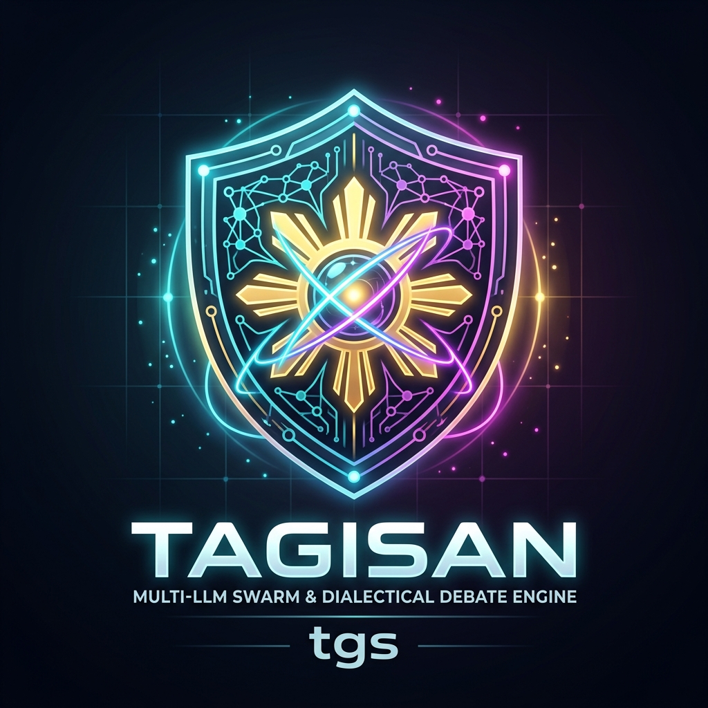

<div align="center">
  <a href="https://github.com/CharleGutierrez/tagisan">
    
  </a>

  # 🇵🇭 Tagisan (`tgs` / `tagisan-rs`)

  **Tagisan ng Talino:** High-Performance Multi-LLM Swarm, Dialectical Debate, Autonomous Polyglot Agents, Local Ollama Engine, & ECC Engineering Swarm in Rust.

  <br />

  [](https://www.rust-lang.org/)
  [](https://github.com/CharleGutierrez/tagisan)
  [](LICENSE)
  [](https://tokio.rs/)
  [](https://ollama.com/)
  [](https://github.com/CharleGutierrez/tagisan)
  [](https://modelcontextprotocol.io/)
</div>

---

## 🌟 Overview

**Tagisan** (invoked via the blazing-fast command **`tgs`**) is a zero-cost abstraction multi-agent engine written in Rust that coordinates heterogeneous Large Language Models—**Anthropic Claude, Google Gemini, OpenAI, xAI Grok, DeepSeek, and Local Ollama**—into an orchestrated, collaborative intelligence swarm.

Instead of relying on a single AI model (which can hallucinate or produce biased designs), Tagisan enables models to **debate, cross-verify, propose alternative solutions in parallel, plan as Directed Acyclic Graphs (DAGs), and execute autonomous tool loops** with real-time streaming, persistent vector memory, and sandboxed polyglot execution.

Tagisan natively incorporates the **Everything Coding Cloud (ECC)** agent harness and skills architecture, bringing 170+ engineering skills, automatic semantic skill dispatching, specialized personas, and **AgentShield** real-time safety guardrails directly to your terminal.

---

## 🚀 Key Architectural Pillars

```mermaid
graph TD
    CLI["CLI Binary (tgs)"] --> Engine["Tagisan Core Engine"]
    Engine --> Swarm["Autonomous Swarm & Strategies"]
    Engine --> Providers["Provider Hub (Cloud & Local)"]
    Engine --> Polyglot["Polyglot Runtimes (Python, Perl, Bun)"]
    Engine --> Skills["AI Skill Dispatcher (170+ Skills)"]
    Engine --> Memory["Vector RAG & Episodic Memory"]
    
    Swarm --> Debate["Dialectical Debate (Thesis -> Antithesis -> Synthesis)"]
    Swarm --> MoA["Mixture-of-Agents (MoA Proposers -> Aggregator)"]
    Swarm --> DAG["Petgraph 5-Stage Parallel DAG Pipeline"]
    Swarm --> Consensus["Mathematical Peer Review & Consensus"]

    Providers --> Cloud["Claude 3.5, Gemini 2.0, GPT-4o, Grok-2, DeepSeek-R1"]
    Providers --> Ollama["Local Ollama (Dynamic Discovery, Zero-Cost, GPU Pinning)"]

    Polyglot --> Py["Python 3.14+ (python_eval, python_run)"]
    Polyglot --> Pl["Perl 5.42+ (perl_eval, perl_run)"]
    Polyglot --> Bun["Bun / TypeScript Runtime & Sandbox"]

    Skills --> AutoDispatch["Sub-ms Semantic Intent Matcher (Top-K)"]
    Skills --> BuiltinSkills["40 Built-in Domain Skills"]
    Skills --> DiskSkills["130+ On-Disk ECC Catalog Skills"]

    Polyglot --> Shield["AgentShield Security Interceptor"]
    Engine --> MCP["Model Context Protocol (Bidirectional Client & Server)"]
```



---

### 1. ⚔️ Dialectical Debate (*Tagisan ng Talino / Balagtasan*)
- **Round 1 (Thesis):** Proponent model (e.g., Claude 3.5 Sonnet or local `qwen2.5:0.5b`) drafts the initial technical proposal.
- **Round 2 (Antithesis):** Adversary model (e.g., DeepSeek R1, Grok 2, or local `dolphin-phi:latest`) ruthlessly probes for logical flaws, security vulnerabilities, and runtime bottlenecks.
- **Round 3 (Synthesis / Lakandiwa):** Chief Adjudicator synthesizes both perspectives, balances trade-offs, and issues a final, mathematically grounded verdict.
- **100% Local Execution:** Can run entirely offline using local Ollama models in rotation without any cloud dependencies or API costs.

### 2. 🛖 Mixture-of-Agents (MoA)
- **Layer 1 (Parallel Proposers):** Multiple models generate independent candidate solutions concurrently over Tokio async channels.
- **Layer 2 (Master Aggregator):** Aggregating model analyzes, filters, and combines the strongest elements of each proposal into a definitive solution.

### 3. 🦙 High-Performance Local Ollama Engine & Rotational Multi-LLM Execution
- **Dynamic On-Disk Model Discovery:** Automatically detects installed models from `~/.ollama/models/manifests/` with zero configuration.
- **Hardware-Aware Memory Prioritization:** Intelligently scores and selects models matching physical host resources (e.g., prioritizing `dolphin-phi:latest` and `qwen2.5:0.5b` for 8GB RAM hosts, while safeguarding large 26GB MoE models).
- **Extreme Speed Protocol Tuning:**
  - `keep_alive: "24h"` (eliminates model re-loading latency)
  - `num_gpu: 99` (forces 100% layer offloading to available GPU/Vulkan accelerators)
  - `num_batch: 512` (high-throughput prompt ingestion)
  - `f16_kv: true` & `use_mmap: true` (minimal memory footprint and instantaneous memory mapping)
  - `num_ctx: 8192` (expanded reasoning context)
- **DeepSeek `<think>` Reasoning Parser:** Built-in state machine extracts and isolates internal chain-of-thought blocks (`ContentBlock::Thinking`) from final answers (`ContentBlock::Text`).
- **Rotational Multi-Model Swapping:** Seamlessly hot-swaps between local models during multi-turn swarms and debates with sub-400ms transition times and zero memory leaks.

### 4. 🐍 🐪 🥟 Polyglot Execution Runtimes (Python, Perl & Bun)
Tagisan natively embeds execution engines and tool handlers for polyglot systems engineering:
- **Python 3 Integration (`python_eval`, `python_run`):** Execute Python scripts and snippets with automatic virtualenv/PATH discovery, execution timeouts, and 1MB buffer safety clamps.
- **Perl 5 Integration (`perl_eval`, `perl_run`):** Run high-performance Perl 5 text-processing, regular expressions, and system scripts directly from autonomous agents.
- **Bun / TypeScript Subsystem:** Integrated Bun runner (`tgs bun run`, `tgs bun test`, `tgs bun repl`, `tgs bun install`) with process sandboxing.
- **AgentShield Polyglot Defense:** Real-time AST and regex scanners intercept dangerous operations (`os.system`, `subprocess.Popen`, reverse shells, `shutil.rmtree`, Perl `system()`, `exec()`, and pipe opens) before execution.

### 5. 🎯 AI Automatic Skill Dispatcher (170+ Skills Catalog)
- **Zero-Latency Dispatcher (`SkillDispatcher`):** Sub-millisecond semantic intent matcher that indexes 40 built-in skills and 130+ on-disk skills from `.ecc/skills/`.
- **Top-K Scoring:** Dynamically matches developer queries (e.g., UX/UI design, TDD, cloud architecture, security audits, microinteractions, cognitive UX) to the most authoritative engineering skill.
- **Automated Pipeline Equipping:** Automatically equips relevant skills into the 5-stage DAG pipeline (`ecc_plan`, `ecc_test`, `ecc_implement`, `ecc_review`, `ecc_security`).
- **Autonomous Tool Exploration:** Equips agents with `search_skills` to discover and self-equip capabilities on the fly.

### 6. 🛡️ AgentShield Runtime Security Interceptor
- Zero-overhead security firewall integrated into every tool invocation.
- **Destructive Command Defense:** Blocks root file deletions (`rm -rf /`), disk formatting (`mkfs`), raw block writes (`dd if=`, `> /dev/sda`), and fork bombs (`:(){ :|:& };:`).
- **Path Traversal Defense:** Prevents directory traversal attacks (`../../../`, sensitive system files like `/etc/shadow`, `/proc/kcore`, SSH private keys).
- **Credential Leak Redaction:** Scans and redacts Anthropic (`sk-ant-`), OpenAI (`sk-proj-`), Gemini (`AIzaSy`), and xAI (`xai-`) secret keys before output exposure.

### 7. 🔌 Model Context Protocol (MCP) Client & Server Subsystem
- **Universal MCP Client:** Connects via JSON-RPC 2.0 stdio to any MCP server (SQLite, GitHub, Filesystem, Postgres, Memory) with namespace isolation (`<server>__<tool>`).
- **Native MCP Server (`tgs serve-mcp`):** Exposes Tagisan's capabilities (debate, MoA, autonomous agents, vector memory, DAG pipelines) to **Claude Desktop**, **Cursor**, **Zed**, and **Windsurf**.

### 8. 🧠 Persistent Long-Term Memory & Local Vector RAG
- **Offline-First Vector Math:** Built-in `FastHashEmbeddingProvider` (256-dim hashing with L2 unit normalization) delivers zero-dependency, zero-API-key semantic embeddings out of the box.
- **Pluggable Neural Embeddings:** Support for OpenAI (`text-embedding-3-small`), Gemini (`text-embedding-004`), and local Ollama (`nomic-embed-text`).
- **Sliding-Window Code Chunking:** `CodeChunker` splits source files preserving exact line boundaries, AST context, and language metadata.
- **Episodic Memory & Agent Recall:** Auto-injects top matching context chunks into autonomous sessions via `.tagisan/memory.json`.

---

## 📦 Project Structure

```
tagisan/
├── Cargo.toml
├── .env.example                  # Template for API keys
├── mcp.example.json              # Template for MCP server definitions
├── README.md
├── .ecc/                         # ECC Agent & Skill definitions (Markdown + YAML frontmatter)
│   ├── agents/                   # Extensible agent personas (architect, tdd-engineer, ...)
│   └── skills/                   # 130+ Extensible skills catalog (design, security, cloud, ...)
└── src/
    ├── lib.rs                    # Library exports & public crate interface
    ├── cli.rs                    # Unified CLI implementation & command dispatch
    ├── bin/
    │   ├── tgs.rs                # Primary ultra-fast CLI command (`tgs`)
    │   └── tagisan.rs            # Full compatibility alias (`tagisan`)
    ├── error.rs                  # TagisanError & Result types
    ├── types/                    # Core message blocks, roles, token usage, tool schemas
    ├── providers/                # LLM API adapters & resilient cascade fallbacks
    │   ├── mod.rs                # LlmProvider trait & ProviderCapabilities
    │   ├── ollama.rs             # Hardened local Ollama provider (wire protocol & discovery)
    │   ├── anthropic.rs          # Anthropic Claude 3.5 Sonnet / Opus
    │   ├── openai_compat.rs      # OpenAI, xAI (Grok), DeepSeek (R1 / V3)
    │   ├── gemini.rs             # Google Gemini 1.5 Pro / 2.0 Flash
    │   └── cascade.rs            # Multi-provider cascade fallback
    ├── python/                   # Python 3 runtime engine & sandboxed executor
    │   ├── mod.rs
    │   └── runtime.rs
    ├── perl/                     # Perl 5 runtime engine & sandboxed executor
    │   ├── mod.rs
    │   └── runtime.rs
    ├── bun/                      # Bun / TypeScript execution engine & sandbox
    ├── tools/                    # Tool definitions & registry
    │   ├── builtin.rs            # File I/O, Command execution, Math, Memory tools
    │   ├── python.rs             # PythonEvalTool & PythonRunTool
    │   └── perl.rs               # PerlEvalTool & PerlRunTool
    ├── strategies/               # Multi-LLM consensus & collaboration algorithms
    │   ├── moa.rs                # Mixture-of-Agents parallel runner
    │   ├── debate.rs             # Dialectical Debate (Tagisan ng Talino)
    │   └── harmony.rs            # Structured Role-Based Harmony Swarm (RFC-003)
    ├── swarm/                    # Multi-agent swarm & consensus coordination
    │   ├── harmony/              # Sequential assembly line, validation gates, blackboard
    │   ├── consensus/            # Multi-agent voting & peer review engine
    │   └── coordinator.rs        # Dynamic task delegation & swarm orchestration
    ├── memory/                   # Persistent Vector Memory & Codebase RAG
    ├── dag/                      # Petgraph DAG workflow engine & scheduler
    ├── mcp/                      # Model Context Protocol (Client & Server)
    ├── ecc/                      # ECC Swarm, Personas, Skills Dispatcher, and AgentShield
    │   ├── skills_dispatcher.rs  # High-performance semantic skill search & ranker
    │   └── agentshield.rs        # Security firewall for commands, files, and scripts
    ├── engine/                   # Runtime orchestrator & atomic USD budget tracker
    └── tui/                      # Interactive terminal user interface (Ratatui)
```

---

## 🛠️ Quick Start & Installation

### 1. Build & Install CLI
Install both `tgs` and `tagisan` binaries into `~/.cargo/bin/`:

```bash
cargo install --path .
```

You can now use `tgs` directly from anywhere in your terminal!

### 2. Configure Environment (Optional Cloud Keys)
Copy `.env.example` to `.env`:

```bash
cp .env.example .env
```

Add any keys you wish to use:
```env
GEMINI_API_KEY=AIzaSy...             # Google AI Studio (Free tier supported)
DEEPSEEK_API_KEY=sk-...              # DeepSeek R1 / V3
ANTHROPIC_API_KEY=sk-ant-api03-...   # Claude 3.5 Sonnet
OPENAI_API_KEY=sk-proj-...           # GPT-4o
XAI_API_KEY=xai-...                  # Grok 2
OLLAMA_MODEL=dolphin-phi:latest      # Override local Ollama default model
```

> [!TIP]
> **Zero-Cost Offline Mode:** If no cloud API keys are provided, Tagisan **automatically detects your local Ollama installation** and runs offline using installed local models (such as `dolphin-phi:latest` or `qwen2.5:0.5b`).

### 3. Check System Status & Local Models
```bash
tgs status
```

Displays active cloud keys, local Ollama daemon status, installed models, and budget limits.

---

## 💻 CLI Usage Guide

### 1. Interactive Queries & Streaming
```bash
# Query the best available model (auto-detected)
tgs ask "Explain how lock-free atomics work in Rust"

# Stream response in real-time
tgs stream "Write an async HTTP health checker using Tokio"

# Force execution via local Ollama
tgs ask -p ollama "Summarize the law of conservation of energy"
tgs stream -p ollama -m qwen2.5:0.5b "Count from 1 to 10 in Rust"
```

### 2. Dialectical Debate (*Tagisan ng Talino*)
Pit two models against each other in an adversarial architectural critique:

```bash
# Cloud Debate (e.g. Claude vs DeepSeek with Gemini adjudicator)
tgs debate "Should we build our backend with Rust microservices or a modular Go monolith?"

# 100% Local Debate using Ollama models in rotation
tgs debate "Postgres JSONB vs Relational Tables for high-throughput events"

# Watch the debate live in an interactive TUI
tgs debate --tui "Rust vs Zig for embedded systems"
```

### 3. Mixture-of-Agents (`moa`)
```bash
tgs moa "Design an ultra-low latency circular buffer in Rust"
```

### 4. Autonomous Agent Loop (`agent`)
Deploy an autonomous reasoning agent equipped with filesystem, command execution, and memory tools:

```bash
# Autonomous code inspection and enhancement
tgs agent "Scan src/providers/ollama.rs, identify optimization flags, and explain them"

# Autonomous run with persistent codebase memory
tgs agent "Refactor our vector memory distance functions" --memory

# Autonomous run with external MCP tools
tgs agent "Analyze our local database schema" --mcp
```

### 5. Polyglot Runtimes (`python`, `perl`, `bun`)
Run secure, AgentShield-protected Python and Perl evaluations directly:

```bash
# Python one-liner evaluation
tgs python eval "import sys; print(f'Python version: {sys.version}')"

# Run Python script file with arguments
tgs python run scripts/benchmark.py --iterations 1000

# Perl one-liner evaluation
tgs perl eval 'my @nums = (1..10); print "Sum: " . eval(join("+", @nums));'

# Run Perl script file
tgs perl run scripts/parser.pl input.txt

# Bun / TypeScript execution
tgs bun run index.ts
tgs bun test
```

### 6. ECC Multi-Agent Engineering Swarm & Skills Dispatch
```bash
# List all 170+ available engineering skills
tgs ecc skills

# Run an agent persona with an attached skill
tgs ecc run tdd-engineer "Build an atomic ring buffer" --skill tdd-workflow

# Execute the automated 5-Stage Engineering Pipeline
tgs ecc pipeline "Implement an encrypted SQLite session store with Zeroize"

# Adversarial Architecture & Security Audit
tgs ecc audit "Is mmap-backed shared memory safe for inter-process IPC?"
```

### 7. Autonomous Swarms & Team Consensus
```bash
# Distributed Swarm with Lead Architect delegating to TDD and Security agents
tgs swarm run "Design and implement a zero-allocation token bucket" --agents architect,tdd-engineer,security-auditor --lead architect

# Mathematical Peer Review & Consensus Voting on code
tgs consensus src/agent/mod.rs --rule unanimous

# Position-based Borda Count consensus ranking
tgs consensus "Raft vs Paxos for consensus engine" --rule borda
```

### 8. Interactive Multi-Turn REPL (`repl`)
```bash
# Start an interactive agent session with memory and persona
tgs repl --agent architect --memory

# Start inside an isolated Git worktree sandbox
tgs repl --sandbox

# Resume a previous session checkpoint
tgs repl --resume repl-1725890000
```

### 9. Structured Role-Based Harmony Swarm (`tgs harmony` / Bayanihan)
Execute deterministic, role-based assembly line pipelines (RFC-003) powered by local Ollama models, cloud models, or mixed fleets:

```bash
# Execute standard 4-stage assembly line (Architect -> Implementer -> QA -> Doc)
tgs harmony build "Implement an async rate limiter in Rust using token bucket"

# Customize role models across local Ollama and cloud providers
tgs harmony build "Build a thread-safe LRU cache" \
  --architect ollama:qwen2.5:0.5b \
  --implementer ollama:dolphin-phi:latest \
  --qa ollama:qwen2.5:0.5b \
  --doc ollama:dolphin-phi:latest

# Run with adversarial security audit and dump artifacts to directory
tgs harmony build "Build a JWT parser" --audit --output-dir ./jwt_build/

# Output structured JSON project bundle for CI/CD pipelines
tgs harmony build "Implement a binary search tree" --json
```

---

## 📊 Local LLM Rotational Performance Scorecard

Tested on a real-world developer machine (Intel Core i3, 8GB RAM, integrated graphics) running local Ollama v0.33.3:

| Model | Size / Quant | Non-Streaming Speed | Real-Time Streaming | Time to First Token (TTFT) | Role in Swarm |
| :--- | :---: | :---: | :---: | :---: | :--- |
| **`qwen2.5:0.5b`** | 397 MB / Q4_K_M | **31.22 tps** (0.61s) | **39.45 tps** | **390 ms** | Fast routing, thesis drafting, synthesis |
| **`dolphin-phi:latest`** | 1.60 GB / Q4_0 | **19.15 tps** (1.36s) | **20.66 tps** | **170 ms** | In-depth critique, code review, antithesis |
| **`dolphin-mixtral:latest`** | 26.44 GB / Q4_0 | Watchdog Guarded | Safe Probe | Watchdog Intercept | Large-memory architectural audit |

- **Hot-Swapping Performance:** 10 rapid alternating switches between `qwen2.5:0.5b` and `dolphin-phi:latest` completed in **4.10s** (avg. **0.38s/swap**) with zero memory leaks or runner crashes.
- **Resource Boundary Safety:** 26GB models on 8GB host machines are automatically guarded by watchdog timers, preventing system freezes and recovering within 0.05s.

---

## 🧪 Comprehensive Test Suites

Tagisan includes brutal, production-grade test suites verifying reliability across every subsystem:

```bash
# Run all unit and integration test suites
cargo test

# Run the brutal local Ollama wire protocol & streaming stress suite (9 tests)
cargo test --test ollama_brutal_stress_tests

# Run the live local LLM rotational multi-model benchmark suite (8 tests)
cargo test --test ollama_rotational_model_tests

# Run the Python 3 and Perl 5 runtime integration and security tests
cargo test --test python_perl_integration_tests
cargo test --test python_perl_brutal_stress_tests

# Run the 170+ skills catalog & auto-dispatcher verification suite
cargo test --test skills_brutal_verification_tests

# Run the Distributed Swarm, Consensus & REPL test suite
cargo test --test milestone8_swarm_tests

# Run the Model Context Protocol (MCP) Client & Server test suites
cargo test --test milestone7_mcp_server_tests
cargo test --test milestone5_mcp_tests

# Run the Persistent Vector Memory & Codebase RAG test suite
cargo test --test milestone6_memory_tests
```

---

## 🗺️ Architectural Specifications & Roadmaps

- 📑 **[RFC-001: Universal Protocol & Ecosystem Integrations](ROADMAP_EXTENSIONS.md)** — Pluggable external vector backends, OTel, and automated evaluation.
- 🔌 **[RFC-002: WASM & Native Dynamic Plugins Architecture](ROADMAP_PLUGINS.md)** — Extism WASM sandboxing and dynamic shared library plugins.
- 🏛️ **[RFC-003: Structured Role-Based Harmony Swarms for Local LLMs](docs/SPEC_STRUCTURED_ROLE_HARMONY_SWARM.md)** — Multi-model assembly line, anti-sycophancy gates, and shared blackboard memory for local Ollama swarms.
- 🧠 **[RFC-004: Semantic Skill Dispatching & Local LLM Knowledge Injection](docs/SPEC_LOCAL_LLM_SKILL_DISPATCHING.md)** — Top-K semantic skill auto-equipping, sub-0.5ms dispatching, and cheat-sheet prompt injection for local models.

---

## 📄 License

This project is dual-licensed under the **MIT License** and the **Apache 2.0 License**. See [LICENSE](LICENSE) for details.

