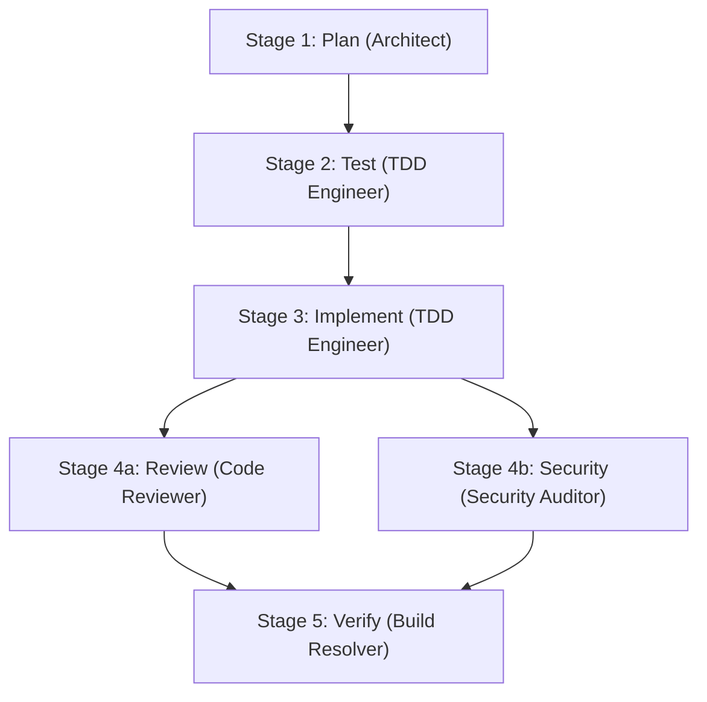

# 🇵🇭 Tagisan (`tgs` / `tagisan-rs`)
> **Tagisan ng Talino (`tgs`):** High-Performance Multi-LLM Collaboration, Adversarial Debate, Autonomous Agents & ECC Engineering Swarm in Rust.

[](https://www.rust-lang.org/)
[](https://github.com/CharleGutierrez/tagisan)
[](LICENSE)
[](https://tokio.rs/)
[](https://github.com/petgraph/petgraph)
[](https://github.com/ratatui-org/ratatui)

---

## 🌟 Overview

**Tagisan** (invoked as **`tgs`**) is an asynchronous, zero-cost abstraction engine written in Rust that orchestrates heterogeneous Large Language Models—**Anthropic Claude, xAI Grok, Google Gemini, OpenAI, DeepSeek, and local Ollama**—into a collaborative intelligence swarm.

Instead of relying on a single AI model (which can hallucinate or produce biased designs), Tagisan enables models to **debate, critique, cross-verify, plan as Directed Acyclic Graphs (DAGs), and execute autonomous tool loops**.

Tagisan natively integrates the agent harness and persona architecture of **[ECC (Everything Coding Cloud / Agent Harness OS)](https://github.com/affaan-m/ECC)**, bringing specialized engineering personas, attachable skill modules, automated 5-stage development pipelines, and **AgentShield** runtime security guardrails directly into Rust.

---

## 🚀 Key Architectural Pillars

### 1. ⚔️ Dialectical Debate (*Tagisan ng Talino / Balagtasan*)
- **Round 1 (Thesis):** Proponent model (e.g., Claude 3.5 Sonnet) drafts the initial architectural or code solution.
- **Round 2 (Antithesis):** Adversary model (e.g., DeepSeek R1 / Grok 3) ruthlessly probes for logical flaws, edge cases, and vulnerabilities.
- **Round 3 (Synthesis / Lakandiwa):** Chief Adjudicator (e.g., Google Gemini 1.5 Pro / GPT-4o) evaluates both sides, balances trade-offs, and synthesizes the hardened verdict.

### 2. 🛖 Mixture-of-Agents (MoA)
- **Layer 1 (Parallel Proposers):** Grok, Gemini, and DeepSeek generate candidate drafts concurrently in milliseconds via Tokio async channels.
- **Layer 2 (Master Aggregator):** Claude 3.5 Sonnet analyzes, filters, and combines the proposals into a definitive solution.

### 3. 🤖 Autonomous Multi-Turn Agent Loop
- Equips models with a sandboxed **Tool Registry** (`read_file`, `write_file`, `run_command`, `calculator`).
- Drives continuous reasoning cycles (`Thought -> Tool Call -> Observation -> Answer`) with configurable recursion limits and automated error recovery.

### 4. 🕸️ Petgraph-Powered DAG Workflow Engine
- Decomposes high-level objectives into Directed Acyclic Graphs with upstream dependency resolution.
- Executes independent nodes in parallel with bounded concurrency, real-time event streaming, and dynamic error propagation.

### 5. 🐝 ECC Multi-Agent Engineering Swarm & Skills Catalog
- Native Rust implementation of the Everything Coding Cloud (ECC) agent architecture.
- Five specialized built-in personas (`architect`, `tdd-engineer`, `code-reviewer`, `security-auditor`, `build-resolver`) plus dynamic discovery from `.ecc/agents/*.md`.
- Attachable capabilities from the **ECC Skills Catalog** (`tdd-workflow`, `security-review`, `api-design`, `verification-loop`, plus `.ecc/skills/*/SKILL.md`).
- Fully automated **5-stage parallel DAG pipeline** (`Plan -> Test -> Implement -> (Review || Security) -> Verify`).

### 6. 🛡️ AgentShield Runtime Security Interceptor
- Zero-overhead security scanner integrated directly into tool invocation.
- **Destructive Command Defense:** Blocks root file deletions (`rm -rf /`), disk formatting (`mkfs`), raw block writes (`dd if=`, `> /dev/sda`), and fork bombs (`:(){ :|:& };:`).
- **Path Traversal Defense:** Prevents directory traversal attacks (`../../../`, sensitive system file access like `/etc/shadow`, `/proc/kcore`, SSH private keys).
- **Credential Leak Redaction:** Automatically scans and redacts Anthropic (`sk-ant-`), OpenAI (`sk-proj-`), Google Gemini (`AIzaSy`), and xAI (`xai-`) secret keys before output exposure.

### 7. 🔌 Model Context Protocol (MCP) Client Subsystem
- **JSON-RPC 2.0 stdio Transport:** Connects asynchronously to standard MCP servers (e.g., SQLite, GitHub, Filesystem, Postgres, Memory) via spawned child processes.
- **Dynamic Configuration & Discovery:** Auto-discovers server definitions from `mcp.json`, `tagisan.mcp.json`, or `.tagisan/mcp.json`.
- **Universal ToolRegistry Adapter:** Seamlessly maps external MCP tool definitions into Tagisan's `ToolHandler` trait with namespace isolation (`<server>__<tool>`).
- **Security-Audited Execution:** All MCP tool calls are vetted by AgentShield prior to execution, and all returned payloads are scrubbed for credential leaks.

### 8. 🧠 Persistent Long-Term Memory & Local Vector RAG Subsystem
- **100% Offline-First Vector Math:** Built-in `FastHashEmbeddingProvider` (256-dim word and n-gram hashing with L2 unit normalization) delivers zero-dependency, zero-API-key semantic embeddings out of the box.
- **Pluggable Neural Embeddings:** First-class support for OpenAI (`text-embedding-3-small`), Google Gemini (`text-embedding-004`), and local Ollama (`nomic-embed-text`).
- **Sliding-Window Code Chunking:** `CodeChunker` splits source files with configurable window and overlap lines, preserving language metadata and exact line boundaries.
- **Persistent Atomic Vector Store:** Thread-safe vector store persisting to `.tagisan/memory.json` via atomic rename operations to prevent corruption.
- **Episodic Memory & Agent Recall:** Auto-injects top-3 relevant context chunks into `AutonomousAgent` before execution, and equips agents with `search_memory` and `save_memory` tools.

---

## 📦 Project Structure

```
tagisan/
├── Cargo.toml
├── .env.example                  # Template for API keys
├── mcp.example.json              # Template for MCP server definitions
├── README.md
├── .ecc/                         # ECC Agent & Skill definitions (Markdown + YAML frontmatter)
│   ├── agents/                   # Extensible agent personas (code-explorer.md, debugger.md, ...)
│   └── skills/                   # Extensible skills catalog (tdd-workflow, security-review, ...)
│       ├── security-review/
│       │   └── SKILL.md
│       └── tdd-workflow/
│           └── SKILL.md
└── src/
    ├── lib.rs                    # Library exports & public crate interface
    ├── cli.rs                    # Unified CLI implementation & command dispatch
    ├── bin/                      # Dual binary targets
    │   ├── tgs.rs                # Primary ultra-fast CLI command (`tgs`)
    │   └── tagisan.rs            # Full compatibility alias (`tagisan`)
    ├── error.rs                  # TagisanError & Result types
    ├── types/                    # Core message blocks, roles, token usage, tool schemas
    │   └── mod.rs
    ├── providers/                # LLM API adapters & resilient cascade fallbacks
    │   ├── mod.rs                # LlmProvider trait & ProviderCapabilities bitflags
    │   ├── anthropic.rs          # Anthropic Claude 3.5 Sonnet / Opus
    │   ├── openai_compat.rs      # OpenAI, xAI (Grok), DeepSeek (R1 / V3)
    │   ├── gemini.rs             # Google Gemini 1.5 Pro / 2.0 Flash
    │   ├── ollama.rs             # Local offline inference (localhost:11434)
    │   └── cascade.rs            # Multi-provider cascade fallback
    ├── strategies/               # Multi-LLM consensus & collaboration algorithms
    │   ├── mod.rs                # CollaborationStrategy trait
    │   ├── moa.rs                # Mixture-of-Agents parallel runner
    │   └── debate.rs             # Dialectical Debate (Tagisan ng Talino)
    ├── agent/                    # Autonomous agent engine
    │   └── mod.rs                # ReAct loop, tool execution & AgentShield interception
    ├── tools/                    # Tool definitions & registry
    │   ├── mod.rs                # Tool trait & ToolRegistry
    │   └── builtin.rs            # ReadFileTool, WriteFileTool, RunCommandTool, CalculatorTool, ViewImageTool, SearchMemoryTool, SaveMemoryTool
    ├── memory/                   # Persistent Vector Memory & Codebase RAG Subsystem (Milestone 6)
    │   ├── mod.rs
    │   ├── embedding.rs          # EmbeddingProvider trait, vector math, FastHash (offline), Ollama, OpenAI, Gemini
    │   ├── chunking.rs           # CodeChunker sliding window & language detection
    │   ├── store.rs              # Thread-safe VectorStore & atomic disk serialization (.tagisan/memory.json)
    │   ├── index.rs              # CodebaseIndexer tree traversal with .gitignore exclusions
    │   └── episodic.rs           # EpisodicMemory recording decisions, insights & architecture invariants
    ├── dag/                      # Directed Acyclic Graph engine
    │   ├── mod.rs
    │   ├── graph.rs              # WorkflowGraph topology powered by petgraph
    │   ├── node.rs               # TaskNode and dependency tracking
    │   ├── planner.rs            # Objective decomposition into DAGs
    │   └── scheduler.rs          # Asynchronous Tokio parallel executor
    ├── mcp/                      # Model Context Protocol (MCP) Client Subsystem (Milestone 5)
    │   ├── mod.rs
    │   ├── protocol.rs           # JSON-RPC 2.0 messages & MCP schemas
    │   ├── config.rs             # mcp.json loader & discovery
    │   ├── transport.rs          # Async line-delimited stdio transport
    │   ├── client.rs             # Handshake, tools/list, tools/call
    │   ├── adapter.rs            # McpToolWrapper implementing ToolHandler
    │   └── manager.rs            # Multi-server orchestrator & tool registration
    ├── ecc/                      # Native ECC (Everything Coding Cloud) Subsystem
    │   ├── mod.rs
    │   ├── agent.rs              # EccAgent loader & YAML frontmatter parser
    │   ├── presets.rs            # Built-in personas (Architect, TDD Engineer, etc.)
    │   ├── skills.rs             # SKILL.md dynamic catalog loader & parser
    │   ├── agentshield.rs        # Runtime security scanner & sandbox interceptor
    │   ├── pipeline.rs           # 5-stage parallel DAG workflow
    │   └── audit.rs              # Adversarial architecture & security debate
    ├── engine/                   # Runtime orchestrator
    │   ├── mod.rs                # EngineContext
    │   └── budget.rs             # Atomic USD token cost tracker with prompt cache discounts
    └── tui/                      # Interactive terminal user interface (Ratatui)
        └── mod.rs
```

---

## 🛠️ Quick Start

### 1. Set Up API Keys
Copy `.env.example` to `.env` in the repository root:

```bash
cp .env.example .env
```

Add any keys you have available:
```env
ANTHROPIC_API_KEY=sk-ant-api03-...
XAI_API_KEY=xai-...
GEMINI_API_KEY=AIzaSy...
DEEPSEEK_API_KEY=sk-...
OPENAI_API_KEY=sk-proj-...
```

> [!NOTE]
> If no external API keys are provided, Tagisan falls back automatically to local offline Ollama at `localhost:11434`.

---

### 2. Install CLI Locally (Fast `tgs` Command)
Install both `tgs` and `tagisan` binaries into `~/.cargo/bin/`:

```bash
cargo install --path .
```

You can now use `tgs` directly from anywhere in your terminal! *(Or use `cargo run --`)*

---

### 3. Verify System Status & Providers
Check configured providers, active API keys, and model capabilities:

```bash
tgs status
# or: cargo run -- status
```

---

### 4. Run Dialectical Debate (`debate`)
Pit two frontier models against each other with adjudication:

```bash
tgs debate "Should a high-throughput payment engine use an Event-Sourced architecture or CRUD with Postgres?"
```

To watch the debate unfold in an interactive, multi-pane Terminal User Interface:
```bash
tgs debate --tui "Rust vs Go for high-concurrency microservices"
```

---

### 5. Run Mixture-of-Agents (`moa`)
Execute layered parallel generation and synthesis:

```bash
tgs moa "Design a zero-downtime database migration strategy for 100M active records in Rust"
```

---

### 6. Run an Autonomous Agent (`agent`)
Deploy an autonomous reasoning loop equipped with file system and terminal tools:

```bash
tgs agent "Analyze src/lib.rs, identify any missing error types, and document them"
```

---

### 7. Run Dynamic DAG Workflows (`workflow`)
Decompose complex goals into dependency graphs and execute them concurrently:

```bash
tgs workflow plan "Design a telemetry metrics collector, write unit tests, and implement the Tokio worker"
```

---

## 🐝 ECC Multi-Agent Engineering Swarm

Tagisan natively incorporates the **Everything Coding Cloud (ECC)** agent specification, bringing specialized roles, modular skills, structured engineering pipelines, and runtime security to your Rust workflows.

### Built-in Agent Personas
Tagisan includes 5 pre-configured engineering personas:

| Agent Persona | Role & Focus | Recommended Model |
|---|---|---|
| `architect` | System architecture, concurrency patterns, non-functional requirements, data flow | `claude-3-5-sonnet` |
| `tdd-engineer` | Test-driven development, edge-case coverage, unit & integration tests | `deepseek-reasoner` / `claude-3-5-sonnet` |
| `code-reviewer` | Code hygiene, idiomatic Rust, memory safety, SOLID principles | `claude-3-5-sonnet` |
| `security-auditor` | Threat modeling, injection/overflow risks, credential leak prevention | `gemini-1.5-pro` / `deepseek-reasoner` |
| `build-resolver` | Compilation diagnostics, borrow checker fixes, Cargo dependency conflicts | `claude-3-5-sonnet` |

You can also drop custom Markdown agent definitions with YAML frontmatter into `.ecc/agents/`:
```markdown
---
name: database-specialist
description: PostgreSQL index and schema optimization expert
tools: read_file, write_file, run_command
model: claude-3-5-sonnet-20241022
---

# System Prompt
You are a principal database administrator...
```

List all available built-in and discovered agents:
```bash
tgs ecc list
```

---

### ECC Skills Catalog
Skills are reusable capability modules that can be dynamically attached to any agent via `--skill <skill_name>`.

Built-in skills include:
- `tdd-workflow`: Enforces Red-Green-Refactor, test assertion rigor, and edge-case isolation.
- `security-review`: Guides vulnerability audits, input sanitization, and OWASP Top 10 defenses.
- `api-design`: Enforces RESTful / gRPC idiomatic contracts, semantic versioning, and backward compatibility.
- `verification-loop`: Guides iterative build-and-test loops until clean compilation is achieved.

Custom skills can be placed in `.ecc/skills/<skill-name>/SKILL.md`:
```markdown
---
name: async-optimization
description: Tokio and lock-free concurrency tuning skill
---

# Instructions
Profile bottlenecks before optimizing. Use atomic primitives where possible...
```

List all available skills:
```bash
tgs ecc skills
```

Execute an agent with an attached skill:
```bash
tgs ecc run tdd-engineer "Implement a concurrent LRU cache in Rust" --skill tdd-workflow
```

---

### 5-Stage Parallel DAG Pipeline (`ecc pipeline`)
Run an end-to-end engineering lifecycle for any feature or codebase requirement:



1. **Stage 1 (Plan):** The `architect` produces a detailed specification and module breakdown.
2. **Stage 2 (Test):** The `tdd-engineer` writes failing unit and boundary tests based on the specification.
3. **Stage 3 (Implement):** The `tdd-engineer` writes the code required to satisfy the tests.
4. **Stage 4 (Parallel Audit):**
   - **4a (Review):** The `code-reviewer` checks style, safety, and idiomatic conventions.
   - **4b (Security):** The `security-auditor` conducts threat modeling and security verification concurrently.
5. **Stage 5 (Verify):** The `build-resolver` confirms compilation, executes test suites, and synthesizes the final report.

Run the pipeline with a single command:
```bash
tgs ecc pipeline "Build an atomic lock-free token bucket rate limiter in Rust"
```

---

### Adversarial Architecture & Security Audit (`ecc audit`)
Pit the **ECC Architect** against the **ECC Security Auditor** in a multi-round debate adjudicated by the **Lakandiwa / Chief Adjudicator**:

```bash
tgs ecc audit "Is an in-memory Mutex<HashMap> safe for a high-concurrency payment ledger?"
```

Add `--tui` for live multi-pane terminal visualization:
```bash
tgs ecc audit --tui "Should our crypto wallet store unencrypted keys in shared memory?"
```

---

## 🛡️ AgentShield Runtime Security Guardrail

AgentShield is a built-in security interceptor that guards tool execution in real time:

- **Command Interception:** Evaluates all shell execution requests before they touch the operating system. Destructive operations (`rm -rf /`, `mkfs`, fork bombs, disk rewrites) are immediately blocked with a `ThreatLevel::Critical` verdict.
- **Path Isolation:** Restricts file reading and writing to the project workspace. Deep relative traversals (`../../../`) and sensitive files (`/etc/shadow`, `/proc/kcore`, SSH private keys) are blocked.
- **Secret Redaction:** Outgoing text and logs are passed through an automated redaction filter to ensure API tokens (`sk-ant-`, `sk-proj-`, `AIzaSy`, `xai-`) are never leaked in reports or traces.

```
[AgentShield] Probing tool call: run_command("rm -rf /")
[AgentShield] 🚨 BLOCK [ThreatLevel::Critical]: Attempted recursive deletion of root filesystem
```

---

## 🔌 Model Context Protocol (MCP) Client Subsystem

Tagisan natively implements the Anthropic **Model Context Protocol (MCP)** specification over standard JSON-RPC 2.0 stdio, allowing your agents, swarms, and pipelines to connect to hundreds of community and enterprise MCP servers without writing glue code.

### 1. Configure MCP Servers
Create an `mcp.json`, `tagisan.mcp.json`, or `.tagisan/mcp.json` file in your workspace:

```json
{
  "mcpServers": {
    "sqlite": {
      "command": "uvx",
      "args": ["mcp-server-sqlite", "--db-path", "app.db"]
    },
    "filesystem": {
      "command": "npx",
      "args": ["-y", "@modelcontextprotocol/server-filesystem", "."]
    },
    "git": {
      "command": "uvx",
      "args": ["mcp-server-git", "--repository", "."]
    }
  }
}
```

*(See [mcp.example.json](mcp.example.json) for a template).*

### 2. Discover & Test MCP Servers
List all configured servers and explore their published tools:
```bash
tgs mcp list
```

Perform an initialization handshake with a specific server:
```bash
tgs mcp test sqlite
```

Directly execute an MCP tool from the command line with AgentShield validation:
```bash
tgs mcp call sqlite read_query '{"query": "SELECT name FROM sqlite_master WHERE type=\"table\";"}'
```

### 3. Equip Agents & Swarms with External MCP Tools
Pass `--mcp` to automatically load all discovered MCP tools into any agent, ECC swarm, or workflow:

```bash
# Autonomous Agent with both built-in and external MCP tools
tgs agent "Analyze the schema of test.db and list all tables" --mcp

# Specify a custom config path
tgs agent "Inspect the git commit history" --mcp-config ./custom-mcp.json

# Specialized ECC Persona with MCP capabilities
tgs ecc run architect "Audit our database architecture and indexes" --mcp

# Dynamic Multi-Agent DAG Workflow with MCP tools
tgs workflow plan "Query the SQLite database, format the report, and commit via Git" --mcp
```

---

## 🧠 Persistent Long-Term Memory & Local Vector RAG (Milestone 6)

Tagisan features a native, asynchronous vector database and RAG subsystem stored in `.tagisan/memory.json`. It indexes source code into sliding-window line chunks, hashes semantic features offline with `FastHash` (or neural providers), and auto-retrieves relevant codebase context during autonomous runs.

### 1. Codebase Indexing & Semantic Search
```bash
# Index current directory into long-term vector memory
tgs memory index .

# Index specific source directory
tgs memory index src/memory

# Search indexed chunks semantically with similarity scoring
tgs memory search "cosine similarity"

# Search with custom top-k and similarity threshold
tgs memory search "database connection" --top-k 10 --threshold 0.10

# Display memory storage statistics (documents, dimensions, file size)
tgs memory stats

# Clear and wipe persistent memory
tgs memory clear
```

### 2. Autonomous Agent Context Recall
Pass `--memory` to automatically pre-retrieve top-3 matching codebase chunks and register `search_memory` and `save_memory` tools:

```bash
# Autonomous Agent with persistent memory recall
tgs agent "Refactor our vector similarity functions for performance" --memory

# ECC Persona with long-term memory
tgs ecc run architect "Design the next subsystem matching our existing conventions" --memory

# 5-Stage Engineering Pipeline with memory RAG
tgs ecc pipeline "Add streaming tokenizer cache" --memory
```

---

## 💰 Built-in Cost & Budget Protection

Tagisan tracks token usage and calculates estimated USD costs across all providers atomically, with a 90% discount calculation on cached prompt tokens. You can set strict budget limits to prevent accidental overages:

```bash
# Terminate execution if session cost exceeds $1.50 USD
tgs --max-budget 1.50 moa "Generate a distributed consensus benchmark in Rust"
```

---

## 🧪 Testing & Verification

Tagisan includes an exhaustive automated test suite covering unit logic, DAG validation, provider adapters, AgentShield safety, MCP client integration, vector RAG memory, and chaos stress tests:

```bash
# Run all tests (106 tests across 11 test binaries)
cargo test

# Run Milestone 6 Memory & RAG test suite specifically
cargo test --test milestone6_memory_tests

# Run Milestone 5 MCP test suite specifically
cargo test --test milestone5_mcp_tests

# Run the MCP brutal stress & protocol adversarial suite
cargo test --test mcp_brutal_tests

# Run the brutal chaos & adversarial stress suite
cargo test --test brutal_stress_tests

# Run ECC integration tests specifically
cargo test --test ecc_integration_tests
```

---

## 📄 License

This project is dual-licensed under the **MIT License** and the **Apache 2.0 License**. See [LICENSE](LICENSE) for details.
