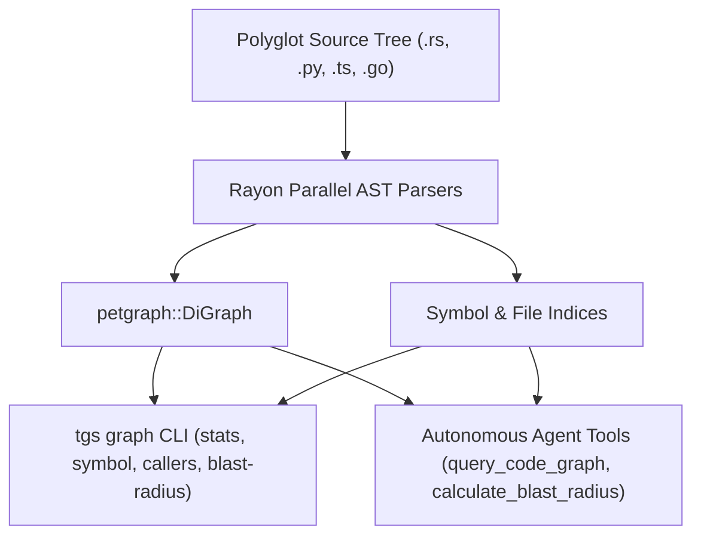

# Tagisan AST Codebase Knowledge Graph & Blast-Radius Engine (`tgs graph`)

## Architectural Overview

The **Tagisan AST Codebase Knowledge Graph & Blast-Radius Engine** is a high-performance polyglot code intelligence system built in Rust. It parses source trees across **Rust**, **Python**, **TypeScript/JavaScript**, and **Go**, extracts semantic symbols and call-sites, builds directed dependency graphs with `petgraph`, and performs transitive blast-radius risk modeling.



---

## 1. Core Data Structures (`src/engine/graph.rs`)

### Symbol Representation
- `CodeSymbol`:
  - `id`: Globally unique identifier (`path:line:kind:name`)
  - `name`: Identifier name (e.g. `build_from_dir`)
  - `qualified_name`: Path-resolved name (e.g. `CodebaseGraph::build_from_dir`)
  - `kind`: `Function`, `Method`, `Struct`, `Enum`, `Trait`, `Interface`, `TypeAlias`, `Module`, `Constant`, `Macro`
  - `file`: Source file path
  - `line`, `col`, `end_line`, `end_col`: Exact 1-indexed source spans
  - `visibility`: `Public`, `Private`, `Crate`, `Protected`
  - `signature`: Raw declaration signature
  - `doc`: Extracted docstring / doc comments

### Graph Edges
- `SymbolEdge`:
  - `relation`: `Calls`, `Defines`, `Implements`, `Imports`, `References`
  - `weight`: Edge weight (default `1.0`)
  - `call_site_line`: Optional line number of the call site

### Blast Radius & Risk Classification
- `BlastRisk`:
  - `Low`: 0-2 dependents. Safe localized refactoring.
  - `Medium`: 3-5 dependents. Multi-call-site verification required.
  - `High`: 6-12 dependents. Wide ripple effect across modules.
  - `Critical`: 13+ dependents or foundational architectural traits with multiple implementations.

---

## 2. Polyglot AST Parsers

The engine incorporates zero-panic, high-speed lexical and syntactic AST extractors:

| Language | Extracted Constructs | Call-site Resolution |
| :--- | :--- | :--- |
| **Rust** (`.rs`) | `fn`, `async fn`, `struct`, `enum`, `trait`, `impl Trait for Type`, `type`, `mod`, `macro_rules!`, `const`, `use` | Scans call expressions within function bodies, resolves trait implementations |
| **Python** (`.py`) | `def`, `async def`, `class`, `import`, `from ... import` | Detects methods within class indentation, inheritance edges, function calls |
| **TypeScript / JS** (`.ts`, `.tsx`, `.js`) | `function`, `class`, `interface`, `type`, arrow functions, `import` | Detects `implements` interfaces, `extends` superclasses, inner method calls |
| **Go** (`.go`) | `func`, receiver methods `func (r *T)`, `struct`, `interface`, `import` | Resolves pointer/value receiver methods, package imports, call-sites |

---

## 3. CLI Command Suite (`tgs graph`)

### Statistics & Centrality Rankings
```bash
tgs graph stats
```
Displays total nodes, edges, function counts, type counts, indexed files, and the top 10 most heavily depended upon architectural hubs.

### Symbol Lookup
```bash
tgs graph symbol TokenBudgetTracker
```
Locates definitions, files, line numbers, visibility, signatures, and doc comments.

### Callers & Callees
```bash
# Find all incoming callers that depend on a function
tgs graph callers calculate_blast_radius

# Find all outgoing calls executed by a function
tgs graph callees build_from_dir
```

### Transitive Blast-Radius Analysis
```bash
tgs graph blast-radius --target TokenBudgetTracker --max-depth 3
```
Computes direct callers, transitive callers, implementing types, affected files, risk level, and tailored refactoring recommendations.

### Graph Export
```bash
# Export Graphviz DOT format
tgs graph export --format dot > codebase.dot

# Export structured JSON
tgs graph export --format json > codebase.json
```

---

## 4. Autonomous Agent Tools

Agents in Tagisan leverage these tools to safely navigate and edit unfamiliar codebases:

### `query_code_graph`
- **Parameters**: `query` (string), `direction` ("definition" | "callers" | "callees"), `path` (string)
- **Output**: Markdown table of matching symbols, callers, or callees with exact line references.

### `calculate_blast_radius`
- **Parameters**: `target` (string), `max_depth` (integer), `path` (string)
- **Output**: Full blast-radius audit report with risk level and refactoring advice.

---

## 5. Security & AgentShield Integration

Both `query_code_graph` and `calculate_blast_radius` are read-only introspection tools and are explicitly whitelisted in `AgentShieldScanner` in `src/ecc/agentshield.rs`.
