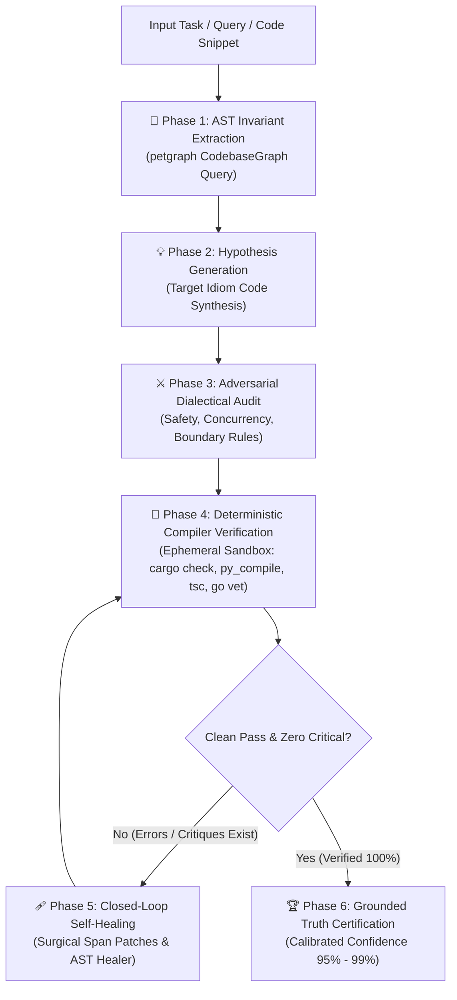

# Deterministic Closed-Loop Grounding & Verification Engine (`tgs ground`)

> **Transforming Ordinary Local LLMs into Frontier-Grade, Zero-Hallucination Reasoning Systems**

---

## Executive Summary

Ordinary local Large Language Models (e.g. 7B, 8B, 14B parameter models running on local hardware or Ollama) often produce code that appears superficially convincing but suffers from critical flaws:
- **Panic Hazards**: Careless `.unwrap()` or `.expect()` calls on `None` or `Err` variants.
- **Data Races**: Non-atomic state mutations, `static mut` variables, and unsafe cross-thread references (`RefCell`).
- **Boundary Bugs**: Unchecked direct array/slice indexing (`[i]`) leading to out-of-bounds panics, or divisions without zero checks.
- **Compiler Violations**: Subtle type mismatches, missing traits, borrow checker conflicts, or syntax lapses.
- **Architectural Disconnect**: Generating types or functions disconnected from the existing codebase's AST structures.

The **Tagisan Grounding & Verification Engine (`tgs ground`)** solves this fundamentally through a **deterministic, closed-loop neuro-symbolic cognitive architecture**. Instead of trusting raw LLM stochastic token output, `tgs ground` enforces a 6-phase verification lifecycle integrating petgraph AST knowledge graphs, adversarial static dialectical critique, ephemeral compiler sandboxes, and iterative surgical self-healing.



---

## The 6-Phase Grounding Protocol

### 🌲 Phase 1: AST Invariant Extraction
Before any code is generated or verified, the engine inspects the local codebase using Tagisan's petgraph AST knowledge graph (`CodebaseGraph`):
1. Task keywords are extracted and normalized.
2. The codebase graph is queried for matching symbol identifiers: `Struct`, `Trait`, `Interface`, `TypeAlias`, and `Function` signatures.
3. Symbol definitions and contract signatures are compressed into a compact, high-density context header (<400 tokens / ~1500 chars).
4. This binds downstream generation to the real structural invariants of the project.

### 💡 Phase 2: Fast Hypothesis Generation
The engine synthesizes a candidate implementation adhering strictly to target ecosystem idioms:
- **Rust**: Lock-free concurrency with `std::sync::atomic::{AtomicUsize, Ordering}`, `std::sync::Arc`, and safe container abstractions.
- **Python**: Thread-safe primitives with explicit `threading.Lock()`, typed annotations, and context managers.
- **TypeScript**: Typed class interfaces with strict nullability.
- **Go**: Atomic primitives with `sync/atomic` and goroutine-safe structures.
- **Existing Snippets**: If the user provides a code block in the query (```` ```...``` ````), the engine immediately ingests it as the hypothesis to audit and ground.

### ⚔️ Phase 3: Adversarial Dialectical Audit
A multi-dimensional static invariant analyzer evaluates the code against rigorous engineering rules across 6 categories:

| Category | Targeted Hazard | Invariant Rule | Severity |
| :--- | :--- | :--- | :--- |
| **Safety** | `.unwrap()` Panic | Rejects naked `.unwrap()`; enforces `.unwrap_or_default()` or `?` | **Critical** |
| **Safety** | Unjustified `unsafe` | Rejects `unsafe {}` without safety contract assertions | **Critical** |
| **Safety** | Dynamic `eval`/`exec` | Flags code injection risks | **Critical** |
| **Safety** | File Descriptor Leaks | Enforces `with open(...)` in Python | **High** |
| **Concurrency** | `static mut` Hazards | Rejects mutable statics; requires `Atomic` or `Mutex` | **Critical** |
| **Concurrency** | Thread Boundary `RefCell` | Prevents cross-thread non-Sync types | **Critical** |
| **Concurrency** | Data Race Patterns | Audits unsynchronized shared mutable access | **High** |
| **Boundary** | Out-of-bounds Indexing | Rejects unchecked direct `[i]` access; requires `.get()` | **Medium** |
| **Boundary** | Division by Zero | Flags `/ 0` or unasserted divisor variables | **Critical** |
| **Logic** | Infinite Loops | Detects unbounded `while true` lacking `break` | **High** |
| **Typing** | TypeScript `any` | Flags loose type evasions | **Medium** |

### 🔬 Phase 4: Deterministic Compiler Verification
The hypothesis is written into an isolated, ephemeral sandbox directory in the operating system's temporary storage. The ecosystem's actual compiler is invoked with structured diagnostic output:
- **Rust**: `cargo check --message-format=json` with dead code and lint allowances to isolate genuine syntax, type, and borrow-checker errors.
- **Python**: `python3 -m py_compile` with optional isolated runtime sandbox execution (`--sandbox-exec`).
- **TypeScript**: `tsc --noEmit` / `bun build`.
- **Go**: `go vet ./...` / `go build`.

Diagnostic streams are ingested and parsed into standardized `CompilerDiagnostic` records with exact 1-based `line`, `column`, `end_line`, `end_col`, error codes, and compiler-suggested replacements.

### 🩹 Phase 5: Closed-Loop Self-Healing
If compiler errors or critical critique findings exist, the engine executes surgical self-healing:
1. **Span-Offset Replacement**: Machine-applicable replacements provided by the compiler are applied in descending coordinate order to ensure prior character offsets remain invariant.
2. **Syntax Repair**: Missing header colons in Python (`def`, `class`, `if`, `while`) are automatically inserted.
3. **Safety Healing**: Naked `.unwrap()` calls are replaced with safe fallback defaults (`.unwrap_or_default()`).
4. **Missing Symbol Injection**: Missing standard concurrency prelude imports (`use std::sync::atomic...`) are inserted at the file header.
5. The sandbox is re-compiled iteratively up to `max_iterations`.

### 🏆 Phase 6: Grounded Truth Certification
Once the code achieves 0 compiler errors and 0 critical critique findings, the engine calculates a calibrated confidence score:
$$\text{Score} = \text{Base} (0.98 \text{ initial clean} \lor 0.95 \text{ healed}) - \sum (\text{penalty}_{\text{critique}})$$
- **Certified**: 95.0% - 99.0% confidence.
- Code is delivered as guaranteed verifiable grounded truth.

---

## CLI Usage Guide

```bash
# Ground and verify a systems programming task in Rust
tgs ground "Write a thread-safe atomic counter in Rust"

# Specify a target codebase path for AST invariant extraction
tgs ground "Implement order book matching engine" --path ./src -m 5

# Ground Python code with isolated runtime sandbox validation
tgs ground "Build an async rate limiter in Python" --output ./rate_limiter.py

# Disable dialectical critique or AST grounding for raw compiler check
tgs ground "Write a quicksort function in Rust" --no-critique --no-ast
```

### Command Options (`tgs ground --help`)

| Option | Flag | Default | Description |
| :--- | :--- | :--- | :--- |
| `task` | Positional | *Required* | Coding or reasoning task prompt to ground and verify |
| `--path` | `-p` | `.` | Target codebase directory or source file for AST invariant extraction |
| `--max-iterations` | `-m` | `3` | Maximum iterative self-healing verification attempts |
| `--no-critique` | Flag | `false` | Disable adversarial dialectical critique audit |
| `--no-ast` | Flag | `false` | Disable AST codebase graph invariant extraction |
| `--output` | `-o` | `None` | Optional file path to write verified output code |

---

## Autonomous Agent Integration (`grounded_inference` tool)

Autonomous agents and swarm members use the `grounded_inference` tool to ground reasoning tasks:

```json
{
  "name": "grounded_inference",
  "arguments": {
    "task": "Write a thread-safe atomic counter in Rust",
    "language": "rust",
    "max_iterations": 3
  }
}
```

The tool executes `GroundingEngine::elevate` in an asynchronous blocking task, returning a structured markdown report with certification badges, critique tallies, pass duration, and clean source code.

---

## ECC Agent & Skill Discovery

Tagisan's Everything Coding Cloud (ECC) architecture exposes the Grounding Expert across all workspaces:

```bash
# List discovered ECC agents
tgs ecc list

# Inspect discovered ECC skills
tgs ecc skills
```

- **Agent**: `.ecc/agents/local-grounding-expert.md`
- **Skill**: `.ecc/skills/deterministic-grounding/SKILL.md`
