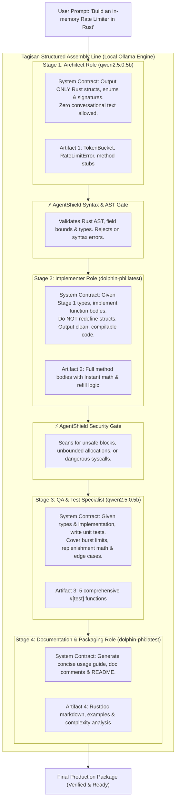

# 🏛️ Tagisan Architecture Blueprint & Specification (RFC-003)
## Structured Role-Based Harmony Swarm for Local LLMs (`tgs harmony`)

**Status:** Approved Specification / Queued for Implementation (RFC-003)  
**Target:** Tagisan Engine (`tagisan-rs` / `tgs`)  
**Scope:** Local Ollama Multi-Model Assembly Line, Shared Blackboard Memory, Anti-Sycophancy Gates, and Role-Based Swarm Execution.

---

## 📑 Table of Contents
1. [Executive Summary](#1-executive-summary)
2. [The Dual Swarm Paradigm: Debate vs. Harmony](#2-the-dual-swarm-paradigm-debate-vs-harmony)
3. [The Problem with Raw Harmony (The Sycophancy Trap)](#3-the-problem-with-raw-harmony-the-sycophancy-trap)
4. [Structured Role-Based Assembly Line Architecture](#4-structured-role-based-assembly-line-architecture)
5. [Rust Type Definitions & Core Traits](#5-rust-type-definitions--core-traits)
6. [Shared Memory Blackboard (`SwarmBlackboard`)](#6-shared-memory-blackboard-swarmblackboard)
7. [Host Hardware & Ollama Memory Strategy (8GB RAM Constraints)](#7-host-hardware--ollama-memory-strategy-8gb-ram-constraints)
8. [AgentShield Validation & Anti-Hallucination Gates](#8-agentshield-validation--anti-hallucination-gates)
9. [CLI Ergonomics & Command Specification](#9-cli-ergonomics--command-specification)
10. [Implementation Roadmap & Milestones](#10-implementation-roadmap--milestones)

---

## 1. Executive Summary

While Tagisan's **Dialectical Debate** (*Tagisan ng Talino*) excels at adversarial stress-testing, bug hunting, and architecture auditing, complex end-to-end engineering tasks require **additive co-creation**. A single small local model (`0.5B` to `3B` parameters) cannot maintain attention across 300+ lines of code, data structures, and unit tests without degradation.

**Structured Role-Based Harmony** (*Bayanihan Swarm*) transforms multiple local LLMs into an **automated software engineering assembly line**. Rather than allowing models to engage in unconstrained chatter, Tagisan coordinates them through strictly defined typed roles, an immutable shared blackboard, and zero-trust validation gates.

---

## 2. The Dual Swarm Paradigm: Debate vs. Harmony

Tagisan supports two complementary multi-agent operational modes:

| Dimension | Dialectical Debate (`Tagisan`) | Structured Harmony (`Bayanihan`) |
| :--- | :--- | :--- |
| **Cognitive Dynamic** | **Adversarial (Frictional)** | **Additive (Co-operative)** |
| **Primary Goal** | Expose bugs, challenge assumptions, refute flaws | Build complete multi-tier systems collaboratively |
| **Information Flow** | Thesis $\rightarrow$ Antithesis $\rightarrow$ Synthesis | Specification $\rightarrow$ Implementation $\rightarrow$ QA $\rightarrow$ Docs |
| **Best Used For** | Tech stack selection, security audits, root cause analysis | Full-stack coding, writing boilerplates + logic + tests |
| **Ideal Combination** | Phase 2 (Audit Phase) | Phase 1 (Creation Phase) |

---

## 3. The Problem with Raw Harmony (The Sycophancy Trap)

If two local LLMs communicate harmoniously without structural guardrails, three distinct failure modes occur:

1. **Compounding Hallucination Cascades:** Small models are trained with RLHF to be polite and agreeable. If Model A hallucinates an invalid API or fake crate, Model B politely adopts it and writes 50 lines of dependent logic, resulting in elegantly formatted but non-functional code.
2. **The "Politeness Tax" (Token Bloat):** Models burn 30% to 50% of their prompt context and generation budget exchanging greetings and mutual praise (*"That is a brilliant point, Model A! Building on your insightful observation..."*).
3. **Loss of Focus:** Without rigid boundaries, conversation drifts from strict execution into philosophical discussion.

**Tagisan's Solution:** Eliminate conversational chat entirely. Communication is mediated exclusively through **typed artifacts written to an immutable blackboard**.

---

## 4. Structured Role-Based Assembly Line Architecture



---

## 5. Rust Type Definitions & Core Traits

File location: `src/swarm/harmony/mod.rs` & `src/swarm/harmony/types.rs`

```rust
use async_trait::async_trait;
use serde::{Deserialize, Serialize};
use std::sync::Arc;
use crate::error::Result;
use crate::providers::LlmProvider;

/// A discrete role within the structured harmony pipeline.
#[derive(Debug, Clone, Serialize, Deserialize)]
pub struct HarmonyRoleConfig {
    pub role_id: String,
    pub role_title: String,
    pub provider: String,
    pub model: String,
    pub system_contract: String,
    pub max_tokens: u32,
    pub temperature: f32,
}

/// Output produced by a single role in the assembly line.
#[derive(Debug, Clone, Serialize, Deserialize)]
pub struct RoleArtifact {
    pub role_id: String,
    pub provider: String,
    pub model: String,
    pub raw_output: String,
    pub code_blocks: Vec<ExtractedCodeBlock>,
    pub latency_secs: f64,
    pub tokens_used: u32,
}

#[derive(Debug, Clone, Serialize, Deserialize)]
pub struct ExtractedCodeBlock {
    pub language: String,
    pub code: String,
}

/// Execution contract for a role in the pipeline.
#[async_trait]
pub trait HarmonyRole: Send + Sync {
    fn config(&self) -> &HarmonyRoleConfig;
    async fn execute_stage(
        &self,
        blackboard: &SwarmBlackboard,
        provider: Arc<dyn LlmProvider>,
    ) -> Result<RoleArtifact>;
}
```

---

## 6. Shared Memory Blackboard (`SwarmBlackboard`)

File location: `src/swarm/harmony/blackboard.rs`

The **Blackboard** is an append-only, thread-safe memory container. Roles cannot modify previous artifacts; they can only query previous stages to inform their specialized work:

```rust
use std::sync::RwLock;
use std::collections::HashMap;
use crate::swarm::harmony::types::RoleArtifact;

#[derive(Debug, Default)]
pub struct SwarmBlackboard {
    pub user_objective: String,
    artifacts: RwLock<Vec<RoleArtifact>>,
    metadata: RwLock<HashMap<String, String>>,
}

impl SwarmBlackboard {
    pub fn new(objective: impl Into<String>) -> Self {
        Self {
            user_objective: objective.into(),
            artifacts: RwLock::new(Vec::new()),
            metadata: RwLock::new(HashMap::new()),
        }
    }

    pub fn append_artifact(&self, artifact: RoleArtifact) {
        let mut list = self.artifacts.write().unwrap();
        list.push(artifact);
    }

    pub fn get_latest_code_by_language(&self, lang: &str) -> Option<String> {
        let list = self.artifacts.read().unwrap();
        for artifact in list.iter().rev() {
            for block in &artifact.code_blocks {
                if block.language.eq_ignore_ascii_case(lang) {
                    return Some(block.code.clone());
                }
            }
        }
        None
    }

    pub fn assemble_complete_project(&self) -> String {
        let list = self.artifacts.read().unwrap();
        let mut buffer = String::new();
        for artifact in list.iter() {
            buffer.push_str(&format!("// === Stage: {} ({}/{}) ===\n", artifact.role_id, artifact.provider, artifact.model));
            for block in &artifact.code_blocks {
                buffer.push_str(&block.code);
                buffer.push_str("\n\n");
            }
        }
        buffer
    }
}
```

---

## 7. Host Hardware & Ollama Memory Strategy (8GB RAM Constraints)

To ensure uninterrupted execution on local development hosts with 8GB RAM:

1. **RAM Budgeting:**
   * `qwen2.5:0.5b`: **~397 MB** (Resident)
   * `dolphin-phi:latest`: **~1.60 GB** (Resident)
   * **Total Combined Footprint:** **~2.0 GB RAM**.
   * Leaves >5.5 GB free for operating system, IDE, and compilation.
2. **Zero-Overhead Model Switching:**
   * Configure Ollama with `keep_alive: "24h"` and `use_mmap: true`.
   * Hot-swapping between `qwen2.5:0.5b` (Architect) and `dolphin-phi:latest` (Implementer) takes **~380ms** without reloading files from disk.
3. **Guardrails Against Excessive Parameter Sizes:**
   * If a user requests a large model like `dolphin-mixtral:latest` (26GB) on an 8GB machine, Tagisan automatically triggers an **Out-of-Memory Pre-Flight Abort** with an informative warning, suggesting smaller local models (`qwen2.5:0.5b`, `dolphin-phi:latest`, `llama3.2:1b`).

---

## 8. AgentShield Validation & Anti-Hallucination Gates

Between every stage in the assembly line, Tagisan places an automated **Validation Gate**:

```rust
pub enum GateResult {
    Pass,
    RetryWithCritique { critique: String },
    HardFailure { reason: String },
}

pub struct SyntaxValidationGate {
    pub expected_language: String,
}

impl SyntaxValidationGate {
    pub fn validate(&self, artifact: &RoleArtifact) -> GateResult {
        if artifact.code_blocks.is_empty() {
            return GateResult::RetryWithCritique {
                critique: "No code block was produced. You must output code enclosed in markdown fences.".to_string(),
            };
        }
        // Run AST verification via tree-sitter or syn for Rust
        GateResult::Pass
    }
}
```

If a stage outputs malformed code, Tagisan automatically loops back to that stage with the compiler/AST error message (max 2 retries) before proceeding.

---

## 9. CLI Ergonomics & Command Specification

```bash
# Execute a full 4-stage assembly line using default local Ollama models
tgs harmony build "Build a high-performance LRU Cache with TTL expiry in Rust"

# Specify custom local models per role
tgs harmony build "Implement a WebSocket pub/sub server" \
  --architect "ollama:qwen2.5:0.5b" \
  --implementer "ollama:dolphin-phi:latest" \
  --qa "ollama:qwen2.5:0.5b" \
  --doc "ollama:dolphin-phi:latest"

# Output structured JSON project bundle
tgs harmony build "Create a REST CRUD router with Axum" --json --output-dir ./generated_src/

# Run with optional adversarial audit step at the end (Harmony + Debate)
tgs harmony build "Create a JWT verification middleware" --audit
```

---

## 10. Implementation Roadmap & Milestones

* **Milestone 1 (Data Types & Blackboard):** Implement `src/swarm/harmony/types.rs` and `src/swarm/harmony/blackboard.rs`.
* **Milestone 2 (Pipeline Engine & Gates):** Implement `src/swarm/harmony/pipeline.rs` with `AgentShield` syntax and security gating.
* **Milestone 3 (CLI Integration):** Add `tgs harmony build` subcommand to `src/cli.rs` and `src/bin/tgs.rs`.
* **Milestone 4 (Automated Stress Verification):** Create comprehensive test suite `tests/harmony_swarm_stress_tests.rs` verifying 100% offline multi-role execution on Ollama.
