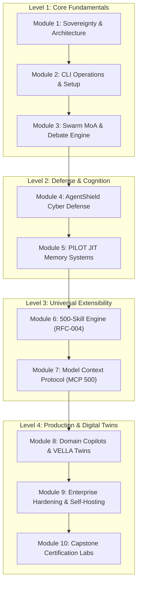
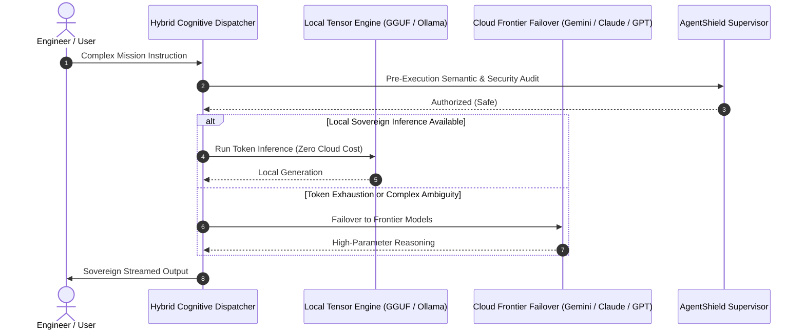
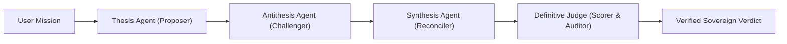
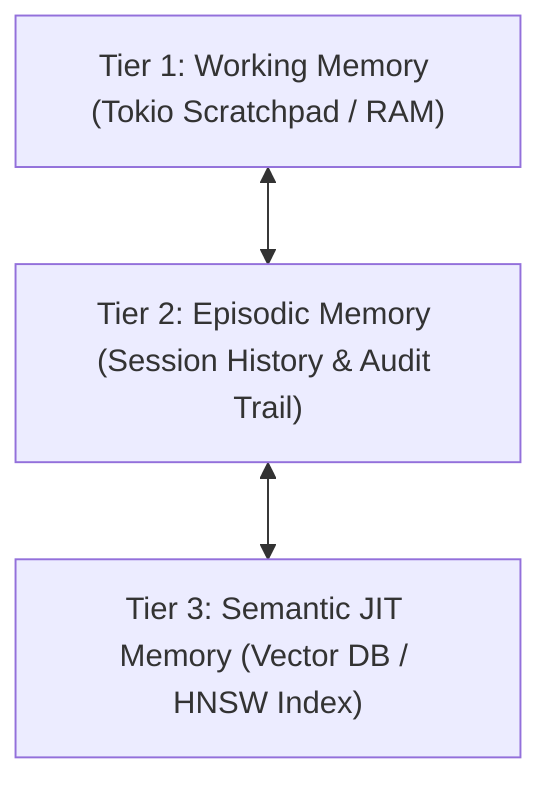
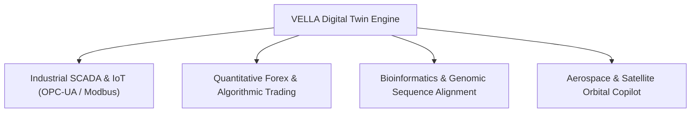

# Tagisan (`tgs`) Sovereign Autonomous Agent Architecture
# The Definitive Master Class Course: From Zero to Autonomous Production Architect

```
   ████████╗ ██████╗ ███████╗
   ╚══██╔══╝██╔════╝ ██╔════╝   TAGISAN (tgs / tagisan-rs)
      ██║   ██║  ███╗███████╗   The Sovereign Dual-Brain Agent Architecture
      ██║   ██║   ██║╚════██║   Production Master Class Course & Curriculum
      ██║   ╚██████╔╝███████║   Version: 2.0 (Dual-Brain / Swarm MoA / MCP 500)
      ╚═╝    ╚═════╝ ╚══════╝   
```

---

## Course Overview & Learning Objectives

Welcome to the **Tagisan (`tgs`) Master Class**. Tagisan is a production-grade, sovereign autonomous agent architecture engineered in high-performance Rust on top of the Tokio asynchronous runtime. Unlike single-threaded, Python-bound agent frameworks, Tagisan is designed for deterministic reliability, sub-millisecond dispatching, dual-brain hybrid inference (local GGUF/Ollama tensor engines + cloud frontier models), proactive AgentShield cyber defense, and native polyglot tool orchestration.

By the conclusion of this Master Class, you will master:
1. **Architectural Foundations**: The dual-brain paradigm, Tokio concurrency, Swarm Mixture-of-Agents (MoA), and dialectical debate consensus.
2. **CLI & Operational Ergonomics**: Seamless terminal navigation, interactive agent chat, automated code synthesis, and diagnostics.
3. **AgentShield Security Sandboxing**: Defending against prompt injections, dangerous syscalls, destructive shell constructs, and credential exfiltration.
4. **PILOT JIT Memory**: Multi-tiered working, episodic, and vector memory with sub-millisecond relevance routing.
5. **The 500 Dynamic Skills Ecosystem (RFC-004)**: Dynamic ingestion, skill chaining, and authoring sovereign capability packages.
6. **Model Context Protocol (MCP) Mastery**: Querying, installing, sandboxing, and orchestrating 500 web MCP plug-ins across 10 strategic domains.
7. **Domain Copilots & Digital Twin Engineering (VELLA)**: Deploying cyber-physical digital twins, quantitative finance models, genomic pipelines, and aerospace orbital trackers.
8. **Enterprise Production Hardening**: Self-hosting, GPU offloading, air-gapped air-lock architectures, and observability.

---

## Course Curriculum Map



---

## Module 1: Architectural Foundations of Sovereignty

### 1.1 The Sovereign Dual-Brain Paradigm
Modern autonomous agents struggle with two extremes:
- **Cloud-only reliance**: High token latency, uncontrollable API bills, privacy leakages, rate limits, and external outages.
- **Local-only constraints**: Limited parameter counts, reasoning degradation on edge cases, and high VRAM requirements.

Tagisan resolves this with **Dual-Brain Hybrid Failover**:



### 1.2 Rust + Tokio vs. Legacy Agent Frameworks
| Architectural Attribute | Legacy Python Frameworks (LangChain/CrewAI) | Tagisan (`tagisan-rs`) |
| :--- | :--- | :--- |
| **Language Runtime** | Python (GIL bottleneck, high RAM overhead) | **Native Rust (Zero-cost abstractions, zero GIL)** |
| **Concurrency** | ThreadPool / asyncio with event loop lag | **Tokio multi-threaded work-stealing reactor** |
| **Cold Start Latency** | 2,000ms – 6,000ms | **< 15ms native binary invocation** |
| **Memory Footprint** | 250MB – 1.2GB idle | **< 18MB idle memory consumption** |
| **Security Supervision** | Post-facto output filtering | **Kernel & AST level AgentShield interceptor** |
| **Tool Execution** | Unchecked subprocess piping | **Sandboxed Stdio/SSE with JSON-RPC 2.0 isolation** |

---

## Module 2: Installation, Environment Setup & CLI Ergonomics

### 2.1 System Prerequisites & Compilation
Tagisan is polyglot-accelerated:
- **Rust Toolchain**: `rustc` & `cargo` (1.78+ stable)
- **Bun Runtime**: Accelerated JS/TS execution engine (`bun`)
- **Python / uv**: Python execution engine (`uv` / `uvx` / `python 3.11+`)
- **Local LLM Server**: Ollama (v0.3.0+) or direct GGUF llama.cpp backend

```bash
# Clone the repository
git clone https://github.com/CharleGutierrez/tagisan.git
cd tagisan

# Compile native release binary
cargo build --release

# Symlink or add to your PATH
cp target/release/tgs ~/.local/bin/tgs   # Linux/macOS
# On Windows, target\release\tgs.exe is immediately usable in PowerShell
```

### 2.2 Configuration Hierarchy & Environment Variables
Tagisan loads configuration deterministically from:
1. Active CLI flags (`--config`, `--model`, `--temperature`)
2. Environment file: `.env`
3. Repository configuration: `.tagisan/config.toml` or `tagisan.toml`
4. Dynamic MCP configuration: `mcp.dynamic.json` or `.tagisan/mcp.json`

```ini
# .env Configuration Example
TAGISAN_PRIMARY_BRAIN="ollama/qwen2.5-coder:7b"
TAGISAN_FALLBACK_BRAIN="gemini-2.5-pro"
GEMINI_API_KEY="your_api_key_here"
TAGISAN_AGENTSHIELD_PROFILE="sandboxed"
TAGISAN_DISABLE_BUN_ACCELERATION=0
```

### 2.3 Essential CLI Command Atlas
```bash
# Launch interactive sovereign agent chat
tgs chat

# Execute a one-shot mission with automatic tool invocation
tgs run "Analyze all failing tests in src/ and generate fixes"

# Run a Dialectical Multi-Agent Debate
tgs debate "Should we migrate from Postgres to ScyllaDB for telemetry?"

# Search the 500-skill repository
tgs skills search "kubernetes"

# Search and install an MCP plugin
tgs mcp search "postgres"
tgs mcp add postgresql-advanced-admin-mcp

# Verify MCP environment and active security allowances
tgs mcp verify

# Serve Tagisan as an MCP Server over stdio for Claude Desktop / Cursor
tgs serve-mcp
```

---

## Module 3: Swarm MoA (Mixture of Agents) & Dialectical Debate

### 3.1 Overcoming Single-Agent Hallucinations
Single-prompt agents exhibit high confirmation bias on non-trivial architectural and security decisions. Tagisan implements **Hegelian Dialectical Debate**:



1. **Thesis Agent**: Formulates the optimal initial architecture or algorithm.
2. **Antithesis Agent**: Systematically probes failure modes, edge cases, race conditions, memory leaks, and attack vectors.
3. **Synthesis Agent**: Reconciles the conflicting viewpoints into a hardened proposal.
4. **Judge Agent**: Audits token metrics, latency, and logical consistency to render the binding verdict.

### 3.2 Executing Dialectical Debate in CLI
```bash
tgs debate \
  --proposer "Propose zero-downtime database migration strategy" \
  --challenger "Identify data loss, lock contention, and rollback risks" \
  --rounds 3
```

---

## Module 4: AgentShield Cyber Defense & Process Sandboxing

### 4.1 Threat Modeling in Autonomous Execution
When agents execute arbitrary tools or shell commands, they become targets for:
- **Indirect Prompt Injection**: Malicious instructions embedded in fetched webpages or READMEs.
- **Catastrophic Shell Commands**: Accidental or induced execution of destructive operations.
- **Credential Exfiltration**: Leaking `.env`, `~/.ssh/id_rsa`, or `/etc/shadow`.

### 4.2 How AgentShield Works
[`AgentShieldScanner`](file:///C:/Users/CharleOGutierrez/Documents/My%20AI%20Projects/tagisan/src/security/agentshield.rs) operates *before* any command or tool argument reaches the operating system kernel:

```rust
// AgentShield Pre-Execution Interception
let verdict = AgentShieldScanner::scan_tool_call(&tool, &parsed_args);
if let AgentShieldVerdict::Block { reason, threat_level } = verdict {
    eprintln!("Blocked by AgentShield [{threat_level:?}]: {reason}");
    return Err(SecurityError::Blocked);
}
```

> [!CAUTION]
> **Blocked Operations**:
> - Fork bombs (`:(){ :|:& };:`)
> - Root deletions (`rm -rf /`, `rmdir /s /q C:\`)
> - Block device writes (`mkfs`, `dd if=/dev/zero of=/dev/sda`)
> - Reverse shells (`nc -e /bin/sh`, `/dev/tcp/...`)
> - Accessing private keys and credential vaults (`~/.ssh/id_rsa`, `/etc/shadow`, AWS secret keys)

---

## Module 5: PILOT Just-In-Time Memory & Semantic Routing

### 5.1 The Memory Hierarchy
Tagisan splits memory into three distinct tiers:



1. **Working Memory**: In-flight token buffer holding active task state and tool scratchpads.
2. **Episodic Memory**: Fast SQLite/DuckDB backing session turns, previous successes, and rollback logs.
3. **Semantic Memory**: High-dimensional vector embeddings (Qdrant, Milvus, LanceDB, SQLite-vec) queried JIT via Reciprocal Rank Fusion (RRF).

---

## Module 6: Mastering the 500-Skill Ecosystem (RFC-004)

### 6.1 The RFC-004 Skill Package Standard
Every skill in Tagisan is defined under `.ecc/skills/<skill-name>/SKILL.md` with structured YAML frontmatter:

```markdown
---
name: kubernetes-cluster-auditor
description: Performs end-to-end security audits of Kubernetes pods, RBAC policies, and ingress rules.
tags: [devops, kubernetes, security, sre]
version: 1.0.0
entrypoint: scripts/audit.py
runtime: python
allow_network: true
---

# Instructions for the Sovereign Agent
When auditing clusters:
1. Query cluster state using `kubectl get pods -A -o json`.
2. Inspect for privileged containers (`securityContext.privileged: true`).
3. Report findings categorized by CVSS score.
```

### 6.2 Managing Skills with `tgs`
```bash
# List all 500 cataloged skills
tgs skills list

# Search for skills by topic
tgs skills search "forex"

# Inspect detailed skill specifications
tgs skills inspect "forex-risk-calculator"

# Invoke a specific skill within a mission
tgs run --skill "kubernetes-cluster-auditor" "Audit staging cluster"
```

---

## Module 7: Model Context Protocol (MCP 500) Mastery

### 7.1 The Model Context Protocol Architecture
MCP standardizes how LLM agents discover and invoke external tools and resources over JSON-RPC 2.0 stdio and SSE transports.

Tagisan features a **500-Plugin Sovereign Catalog** sourced exclusively from verified, non-GitHub enterprise registries (Smithery.ai, NPM Registry, PyPI, Glama.ai, Cloudflare Marketplace, Composio, Zapier, Postman, Hugging Face Hub, Ollama Protocol).

### 7.2 The 10 Strategic Domains
1. **Search, Web Scraping & Deep Research** (50 plugins)
2. **Relational Databases, OLAP & Event Streaming** (60 plugins)
3. **Vector Databases & Semantic Memory** (40 plugins)
4. **Cloud Infrastructure, Serverless & Edge** (55 plugins)
5. **DevOps, Containers & Kubernetes Orchestration** (50 plugins)
6. **Observability, APM & SRE Reliability** (45 plugins)
7. **Cybersecurity, EDR & Threat Defense** (50 plugins)
8. **Developer Productivity, Tracking & Collaboration** (50 plugins)
9. **Enterprise SaaS, CRM, FinTech & ERP** (50 plugins)
10. **AI Models, Multimodal & GPU Compute** (50 plugins)

### 7.3 Working with MCP in `tgs`
```bash
# Browse plugins by domain
tgs mcp catalog --domain "Database" --limit 5

# Search with relevance ranking
tgs mcp search "redis"

# Add a plugin to mcp.dynamic.json
tgs mcp add redis-cache-inspector-mcp

# Verify environment variables and AgentShield permissions
tgs mcp verify

# Execute a tool directly on an active MCP server
tgs mcp call redis-cache-inspector-mcp get_key '{"key":"session:1001"}'
```

---

## Module 8: Domain Copilots & Digital Twin Engineering (VELLA)

### 8.1 What is VELLA?
VELLA is Tagisan's specialized cyber-physical copilot engine providing real-time digital twin synchronization, telemetry forecasting, and safety-critical intervention across four mission domains:



### 8.2 Industrial SCADA & IoT
Reads industrial telemetry, tracks heat loads, checks valve states, and alerts on anomalous temperature excursions before physical degradation occurs.

### 8.3 Quantitative Forex & Risk Control
Computes tick spreads, margin utilization, lot size leverage, and value-at-risk (VaR) with automated algorithmic stop-loss protections.

### 8.4 Aerospace & Orbital Mechanics
Computes SGP4 two-line element (TLE) orbit propagation, ground track coordinates, Keplerian element drift, and ground station visibility windows.

---

## Module 9: Enterprise Hardening, Self-Hosting & Production Operations

### 9.1 Containerization & Air-Gapped Deployment
Deploying Tagisan inside isolated corporate VPCs or air-gapped server racks:

```dockerfile
FROM rust:1.78-bullseye as builder
WORKDIR /usr/src/tagisan
COPY . .
RUN cargo build --release

FROM debian:bullseye-slim
RUN apt-get update && apt-get install -y ca-certificates curl jq && rm -rf /var/lib/apt/lists/*
COPY --from=builder /usr/src/tagisan/target/release/tgs /usr/local/bin/tgs
COPY .ecc /etc/tagisan/.ecc
ENV TAGISAN_CONFIG_DIR="/etc/tagisan"
ENTRYPOINT ["/usr/local/bin/tgs"]
CMD ["serve-mcp"]
```

### 9.2 Observability & Telemetry
Tagisan outputs OpenTelemetry-compliant structured JSON logs. Every agent turn includes:
- `turn_id` and `correlation_id`
- Prompt and completion token counts
- Exact wall-clock latency (ms)
- AgentShield threat evaluation verdict
- Estimated monetary cost (USD)

---

## Module 10: Capstone Certification Labs

### Lab 1: Autonomous Self-Healing Code Pipeline
**Objective**: Configure Tagisan to monitor a Git repository, detect build errors, invoke a 3-round dialectical debate between a Refactoring Agent and a Security Auditor, apply the fixes, and verify tests pass.
- **Required Commands**: `tgs run`, `tgs debate`, `tgs mcp add github-pull-request-mcp`

### Lab 2: Enterprise Market Intelligence Swarm
**Objective**: Build a multi-agent swarm orchestrating Brave Search MCP, Postgres MCP, and Qdrant Vector Memory to monitor financial filings and synthesize real-time market risk summaries.
- **Required Commands**: `tgs mcp add brave-search-mcp`, `tgs mcp add qdrant-vector-db-mcp`, `tgs swarm`

### Lab 3: Zero-Trust Air-Gapped Security Cluster
**Objective**: Deploy Tagisan with zero external network access (`TAGISAN_AGENTSHIELD_PROFILE=strict`), local Ollama Qwen2.5-Coder model, and local SQLite-vec memory. Verify that AgentShield intercepts all simulated exfiltration attempts.
- **Required Verification**: `cargo test --test mcp_catalog_and_lifecycle_brutal_tests`

---

## Summary & Master Class Certification Checklist

To achieve Tagisan Certified Architect status:
- [ ] Successfully build and run `tagisan-rs` on your local workstation.
- [ ] Configure both local GGUF/Ollama and cloud failover inference engines.
- [ ] Execute an automated multi-round Dialectical Debate.
- [ ] Install and verify at least 3 MCP servers from the 500-plugin catalog.
- [ ] Create and register a custom RFC-004 skill under `.ecc/skills/`.
- [ ] Pass all 8 brutal security and transport tests in the test suite.
