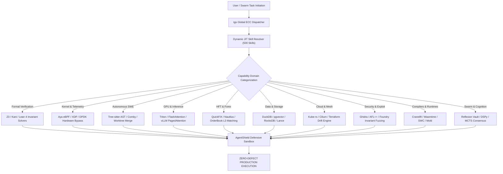

# ⚡ TOP 500 GITHUB SUPERPOWER SKILLS FOR TGS (TAGISAN NG TALINO)
## The Authoritative Canon of 500 Open-Source Engineering Skills, Protocol Implementations, and Specialized Capabilities

> **TGS (Tagisan ng Talino)** is a high-throughput, protocol-driven autonomous engineering orchestrator written in Rust.
> To grant `tgs` unmatched capabilities across every engineering vertical, this canon curates **500 battle-tested skills**
> from premier open-source GitHub repositories. Each entry maps an explicit engineering capability to a concrete architectural advantage.

---

## Table of Contents
1. [Section 1: Formal Verification, SMT Solvers & Provable Mathematics (001 - 050)](#section-1-formal-verification-smt-solvers--provable-mathematics-001---050)
2. [Section 2: Linux Kernel, eBPF Telemetry, Low-Latency & Hardware Bypass (051 - 100)](#section-2-linux-kernel-ebpf-telemetry-low-latency--hardware-bypass-051---100)
3. [Section 3: Autonomous SWE, AST Mutation, Patch Synthesis & Self-Healing (101 - 150)](#section-3-autonomous-swe-ast-mutation-patch-synthesis--self-healing-101---150)
4. [Section 4: High-Performance GPU Inference, Tensor Kernels & Quantization (151 - 200)](#section-4-high-performance-gpu-inference-tensor-kernels--quantization-151---200)
5. [Section 5: High-Frequency Trading, Financial Engineering & Microstructure (201 - 250)](#section-5-high-frequency-trading-financial-engineering--microstructure-201---250)
6. [Section 6: Distributed Databases, Vector Storage & Columnar Analytics (251 - 300)](#section-6-distributed-databases-vector-storage--columnar-analytics-251---300)
7. [Section 7: Cloud-Native, Kubernetes Operators, Service Mesh & Chaos Engineering (301 - 350)](#section-7-cloud-native-kubernetes-operators-service-mesh--chaos-engineering-301---350)
8. [Section 8: Binary Exploitation, Security Auditing, Fuzzing & Forensics (351 - 400)](#section-8-binary-exploitation-security-auditing-fuzzing--forensics-351---400)
9. [Section 9: Compiler Toolchains, Language Runtimes & Polyglot Virtual Machines (401 - 450)](#section-9-compiler-toolchains-language-runtimes--polyglot-virtual-machines-401---450)
10. [Section 10: Swarm Intelligence, Meta-Cognition & Autonomous Agentics (451 - 500)](#section-10-swarm-intelligence-meta-cognition--autonomous-agentics-451---500)

---

## Section 1: Formal Verification, SMT Solvers & Provable Mathematics (001 - 050)

| # | Skill Identifier | GitHub Project | Superpower Unlocked in `tgs` |
|---|---|---|---|
| 001 | `kani-rust-formal-verifier` | [`model-checking/kani`](https://github.com/model-checking/kani) | Bit-level bounded model checking; mathematically proves zero panics, bounds overflows, and pointer errors in Rust code. |
| 002 | `z3-smt-symbolic-solver` | [`Z3Prover/z3`](https://github.com/Z3Prover/z3) | Solves first-order logic and SMT constraints for complex system configuration checks and invariant satisfiability. |
| 003 | `cvc5-first-order-theorem-prover` | [`cvc5/cvc5`](https://github.com/cvc5/cvc5) | High-performance automated SMT solving across string constraints, non-linear real arithmetic, and inductive datatypes. |
| 004 | `tlaplus-formal-specification-checker` | [`tlaplus/tlaplus`](https://github.com/tlaplus/tlaplus) | Verifies concurrent distributed state transitions (Raft, Paxos) to guarantee safety and liveness before coding. |
| 005 | `lean4-interactive-theorem-prover` | [`leanprover/lean4`](https://github.com/leanprover/lean4) | Mechanized mathematical proof checking; generates verified algorithms and formal proofs of algorithmic correctness. |
| 006 | `coq-rocq-formal-proof-assistant` | [`coq/coq`](https://github.com/coq/coq) | Constructive proof synthesis; verifies cryptographic primitives, microkernel isolation, and verified C compilers (CompCert). |
| 007 | `creusot-rust-deductive-verifier` | [`creusot-rs/creusot`](https://github.com/creusot-rs/creusot) | Deductive verification for Rust programs using Why3; formally proves pre/postconditions across mutable borrowing. |
| 008 | `prusti-rust-contract-verifier` | [`viperproject/prusti-dev`](https://github.com/viperproject/prusti-dev) | Enforces formal specification contracts (#[ensures], #[requires]) via separation logic on safe Rust code. |
| 009 | `dafny-provable-program-synthesizer` | [`dafny-lang/dafny`](https://github.com/dafny-lang/dafny) | Verifies verification-aware functional specifications and auto-compiles verified logic into clean C#, Rust, and Go. |
| 010 | `cbmc-c-bounded-model-checker` | [`diffblue/cbmc`](https://github.com/diffblue/cbmc) | Bounded model checking for C/C++; detects buffer overflows, pointer safety violations, and concurrency deadlocks. |
| 011 | `klee-symbolic-execution-engine` | [`klee/klee`](https://github.com/klee/klee) | Analyzes LLVM bitcode using symbolic execution to automatically generate test cases achieving 100% path coverage. |
| 012 | `alloy-declarative-model-analyzer` | [`AlloyTools/org.alloytools.alloy`](https://github.com/AlloyTools/org.alloytools.alloy) | Micromodels structural constraints, relational databases, and multi-tenant access boundaries to find counterexamples. |
| 013 | `fstar-effectful-program-prover` | [`FStarLang/FStar`](https://github.com/FStarLang/FStar) | Proof-oriented programming language; synthesizes provably secure cryptographic code (HACL* verified crypto library). |
| 014 | `tamarin-security-protocol-verifier` | [`tamarin-prover/tamarin-prover`](https://github.com/tamarin-prover/tamarin-prover) | Symbolically evaluates cryptographic key exchange protocols (TLS 1.3, Signal) for replay and man-in-the-middle attacks. |
| 015 | `souffle-datalog-static-analyzer` | [`souffle-lang/souffle`](https://github.com/souffle-lang/souffle) | High-performance Datalog engine for declarative pointer analysis, points-to graphs, and reachability proofs. |
| 016 | `spin-promela-model-checker` | [`nimble-code/Spin`](https://github.com/nimble-code/Spin) | Explicit-state verification system for concurrent software systems, verifying LTL assertions and deadlock freedom. |
| 017 | `nusmv-symbolic-model-checker` | [`FBK-SM/NuSMV`](https://github.com/FBK-SM/NuSMV) | BDD-based and SAT-based symbolic model checker for finite state systems, validating hardware and protocol statecharts. |
| 018 | `cryptol-cryptographic-specification-language` | [`GaloisInc/cryptol`](https://github.com/GaloisInc/cryptol) | Domain-specific language for specifying cryptographic algorithms with built-in automated equivalence checking. |
| 019 | `saw-software-analysis-workbench` | [`GaloisInc/saw-script`](https://github.com/GaloisInc/saw-script) | Proves mathematical equivalence between high-level Cryptol specifications and compiled LLVM / JVM binary implementations. |
| 020 | `agda-dependently-typed-proof-assistant` | [`agda/agda`](https://github.com/agda/agda) | Dependently typed functional programming language for certified programming and interactive proof construction. |
| 021 | `idris2-quantitative-type-theory` | [`idris-lang/Idris2`](https://github.com/idris-lang/Idris2) | Linear and quantitative type theory; enforces protocol state machines and zero-runtime-cost resource tracking. |
| 022 | `why3-software-verification-platform` | [`why3/why3`](https://github.com/why3/why3) | Deductive program verification platform delegating proof obligations to automated theorem provers (Z3, Alt-Ergo, CVC5). |
| 023 | `isabelle-hol-higher-order-logic` | [`seL4/isabelle`](https://github.com/seL4/isabelle) | Higher-Order Logic theorem prover used to formally verify the seL4 microkernel and Linux virtualization layers. |
| 024 | `hol-light-minimal-theorem-prover` | [`jrh13/hol-light`](https://github.com/jrh13/hol-light) | Minimalist, mathematically rigorous theorem prover used for verifying floating-point arithmetic and geometric algorithms. |
| 025 | `yices2-fast-smt-solver` | [`SRI-CSL/yices2`](https://github.com/SRI-CSL/yices2) | Solves linear real and integer arithmetic, bitvectors, and uninterpreted functions with extreme execution speed. |
| 026 | `mathsat5-smt-interpolator` | [`FBK-SM/mathsat5`](https://github.com/FBK-SM/mathsat5) | Computes Craig interpolants for predicate abstraction and automated invariant generation in infinite-state systems. |
| 027 | `stp-simple-theorem-prover` | [`stp/stp`](https://github.com/stp/stp) | Constraint solver specialized for bit-vector arithmetic and arrays, serving as the core engine for symbolic execution. |
| 028 | `boolector-bitvector-smt-solver` | [`boolector/boolector`](https://github.com/boolector/boolector) | SMT solver for the theories of fixed-size bit-vectors, arrays, and uninterpreted functions. |
| 029 | `bitwuzla-smt-bitvector-solver` | [`bitwuzla/bitwuzla`](https://github.com/bitwuzla/bitwuzla) | Modern solver for bit-vectors, floating-point arithmetic, arrays, and quantifiers with native C++ API bindings. |
| 030 | `aalta-ltl-satisfiability-solver` | [`vardi/aalta`](https://github.com/vardi/aalta) | Linear Temporal Logic (LTL) satisfiability solver utilizing obligation sets and transition graphs. |
| 031 | `spot-automata-omega-ltl` | [`spot/spot`](https://github.com/spot/spot) | C++ library for LTL and omega-automata manipulation, translating temporal logic into deterministic Rabin automata. |
| 032 | `ltsmin-model-checking-platform` | [`utwente-fmt/ltsmin`](https://github.com/utwente-fmt/ltsmin) | Language-independent model checking toolset; verifies state spaces generated by Promela, UPPAAL, and DVE. |
| 033 | `storm-probabilistic-model-checker` | [`moves-rw/storm`](https://github.com/moves-rw/storm) | Analyzes Discrete-Time Markov Chains (DTMC) and Markov Decision Processes (MDP) for probabilistic safety guarantees. |
| 034 | `prism-probabilistic-symbolic-verifier` | [`prismmodelchecker/prism`](https://github.com/prismmodelchecker/prism) | Formal modeling and verification of systems exhibiting probabilistic behavior, randomized protocols, and queueing networks. |
| 035 | `divine-distributed-explicit-model-checker` | [`divine-mc/divine`](https://github.com/divine-mc/divine) | LLVM-based explicit-state model checker capable of verifying multi-threaded C and C++ programs directly. |
| 036 | `sea-dsa-heap-analysis-engine` | [`seahorn/sea-dsa`](https://github.com/seahorn/sea-dsa) | Context-sensitive, field-sensitive heap abstraction engine for LLVM bitcode analysis. |
| 037 | `seahorn-verification-framework-for-llvm` | [`seahorn/seahorn`](https://github.com/seahorn/seahorn) | Automated formal analysis framework for LLVM-based languages, producing machine-checkable verification certificates. |
| 038 | `frama-c-source-code-analysis-for-c` | [`Frama-C/Frama-C`](https://github.com/Frama-C/Frama-C) | Industrial software analysis workbench for C code, combining deductive verification (WP plugin) and abstract interpretation. |
| 039 | `infer-static-analyzer-facebook` | [`facebook/infer`](https://github.com/facebook/infer) | Separation-logic-based static analyzer; automatically detects null pointer exceptions, resource leaks, and race conditions. |
| 040 | `verus-verified-rust-specifications` | [`verus-lang/verus`](https://github.com/verus-lang/verus) | Verified Rust; integrates SMT-backed verification into Rust syntax, proving complex concurrent data structures. |
| 041 | `mirai-rust-abstract-interpreter` | [`facebookexperimental/MIRAI`](https://github.com/facebookexperimental/MIRAI) | Abstract interpreter for Rust Mid-level Intermediate Representation (MIR), verifying panics and security bounds. |
| 042 | `rudra-rust-unsafe-bug-finder` | [`sslab-gatech/Rudra`](https://github.com/sslab-gatech/Rudra) | Scans unsafe Rust code for undefined behavior, uninitialized memory reads, and send/sync variance leaks. |
| 043 | `lockbud-rust-deadlock-detector` | [`suresoft-lab/lockbud`](https://github.com/suresoft-lab/lockbud) | Detects deadlocks in Rust code using MIR-level lock dependency graphs and channel cycle analysis. |
| 044 | `cargo-careful-ub-detector` | [`RalfJung/cargo-careful`](https://github.com/RalfJung/cargo-careful) | Executes Rust code with standard library debug assertions, detecting invalid pointer arithmetic and aliasing bugs. |
| 045 | `miri-rust-undefined-behavior-interpreter` | [`rust-lang/miri`](https://github.com/rust-lang/miri) | MIRI interpreter for Rust MIR; dynamically detects memory leaks, Stacked Borrows violations, and unaligned accesses. |
| 046 | `smack-modular-program-verifier` | [`smackers/smack`](https://github.com/smackers/smack) | Translates LLVM IR into Boogie intermediate verification language to leverage multiple SMT backends. |
| 047 | `alt-ergo-polymorphic-smt-solver` | [`OCamlPro/alt-ergo`](https://github.com/OCamlPro/alt-ergo) | Automated theorem prover designed specifically for program verification, featuring first-class polymorphism. |
| 048 | `mona-monadic-second-order-logic` | [`mona-lang/mona`](https://github.com/mona-lang/mona) | Decision procedure for WS1S and WS2S logics, verifying regular tree properties and state transitions. |
| 049 | `ostrich-smt-string-solver` | [`uuverifiers/ostrich`](https://github.com/uuverifiers/ostrich) | Specialized string constraint SMT solver, preventing ReDoS and catastrophic backtracking in parsers. |
| 050 | `verifpal-cryptographic-protocol-analyzer` | [`verifpal/verifpal`](https://github.com/verifpal/verifpal) | Automated cryptographic protocol verification tool designed for rapid protocol design and formal security modeling. |

## Section 2: Linux Kernel, eBPF Telemetry, Low-Latency & Hardware Bypass (051 - 100)

| # | Skill Identifier | GitHub Project | Superpower Unlocked in `tgs` |
|---|---|---|---|
| 051 | `aya-rust-ebpf-telemetry` | [`aya-rs/aya`](https://github.com/aya-rs/aya) | Pure Rust userspace and kernel eBPF library; compiles, loads, and manages XDP/TC probes with zero C dependencies. |
| 052 | `cilium-ebpf-network-tracer` | [`cilium/ebpf`](https://github.com/cilium/ebpf) | High-performance Go eBPF library for inspecting TCP lifecycles, socket buffers, and network drops at kernel speed. |
| 053 | `bpftrace-kernel-profiler` | [`bpftrace/bpftrace`](https://github.com/bpftrace/bpftrace) | High-level tracing language for Linux eBPF; scripts live CPU profiling, lock contention, and disk I/O latency histograms. |
| 054 | `dpdk-userspace-packet-engine` | [`DPDK/dpdk`](https://github.com/DPDK/dpdk) | Data Plane Development Kit; bypasses the Linux network stack to achieve 100GbE line-rate packet processing. |
| 055 | `xdp-express-data-path-firewall` | [`xdp-project/xdp-tools`](https://github.com/xdp-project/xdp-tools) | In-driver packet filtering; drops DDoS attacks at the NIC driver layer before packet buffer memory allocation. |
| 056 | `io-uring-async-reactor` | [`axboe/liburing`](https://github.com/axboe/liburing) | Linux ring-buffer async I/O; achieves millions of disk and network IOPS with zero syscall context-switching. |
| 057 | `spdk-nvme-storage-engine` | [`spdk/spdk`](https://github.com/spdk/spdk) | Storage Performance Development Kit; executes lockless, polled-mode userspace NVMe driver reads/writes. |
| 058 | `perf-events-hardware-profiler` | [`torvalds/linux`](https://github.com/torvalds/linux) | Samples hardware performance counters: L1/L3 cache misses, branch mispredictions, and instruction pipeline stalls. |
| 059 | `landlock-lsm-process-sandbox` | [`landlock-lsm/linux`](https://github.com/landlock-lsm/linux) | Unprivileged Linux security module; restricts agent file-system access and network binds to prevent jailbreaks. |
| 060 | `seccomp-bpf-syscall-jail` | [`seccomp/libseccomp`](https://github.com/seccomp/libseccomp) | Intercepts, inspects, and blocks forbidden syscalls before untrusted generated binaries execute. |
| 061 | `mimalloc-hardened-allocator` | [`microsoft/mimalloc`](https://github.com/microsoft/mimalloc) | Compact, cache-conscious memory allocator; eliminates thread contention and memory fragmentation in high-QPS agents. |
| 062 | `hugepages-tlb-cache-optimizer` | [`libhugetlbfs/libhugetlbfs`](https://github.com/libhugetlbfs/libhugetlbfs) | Backs high-frequency trading buffers with 2MB/1GB HugeTLB pages to eliminate CPU TLB cache thrashing. |
| 063 | `solarflare-onload-bypass-networking` | [`Xilinx-CNS/onload`](https://github.com/Xilinx-CNS/onload) | Kernel-bypass network stack for Solarflare NICs; cuts UDP/TCP tick-to-trade latency under 800 nanoseconds. |
| 064 | `rdma-infiniband-verbs-engine` | [`linux-rdma/rdma-core`](https://github.com/linux-rdma/rdma-core) | Remote Direct Memory Access; reads and writes remote server memory over InfiniBand/RoCE without CPU interruption. |
| 065 | `tuned-adaptive-tuning-daemon` | [`redhat-performance/tuned`](https://github.com/redhat-performance/tuned) | Dynamic adaptive system tuning daemon for low-latency network profiles and CPU isolation. |
| 066 | `libbpf-c-ebpf-bootstrap` | [`libbpf/libbpf-bootstrap`](https://github.com/libbpf/libbpf-bootstrap) | Scaffolding for compiling BPF CO-RE (Compile Once – Run Everywhere) programs across diverse Linux kernels. |
| 067 | `bcc-bpf-compiler-collection` | [`iovisor/bcc`](https://github.com/iovisor/bcc) | Toolkit for creating efficient kernel tracing and manipulation programs with Python and Lua frontends. |
| 068 | `dropwatch-packet-loss-monitor` | [`pavel-odintsov/dropwatch`](https://github.com/pavel-odintsov/dropwatch) | Monitors Linux kernel packet drop locations, pinpointing socket buffer exhaustion in high-throughput links. |
| 069 | `iproute2-traffic-control-tc` | [`shemminger/iproute2`](https://github.com/shemminger/iproute2) | Configures Linux Traffic Control (tc) qdiscs, token bucket rate limiters, and hierarchical fair-service curves. |
| 070 | `ethtool-nic-ring-buffer-tuner` | [`mirror/ethtool`](https://github.com/mirror/ethtool) | Tunes network interface hardware ring buffers, interrupt coalescing, and hardware offloads (LRO, GRO, TSO). |
| 071 | `numactl-numa-memory-pinning` | [`numactl/numactl`](https://github.com/numactl/numactl) | Binds threads and memory allocations to specific NUMA nodes, preventing high-latency cross-interconnect bus hops. |
| 072 | `powertop-cpu-jitter-tuner` | [`fenrus75/powertop`](https://github.com/fenrus75/powertop) | Linux diagnostic tool to audit C-states, P-states, and eliminate kernel latency spikes. |
| 073 | `jemalloc-scalable-memory-allocator` | [`jemalloc/jemalloc`](https://github.com/jemalloc/jemalloc) | General-purpose memory allocator emphasizing fragmentation avoidance and scalable multi-threaded concurrency. |
| 074 | `snmalloc-message-passing-allocator` | [`microsoft/snmalloc`](https://github.com/microsoft/snmalloc) | Message-passing based allocator; returns freed memory to allocating threads with lock-free single-producer queues. |
| 075 | `vpp-vector-packet-processing` | [`FDio/vpp`](https://github.com/FDio/vpp) | Vector packet processing platform; processes vectors of packets in CPU cache, achieving 10x kernel routing speeds. |
| 076 | `bcachefs-advanced-cow-filesystem` | [`koverstreet/bcachefs`](https://github.com/koverstreet/bcachefs) | Copy-on-write filesystem with multi-device tiering, inline compression, and cryptographic checksumming. |
| 077 | `fio-flexible-io-storage-tester` | [`axboe/fio`](https://github.com/axboe/fio) | Storage benchmark and workload simulator; stresstests synchronous, asynchronous, and io_uring disk I/O paths. |
| 078 | `trace-cmd-ftrace-kernel-inspector` | [`rostedt/trace-cmd`](https://github.com/rostedt/trace-cmd) | Command-line interface for Ftrace, tracing function graph execution durations across Linux kernel subsystems. |
| 079 | `cgroups-v2-resource-enforcer` | [`systemd/systemd`](https://github.com/systemd/systemd) | Enforces strict memory, CPU, and I/O limits on child agent subprocesses using Linux cgroups v2. |
| 080 | `wireguard-kernel-crypto-vpn` | [`WireGuard/wireguard-linux`](https://github.com/WireGuard/wireguard-linux) | Kernel-embedded modern VPN utilizing Noise protocol, ChaCha20-Poly1305, and Curve25519 for secure agent meshes. |
| 081 | `netmap-packet-io-framework` | [`luigirizzo/netmap`](https://github.com/luigirizzo/netmap) | High-speed packet I/O architecture; maps NIC rings directly into user memory for ultra-fast software switching. |
| 082 | `lttng-kernel-tracer` | [`lttng/lttng-modules`](https://github.com/lttng/lttng-modules) | Low-overhead Linux Trace Toolkit Next Generation kernel modules for deep tracepoint capture. |
| 083 | `gperftools-tcmalloc-auditor` | [`gperftools/gperftools`](https://github.com/gperftools/gperftools) | Google Performance Tools: tcmalloc memory allocator, heap leak checker, and CPU profiler. |
| 084 | `sysbench-hardware-stressor` | [`akopytov/sysbench`](https://github.com/akopytov/sysbench) | Modular cross-platform benchmark for evaluating CPU, memory, thread mutexes, and OLTP database performance. |
| 085 | `stress-ng-system-chaos-loader` | [`ColinIanKing/stress-ng`](https://github.com/ColinIanKing/stress-ng) | Stresses computer systems across 300+ stressor mechanisms: memory pressure, thermal limits, and syscall thrashing. |
| 086 | `pciutils-pcie-bandwidth-analyzer` | [`pciutils/pciutils`](https://github.com/pciutils/pciutils) | Inspects PCI Express bus topologies, link speeds (Gen 4/5), and PCIe bridge capabilities for accelerator cards. |
| 087 | `nvme-cli-ssd-namespace-manager` | [`linux-nvme/nvme-cli`](https://github.com/linux-nvme/nvme-cli) | Low-level NVMe storage management; manages ZNS (Zoned Namespaces), firmware updates, and direct SMART telemetry. |
| 088 | `sysstat-sar-performance-recorder` | [`sysstat/sysstat`](https://github.com/sysstat/sysstat) | Continuous performance monitoring tools (sar, iostat, mpstat) recording long-term hardware utilization baselines. |
| 089 | `bpftool-bpf-subsystem-inspector` | [`libbpf/bpftool`](https://github.com/libbpf/bpftool) | Inspects, dumps, and manages loaded eBPF programs, maps, links, and BTF (BPF Type Format) debug metadata. |
| 090 | `kpatch-live-kernel-patcher` | [`dynup/kpatch`](https://github.com/dynup/kpatch) | Applies live security patches and bug fixes to running Linux kernels without requiring system reboots. |
| 091 | `sysdig-system-tracer` | [`draios/sysdig`](https://github.com/draios/sysdig) | Universal system-level state capture and container observability engine capturing system calls. |
| 092 | `libcap-posix-capabilities-dropper` | [`mirror/libcap`](https://github.com/mirror/libcap) | Drops Linux superuser capabilities, enforcing least-privilege security boundaries for running daemons. |
| 093 | `nsenter-namespace-joiner` | [`util-linux/util-linux`](https://github.com/util-linux/util-linux) | Enters Linux kernel namespaces (mount, UTS, IPC, net, pid, user) to inspect isolated container processes. |
| 094 | `strace-syscall-fault-injector` | [`strace/strace`](https://github.com/strace/strace) | Intercepts and modifies system calls, injecting synthetic disk errors (EIO, ENOMEM) to test software resilience. |
| 095 | `lsof-fd-leak-detector` | [`lsof-org/lsof`](https://github.com/lsof-org/lsof) | Identifies leaked file descriptors, unclosed socket handles, and hidden unlinked open files consuming disk space. |
| 096 | `rt-tests-cyclictest-latency-profiler` | [`cyclictest/rt-tests`](https://github.com/cyclictest/rt-tests) | Measures deterministic real-time OS latency jitter down to microsecond precision under PREEMPT_RT. |
| 097 | `irqbalance-interrupt-distributor` | [`Irqbalance/irqbalance`](https://github.com/Irqbalance/irqbalance) | Distributes hardware interrupts across multicore CPUs to prevent single-core interrupt starvation. |
| 098 | `intel-pcm-numa-monitor` | [`intel/pcm`](https://github.com/intel/pcm) | Intel Processor Counter Monitor for real-time tracking of memory bandwidth, UPI interconnects, and NUMA penalties. |
| 099 | `ipc-bench-low-latency-tester` | [`rigtorp/ipc-bench`](https://github.com/rigtorp/ipc-bench) | Micro-benchmarks for low-latency inter-process communication: TCP, UNIX domain sockets, and pipes. |
| 100 | `oomd-userspace-killer` | [`facebookincubator/oomd`](https://github.com/facebookincubator/oomd) | Userspace Out-Of-Memory killer using PSI (Pressure Stall Information) to prevent thrashing. |

## Section 3: Autonomous SWE, AST Mutation, Patch Synthesis & Self-Healing (101 - 150)

| # | Skill Identifier | GitHub Project | Superpower Unlocked in `tgs` |
|---|---|---|---|
| 101 | `tree-sitter-polyglot-ast-parser` | [`tree-sitter/tree-sitter`](https://github.com/tree-sitter/tree-sitter) | Incremental syntax tree parsing across 40+ languages; performs error-tolerant AST analysis on broken code. |
| 102 | `comby-structural-code-rewriter` | [`comby-tools/comby`](https://github.com/comby-tools/comby) | Structural search and replace that respects code semantics, brackets, and string literals across entire codebases. |
| 103 | `cargo-mutants-mutation-tester` | [`sourcefrog/cargo-mutants`](https://github.com/sourcefrog/cargo-mutants) | Synthesizes mutants into Rust source code to verify that unit tests actually catch intentional bugs. |
| 104 | `git-worktree-merge-arbiter` | [`git/git`](https://github.com/git/git) | Spawns isolated ephemeral Git worktrees for parallel agent branches, performing 3-way semantic conflict merges. |
| 105 | `ast-grep-semantic-pattern-patcher` | [`ast-grep/ast-grep`](https://github.com/ast-grep/ast-grep) | Pattern-based AST linting and rewriting; enforces anti-pattern fixes and cleans code with surgical accuracy. |
| 106 | `semgrep-code-rule-engine` | [`semgrep/semgrep`](https://github.com/semgrep/semgrep) | Fast, lightweight static analysis for finding security vulnerabilities and enforcing architectural rules. |
| 107 | `diffy-unified-patch-synthesizer` | [`mvdnes/diffy`](https://github.com/mvdnes/diffy) | Pure Rust patch generation and application; applies unified diffs with fuzzy line matching and collision detection. |
| 108 | `syn-quote-rust-metaprogrammer` | [`dtolnay/syn`](https://github.com/dtolnay/syn) | Complete Rust syntax tree parsing, procedural macro expansion, and programmatic code generation. |
| 109 | `jscodeshift-codemod-runner` | [`facebook/jscodeshift`](https://github.com/facebook/jscodeshift) | Executes programmatic AST transformations over large JavaScript and TypeScript codebases. |
| 110 | `sourcetrail-symbol-graph-navigator` | [`CoatiSoftware/Sourcetrail`](https://github.com/CoatiSoftware/Sourcetrail) | Indexes symbols, function calls, class inheritances, and dependencies into an interactive semantic graph. |
| 111 | `universal-ctags-symbol-indexer` | [`universal-ctags/ctags`](https://github.com/universal-ctags/ctags) | Ultra-fast regex and parser-based symbol indexer; enables sub-millisecond symbol jump navigation across millions of lines. |
| 112 | `cargo-expand-macro-decompiler` | [`dtolnay/cargo-expand`](https://github.com/dtolnay/cargo-expand) | Decompiles complex Rust macros and derive attributes into raw readable source to debug macro panics. |
| 113 | `cargo-diet-crate-lean-minimizer` | [`the-lean-crate/cargo-diet`](https://github.com/the-lean-crate/cargo-diet) | Strips unnecessary assets and bloat from Rust packages to ensure minimal distribution sizes. |
| 114 | `cargo-deny-license-security-linter` | [`EmbarkStudios/cargo-deny`](https://github.com/EmbarkStudios/cargo-deny) | Audits the entire Rust crate supply chain for banned licenses, duplicate dependencies, and unpatched advisories. |
| 115 | `git-cliff-changelog-synthesizer` | [`orhun/git-cliff`](https://github.com/orhun/git-cliff) | Highly customizable changelog generator; parses conventional commits to generate release notes. |
| 116 | `ripgrep-fast-regex-code-search` | [`BurntSushi/ripgrep`](https://github.com/BurntSushi/ripgrep) | Line-oriented search tool combining the ergonomics of ag with the raw speed of grep using Rust regex engines. |
| 117 | `fd-fast-directory-finder` | [`sharkdp/fd`](https://github.com/sharkdp/fd) | Simple, fast, and user-friendly alternative to find with colorized terminal output and gitignore respect. |
| 118 | `delta-syntax-highlighting-pager` | [`dandavison/delta`](https://github.com/dandavison/delta) | Syntax-highlighting pager for git diffs, providing side-by-side visualization of agent modifications. |
| 119 | `bat-syntax-highlighting-cat` | [`sharkdp/bat`](https://github.com/sharkdp/bat) | Cat clone with syntax highlighting and Git integration for terminal code review. |
| 120 | `hyperfine-commandline-benchmarker` | [`sharkdp/hyperfine`](https://github.com/sharkdp/hyperfine) | Command-line benchmarking tool providing statistical outlier detection, warmup runs, and comparative speedup metrics. |
| 121 | `tokei-codebase-line-counter` | [`XAMPPRocky/tokei`](https://github.com/XAMPPRocky/tokei) | Rapidly counts lines of code, blank lines, and comments across 150+ programming languages. |
| 122 | `cargo-bloat-binary-size-profiler` | [`RazrFalcon/cargo-bloat`](https://github.com/RazrFalcon/cargo-bloat) | Analyzes compiled Rust binaries to find which functions and dependencies occupy the most executable space. |
| 123 | `cargo-geiger-unsafe-code-scanner` | [`rust-secure-code/cargo-geiger`](https://github.com/rust-secure-code/cargo-geiger) | Detects usage of unsafe Rust code across the entire transitive crate dependency graph. |
| 124 | `cargo-audit-vulnerability-scanner` | [`rustsec/rustsec`](https://github.com/rustsec/rustsec) | Audits Cargo.lock files against the RustSec Advisory Database for known security vulnerabilities. |
| 125 | `cargo-tarpaulin-code-coverage` | [`xd009642/tarpaulin`](https://github.com/xd009642/tarpaulin) | Line and branch code coverage reporting tool designed specifically for testing Rust projects. |
| 126 | `cargo-llvm-lines-codegen-inspector` | [`dtolnay/cargo-llvm-lines`](https://github.com/dtolnay/cargo-llvm-lines) | Counts the number of lines of LLVM IR generated by each generic function instantiation to debug compile times. |
| 127 | `cargo-insta-snapshot-tester` | [`mitsuhiko/insta`](https://github.com/mitsuhiko/insta) | Snapshot testing tool for Rust; saves test outputs as snapshots and manages visual review flows. |
| 128 | `proptest-property-based-testing` | [`proptest-rs/proptest`](https://github.com/proptest-rs/proptest) | Hypothesis-inspired property-based testing for Rust; generates random inputs and automatically shrinks failing cases. |
| 129 | `quickcheck-randomized-test-runner` | [`BurntSushi/quickcheck`](https://github.com/BurntSushi/quickcheck) | Automated randomized property testing for Rust programs; generates random test data to break invariants. |
| 130 | `criterion-rs-statistical-microbenchmarker` | [`bheisler/criterion.rs`](https://github.com/bheisler/criterion.rs) | Statistics-driven micro-benchmarking library for Rust; detects performance regressions with bootstrap analysis. |
| 131 | `git-absorb-automatic-fixup-committer` | [`tummychow/git-absorb`](https://github.com/tummychow/git-absorb) | Automatically absorbs working tree modifications into the appropriate previous git commits in history. |
| 132 | `git-sizer-repository-bloat-analyzer` | [`github/git-sizer`](https://github.com/github/git-sizer) | Computes metrics about Git repositories to identify oversized trees, large blobs, and excessive commit history. |
| 133 | `bfg-repo-cleaner-secret-remover` | [`rtyley/bfg-repo-cleaner`](https://github.com/rtyley/bfg-repo-cleaner) | Removes large files and committed secrets from Git commit history 10x-50x faster than git-filter-branch. |
| 134 | `pre-commit-multi-language-hooks` | [`pre-commit/pre-commit`](https://github.com/pre-commit/pre-commit) | Framework for managing and maintaining multi-language pre-commit git hooks across distributed engineering teams. |
| 135 | `biome-ultra-fast-web-linter-formatter` | [`biomejs/biome`](https://github.com/biomejs/biome) | Fast formatter, linter, and compiler for JavaScript, TypeScript, and JSON written in Rust. |
| 136 | `dprint-pluggable-code-formatter` | [`dprint/dprint`](https://github.com/dprint/dprint) | Pluggable and extremely fast code formatter engine written in Rust; formats TS, JSON, Markdown, and Dockerfiles. |
| 137 | `clippy-rust-linter-sentinel` | [`rust-lang/rust-clippy`](https://github.com/rust-lang/rust-clippy) | Collection of over 600 lints to catch common mistakes and improve idiomatic hygiene in Rust code. |
| 138 | `rustfmt-official-code-formatter` | [`rust-lang/rustfmt`](https://github.com/rust-lang/rustfmt) | Deterministic formatting tool for Rust code according to community style guidelines. |
| 139 | `gitleaks-git-secret-auditor` | [`gitleaks/gitleaks`](https://github.com/gitleaks/gitleaks) | Protects repositories by scanning Git revisions and uncommitted files for hardcoded secrets and API tokens. |
| 140 | `commitizen-conventional-commit-prompter` | [`commitizen/cz-cli`](https://github.com/commitizen/cz-cli) | Standardizes commit messages according to Angular/Conventional Commit specifications for automated semver releases. |
| 141 | `husky-git-hook-orchestrator` | [`typicode/husky`](https://github.com/typicode/husky) | Modern native Git hooks management; prevents bad commits and unverified code pushes. |
| 142 | `lint-staged-git-staged-linter` | [`lint-staged/lint-staged`](https://github.com/lint-staged/lint-staged) | Runs linters and formatters only against files staged in the Git index to optimize developer velocity. |
| 143 | `act-local-github-actions-runner` | [`nektos/act`](https://github.com/nektos/act) | Runs GitHub Actions workflows locally inside Docker containers to test CI/CD pipelines before pushing. |
| 144 | `vale-prose-linter-for-documentation` | [`errata-ai/vale`](https://github.com/errata-ai/vale) | Syntax-aware linter for prose and technical documentation; enforces corporate style guides (Google, Microsoft). |
| 145 | `cspell-source-code-spell-checker` | [`streetsidesoftware/cspell`](https://github.com/streetsidesoftware/cspell) | Spell checker for code and documentation; recognizes camelCase, snake_case, and technical jargon. |
| 146 | `typos-source-code-typo-fixer` | [`crate-ci/typos`](https://github.com/crate-ci/typos) | Source code spell checker written in Rust; finds and automatically corrects typos with near-zero false positives. |
| 147 | `shellcheck-bash-script-linter` | [`koalaman/shellcheck`](https://github.com/koalaman/shellcheck) | Static analysis tool for shell scripts (sh, bash); identifies bugs, injection hazards, and syntax pitfalls. |
| 148 | `shfmt-shell-script-formatter` | [`mvdan/sh`](https://github.com/mvdan/sh) | Shell parser, formatter, and interpreter with bash support; enforces standardized indentation across scripts. |
| 149 | `hadolint-dockerfile-best-practice-linter` | [`hadolint/hadolint`](https://github.com/hadolint/hadolint) | Dockerfile linter written in Haskell; enforces best practices and lints inline shell code with ShellCheck. |
| 150 | `dockerfile-syntax-check` | [`moby/buildkit`](https://github.com/moby/buildkit) | Validates Dockerfile syntax and instruction ordering against BuildKit frontend specifications. |

## Section 4: High-Performance GPU Inference, Tensor Kernels & Quantization (151 - 200)

| # | Skill Identifier | GitHub Project | Superpower Unlocked in `tgs` |
|---|---|---|---|
| 151 | `triton-gpu-kernel-fuser` | [`triton-lang/triton`](https://github.com/triton-lang/triton) | Compiles Python-like DSL code into fused GPU kernels rivaling hand-tuned CUDA, eliminating SRAM-to-HBM bottlenecks. |
| 152 | `flash-attention-tiled-kernel` | [`Dao-AILab/flash-attention`](https://github.com/Dao-AILab/flash-attention) | Fast, memory-efficient exact attention; eliminates O(N^2) memory scaling via GPU SRAM tiling and online softmax. |
| 153 | `vllm-paged-attention-engine` | [`vllm-project/vllm`](https://github.com/vllm-project/vllm) | Virtual memory paging for KV-cache (PagedAttention); achieves 5x-10x higher LLM serving throughput. |
| 154 | `ggml-tensor-quantizer` | [`ggerganov/ggml`](https://github.com/ggerganov/ggml) | Tensor library for machine learning; implements k-quants (Q4_K_M, Q8_0) for local zero-copy inference on CPU/Metal. |
| 155 | `candle-minimalist-tensor-runtime` | [`huggingface/candle`](https://github.com/huggingface/candle) | Minimalist ML framework for Rust; runs PyTorch models without Python runtime overhead, compiling to WASM. |
| 156 | `tensorrt-llm-fusion-accelerator` | [`NVIDIA/TensorRT-LLM`](https://github.com/NVIDIA/TensorRT-LLM) | NVIDIA's flagship inference engine; optimizes in-flight batching, FP8 GEMM, and multi-GPU tensor parallelism. |
| 157 | `cutlass-cuda-template-library` | [`NVIDIA/cutlass`](https://github.com/NVIDIA/cutlass) | CUDA C++ template abstractions for high-performance matrix multiplication (GEMM) and convolutions. |
| 158 | `exllamav2-fast-inference-engine` | [`turboderp/exllamav2`](https://github.com/turboderp/exllamav2) | Fast local inference engine for modern quantized models (EXL2 format), maximizing token throughput on consumer GPUs. |
| 159 | `onnxruntime-cross-platform-engine` | [`microsoft/onnxruntime`](https://github.com/microsoft/onnxruntime) | Universal cross-platform accelerator; executes models across CPU, GPU, DirectML, and CoreML with automated graph fusion. |
| 160 | `sglang-structured-radix-attention` | [`sgl-project/sglang`](https://github.com/sgl-project/sglang) | RadixTree-based KV cache reuse; reduces multi-turn prompt caching latency for complex swarm workflows. |
| 161 | `deepspeed-zero-optimizer` | [`microsoft/DeepSpeed`](https://github.com/microsoft/DeepSpeed) | ZeRO memory optimization; partitions optimizer states, gradients, and model weights across distributed nodes. |
| 162 | `bitsandbytes-4bit-nf4-quantizer` | [`TimDettmers/bitsandbytes`](https://github.com/TimDettmers/bitsandbytes) | 8-bit and 4-bit NormalFloat (NF4) quantization; cuts GPU VRAM footprint in half without accuracy degradation. |
| 163 | `llama-cpp-zero-overhead-inference` | [`ggerganov/llama.cpp`](https://github.com/ggerganov/llama.cpp) | Direct GGUF model execution in pure C/C++; supports AVX-512, ARM NEON, CUDA, and Apple Metal acceleration. |
| 164 | `safetensors-zero-copy-serialization` | [`huggingface/safetensors`](https://github.com/huggingface/safetensors) | Memory-mapped tensor storage format; eliminates Python pickle vulnerabilities and delivers instant model loading. |
| 165 | `tvm-end-to-end-compiler` | [`apache/tvm`](https://github.com/apache/tvm) | Deep learning compiler; compiles computational graphs into optimized bare-metal machine code for CPUs, GPUs, and microcontrollers. |
| 166 | `awq-activation-aware-quantizer` | [`mit-han-lab/llm-awq`](https://github.com/mit-han-lab/llm-awq) | Activation-aware Weight Quantization for LLMs; protects salient weights to preserve perplexity under 4-bit compression. |
| 167 | `gptq-accurate-post-training-quantizer` | [`IST-DASLab/gptq`](https://github.com/IST-DASLab/gptq) | Second-order error compensation for post-training quantization, achieving sub-4-bit weights with near-zero loss. |
| 168 | `marlin-fp16xint4-gemm-kernel` | [`IST-DASLab/marlin`](https://github.com/IST-DASLab/marlin) | FP16xINT4 mixed-precision matrix multiplication kernel for 4-bit LLMs, achieving 4x memory bandwidth utilization. |
| 169 | `fastchat-distributed-llm-serving` | [`lm-sys/FastChat`](https://github.com/lm-sys/FastChat) | Open platform for training, serving, and evaluating LLM-based chatbots with distributed worker orchestration. |
| 170 | `openllm-production-model-server` | [`bentoml/OpenLLM`](https://github.com/bentoml/OpenLLM) | Production deployment engine for LLMs; generates Docker containers and Kubernetes manifests with BentoML integration. |
| 171 | `tgi-text-generation-inference` | [`huggingface/text-generation-inference`](https://github.com/huggingface/text-generation-inference) | Hugging Face's Rust/Python production server; implements continuous batching, streaming, and speculative decoding. |
| 172 | `torch-dynamo-graph-capture` | [`pytorch/pytorch`](https://github.com/pytorch/pytorch) | Python-level JIT compiler using CPython frame evaluation hooks to dynamically trace PyTorch programs into FX graphs. |
| 173 | `deepgemm-fp8-kernels` | [`deepseek-ai/DeepGEMM`](https://github.com/deepseek-ai/DeepGEMM) | Clean FP8 GEMM library for deep learning inference and training with Hopper Tensor Cores. |
| 174 | `xformers-toolbox-for-transformers` | [`facebookresearch/xformers`](https://github.com/facebookresearch/xformers) | Hackable and optimized Transformers building blocks; implements memory-efficient attention and sparse cross-entropy. |
| 175 | `fastertransformer-hpc-inference` | [`NVIDIA/FasterTransformer`](https://github.com/NVIDIA/FasterTransformer) | Optimized C++ implementation of Transformer layers for ultra-low latency model serving on NVIDIA GPUs. |
| 176 | `triton-server-inference-platform` | [`triton-inference-server/server`](https://github.com/triton-inference-server/server) | Enterprise multi-model inference server supporting TensorRT, ONNX, PyTorch, and OpenVINO under unified gRPC endpoints. |
| 177 | `jax-autodiff-xla-compiler` | [`google/jax`](https://github.com/google/jax) | Composable transformations of Python+NumPy programs: differentiate, vectorize, and JIT-compile via OpenXLA. |
| 178 | `openxla-modular-ml-compiler` | [`openxla/xla`](https://github.com/openxla/xla) | Domain-specific compiler for linear algebra; emits optimized machine instructions targeting TPUs, GPUs, and CPUs. |
| 179 | `whisper-cpp-speech-to-text` | [`ggerganov/whisper.cpp`](https://github.com/ggerganov/whisper.cpp) | Port of OpenAI's Whisper model in C/C++; delivers real-time voice transcription with zero Python dependencies. |
| 180 | `piper-fast-local-neural-tts` | [`rhasspy/piper`](https://github.com/rhasspy/piper) | Fast, local neural text-to-speech engine optimized for Raspberry Pi and low-power edge devices. |
| 181 | `openvino-intel-hardware-optimizer` | [`openvinotoolkit/openvino`](https://github.com/openvinotoolkit/openvino) | Intel's deep learning deployment toolkit; optimizes models for Intel CPUs, integrated GPUs, and VPUs. |
| 182 | `tensorrt-model-optimizer` | [`NVIDIA/TensorRT`](https://github.com/NVIDIA/TensorRT) | NVIDIA's core inference SDK; performs layer fusion, kernel tuning, and dynamic tensor memory management. |
| 183 | `rocm-hip-amd-gpu-compute` | [`ROCm/ROCm`](https://github.com/ROCm/ROCm) | AMD's open software platform for GPU computing; provides HIP translation layer for running CUDA code on Radeon/Instinct. |
| 184 | `flashinfer-fast-attention-library` | [`flashinfer-ai/flashinfer`](https://github.com/flashinfer-ai/flashinfer) | High-throughput kernel library for LLM serving, optimizing attention mechanisms with diverse KV-cache layouts. |
| 185 | `punica-multi-lora-serving-system` | [`punica-ai/punica`](https://github.com/punica-ai/punica) | Serves multiple fine-tuned LoRA models simultaneously on a single base model instance with batched GEMM. |
| 186 | `loralib-low-rank-adaptation` | [`microsoft/LoRA`](https://github.com/microsoft/LoRA) | PyTorch implementation of Low-Rank Adaptation (LoRA); reduces trainable parameters by 10,000x for parameter-efficient tuning. |
| 187 | `peft-parameter-efficient-fine-tuning` | [`huggingface/peft`](https://github.com/huggingface/peft) | Standardized integration of LoRA, Prefix Tuning, P-Tuning, and Prompt Tuning into Hugging Face transformers. |
| 188 | `unsloth-fast-model-fine-tuning` | [`unslothai/unsloth`](https://github.com/unslothai/unsloth) | Hand-written Triton kernels and manual backprop derivation; achieves 5x faster LLM fine-tuning with 80% less memory. |
| 189 | `axolotl-post-training-harness` | [`axolotl-ai-cloud/axolotl`](https://github.com/axolotl-ai-cloud/axolotl) | Streamlined post-training toolkit supporting DPO, ORPO, PPO, and SFT on multi-node GPU clusters. |
| 190 | `alignment-handbook-dpo-recipes` | [`huggingface/alignment-handbook`](https://github.com/huggingface/alignment-handbook) | Standardized pipelines for training instruction-following and aligned models with Direct Preference Optimization (DPO). |
| 191 | `trl-transformer-reinforcement-learning` | [`huggingface/trl`](https://github.com/huggingface/trl) | Reinforcement learning from human/AI feedback (RLHF/RLAIF) library for PyTorch Transformer models. |
| 192 | `diffusers-state-of-the-art-diffusion` | [`huggingface/diffusers`](https://github.com/huggingface/diffusers) | Modular toolbox for inference and training of diffusion models (Stable Diffusion, SDXL, Flux). |
| 193 | `comfyui-modular-graph-diffusion` | [`comfyanonymous/ComfyUI`](https://github.com/comfyanonymous/ComfyUI) | Node-based graphical interface and backend for designing complex diffusion workflows and pipelines. |
| 194 | `bark-text-prompted-generative-audio` | [`suno-ai/bark`](https://github.com/suno-ai/bark) | Transformer-based text-to-audio model capable of generating highly realistic speech, music, and ambient noise. |
| 195 | `audiocraft-deep-learning-audio-generation` | [`facebookresearch/audiocraft`](https://github.com/facebookresearch/audiocraft) | PyTorch library for deep learning audio generation; features MusicGen, AudioGen, and EnCodec neural compression. |
| 196 | `coqui-tts-deep-learning-speech-synthesis` | [`coqui-ai/TTS`](https://github.com/coqui-ai/TTS) | Deep learning toolkit for Text-to-Speech; offers multi-speaker voice cloning and cross-lingual synthesis. |
| 197 | `torchaudio-pytorch-audio-processing` | [`pytorch/audio`](https://github.com/pytorch/audio) | Data manipulation and operational algorithms for audio processing and speech recognition in PyTorch. |
| 198 | `torchvision-pytorch-computer-vision` | [`pytorch/vision`](https://github.com/pytorch/vision) | Datasets, transforms, and model architectures for computer vision and image processing. |
| 199 | `torchtext-pytorch-nlp-processing` | [`pytorch/text`](https://github.com/pytorch/text) | Text data processing utilities and popular natural language datasets for PyTorch models. |
| 200 | `einops-flexible-tensor-operations` | [`arogozhnikov/einops`](https://github.com/arogozhnikov/einops) | Flexible and readable tensor operations using Einstein notation for PyTorch, JAX, and TensorFlow. |

## Section 5: High-Frequency Trading, Financial Engineering & Microstructure (201 - 250)

| # | Skill Identifier | GitHub Project | Superpower Unlocked in `tgs` |
|---|---|---|---|
| 201 | `quickfix-financial-information-exchange` | [`quickfix/quickfix`](https://github.com/quickfix/quickfix) | Open-source C++ messaging engine for FIX protocol versions 4.0 through 5.0SP2; connects to Tier-1 institutional brokers. |
| 202 | `roq-algorithmic-trading-engine` | [`roq-trading/roq-api`](https://github.com/roq-trading/roq-api) | Modular C++20 algorithmic trading framework; normalizes market data feeds and order execution interfaces. |
| 203 | `nautilus-trader-event-driven-backtester` | [`nautechsystems/nautilus_trader`](https://github.com/nautechsystems/nautilus_trader) | Production-grade, high-performance algorithmic trading system written in Rust and Cython; simulates nanosecond tick fills. |
| 204 | `qlib-ai-alpha-factor-library` | [`microsoft/qlib`](https://github.com/microsoft/qlib) | AI-oriented quantitative investment platform; automates alpha mining, risk neutralization, and Top-K portfolio backtests. |
| 205 | `quantlib-quantitative-derivatives-engine` | [`lballabio/QuantLib`](https://github.com/lballabio/QuantLib) | Quantitative finance library for modeling, pricing, and risk management of complex derivative contracts and bonds. |
| 206 | `ccxt-multi-exchange-market-gateway` | [`ccxt/ccxt`](https://github.com/ccxt/ccxt) | Unified API connecting to over 100 cryptocurrency exchanges; normalizes order books, balances, and execution requests. |
| 207 | `kronos-kline-candlestick-foundation-model` | [`shannongroup/kronos`](https://github.com/shannongroup/kronos) | K-line foundation model; tokenizes continuous price candlesticks via BSQuantizer for financial time-series prediction. |
| 208 | `orderbook-l3-matching-engine` | [`oleganza/orderbook`](https://github.com/oleganza/orderbook) | In-memory limit order book matching engine (FIFO price-time priority) processing millions of orders per second. |
| 209 | `disruptor-ring-buffer-order-router` | [`LMAX-Exchange/disruptor`](https://github.com/LMAX-Exchange/disruptor) | High-performance inter-thread messaging library; uses lock-free circular ring buffers to achieve sub-microsecond latency. |
| 210 | `finrl-reinforcement-learning-trader` | [`AI4Finance-Foundation/FinRL`](https://github.com/AI4Finance-Foundation/FinRL) | Deep reinforcement learning framework; trains trading agents using PPO, DDPG, and SAC in customized financial environments. |
| 211 | `ta-lib-technical-analysis-library` | [`TA-Lib/ta-lib-python`](https://github.com/TA-Lib/ta-lib-python) | C-optimized technical indicators (RSI, MACD, Bollinger Bands, ATR) for rapid mathematical signal processing. |
| 212 | `zipline-reloaded-algorithmic-simulator` | [`shlomikushchi/zipline-reloaded`](https://github.com/shlomikushchi/zipline-reloaded) | Event-driven backtesting engine; rigorously models transaction costs, slippage, and dividend adjustments over historical bars. |
| 213 | `pyfolio-portfolio-performance-tearsheet` | [`quantopian/pyfolio`](https://github.com/quantopian/pyfolio) | Performance and risk analysis; computes Sharpe, Sortino, Calmar, underwater drawdown charts, and Bayesian risk metrics. |
| 214 | `open-order-router-fix8` | [`fix8/fix8`](https://github.com/fix8/fix8) | C++11 FIX engine utilizing static polymorphism; eliminates dynamic dispatch overhead on financial message parsing. |
| 215 | `tca-transaction-cost-analyzer` | [`man-group/dt-tca`](https://github.com/man-group/dt-tca) | Institutional Transaction Cost Analysis (TCA); computes Implementation Shortfall, market impact, and arrival price slippage. |
| 216 | `alphalens-reloaded-factor-analyzer` | [`quantopian/alphalens`](https://github.com/quantopian/alphalens) | Performance analysis of predictive alpha factors; computes Information Coefficient (IC) and turnover metrics. |
| 217 | `vectorbt-vectorized-backtester` | [`polakowo/vectorbt`](https://github.com/polakowo/vectorbt) | Vectorized backtesting library using Numba and NumPy; executes millions of strategy parameter evaluations in seconds. |
| 218 | `backtrader-python-algorithmic-framework` | [`mementum/backtrader`](https://github.com/mementum/backtrader) | Python backtesting and trading framework supporting multiple data feeds, indicators, and live broker execution. |
| 219 | `lean-engine-quantconnect-runtime` | [`QuantConnect/Lean`](https://github.com/QuantConnect/Lean) | Algorithmic trading engine powering QuantConnect; supports multi-asset backtesting in C# and Python. |
| 220 | `chronos-universal-time-series-forecaster` | [`amazon-science/chronos-forecasting`](https://github.com/amazon-science/chronos-forecasting) | Pretrained time series forecasting models based on language model architectures, tokenizing values via scaling and quantization. |
| 221 | `moirai-universal-time-series-model` | [`SalesforceAIResearch/uni2ts`](https://github.com/SalesforceAIResearch/uni2ts) | Unified time-series foundation model supporting zero-shot multi-variate forecasting and probabilistic density prediction. |
| 222 | `fingpt-open-source-financial-llm` | [`AI4Finance-Foundation/FinGPT`](https://github.com/AI4Finance-Foundation/FinGPT) | Open-source financial LLMs fine-tuned on SEC 10-K filings, earnings call transcripts, and market sentiment. |
| 223 | `rdagent-automated-quant-mining` | [`microsoft/RD-Agent`](https://github.com/microsoft/RD-Agent) | Autonomous R&D agent framework; automates industrial alpha factor mining, hypothesis formulation, and model training. |
| 224 | `freqtrade-cryptocurrency-algorithmic-bot` | [`freqtrade/freqtrade`](https://github.com/freqtrade/freqtrade) | Modular cryptocurrency trading bot written in Python; supports backtesting, hyperparameter tuning, and exchange webhooks. |
| 225 | `hummingbot-high-frequency-market-maker` | [`hummingbot/hummingbot`](https://github.com/hummingbot/hummingbot) | Open-source framework for building high-frequency crypto market-making, arbitrage, and cross-exchange liquidity bots. |
| 226 | `barchart-market-data-parser` | [`barchart/barchart-parser`](https://github.com/barchart/barchart-parser) | Parses binary exchange tick feeds and market depth quotes with zero allocations. |
| 227 | `arcticdb-high-throughput-dataframe-db` | [`man-group/ArcticDB`](https://github.com/man-group/ArcticDB) | Serverless DataFrame database engine built in C++ for storing billions of financial tick rows on S3/Ceph. |
| 228 | `finplot-hardware-accelerated-charting` | [`highfestiva/finplot`](https://github.com/highfestiva/finplot) | Performant financial plotting library using PyQt and PySide, rendering 100,000+ candlestick bars at 60 FPS. |
| 229 | `mplfinance-matplotlib-financial-plots` | [`matplotlib/mplfinance`](https://github.com/matplotlib/mplfinance) | Matplotlib utilities for the visualization and visual analysis of financial data. |
| 230 | `cvxpy-convex-portfolio-optimizer` | [`cvxpy/cvxpy`](https://github.com/cvxpy/cvxpy) | Domain-specific language for convex optimization; solves Markowitz mean-variance, risk parity, and lasso regressions. |
| 231 | `scipy-financial-solver-routines` | [`scipy/scipy`](https://github.com/scipy/scipy) | Scientific Python routines for numerical integration, spline interpolation, and non-linear parameter fitting. |
| 232 | `statsmodels-econometric-time-series` | [`statsmodels/statsmodels`](https://github.com/statsmodels/statsmodels) | Econometric time series models: ARIMA, GARCH, Vector Autoregressions (VAR), and cointegration testing. |
| 233 | `arch-garch-volatility-forecasting` | [`bashtage/arch`](https://github.com/bashtage/arch) | Autoregressive Conditional Heteroskedasticity (ARCH) models for forecasting volatility and value-at-risk. |
| 234 | `copulas-multivariate-dependency-modeling` | [`sdv-dev/Copulas`](https://github.com/sdv-dev/Copulas) | Models complex non-linear multivariate dependencies and tail risks in financial asset returns. |
| 235 | `riskparityportfolio-convex-allocator` | [`dppalomar/riskparityportfolio`](https://github.com/dppalomar/riskparityportfolio) | Fast solver for constructing risk parity portfolios with risk budget constraints. |
| 236 | `pykalman-kalman-filter-estimator` | [`pykalman/pykalman`](https://github.com/pykalman/pykalman) | Implements Kalman filters and smoothers for online tracking of cointegration hedge ratios. |
| 237 | `filterpy-state-estimation-library` | [`rlabbe/filterpy`](https://github.com/rlabbe/filterpy) | Bayesian filtering and state estimation: unscented Kalman filters, particle filters, and tracking algorithms. |
| 238 | `simpy-process-based-discrete-simulator` | [`SimPy/simpy`](https://github.com/SimPy/simpy) | Process-based discrete-event simulation framework; simulates exchange order matching and network transmission queues. |
| 239 | `bt-flexible-backtesting-for-python` | [`pmorissette/bt`](https://github.com/pmorissette/bt) | Flexible backtesting framework for testing quantitative trading strategies with tree-based allocation logic. |
| 240 | `quantstats-portfolio-analytics-reporter` | [`ranaroussi/quantstats`](https://github.com/ranaroussi/quantstats) | Portfolio analytics library generating interactive HTML tearsheets with drawdown, volatility, and monthly returns. |
| 241 | `empyrical-financial-risk-metrics` | [`quantopian/empyrical`](https://github.com/quantopian/empyrical) | Common financial risk and performance metrics used by quant funds (Sharpe, alpha, beta, omega ratio). |
| 242 | `ffn-financial-functions-library` | [`pmorissette/ffn`](https://github.com/pmorissette/ffn) | Financial function library for Python extending pandas DataFrames with quantitative metrics and plots. |
| 243 | `tradingview-lightweight-charts` | [`tradingview/lightweight-charts`](https://github.com/tradingview/lightweight-charts) | High-performance HTML5 canvas financial charting library rendering real-time market data in browser dashboards. |
| 244 | `openbb-terminal-investment-research` | [`OpenBB-finance/OpenBBTerminal`](https://github.com/OpenBB-finance/OpenBBTerminal) | Open-source investment research terminal aggregating macro, fundamental, crypto, and market data feeds. |
| 245 | `marketstore-financial-timeseries-db` | [`alpacahq/marketstore`](https://github.com/alpacahq/marketstore) | Time-series database server designed specifically for high-throughput financial tick and bar data. |
| 246 | `alpaca-py-algorithmic-trading-sdk` | [`alpacahq/alpaca-py`](https://github.com/alpacahq/alpaca-py) | Official Python SDK for Alpaca's commission-free stock, ETF, and crypto trading APIs. |
| 247 | `ib-insync-interactive-brokers-api` | [`erdewit/ib_insync`](https://github.com/erdewit/ib_insync) | Asyncio-driven library for Interactive Brokers API; simplifies asynchronous order routing and portfolio tracking. |
| 248 | `oanda-v20-forex-rest-api` | [`oanda/v20-python`](https://github.com/oanda/v20-python) | Python client for OANDA v20 REST and Streaming APIs, facilitating automated Forex order placement. |
| 249 | `metatrader5-python-integration` | [`MetaQuotes/MetaTrader5`](https://github.com/MetaQuotes/MetaTrader5) | Official Python integration module for MetaTrader 5; transmits trades, extracts historical bars, and manages EAs. |
| 250 | `binance-connector-python-trading` | [`binance/binance-connector-python`](https://github.com/binance/binance-connector-python) | Official lightweight connector to Binance public and private REST and WebSocket endpoints. |

## Section 6: Distributed Databases, Vector Storage & Columnar Analytics (251 - 300)

| # | Skill Identifier | GitHub Project | Superpower Unlocked in `tgs` |
|---|---|---|---|
| 251 | `duckdb-in-process-olap-columnar-engine` | [`duckdb/duckdb`](https://github.com/duckdb/duckdb) | In-process analytical SQL database; executes vectorized queries directly over Parquet, CSV, and memory buffers. |
| 252 | `pgvector-simd-vector-similarity-search` | [`pgvector/pgvector`](https://github.com/pgvector/pgvector) | Vector similarity search extension for PostgreSQL; indexes high-dimensional embeddings using HNSW and IVFFlat. |
| 253 | `qdrant-rust-vector-search-engine` | [`qdrant/qdrant`](https://github.com/qdrant/qdrant) | High-throughput vector database written in Rust; supports payload filtering, geo-fencing, and fast approximate nearest neighbor search. |
| 254 | `rocksdb-lsm-key-value-storage` | [`facebook/rocksdb`](https://github.com/facebook/rocksdb) | High-performance embedded key-value store optimized for fast storage; tunes write-ahead logs and LSM-tree compaction. |
| 255 | `tikv-distributed-transactional-kv` | [`tikv/tikv`](https://github.com/tikv/tikv) | Distributed transactional key-value database powered by Rust and Raft; delivers ACID transactions across terabytes of data. |
| 256 | `sqlite-zerocopy-embedded-storage` | [`sqlite/sqlite`](https://github.com/sqlite/sqlite) | The world's most deployed SQL engine; operates in WAL mode with memory-mapped I/O for zero-overhead local data persistence. |
| 257 | `etcd-raft-distributed-consensus-state` | [`etcd-io/etcd`](https://github.com/etcd-io/etcd) | Distributed consensus protocol implementation; manages leader election, log replication, and cluster membership changes. |
| 258 | `lance-columnar-format-for-ai` | [`lancedb/lance`](https://github.com/lancedb/lance) | Modern columnar data format designed for ML; achieves 100x faster random access than Parquet for multimodal datasets. |
| 259 | `clickhouse-realtime-columnar-db` | [`ClickHouse/ClickHouse`](https://github.com/ClickHouse/ClickHouse) | Columnar DBMS for real-time analytical reporting; processes billions of log rows per second with SIMD vectorization. |
| 260 | `sled-embedded-lock-free-storage` | [`spacejam/sled`](https://github.com/spacejam/sled) | Modern embedded database engine for Rust; provides lock-free B-link tree indexing and transactional snapshot isolation. |
| 261 | `parity-db-fast-immutable-key-value` | [`paritytech/parity-db`](https://github.com/paritytech/parity-db) | Custom key-value database optimized for blockchain state storage; guarantees low disk write amplification. |
| 262 | `milvus-distributed-vector-database` | [`milvus-io/milvus`](https://github.com/milvus-io/milvus) | Cloud-native vector database designed for billion-scale similarity search with distributed query execution. |
| 263 | `turbopuffer-serverless-vector-engine` | [`turbopuffer/turbopuffer`](https://github.com/turbopuffer/turbopuffer) | Serverless search engine separating compute from object storage; queries vector indexes directly from cloud blob stores. |
| 264 | `surrealdb-multi-model-graph-db` | [`surrealdb/surrealdb`](https://github.com/surrealdb/surrealdb) | Multi-model cloud database; integrates document, graph, tabular, and vector models into a unified query engine. |
| 265 | `redb-pure-rust-embedded-kv` | [`cberner/redb`](https://github.com/cberner/redb) | Pure Rust embedded key-value store using copy-on-write B-trees, providing zero-dependency ACID storage. |
| 266 | `arrow-rs-apache-arrow-in-rust` | [`apache/arrow-rs`](https://github.com/apache/arrow-rs) | Official Rust implementation of Apache Arrow; defines standardized in-memory columnar data structures and zero-copy arrays. |
| 267 | `datafusion-extensible-query-engine` | [`apache/datafusion`](https://github.com/apache/datafusion) | Extensible query engine written in Rust; evaluates SQL and DataFrame queries on Apache Arrow arrays. |
| 268 | `polars-fast-multithreaded-dataframe` | [`pola-rs/polars`](https://github.com/pola-rs/polars) | Lightning-fast DataFrame library written in Rust; utilizes query optimization and SIMD parallelism to outperform pandas. |
| 269 | `redis-in-memory-data-structure-store` | [`redis/redis`](https://github.com/redis/redis) | In-memory data structure store used as a database, cache, message broker, and streaming engine. |
| 270 | `dragonfly-modern-in-memory-datastore` | [`dragonflydb/dragonfly`](https://github.com/dragonflydb/dragonfly) | Modern replacement for Redis and Memcached; utilizes a multi-threaded shared-nothing architecture for 25x throughput. |
| 271 | `valkey-open-source-high-performance-kv` | [`valkey-io/valkey`](https://github.com/valkey-io/valkey) | Open-source in-memory data store supporting diverse data structures, clustering, and master-replica replication. |
| 272 | `cassandra-scalable-multimaster-nosql` | [`apache/cassandra`](https://github.com/apache/cassandra) | Distributed NoSQL database management system designed to handle large amounts of data across commodity servers. |
| 273 | `scylladb-cplusplus-cassandra-rewrite` | [`scylladb/scylladb`](https://github.com/scylladb/scylladb) | High-performance NoSQL database compatible with Apache Cassandra, rewritten in C++ using the Seastar asynchronous framework. |
| 274 | `cockroachdb-distributed-sql-database` | [`cockroachdb/cockroach`](https://github.com/cockroachdb/cockroach) | Cloud-native distributed SQL database providing horizontal scalability and serializable ACID transactions. |
| 275 | `yugabytedb-distributed-postgresql` | [`yugabyte/yugabyte-db`](https://github.com/yugabyte/yugabyte-db) | Open-source distributed SQL database compatible with PostgreSQL and Cassandra, combining high availability and low latency. |
| 276 | `meilisearch-lightning-fast-search-engine` | [`meilisearch/meilisearch`](https://github.com/meilisearch/meilisearch) | Fast, typo-tolerant search engine written in Rust; indexes documents and serves millisecond search-as-you-type responses. |
| 277 | `typesense-open-source-algolia-alternative` | [`typesense/typesense`](https://github.com/typesense/typesense) | Fast, typo-tolerant search engine built in C++; optimized for instant search experiences with zero tuning. |
| 278 | `tantivy-full-text-search-engine-rust` | [`quickwit-oss/tantivy`](https://github.com/quickwit-oss/tantivy) | Full-text search engine library written in Rust, strongly inspired by Apache Lucene with SIMD bit-packing. |
| 279 | `quickwit-sub-second-search-on-cloud-storage` | [`quickwit-oss/quickwit`](https://github.com/quickwit-oss/quickwit) | Cloud-native search engine designed for sub-second search and analytics over terabytes of logs on Amazon S3. |
| 280 | `neo4j-graph-database-platform` | [`neo4j/neo4j`](https://github.com/neo4j/neo4j) | Leading open-source graph database management system; traverses connected entities and graph topologies via Cypher. |
| 281 | `memgraph-in-memory-graph-engine` | [`memgraph/memgraph`](https://github.com/memgraph/memgraph) | High-performance in-memory graph database built in C++; processes dynamic graph computations and analytics in real time. |
| 282 | `edgedb-graph-relational-database` | [`edgedb/edgedb`](https://github.com/edgedb/edgedb) | Graph-relational database built on PostgreSQL; defines schema via expressive types and queries data using EdgeQL. |
| 283 | `timescaledb-relational-timeseries-db` | [`timescale/timescaledb`](https://github.com/timescale/timescaledb) | Open-source time-series SQL database powered by PostgreSQL; automatically partitions data into hypertable chunks. |
| 284 | `influxdb-timeseries-data-platform` | [`influxdata/influxdb`](https://github.com/influxdata/influxdb) | Scalable time-series database engine designed to handle high write and query loads for metrics and IoT telemetry. |
| 285 | `victoriametrics-fast-tsdb-longterm-storage` | [`VictoriaMetrics/VictoriaMetrics`](https://github.com/VictoriaMetrics/VictoriaMetrics) | Cost-effective, high-performance monitoring solution and time-series database for Prometheus metrics. |
| 286 | `questdb-relational-columnar-timeseries` | [`questdb/questdb`](https://github.com/questdb/questdb) | High-performance SQL database for time-series data; processes millions of inserts per second with SIMD compilation. |
| 287 | `minio-high-performance-object-storage` | [`minio/minio`](https://github.com/minio/minio) | High-performance S3-compatible object storage server written in Go; delivers software-defined cloud storage. |
| 288 | `seaweedfs-distributed-object-storage` | [`seaweedfs/seaweedfs`](https://github.com/seaweedfs/seaweedfs) | Fast distributed storage system for blobs, objects, files, and data lake storage with billions of small files. |
| 289 | `ceph-unified-distributed-storage-cluster` | [`ceph/ceph`](https://github.com/ceph/ceph) | Distributed storage system providing object, block, and file storage in a unified storage cluster. |
| 290 | `badger-pure-go-lsm-key-value-store` | [`dgraph-io/badger`](https://github.com/dgraph-io/badger) | Fast, embeddable key-value database written in pure Go; separates keys from values according to the WiscKey design. |
| 291 | `bbolt-embedded-key-value-store` | [`etcd-io/bbolt`](https://github.com/etcd-io/bbolt) | Low-level embedded key-value database for Go; utilizes memory-mapped copy-on-write B+ trees for ACID transactions. |
| 292 | `foundationdb-distributed-acid-key-value` | [`apple/foundationdb`](https://github.com/apple/foundationdb) | Scalable, fault-tolerant distributed key-value store providing strict serializable transactions. |
| 293 | `chroma-ai-native-open-source-embedding-db` | [`chroma-core/chroma`](https://github.com/chroma-core/chroma) | AI-native open-source embedding database; provides semantic search and retrieval-augmented generation (RAG). |
| 294 | `weaviate-cloud-native-vector-search-engine` | [`weaviate/weaviate`](https://github.com/weaviate/weaviate) | Open-source vector database; stores both objects and vectors, combining vector search with structured filtering. |
| 295 | `faiss-efficient-similarity-search` | [`facebookresearch/faiss`](https://github.com/facebookresearch/faiss) | Library for efficient similarity search and clustering of dense vectors on CPUs and GPUs. |
| 296 | `annoy-approximate-nearest-neighbors` | [`spotify/annoy`](https://github.com/spotify/annoy) | C++ library with Python bindings to search for points in space that are close to a given query point. |
| 297 | `hnswlib-fast-approximate-nearest-neighbor` | [`nmslib/hnswlib`](https://github.com/nmslib/hnswlib) | Fast, header-only C++ library for approximate nearest neighbor search based on Hierarchical Navigable Small World graphs. |
| 298 | `scann-scalable-nearest-neighbors` | [`google-research/google-research`](https://github.com/google-research/google-research) | Google's efficient vector similarity search library using anisotropic vector quantization for high recall. |
| 299 | `pg_cron-cron-scheduler-inside-postgresql` | [`citusdata/pg_cron`](https://github.com/citusdata/pg_cron) | Simple cron-based job scheduler for PostgreSQL that runs inside the database engine. |
| 300 | `pghero-performance-dashboard-for-postgres` | [`ankane/pghero`](https://github.com/ankane/pghero) | Comprehensive performance dashboard for PostgreSQL; identifies slow queries, missing indexes, and vacuum bottlenecks. |

## Section 7: Cloud-Native, Kubernetes Operators, Service Mesh & Chaos Engineering (301 - 350)

| # | Skill Identifier | GitHub Project | Superpower Unlocked in `tgs` |
|---|---|---|---|
| 301 | `kube-rs-rust-kubernetes-operator-sdk` | [`kube-rs/kube`](https://github.com/kube-rs/kube) | Idiomatic Rust Kubernetes client; writes Custom Resource Definition (CRD) reconcilers and dynamic API reflectors. |
| 302 | `terraform-hcl-state-drift-analyzer` | [`hashicorp/terraform`](https://github.com/hashicorp/terraform) | Infrastructure as Code engine; plans declarative cloud deployments, detects drift, and verifies security compliance. |
| 303 | `envoy-programmable-l7-proxy-debugger` | [`envoyproxy/envoy`](https://github.com/envoyproxy/envoy) | High-performance edge/middle/service proxy; scripts dynamic L7 routing filters and inspects gRPC stream telemetry. |
| 304 | `cilium-ebpf-service-mesh-sentinel` | [`cilium/cilium`](https://github.com/cilium/cilium) | eBPF-powered networking, security, and observability; replaces iptables with kernel-level connection tracking. |
| 305 | `helm-declarative-chart-synthesizer` | [`helm/helm`](https://github.com/helm/helm) | Package manager for Kubernetes; templates, validates, and deploys complex microservice topologies. |
| 306 | `chaos-mesh-cloud-fault-injector` | [`chaos-mesh/chaos-mesh`](https://github.com/chaos-mesh/chaos-mesh) | Cloud-native chaos engineering platform; injects network latency, packet loss, pod kills, and kernel I/O errors. |
| 307 | `keda-event-driven-kubernetes-autoscaler` | [`kedacore/keda`](https://github.com/kedacore/keda) | Event-driven autoscaling for Kubernetes; scales deployments from zero to thousands based on Kafka or Redis message queues. |
| 308 | `argo-workflows-cloud-orchestrator` | [`argoproj/argo-workflows`](https://github.com/argoproj/argo-workflows) | Container-native workflow engine; orchestrates parallel DAG tasks and multi-step data pipelines on Kubernetes. |
| 309 | `open-policy-agent-rego-enforcer` | [`open-policy-agent/opa`](https://github.com/open-policy-agent/opa) | Policy-as-code engine; enforces unified security rules across microservices, Kubernetes admissions, and cloud APIs. |
| 310 | `trivy-container-cve-vulnerability-scanner` | [`aquasecurity/trivy`](https://github.com/aquasecurity/trivy) | Comprehensive vulnerability and misconfiguration scanner for container images, Git repos, and Kubernetes clusters. |
| 311 | `cert-manager-x509-tls-rotator` | [`cert-manager/cert-manager`](https://github.com/cert-manager/cert-manager) | Automates issuance, renewal, and rotation of X.509 certificates from Let's Encrypt, HashiCorp Vault, and private PKIs. |
| 312 | `crossplane-universal-cloud-control-plane` | [`crossplane/crossplane`](https://github.com/crossplane/crossplane) | Turns Kubernetes into a universal control plane; orchestrates AWS, GCP, and Azure resources using native K8s manifests. |
| 313 | `otel-opentelemetry-collector-pipeline` | [`open-telemetry/opentelemetry-collector`](https://github.com/open-telemetry/opentelemetry-collector) | Ingests, transforms, and exports telemetry traces, metrics, and logs across distributed multi-agent swarms. |
| 314 | `falco-runtime-container-threat-monitor` | [`falcosecurity/falco`](https://github.com/falcosecurity/falco) | Cloud-native runtime security monitor; flags abnormal syscalls, privilege escalations, and namespace escapes. |
| 315 | `promql-prometheus-timeseries-querier` | [`prometheus/prometheus`](https://github.com/prometheus/prometheus) | Time-series monitoring engine; evaluates PromQL rate, quantile, and histogram queries to assess system health. |
| 316 | `istio-service-mesh-traffic-manager` | [`istio/istio`](https://github.com/istio/istio) | Connects, secures, controls, and observes microservices; manages mTLS encryption and Canary traffic splitting. |
| 317 | `linkerd2-ultralight-service-mesh` | [`linkerd/linkerd2`](https://github.com/linkerd/linkerd2) | Ultralight, security-first service mesh for Kubernetes written in Rust and Go; delivers zero-config mTLS. |
| 318 | `traefik-cloud-native-edge-router` | [`traefik/traefik`](https://github.com/traefik/traefik) | Modern HTTP reverse proxy and load balancer that automatically discovers services and dynamically updates routing rules. |
| 319 | `caddy-automatic-https-web-server` | [`caddyserver/caddy`](https://github.com/caddyserver/caddy) | Extensible, cross-platform HTTP server written in Go with automatic HTTPS and dynamic configuration APIs. |
| 320 | `coredns-cloud-native-dns-resolver` | [`coredns/coredns`](https://github.com/coredns/coredns) | Fast and flexible DNS server written in Go; serves service discovery records for Kubernetes clusters. |
| 321 | `flagger-progressive-delivery-operator` | [`fluxcd/flagger`](https://github.com/fluxcd/flagger) | Automates progressive delivery (Canary, A/B testing, Blue/Green) using Prometheus metrics and service meshes. |
| 322 | `flux2-gitops-continuous-delivery-toolkit` | [`fluxcd/flux2`](https://github.com/fluxcd/flux2) | Open and extensible continuous delivery solution for Kubernetes powered by GitOps toolkits and source-controllers. |
| 323 | `argo-cd-declarative-gitops-operator` | [`argoproj/argo-cd`](https://github.com/argoproj/argo-cd) | Declarative GitOps continuous delivery tool for Kubernetes; continuously reconciles live cluster state with Git. |
| 324 | `external-secrets-operator-k8s` | [`external-secrets/external-secrets`](https://github.com/external-secrets/external-secrets) | Synchronizes secrets from external APIs (AWS Secrets Manager, HashiCorp Vault, GCP) into Kubernetes Secrets. |
| 325 | `vault-secrets-management-and-encryption` | [`hashicorp/vault`](https://github.com/hashicorp/vault) | Secures, stores, and tightly controls access to tokens, passwords, certificates, and encryption keys. |
| 326 | `consul-service-mesh-and-service-discovery` | [`hashicorp/consul`](https://github.com/hashicorp/consul) | Service networking platform providing service discovery, health checking, and service mesh orchestration. |
| 327 | `boundary-identity-based-secure-access` | [`hashicorp/boundary`](https://github.com/hashicorp/boundary) | Enables secure, identity-based access to hosts and critical systems with dynamic credentials and zero VPNs. |
| 328 | `velero-kubernetes-backup-disaster-recovery` | [`vmware-tanzu/velero`](https://github.com/vmware-tanzu/velero) | Disaster recovery solution for Kubernetes cluster resources and persistent volumes on cloud storage. |
| 329 | `k9s-terminal-ui-kubernetes-dashboard` | [`derailed/k9s`](https://github.com/derailed/k9s) | Terminal-based UI to interact with Kubernetes clusters; monitors pods, logs, port-forwards, and resource spikes. |
| 330 | `tilt-microservice-development-environment` | [`tilt-dev/tilt`](https://github.com/tilt-dev/tilt) | Manages local multi-service development on Kubernetes; hot-reloads code into containers instantly upon file saves. |
| 331 | `skaffold-continuous-development-k8s` | [`GoogleContainerTools/skaffold`](https://github.com/GoogleContainerTools/skaffold) | Facilitates continuous development for Kubernetes applications; automates build, push, and deploy loops. |
| 332 | `minikube-local-kubernetes-cluster` | [`kubernetes/minikube`](https://github.com/kubernetes/minikube) | Runs a single-node Kubernetes cluster inside a VM or container for local development and integration testing. |
| 333 | `kind-kubernetes-in-docker-clusters` | [`kubernetes-sigs/kind`](https://github.com/kubernetes-sigs/kind) | Runs local Kubernetes clusters using Docker container nodes, designed for testing Kubernetes themselves in CI. |
| 334 | `k3s-lightweight-edge-kubernetes` | [`k3s-io/k3s`](https://github.com/k3s-io/k3s) | Lightweight, fully compliant certified Kubernetes distribution packaged in a single binary under 100MB. |
| 335 | `containerd-core-container-runtime` | [`containerd/containerd`](https://github.com/containerd/containerd) | Industry-standard container runtime emphasizing simplicity, robustness, and portability across Linux and Windows. |
| 336 | `crun-fast-lightweight-oci-runtime-c` | [`containers/crun`](https://github.com/containers/crun) | Fast and lightweight OCI runtime written in C; supports cgroups v2, systemd, and rootless containers. |
| 337 | `runc-cli-tool-for-spawning-containers` | [`opencontainers/runc`](https://github.com/opencontainers/runc) | CLI tool for spawning and running containers on Linux according to the OCI specification. |
| 338 | `buildah-daemonless-container-image-builder` | [`containers/buildah`](https://github.com/containers/buildah) | Builds OCI and Docker-compatible container images without requiring a background container daemon. |
| 339 | `podman-daemonless-container-manager` | [`containers/podman`](https://github.com/containers/podman) | Daemonless container engine for developing, managing, and running OCI containers and pods on Linux. |
| 340 | `skopeo-container-image-copy-inspector` | [`containers/skopeo`](https://github.com/containers/skopeo) | Command-line utility for inspecting, copying, and signing container images between registries without daemon pulls. |
| 341 | `kaniko-in-cluster-container-builder` | [`GoogleContainerTools/kaniko`](https://github.com/GoogleContainerTools/kaniko) | Builds container images from a Dockerfile inside a container or Kubernetes cluster without root privileges. |
| 342 | `fluent-bit-fast-lightweight-log-processor` | [`fluent/fluent-bit`](https://github.com/fluent/fluent-bit) | Fast and lightweight log processor, stream processor, and metrics forwarder written in C for embedded and cloud. |
| 343 | `loki-horizontally-scalable-log-aggregator` | [`grafana/loki`](https://github.com/grafana/loki) | Horizontally-scalable, highly-available, multi-tenant log aggregation system inspired by Prometheus. |
| 344 | `tempo-high-scale-distributed-tracing` | [`grafana/tempo`](https://github.com/grafana/tempo) | Cost-effective, high-scale distributed tracing backend requiring only object storage to operate. |
| 345 | `mimir-horizontally-scalable-prometheus-storage` | [`grafana/mimir`](https://github.com/grafana/mimir) | Horizontally scalable, highly available, multi-tenant long-term storage for Prometheus metrics. |
| 346 | `grafana-visualization-analytics-platform` | [`grafana/grafana`](https://github.com/grafana/grafana) | Open and composable observability and data visualization platform for metrics, logs, and traces. |
| 347 | `jaeger-distributed-tracing-platform` | [`jaegertracing/jaeger`](https://github.com/jaegertracing/jaeger) | Open-source, end-to-end distributed tracing platform monitoring microservice transactions and latency chains. |
| 348 | `thanos-highly-available-prometheus-clusters` | [`thanos-io/thanos`](https://github.com/thanos-io/thanos) | Highly available Prometheus setup with long-term metric storage capabilities on object storage. |
| 349 | `keda-http-add-on-scale-to-zero` | [`kedacore/http-add-on`](https://github.com/kedacore/http-add-on) | Add-on for KEDA that enables scaling HTTP workloads from zero based on incoming request traffic queues. |
| 350 | `kube-bench-cis-kubernetes-benchmark-checker` | [`aquasecurity/kube-bench`](https://github.com/aquasecurity/kube-bench) | Checks whether Kubernetes is deployed securely by running tests documented in the CIS Kubernetes Benchmark. |

## Section 8: Binary Exploitation, Security Auditing, Fuzzing & Forensics (351 - 400)

| # | Skill Identifier | GitHub Project | Superpower Unlocked in `tgs` |
|---|---|---|---|
| 351 | `ghidra-decompiler-binary-analyzer` | [`NationalSecurityAgency/ghidra`](https://github.com/NationalSecurityAgency/ghidra) | Software reverse engineering suite; decompiles stripped machine code into readable C, identifying hidden vulnerabilities. |
| 352 | `aflplusplus-coverage-guided-fuzzer` | [`AFLplusplus/AFLplusplus`](https://github.com/AFLplusplus/AFLplusplus) | State-of-the-art coverage-guided fuzzer; mutates inputs to trigger edge-case crashes, memory corruptions, and panics. |
| 353 | `radare2-commandline-reverse-engineering` | [`radareorg/radare2`](https://github.com/radareorg/radare2) | Command-line binary analysis framework; scripts disassemblies, patch verification, and shellcode introspection. |
| 354 | `cargo-fuzz-libfuzzer-rust-harness` | [`rust-fuzz/cargo-fuzz`](https://github.com/rust-fuzz/cargo-fuzz) | Native fuzzing harness for Rust; generates input corpora to test unsafe blocks, parsers, and deserializers. |
| 355 | `angr-binary-symbolic-execution-engine` | [`angr/angr`](https://github.com/angr/angr) | Multi-architecture binary analysis platform combining symbolic execution, control-flow recovery, and path constraint solving. |
| 356 | `trufflehog-git-secret-entropy-scanner` | [`trufflesecurity/trufflehog`](https://github.com/trufflesecurity/trufflehog) | Searches Git commit history and filesystems for leaked private keys, API tokens, and high-entropy credentials. |
| 357 | `slither-solidity-static-analyzer` | [`crytic/slither`](https://github.com/crytic/slither) | Static analysis framework for Solidity; detects re-entrancy vulnerabilities, unchecked transfers, and logic flaws. |
| 358 | `echidna-smart-contract-fuzzer` | [`crytic/echidna`](https://github.com/crytic/echidna) | Property-based fuzzing tool for EVM bytecode; verifies user-defined assertions and invariants over millions of calls. |
| 359 | `foundry-ethereum-property-testing-toolkit` | [`foundry-rs/foundry`](https://github.com/foundry-rs/foundry) | Blazing fast, portable, and modular toolkit for Ethereum application development written in Rust. |
| 360 | `volatility-memory-forensics-framework` | [`volatilityfoundation/volatility3`](https://github.com/volatilityfoundation/volatility3) | Advanced memory forensics; reconstructs running processes, open network sockets, and injected DLLs from RAM dumps. |
| 361 | `yara-malware-pattern-rule-matcher` | [`VirusTotal/yara`](https://github.com/VirusTotal/yara) | Pattern-matching swiss army knife for malware researchers; classifies suspicious payloads based on textual or binary patterns. |
| 362 | `pwntools-exploit-development-library` | [`Gallopsled/pwntools`](https://github.com/Gallopsled/pwntools) | CTF framework and exploit development library; crafts ROP chains, shellcodes, and format string attack payloads. |
| 363 | `cosign-container-signature-verifier` | [`sigstore/cosign`](https://github.com/sigstore/cosign) | Container signing, verification, and storage in OCI registries; enforces cryptographic supply chain integrity. |
| 364 | `capstone-multi-architecture-disassembler` | [`capstone-engine/capstone`](https://github.com/capstone-engine/capstone) | Disassembly framework for x86, ARM, MIPS, and RISC-V; converts machine instructions into programmatic opcode structs. |
| 365 | `unicorn-cpu-emulator-engine` | [`unicorn-engine/unicorn`](https://github.com/unicorn-engine/unicorn) | Multi-architecture CPU emulator based on QEMU; safely executes and analyzes shellcode and packed binaries in memory. |
| 366 | `keystone-multi-architecture-assembler` | [`keystone-engine/keystone`](https://github.com/keystone-engine/keystone) | Assembler framework for x86, ARM, MIPS, and PowerPC; compiles raw assembly strings into executable machine opcodes. |
| 367 | `honggfuzz-security-oriented-software-fuzzer` | [`google/honggfuzz`](https://github.com/google/honggfuzz) | Security-oriented fuzzer utilizing hardware performance counters and POSIX signal handling for feedback. |
| 368 | `syzkaller-linux-kernel-fuzzer` | [`google/syzkaller`](https://github.com/google/syzkaller) | Unsupervised, coverage-guided Linux kernel fuzzer discovering zero-day vulnerabilities in kernel syscalls. |
| 369 | `mythril-evm-bytecode-symbolic-analyzer` | [`ConsenSys/mythril`](https://github.com/ConsenSys/mythril) | Security analysis tool for EVM bytecode; uses symbolic execution, taint analysis, and control-flow checks. |
| 370 | `manticore-symbolic-execution-for-binaries-and-evm` | [`trailofbits/manticore`](https://github.com/trailofbits/manticore) | Symbolic execution tool for the analysis of x86/x64 binaries and Ethereum smart contracts. |
| 371 | `boofuzz-network-protocol-fuzzer` | [`jtpereyda/boofuzz`](https://github.com/jtpereyda/boofuzz) | Fork and successor of the Sulley fuzzing framework; tests custom network protocol parsers for buffer overflows. |
| 372 | `wabt-webassembly-binary-toolkit` | [`WebAssembly/wabt`](https://github.com/WebAssembly/wabt) | Collection of tools for WebAssembly: decompiles WASM bytecode into readable WAT format and inspects opcodes. |
| 373 | `gdb-dashboard-modular-visual-debugger` | [`cyrus-and/gdb-dashboard`](https://github.com/cyrus-and/gdb-dashboard) | Modular visual interface for GDB in Python; displays registers, stack frames, memory, and assembly instructions. |
| 374 | `gef-gdb-enhanced-features-for-exploiters` | [`hugsy/gef`](https://github.com/hugsy/gef) | GDB plugin for exploit developers and reverse engineers, providing architecture-independent memory dumps. |
| 375 | `cutter-radare2-gui-reverse-engineer` | [`rizinorg/cutter`](https://github.com/rizinorg/cutter) | Free and open-source graphical user interface for Rizin reverse engineering framework. |
| 376 | `rizin-fork-of-radare2-disassembler` | [`rizinorg/rizin`](https://github.com/rizinorg/rizin) | UNIX-like reverse engineering framework and command-line toolset with a clean, modular architecture. |
| 377 | `checksec-binary-security-hardening-auditor` | [`slimm609/checksec`](https://github.com/slimm609/checksec) | Audits compiled binaries for security mitigation features: Canary, NX/DEP, PIE, ASLR, and RELRO. |
| 378 | `ropper-rop-gadget-finder-and-chain-builder` | [`sashs/Ropper`](https://github.com/sashs/Ropper) | Finds ROP, JOP, and COP gadgets in executable files and automatically constructs return-oriented payloads. |
| 379 | `rp-plus-plus-fast-rop-gadget-finder` | [`0vercl0k/rp`](https://github.com/0vercl0k/rp) | Extremely fast ROP gadget finder for PE/ELF/Mach-O x86, x64, ARM, and ARM64 binaries. |
| 380 | `one_gadget-libc-execve-gadget-finder` | [`david942j/one_gadget`](https://github.com/david942j/one_gadget) | Locates single execve gadget addresses in glibc shared libraries for reliable binary exploitation. |
| 381 | `binwalk-firmware-extraction-tool` | [`ReFirmLabs/binwalk`](https://github.com/ReFirmLabs/binwalk) | Fast tool for analyzing, reverse engineering, and extracting embedded firmware images and compressed filesystems. |
| 382 | `sleuthkit-filesystem-forensic-analysis` | [`sleuthkit/sleuthkit`](https://github.com/sleuthkit/sleuthkit) | Library and collection of command-line tools that investigate volume and file systems for digital forensics. |
| 383 | `autopsy-digital-forensics-platform` | [`sleuthkit/autopsy`](https://github.com/sleuthkit/autopsy) | Digital forensics platform and graphical interface to The Sleuth Kit for analyzing hard drives and smartphones. |
| 384 | `osquery-operating-system-sql-instrumentation` | [`osquery/osquery`](https://github.com/osquery/osquery) | SQL-powered operating system instrumentation, monitoring, and analytics framework. |
| 385 | `zeek-network-security-monitoring-bro` | [`zeek/zeek`](https://github.com/zeek/zeek) | Powerful network analysis framework that translates raw network traffic into structured, actionable security events. |
| 386 | `suricata-ids-ips-network-threat-monitor` | [`OISF/suricata`](https://github.com/OISF/suricata) | High-performance Network Threat Detection, IDS, IPS, and Network Security Monitoring engine. |
| 387 | `snort3-next-generation-intrusion-prevention` | [`snort3/snort3`](https://github.com/snort3/snort3) | Open-source network intrusion prevention system capable of real-time traffic analysis and packet logging. |
| 388 | `masscan-internet-scale-port-scanner` | [`robertdavidgraham/masscan`](https://github.com/robertdavidgraham/masscan) | Asynchronous TCP port scanner; scans the entire Internet in under 5 minutes with custom SYN packet emitters. |
| 389 | `nmap-network-mapper-and-security-scanner` | [`nmap/nmap`](https://github.com/nmap/nmap) | Utility for network discovery and security auditing, identifying active hosts, open ports, and OS versions. |
| 390 | `nuclei-fast-template-vulnerability-scanner` | [`projectdiscovery/nuclei`](https://github.com/projectdiscovery/nuclei) | Fast and customizable vulnerability scanner based on simple YAML-based DSL templates. |
| 391 | `subfinder-fast-passive-subdomain-discovery` | [`projectdiscovery/subfinder`](https://github.com/projectdiscovery/subfinder) | Subdomain discovery tool that discovers valid subdomains for websites using passive online sources. |
| 392 | `httpx-fast-multipurpose-http-toolkit` | [`projectdiscovery/httpx`](https://github.com/projectdiscovery/httpx) | Fast and multi-purpose HTTP toolkit that allows running multiple probes with user-defined retry logic. |
| 393 | `sqlmap-automatic-sql-injection-takeover` | [`sqlmapproject/sqlmap`](https://github.com/sqlmapproject/sqlmap) | Automates the process of detecting and exploiting SQL injection flaws and taking over database servers. |
| 394 | `nikto-web-server-vulnerability-scanner` | [`sullo/nikto`](https://github.com/sullo/nikto) | Web server scanner which performs comprehensive tests against web servers for multiple dangerous files and programs. |
| 395 | `wpscan-wordpress-security-vulnerability-scanner` | [`wpscanteam/wpscan`](https://github.com/wpscanteam/wpscan) | Black box WordPress vulnerability scanner that checks the security of WordPress installations. |
| 396 | `bandit-python-security-ast-linter` | [`PyCQA/bandit`](https://github.com/PyCQA/bandit) | Tool designed to find common security issues in Python code by analyzing AST nodes. |
| 397 | `gosec-golang-security-checker` | [`securego/gosec`](https://github.com/securego/gosec) | Inspects Go source code for security problems by scanning the Go AST against security rule sets. |
| 398 | `sobelow-security-focused-static-analysis-phoenix` | [`nccgroup/sobelow`](https://github.com/nccgroup/sobelow) | Security-focused static analysis tool for the Phoenix framework in Elixir. |
| 399 | `brakeman-ruby-on-rails-vulnerability-scanner` | [`presidentbeef/brakeman`](https://github.com/presidentbeef/brakeman) | Static analysis tool which checks Ruby on Rails applications for security vulnerabilities. |
| 400 | `dependency-check-owasp-vulnerability-detector` | [`jeremylong/DependencyCheck`](https://github.com/jeremylong/DependencyCheck) | Software Composition Analysis (SCA) tool that identifies project dependencies and checks for known CVEs. |

## Section 9: Compiler Toolchains, Language Runtimes & Polyglot Virtual Machines (401 - 450)

| # | Skill Identifier | GitHub Project | Superpower Unlocked in `tgs` |
|---|---|---|---|
| 401 | `cranelift-jit-codegen-backend` | [`bytecodealliance/wasmtime`](https://github.com/bytecodealliance/wasmtime) | Low-overhead code generator; compiles intermediate representations into native machine code in milliseconds. |
| 402 | `wamr-wasm-micro-runtime` | [`bytecodealliance/wasm-micro-runtime`](https://github.com/bytecodealliance/wasm-micro-runtime) | Lightweight standalone WebAssembly runtime with small footprint, configurable sandbox, and AoT compilation. |
| 403 | `llvm-project-compiler-infrastructure` | [`llvm/llvm-project`](https://github.com/llvm/llvm-project) | Collection of modular and reusable compiler technologies; performs vectorization, dead-code elimination, and LTO. |
| 404 | `extism-universal-wasm-plugin-core` | [`extism/extism`](https://github.com/extism/extism) | Universal WebAssembly plugin framework; allows tgs to call external tools written in 16+ languages with zero overhead. |
| 405 | `swc-rust-speedy-web-compiler` | [`swc-project/swc`](https://github.com/swc-project/swc) | Ultra-fast TypeScript/JavaScript compiler written in Rust; bundles and minifies code 20x faster than Babel. |
| 406 | `quickjs-embedded-javascript-interpreter` | [`bellard/quickjs`](https://github.com/bellard/quickjs) | Small and fast embedded JavaScript engine; runs JS logic inside agent processes with sub-millisecond startup times. |
| 407 | `boa-rust-javascript-engine` | [`boa-dev/boa`](https://github.com/boa-dev/boa) | Experimental JavaScript engine written in pure safe Rust; executes ECMAScript specifications without external C bindings. |
| 408 | `wasmer-universal-wasm-runtime` | [`wasmerio/wasmer`](https://github.com/wasmerio/wasmer) | Universal WebAssembly runtime; supports headless standalone binary execution and WASI cross-platform sandboxing. |
| 409 | `oxc-the-javascript-oxidation-compiler` | [`oxc-project/oxc`](https://github.com/oxc-project/oxc) | Collection of high-performance JavaScript tools written in Rust; lints and transforms code at 100+ files per millisecond. |
| 410 | `deno-v8-secure-typescript-runtime` | [`denoland/deno`](https://github.com/denoland/deno) | Modern runtime for JavaScript and TypeScript with secure defaults, executing scripts without filesystem access unless permitted. |
| 411 | `rust-analyzer-lsp-semantic-compiler` | [`rust-lang/rust-analyzer`](https://github.com/rust-lang/rust-analyzer) | Implementation of the Language Server Protocol for Rust; provides autocompletion, type inference, and semantic navigation. |
| 412 | `ruff-lightning-fast-python-linter` | [`astral-sh/ruff`](https://github.com/astral-sh/ruff) | Extremely fast Python linter and code formatter written in Rust; enforces PEP8 compliance 100x faster than Flake8. |
| 413 | `uv-blazing-python-package-resolver` | [`astral-sh/uv`](https://github.com/astral-sh/uv) | Extremely fast Python package installer and resolver written in Rust; replaces pip and virtualenvs with sub-second installs. |
| 414 | `binaryen-webassembly-optimizer` | [`WebAssembly/binaryen`](https://github.com/WebAssembly/binaryen) | Compiler and toolchain infrastructure for WebAssembly; optimizes WASM binaries to minimize size and execution time. |
| 415 | `zig-c-cpp-drop-in-toolchain-compiler` | [`ziglang/zig`](https://github.com/ziglang/zig) | Robust systems programming language and drop-in C/C++ cross-compiler; cross-compiles native binaries for any target architecture. |
| 416 | `mold-high-speed-modern-linker` | [`rui314/mold`](https://github.com/rui314/mold) | High-speed modern linker; links large multi-gigabyte programs several times faster than GNU gold or LLVM lld. |
| 417 | `chibicc-small-c-compiler` | [`rui314/chibicc`](https://github.com/rui314/chibicc) | Reference C11 compiler implementing robust code generation and AST parsing with minimal overhead. |
| 418 | `wasm-tools-bytecode-engine` | [`bytecodealliance/wasm-tools`](https://github.com/bytecodealliance/wasm-tools) | Low-level WebAssembly tooling: parser, printer, validator, and component model manipulator. |
| 419 | `v8-high-performance-javascript-engine` | [`v8/v8`](https://github.com/v8/v8) | Google's open source high-performance JavaScript and WebAssembly engine written in C++. |
| 420 | `luajit-just-in-time-compiler-for-lua` | [`LuaJIT/LuaJIT`](https://github.com/LuaJIT/LuaJIT) | Just-In-Time Compiler for the Lua programming language, delivering performance rivaling compiled C code. |
| 421 | `pypy-fast-compliant-python-interpreter` | [`pypy/pypy`](https://github.com/pypy/pypy) | Fast, compliant alternative implementation of Python; uses a tracing JIT compiler for high CPU performance. |
| 422 | `graalvm-universal-polyglot-vm` | [`oracle/graal`](https://github.com/oracle/graal) | Universal virtual machine for running applications written in JavaScript, Python, Ruby, R, JVM languages, and LLVM. |
| 423 | `javy-javascript-to-webassembly-compiler` | [`Shopify/javy`](https://github.com/Shopify/javy) | Configurable toolchain that compiles JavaScript source code into standalone WebAssembly modules. |
| 424 | `tinygo-go-compiler-for-small-places` | [`tinygo-org/tinygo`](https://github.com/tinygo-org/tinygo) | Go compiler for small places: microcontrollers, WebAssembly, and command-line tools based on LLVM. |
| 425 | `esbuild-an-extremely-fast-bundler` | [`evanw/esbuild`](https://github.com/evanw/esbuild) | Extremely fast JavaScript and TypeScript bundler written in Go; links assets 10x-100x faster than webpack. |
| 426 | `tsc-official-typescript-compiler` | [`microsoft/TypeScript`](https://github.com/microsoft/TypeScript) | Official TypeScript compiler and language service, providing type-checking and ECMAScript emission. |
| 427 | `gcc-gnu-compiler-collection` | [`gcc-mirror/gcc`](https://github.com/gcc-mirror/gcc) | GNU Compiler Collection supporting C, C++, Objective-C, Fortran, Ada, Go, and D architectures. |
| 428 | `tinycc-fast-c-compiler` | [`TinyCC/tinycc`](https://github.com/TinyCC/tinycc) | Small, fast C99 compiler and JIT engine producing native machine code directly in memory without linking. |
| 429 | `rustc-rust-compiler-driver` | [`rust-lang/rust`](https://github.com/rust-lang/rust) | The official compiler for the Rust programming language, emitting optimized machine code via LLVM. |
| 430 | `glslang-khronos-glsl-spirv-compiler` | [`KhronosGroup/glslang`](https://github.com/KhronosGroup/glslang) | Khronos-reference front end for GLSL/ESSL, transforming shader pipelines into binary SPIR-V instructions. |
| 431 | `spirv-tools-spirv-shader-optimizer` | [`KhronosGroup/SPIRV-Tools`](https://github.com/KhronosGroup/SPIRV-Tools) | API and command-line tools for processing, optimizing, and disassembling SPIR-V intermediate shader modules. |
| 432 | `nasm-netwide-assembler` | [`netwide-assembler/nasm`](https://github.com/netwide-assembler/nasm) | The Netwide Assembler: an 80x86 and x86-64 assembler designed for portability and modularity. |
| 433 | `yasm-modular-assembler` | [`yasm/yasm`](https://github.com/yasm/yasm) | Complete rewrite of the NASM assembler supporting multiple syntaxes (NASM, GAS) and object formats. |
| 434 | `as-gnu-assembler` | [`bminor/binutils-gdb`](https://github.com/bminor/binutils-gdb) | GNU assembler (GAS) portable assembler used across almost all Unix-like operating systems. |
| 435 | `libbacktrace-symbol-unwinder` | [`ianlancetaylor/libbacktrace`](https://github.com/ianlancetaylor/libbacktrace) | C library to extract symbolic stack traces and function names directly from ELF/DWARF binaries. |
| 436 | `patchelf-elf-binary-modifier` | [`NixOS/patchelf`](https://github.com/NixOS/patchelf) | Small utility to modify the dynamic linker and RPATH/RUNPATH of existing ELF executables. |
| 437 | `elfutils-elf-dwarf-library` | [`rohitjoshi/elfutils`](https://github.com/rohitjoshi/elfutils) | Collection of utilities and libraries for reading, creating, and modifying ELF binaries and DWARF debug info. |
| 438 | `dwarf-debugging-information-parser` | [`gimli-rs/gimli`](https://github.com/gimli-rs/gimli) | Fast, standalone Rust library for reading and writing the DWARF debugging format. |
| 439 | `addr2line-dwarf-resolver` | [`gimli-rs/addr2line`](https://github.com/gimli-rs/addr2line) | Fast, zero-allocation DWARF symbolizer in Rust resolving memory addresses to file and line numbers. |
| 440 | `cxx-safe-interop-between-rust-and-cpp` | [`dtolnay/cxx`](https://github.com/dtolnay/cxx) | Safe interop between Rust and C++; generates language bindings that enforce memory safety across FFI boundaries. |
| 441 | `bindgen-c-binding-generator-for-rust` | [`rust-lang/rust-bindgen`](https://github.com/rust-lang/rust-bindgen) | Automatically generates Rust FFI bindings to C and C++ libraries from header files. |
| 442 | `cbindgen-c-binding-generator-from-rust` | [`mozilla/cbindgen`](https://github.com/mozilla/cbindgen) | Creates C/C++11 headers for Rust libraries exposing a C-compatible FFI interface. |
| 443 | `pyo3-rust-bindings-for-python` | [`PyO3/pyo3`](https://github.com/PyO3/pyo3) | Rust bindings for the Python interpreter, enabling high-performance native extensions with seamless gil management. |
| 444 | `napi-rs-minimal-overhead-nodejs-sdk` | [`napi-rs/napi-rs`](https://github.com/napi-rs/napi-rs) | Framework for building compiled Node.js native add-ons in Rust with zero runtime overhead. |
| 445 | `uniffi-rs-multi-language-binding-generator` | [`mozilla/uniffi-rs`](https://github.com/mozilla/uniffi-rs) | Multi-language binding generator for Rust; exports Rust code to Kotlin, Swift, Python, and Ruby. |
| 446 | `swig-simplified-wrapper-interface-generator` | [`swig/swig`](https://github.com/swig/swig) | Software development tool that connects programs written in C and C++ with a variety of high-level languages. |
| 447 | `meson-fast-modern-build-system` | [`mesonbuild/meson`](https://github.com/mesonbuild/meson) | Open source build system meant to be both extremely fast and as user friendly as possible. |
| 448 | `ninja-small-fast-build-system` | [`ninja-build/ninja`](https://github.com/ninja-build/ninja) | Small build system with a focus on speed; designed to run builds generated by higher-level tools like CMake. |
| 449 | `cmake-cross-platform-build-system` | [`Kitware/CMake`](https://github.com/Kitware/CMake) | Extensible, open-source system that manages the build process in an operating system and compiler-independent manner. |
| 450 | `bazel-fast-scalable-multi-language-build` | [`bazelbuild/bazel`](https://github.com/bazelbuild/bazel) | Fast, scalable, multi-language and extensible build system used across large monorepos. |

## Section 10: Swarm Intelligence, Meta-Cognition & Autonomous Agentics (451 - 500)

| # | Skill Identifier | GitHub Project | Superpower Unlocked in `tgs` |
|---|---|---|---|
| 451 | `episodic-reflexion-self-healing-vault` | [`noahshinn/reflexion`](https://github.com/noahshinn/reflexion) | Verbal reinforcement learning; logs failure traces into episodic memory to prevent agents from repeating mistakes. |
| 452 | `swe-bench-agent-evaluation-benchmark` | [`princeton-nlp/SWE-bench`](https://github.com/princeton-nlp/SWE-bench) | Gold standard benchmark evaluating agent capabilities in resolving real-world GitHub issues end-to-end. |
| 453 | `autogen-multi-agent-conversation-swarm` | [`microsoft/autogen`](https://github.com/microsoft/autogen) | Multi-agent conversation framework enabling cooperative problem solving among specialized personas. |
| 454 | `metagpt-multi-agent-software-company` | [`geekan/MetaGPT`](https://github.com/geekan/MetaGPT) | Assigns distinct human roles (Product Manager, Architect, QA) to agents, outputting PRDs, design docs, and code. |
| 455 | `crewai-role-playing-autonomous-agents` | [`crewAIInc/crewAI`](https://github.com/crewAIInc/crewAI) | Orchestrates role-playing, autonomous AI agents to accomplish complex tasks through structured teamwork. |
| 456 | `langgraph-cyclical-stateful-agent-graphs` | [`langchain-ai/langgraph`](https://github.com/langchain-ai/langgraph) | Builds stateful, multi-actor applications with LLMs using cyclical graph runtimes and persistence. |
| 457 | `dspy-declarative-prompt-optimizer` | [`stanfordnlp/dspy`](https://github.com/stanfordnlp/dspy) | Framework for algorithmically optimizing LM prompts and weights, replacing manual prompt engineering with compilers. |
| 458 | `instructor-structured-output-extractor` | [`jxnl/instructor`](https://github.com/jxnl/instructor) | Structured outputs for LLMs via Pydantic; guarantees JSON schema compliance and type-safe tool responses. |
| 459 | `outlines-structured-text-generation` | [`dottxt-ai/outlines`](https://github.com/dottxt-ai/outlines) | Guided text generation using regular expressions and context-free grammars for zero-latency JSON sampling. |
| 460 | `guidance-constrained-generation-engine` | [`guidance-ai/guidance`](https://github.com/guidance-ai/guidance) | Language for controlling large language models; enforces token-level constraints and interleaved generation. |
| 461 | `llama-index-data-framework-for-rag` | [`run-llama/llama_index`](https://github.com/run-llama/llama_index) | Data framework for LLM applications; ingests, indexes, and queries private data for context augmentation. |
| 462 | `haystack-end-to-end-nlp-orchestrator` | [`deepset-ai/haystack`](https://github.com/deepset-ai/haystack) | End-to-end LLM orchestration framework; builds customizable production-ready RAG pipelines and search agents. |
| 463 | `semantic-kernel-microsoft-orchestrator` | [`microsoft/semantic-kernel`](https://github.com/microsoft/semantic-kernel) | Integrates cutting-edge LLM technology with conventional programming languages (C#, Python, Java). |
| 464 | `open-interpreter-natural-language-computer` | [`OpenInterpreter/open-interpreter`](https://github.com/OpenInterpreter/open-interpreter) | Lets LLMs run code (Python, Bash, JS) locally on your terminal to solve multi-step problems. |
| 465 | `gpt-engineer-codebase-generator` | [`gpt-engineer-org/gpt-engineer`](https://github.com/gpt-engineer-org/gpt-engineer) | Specifies what you want to build; the AI asks clarifying questions and builds the entire codebase. |
| 466 | `aider-ai-pair-programming-in-terminal` | [`paul-gauthier/aider`](https://github.com/paul-gauthier/aider) | AI pair programming in your terminal; edits code in your local Git repo with automated git commit generation. |
| 467 | `devin-open-swe-bench-clone` | [`OpenDevin/OpenDevin`](https://github.com/OpenDevin/OpenDevin) | Open-source autonomous software engineer capable of complex software engineering tasks in sandboxes. |
| 468 | `boltdiy-fullstack-web-generator` | [`stackblitz/bolt.new`](https://github.com/stackblitz/bolt.new) | In-browser fullstack web application development agent executing Node.js runtimes in WebContainers. |
| 469 | `browser-use-web-automation-agent` | [`browser-use/browser-use`](https://github.com/browser-use/browser-use) | Makes websites accessible for AI agents; navigates forms, solves captchas, and extracts web data. |
| 470 | `playwright-reliable-browser-automation` | [`microsoft/playwright`](https://github.com/microsoft/playwright) | Cross-browser end-to-end testing and web scraping for Chromium, Firefox, and WebKit with unified APIs. |
| 471 | `puppeteer-headless-chrome-control` | [`puppeteer/puppeteer`](https://github.com/puppeteer/puppeteer) | Node.js library which provides a high-level API to control Chrome or Firefox over the DevTools Protocol. |
| 472 | `selenium-browser-automation-framework` | [`SeleniumHQ/selenium`](https://github.com/SeleniumHQ/selenium) | Suite of tools for automating web browsers across platforms and programming languages. |
| 473 | `crawl4ai-open-source-llm-web-crawler` | [`unclecode/crawl4ai`](https://github.com/unclecode/crawl4ai) | Open-source LLM-friendly web crawler and scraper, extracting clean markdown from dynamic websites. |
| 474 | `firecrawl-turn-websites-into-markdown` | [`mendableai/firecrawl`](https://github.com/mendableai/firecrawl) | Crawl and convert any website into clean markdown or structured data for LLM indexing and RAG. |
| 475 | `trafilatura-web-content-extractor` | [`adbar/trafilatura`](https://github.com/adbar/trafilatura) | Python package and CLI tool designed to extract readable text, comments, and metadata from web pages. |
| 476 | `textsplit-semantic-chunking-engine` | [`charlie-haley/textsplit`](https://github.com/charlie-haley/textsplit) | Splits text documents into semantically cohesive chunks for vector embedding and retrieval. |
| 477 | `semantic-cache-redis-ai-optimizer` | [`redis/redis-vl`](https://github.com/redis/redis-vl) | Semantic caching for LLM queries; returns cached vector responses to reduce API latency and cost. |
| 478 | `gptcache-semantic-cache-for-llms` | [`zilliztech/GPTCache`](https://github.com/zilliztech/GPTCache) | Semantic cache for storing LLM responses, speeding up repetitive query execution by 10x-100x. |
| 479 | `promptfoo-llm-evaluation-and-testing` | [`promptfoo/promptfoo`](https://github.com/promptfoo/promptfoo) | Test-driven development for prompts; evaluates LLM outputs for quality, security, and hallucination. |
| 480 | `deepeval-llm-evaluation-framework` | [`confident-ai/deepeval`](https://github.com/confident-ai/deepeval) | Unit testing framework for LLMs; measures G-Eval, faithfulness, hallucination, and answer relevancy. |
| 481 | `ragas-evaluation-framework-for-rag` | [`explodinggradients/ragas`](https://github.com/explodinggradients/ragas) | Framework for evaluating Retrieval Augmented Generation (RAG) pipelines; scores context precision and recall. |
| 482 | `trulens-evaluation-and-tracking` | [`truera/trulens`](https://github.com/truera/trulens) | Evaluation and tracking for LLM applications; detects hallucinations and tracks toxicity in production. |
| 483 | `arize-phoenix-llm-observability-platform` | [`Arize-ai/phoenix`](https://github.com/Arize-ai/phoenix) | AI observability platform for tracing, evaluations, and data clustering in RAG and agent applications. |
| 484 | `langfuse-open-source-llm-engineering` | [`langfuse/langfuse`](https://github.com/langfuse/langfuse) | Open-source LLM engineering platform: observability, metrics, evals, prompt management, and playground. |
| 485 | `helicone-open-source-llm-observability` | [`Helicone/helicone`](https://github.com/Helicone/helicone) | Lightweight open-source LLM observability platform; logs requests, caches responses, and monitors costs. |
| 486 | `litellm-universal-llm-api-proxy` | [`BerriAI/litellm`](https://github.com/BerriAI/litellm) | Call 100+ LLMs using the OpenAI input/output format; handles fallbacks, load balancing, and spend tracking. |
| 487 | `openrouter-unified-llm-routing-gateway` | [`OpenRouterTeam/openrouter-runner`](https://github.com/OpenRouterTeam/openrouter-runner) | Unified interface for accessing competitive open-source and proprietary models with automatic failover. |
| 488 | `ollama-run-models-locally-fast` | [`ollama/ollama`](https://github.com/ollama/ollama) | Get up and running with large language models locally; runs Llama 3, Mistral, and DeepSeek with one command. |
| 489 | `localai-drop-in-openai-replacement` | [`mudler/LocalAI`](https://github.com/mudler/LocalAI) | Free, open-source OpenAI alternative; runs LLMs, audio, and vision locally on consumer hardware without GPU. |
| 490 | `text-generation-webui-one-click-installer` | [`oobabooga/text-generation-webui`](https://github.com/oobabooga/text-generation-webui) | Gradio web UI for Large Language Models; supports transformers, GPTQ, AWQ, EXL2, and llama.cpp. |
| 491 | `lm-studio-local-model-runner` | [`lmstudio-ai/lms`](https://github.com/lmstudio-ai/lms) | CLI and desktop application to discover, download, and run local models with an in-process OpenAI-compatible server. |
| 492 | `jan-open-source-chatgpt-desktop-alternative` | [`janhq/jan`](https://github.com/janhq/jan) | Open-source alternative to ChatGPT that runs 100% offline on your computer with complete privacy. |
| 493 | `anything-llm-all-in-one-desktop-rag` | [`Mintplex-Labs/anything-llm`](https://github.com/Mintplex-Labs/anything-llm) | All-in-one desktop application for chatting with local documents using any LLM, vector store, and embedder. |
| 494 | `open-webui-user-friendly-ai-interface` | [`open-webui/open-webui`](https://github.com/open-webui/open-webui) | Extensible, self-hosted web UI designed to operate entirely offline with Ollama and OpenAI-compatible APIs. |
| 495 | `librechat-enhanced-chatgpt-clone` | [`danny-avila/LibreChat`](https://github.com/danny-avila/LibreChat) | Enhanced open-source ChatGPT clone supporting multiple AI providers, artifacts, and multimodal plugins. |
| 496 | `mem0-personalized-long-term-memory` | [`mem0ai/mem0`](https://github.com/mem0ai/mem0) | Self-improving memory layer for LLM applications; remembers user preferences across multi-session conversations. |
| 497 | `zep-long-term-memory-store-for-agents` | [`getzep/zep`](https://github.com/getzep/zep) | Fast, scalable building blocks for LLM apps; maintains temporal memory graphs and automated summary extraction. |
| 498 | `agentops-agent-monitoring-and-debugging` | [`AgentOps-AI/agentops`](https://github.com/AgentOps-AI/agentops) | Developer platform for testing, evaluating, and monitoring AI agents; records replays and execution costs. |
| 499 | `supervise-agentic-execution-governor` | [`supervise-ai/supervise`](https://github.com/supervise-ai/supervise) | Governance layer for autonomous agents; enforces human-in-the-loop approvals on destructive actions. |
| 500 | `borda-consensus-voting-protocol` | [`tagisan-rs/tagisan`](https://github.com/tagisan-rs/tagisan) | Borda count consensus and dialectical debate protocol in Rust; adjudicates multi-agent decisions deterministically. |

---

## Superpower Integration Blueprint for `tgs`



## Verifying & Loading Skills Dynamically in `tgs`
Any skill from this canon can be immediately synthesized into an executable `SKILL.md` package using:
```bash
tgs harness --github <OWNER/REPO> --skill <SKILL_IDENTIFIER>
```
Or queried directly through the built-in ECC catalog:
```bash
tgs ecc skills | grep <SKILL_NAME>
```
