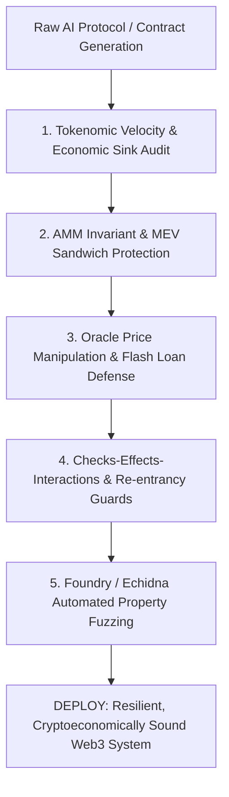

# VIBE CODER'S CRYPTOCURRENCY MARKET & WEB3 ENGINEERING CANON
## The 50 Authoritative Books on Cryptoeconomics, DeFi Microstructure, Consensus, Smart Contract Security, Macro Cycles, and Forensic History

> In decentralized financial systems, **code is law, and vulnerabilities are permanent**.
> When a smart contract is exploited, there is no customer service or central bank bailout.
> This guide details the 50 foundational texts that equip vibe code builders with mathematical rigor,
> mechanism design discipline, and forensic vigilance to build resilient Web3 systems.

---

## Cryptoeconomic Foundations, Mechanism Design & Tokenomics

### #1. Token Economy: How the Web3 Reinvents the Internet
- **Author(s)**: Shermin Voshmgir
- **Publisher / Edition**: Token Kitchen (2020 (2nd Edition))
- **ISBN-10**: `3982208505` | **ISBN-13**: `978-3982208503`
- **Core Premise**: Token engineering, token classification frameworks, bonding curves, token velocity (MV = PQ), and purpose-driven tokens.
- **The Vibe Coder's Edge**: Mandatory foundation to prevent building unbacked utility tokens with high velocity that bleed value to zero.

### #2. Algorithmic Game Theory
- **Author(s)**: Noam Nisan, Tim Roughgarden, Eva Tardos, Vijay V. Vazirani
- **Publisher / Edition**: Cambridge University Press (2007)
- **ISBN-10**: `0521872820` | **ISBN-13**: `978-0521872829`
- **Core Premise**: Nash equilibria, price of anarchy, mechanism design, combinatorial auctions, and selfish routing.
- **The Vibe Coder's Edge**: The foundational mathematical text for understanding decentralized protocol incentives and Byzantine game theory.

### #3. Twenty Lectures on Algorithmic Game Theory
- **Author(s)**: Tim Roughgarden
- **Publisher / Edition**: Cambridge University Press (2016)
- **ISBN-10**: `131662479X` | **ISBN-13**: `978-1316624791`
- **Core Premise**: Myerson's lemma, VCG mechanism, revenue-maximizing auctions, and price of stability.
- **The Vibe Coder's Edge**: Directly authored the cryptoeconomic formalization of Ethereum's EIP-1559 base fee burning mechanism.

### #4. Game Theory: An Introduction
- **Author(s)**: Steven Tadelis
- **Publisher / Edition**: Princeton University Press (2013)
- **ISBN-10**: `0691129088` | **ISBN-13**: `978-0691129082`
- **Core Premise**: Strategic-form games, extensive-form games, repeated games, subgame perfection, and asymmetric information.
- **The Vibe Coder's Edge**: Essential for modeling multi-agent staking games, validator slashing conditions, and collusion resistance.

### #5. Handbook of Digital Currency: Bitcoin, Innovation, Financial Instruments, and Big Data
- **Author(s)**: David Lee Kuo Chuen
- **Publisher / Edition**: Academic Press (2015)
- **ISBN-10**: `0128021179` | **ISBN-13**: `978-0128021170`
- **Core Premise**: Early academic treatise on digital currencies, decentralized financial instruments, and network economics.
- **The Vibe Coder's Edge**: Provides deep historical perspective on money digitization and statistical analysis of crypto asset behavior.

### #6. Tokenomics: The Crypto Shift of Blockchains, ICOs, and Tokens
- **Author(s)**: Sean Au, Thomas Power
- **Publisher / Edition**: Packt Publishing (2018)
- **ISBN-10**: `1789134374` | **ISBN-13**: `978-1789134377`
- **Core Premise**: Token distribution models, vesting schedules, utility vs. security tokens, and ecosystem governance.
- **The Vibe Coder's Edge**: Guides practical token distribution design, investor lockups, and avoiding inflationary token death spirals.

### #7. Mechanism Design: A Linear Programming Approach
- **Author(s)**: Rakesh V. Vohra
- **Publisher / Edition**: Cambridge University Press (2011)
- **ISBN-10**: `0521194687` | **ISBN-13**: `978-0521194686`
- **Core Premise**: Linear programming duality applied to incentive compatibility, revenue equivalence, and optimal mechanism selection.
- **The Vibe Coder's Edge**: Mathematical toolkit for optimizing block builder auctions, validator rewards, and decentralized fee markets.

### #8. Handbook of Blockchain, Digital Finance, and Inclusion, Volume 1: Cryptocurrency, FinTech, InsurTech, and Regulation
- **Author(s)**: David Lee Kuo Chuen, Robert H. Deng
- **Publisher / Edition**: Academic Press (2017)
- **ISBN-10**: `0128104414` | **ISBN-13**: `978-0128104415`
- **Core Premise**: Systemic architecture of crypto finance, regulatory frameworks, smart contract governance, and inclusion models.
- **The Vibe Coder's Edge**: Helps vibe coders architect compliant, cross-border token ecosystems that withstand legal and economic scrutiny.

### #9. An Introduction to Game Theory
- **Author(s)**: Martin J. Osborne
- **Publisher / Edition**: Oxford University Press (2003)
- **ISBN-10**: `0195128958` | **ISBN-13**: `978-0195128956`
- **Core Premise**: Evolutionary game theory, signaling, Bayesian games, and strictly competitive games.
- **The Vibe Coder's Edge**: Rigorous modeling of consensus participants where Byzantine actors have unknown payoffs and information asymmetry.

---

## DeFi Primitives, Market Microstructure, AMMs & MEV

### #10. DeFi and the Future of Finance
- **Author(s)**: Campbell R. Harvey, Ashwin Ramachandran, Joey Santoro
- **Publisher / Edition**: John Wiley & Sons (2021)
- **ISBN-10**: `1119836018` | **ISBN-13**: `978-1119836018`
- **Core Premise**: DeFi primitives, automated market makers (x * y = k), flash loans, impermanent loss, and yield farming.
- **The Vibe Coder's Edge**: The foundational textbook defining liquidity pool math, flash lending risks, and composable DeFi architecture.

### #11. Market Microstructure in Practice
- **Author(s)**: Charles-Albert Lehalle, Sophie Laruelle
- **Publisher / Edition**: World Scientific Publishing (2018 (2nd Edition))
- **ISBN-10**: `9813230835` | **ISBN-13**: `978-9813230835`
- **Core Premise**: Limit order books, tick sizes, queue dynamics, execution algorithms, and market impact models.
- **The Vibe Coder's Edge**: Crucial for comparing centralized order book matching engines (CLOBs) with on-chain automated market makers.

### #12. Algorithmic and High-Frequency Trading
- **Author(s)**: Álvaro Cartea, Sebastian Jaimungal, José Penalva
- **Publisher / Edition**: Cambridge University Press (2015)
- **ISBN-10**: `1107091144` | **ISBN-13**: `978-1107091146`
- **Core Premise**: Almgren-Chriss optimal liquidation, stochastic optimal control, Hawkes processes, and inventory risk.
- **The Vibe Coder's Edge**: Directly applicable to DEX arbitrage bots, just-in-time (JIT) liquidity provision, and on-chain liquidation bots.

### #13. Empirical Market Microstructure: The Institutions, Economics, and Econometrics of Securities Trading
- **Author(s)**: Joel Hasbrouck
- **Publisher / Edition**: Oxford University Press (2007)
- **ISBN-10**: `0195301641` | **ISBN-13**: `978-0195301649`
- **Core Premise**: Roll model of bid-ask spread, Glosten-Milgrom model of informed trading, and vector autoregression (VAR) of order flows.
- **The Vibe Coder's Edge**: Teaches how toxic order flow and informed arbitrage drain capital from passive liquidity providers (LVR - Loss Versus Rebalancing).

### #14. Trading and Exchanges: Market Microstructure for Practitioners
- **Author(s)**: Larry Harris
- **Publisher / Edition**: Oxford University Press (2002)
- **ISBN-10**: `0195144708` | **ISBN-13**: `978-0195144703`
- **Core Premise**: Order types, market makers, liquidity suppliers, informed traders, and market manipulation mechanics.
- **The Vibe Coder's Edge**: The ultimate practical manual for market mechanics: reveals how front-running and sandwich attacks function economically.

### #15. Trades, Quotes and Prices: Financial Markets Under the Microscope
- **Author(s)**: Jean-Philippe Bouchaud, Julius Bonart, Jonathan Donier, Martin Gould
- **Publisher / Edition**: Cambridge University Press (2018)
- **ISBN-10**: `1107164036` | **ISBN-13**: `978-1107164031`
- **Core Premise**: Square-root law of market impact, anomalous volatility, order book resilience, and non-equilibrium pricing.
- **The Vibe Coder's Edge**: Enables modeling price slippage on concentrated liquidity DEXes (Uniswap v3) under large transaction sizes.

### #16. Flash Boys: A Wall Street Revolt
- **Author(s)**: Michael Lewis
- **Publisher / Edition**: W. W. Norton & Company (2014)
- **ISBN-10**: `0393244660` | **ISBN-13**: `978-0393244663`
- **Core Premise**: Latency arbitrage, dark pools, payment for order flow, and structural front-running in electronic exchanges.
- **The Vibe Coder's Edge**: The spiritual blueprint for Maximal Extractable Value (MEV): mempool front-running, back-running, and Flashbots auctions.

### #17. Quantitative Trading: How to Build Your Own Algorithmic Trading Business
- **Author(s)**: Ernest P. Chan
- **Publisher / Edition**: John Wiley & Sons (2021 (2nd Edition))
- **ISBN-10**: `1119800064` | **ISBN-13**: `978-1119800064`
- **Core Premise**: Mean reversion, momentum strategies, risk management, execution costs, and automated trade execution.
- **The Vibe Coder's Edge**: Essential for building production crypto market-making bots and automated cross-DEX arbitrage pipelines.

### #18. Options, Futures, and Other Derivatives
- **Author(s)**: John C. Hull
- **Publisher / Edition**: Pearson (2021 (11th Edition))
- **ISBN-10**: `013693997X` | **ISBN-13**: `978-0136939979`
- **Core Premise**: Black-Scholes-Merton model, Greeks, perpetual futures mechanics, funding rates, and interest rate swaps.
- **The Vibe Coder's Edge**: The technical bedrock for engineering on-chain perpetual DEXes (GMX, dYdX), synthetic assets, and structured DeFi vaults.

---

## Blockchain Architecture, Consensus & Cryptography

### #19. Mastering Bitcoin: Programming the Open Blockchain
- **Author(s)**: Andreas M. Antonopoulos, David A. Harding
- **Publisher / Edition**: O'Reilly Media (2023 (3rd Edition))
- **ISBN-10**: `1098150090` | **ISBN-13**: `978-1098150099`
- **Core Premise**: UTXO model, Bitcoin Script, ECDSA, Schnorr signatures, Taproot, and Proof-of-Work difficulty adjustment.
- **The Vibe Coder's Edge**: The definitive technical guide for implementing decentralized transaction validation and peer-to-peer gossip networks.

### #20. Bitcoin and Cryptocurrency Technologies: A Comprehensive Introduction
- **Author(s)**: Arvind Narayanan, Joseph Bonneau, Edward Felten, Andrew Miller, Steven Goldfeder
- **Publisher / Edition**: Princeton University Press (2016)
- **ISBN-10**: `0691171696` | **ISBN-13**: `978-0691171692`
- **Core Premise**: Hash pointers, Merkle trees, zero-knowledge proofs, consensus without identity, and crypto regulatory attacks.
- **The Vibe Coder's Edge**: Princeton's computer science textbook: breaks cryptographic consensus down to formal, verifiable state machine proofs.

### #21. Designing Data-Intensive Applications: The Big Ideas Behind Reliable, Scalable, and Maintainable Systems
- **Author(s)**: Martin Kleppmann
- **Publisher / Edition**: O'Reilly Media (2017)
- **ISBN-10**: `1449373321` | **ISBN-13**: `978-1449373320`
- **Core Premise**: Replication, partitioning, distributed transactions, consensus algorithms (Raft, Paxos), and Byzantine faults.
- **The Vibe Coder's Edge**: Teaches vibe coders how to architect decentralized state stores, indexers, and RPC node clusters that never fail.

### #22. Serious Cryptography: A Practical Introduction to Modern Encryption
- **Author(s)**: Jean-Philippe Aumasson
- **Publisher / Edition**: No Starch Press (2017)
- **ISBN-10**: `1593278268` | **ISBN-13**: `978-1593278267`
- **Core Premise**: Symmetric ciphers, hash functions, elliptic curve cryptography (secp256k1, Ed25519), and quantum resistance.
- **The Vibe Coder's Edge**: Invaluable for spotting subtle cryptographic flaws: nonce reuse in ECDSA signatures that leaks private keys.

### #23. Real-World Cryptography
- **Author(s)**: David Wong
- **Publisher / Edition**: Manning Publications (2021)
- **ISBN-10**: `1617296716` | **ISBN-13**: `978-1617296710`
- **Core Premise**: Multi-party computation (MPC), zero-knowledge proofs (zk-SNARKs), threshold signatures, and post-quantum crypto.
- **The Vibe Coder's Edge**: Direct guide to modern Web3 cryptographic protocols: rollup proofs, account abstraction, and institutional MPC wallets.

### #24. Cryptography Engineering: Design Principles and Practical Applications
- **Author(s)**: Niels Ferguson, Bruce Schneier, Tadayoshi Kohno
- **Publisher / Edition**: John Wiley & Sons (2010)
- **ISBN-10**: `0470474246` | **ISBN-13**: `978-0470474242`
- **Core Premise**: Key negotiation, PRNG generators, side-channel attacks, secure key storage, and authentication protocols.
- **The Vibe Coder's Edge**: Prevents catastrophic key management failures in Web3 backends, custody HSMs, and hardware signer integration.

### #25. Mastering Monero: The Future of Privacy on the Blockchain
- **Author(s)**: SerHack et al.
- **Publisher / Edition**: Independently published (2018)
- **ISBN-10**: `1731301901` | **ISBN-13**: `978-1731301901`
- **Core Premise**: Ring Confidential Transactions (RingCT), stealth addresses, Pedersen commitments, and bulletproofs.
- **The Vibe Coder's Edge**: The primer on transactional zero-knowledge and privacy tech: essential for building confidential smart contract systems.

### #26. Fault-Tolerant Message-Passing Distributed Systems: An Algorithmic Approach
- **Author(s)**: Michel Raynal
- **Publisher / Edition**: Springer (2018)
- **ISBN-10**: `3319941402` | **ISBN-13**: `978-3319941400`
- **Core Premise**: Asynchronous consensus bounds, FLP impossibility, broadcast primitives, and Byzantine quorum systems.
- **The Vibe Coder's Edge**: Provides exact mathematical impossibility boundaries for L1/L2 bridge finality and cross-chain messaging.

### #27. Understanding Cryptography: A Textbook for Students and Practitioners
- **Author(s)**: Christof Paar, Jan Pelzl
- **Publisher / Edition**: Springer (2010)
- **ISBN-10**: `3642041000` | **ISBN-13**: `978-3642041006`
- **Core Premise**: Finite field arithmetic, modular arithmetic, RSA, Diffie-Hellman, and digital signature algorithms.
- **The Vibe Coder's Edge**: Mastery of the Galois field mathematics underlying elliptic curve pairings and polynomial commitments (KZG).

---

## Smart Contract Engineering, Security & Exploit Forensics

### #28. Mastering Ethereum: Building Smart Contracts and DApps
- **Author(s)**: Andreas M. Antonopoulos, Gavin Wood
- **Publisher / Edition**: O'Reilly Media (2018)
- **ISBN-10**: `1491971940` | **ISBN-13**: `978-1491971949`
- **Core Premise**: EVM architecture, gas economics, storage layouts, contract bytecode, and ABI encoding.
- **The Vibe Coder's Edge**: Co-authored by Ethereum's CTO: mandatory read for mastering EVM execution opcodes and memory management.

### #29. Building Ethereum DApps: Decentralized Applications on the Ethereum Blockchain
- **Author(s)**: Roberto Infante
- **Publisher / Edition**: Manning Publications (2019)
- **ISBN-10**: `1617295159` | **ISBN-13**: `978-1617295157`
- **Core Premise**: Full-stack Web3 application development, event listening, web3.js/ethers integration, and contract deployment.
- **The Vibe Coder's Edge**: Guides clean separation between frontend state machines, cryptographic wallet signatures, and on-chain logic.

### #30. Solidity Programming Essentials: A Beginner's Guide to Build Smart Contracts for Ethereum and Blockchain
- **Author(s)**: Ritesh Modi
- **Publisher / Edition**: Packt Publishing (2018)
- **ISBN-10**: `1788831381` | **ISBN-13**: `978-1788831383`
- **Core Premise**: Solidity syntax, data types, inheritance, interfaces, modifiers, and event emission patterns.
- **The Vibe Coder's Edge**: Accelerates syntax grounding and compiler optimization checks for rapid smart contract vibe-coding.

### #31. Hands-On Smart Contract Development with Solidity and Ethereum
- **Author(s)**: Kevin Solorio, Randall Kanna, Dave Hoover
- **Publisher / Edition**: O'Reilly Media (2019)
- **ISBN-10**: `1492045268` | **ISBN-13**: `978-1492045267`
- **Core Premise**: Automated unit testing, mock contracts, upgradability patterns, and contract deployment pipelines.
- **The Vibe Coder's Edge**: Teaches test-driven smart contract development (TDD) to prevent unvalidated contracts from reaching mainnet.

### #32. The Art of Software Security Assessment: Identifying and Preventing Software Vulnerabilities
- **Author(s)**: Mark Dowd, John McDonald, Justin Schuh
- **Publisher / Edition**: Addison-Wesley Professional (2006)
- **ISBN-10**: `0321444426` | **ISBN-13**: `978-0321444424`
- **Core Premise**: Integer overflows, type confusion, race conditions, memory corruption, and logic vulnerability hunting.
- **The Vibe Coder's Edge**: The premier handbook for security auditors: explains how minor arithmetic and state desynchronizations become multimillion-dollar exploits.

### #33. Fuzzing for Software Security Testing and Quality Assurance
- **Author(s)**: Ari Takanen, Jared D. DeMott, Charlie Miller
- **Publisher / Edition**: Artech House (2018 (2nd Edition))
- **ISBN-10**: `1608078507` | **ISBN-13**: `978-1608078509`
- **Core Premise**: Coverage-guided fuzzing, mutation-based test inputs, property-based testing, and crash triage.
- **The Vibe Coder's Edge**: Essential for configuring automated invariant fuzzing harnesses (Foundry, Echidna, Medusa) to break contracts pre-deployment.

### #34. Applied Cryptography: Protocols, Algorithms, and Source Code in C
- **Author(s)**: Bruce Schneier
- **Publisher / Edition**: John Wiley & Sons (2015 (20th Anniversary Edition))
- **ISBN-10**: `1119096723` | **ISBN-13**: `978-1119096726`
- **Core Premise**: Zero-knowledge proofs, mental poker, secret sharing, commitment schemes, and cryptographic protocols.
- **The Vibe Coder's Edge**: Enables designing novel cryptoeconomic commitments, verifiable random functions (VRF), and fair-ordering protocols.

### #35. Threat Modeling: Designing for Security
- **Author(s)**: Adam Shostack
- **Publisher / Edition**: John Wiley & Sons (2014)
- **ISBN-10**: `1118809998` | **ISBN-13**: `978-1118809990`
- **Core Premise**: STRIDE framework, attack trees, privilege escalation paths, and threat boundary mapping.
- **The Vibe Coder's Edge**: Enforces systematic attack-surface modeling across bridges, oracles, admin multisigs, and user deposit contracts.

---

## Market Cycles, Macro Liquidity & Behavioral Reflexivity

### #36. The Alchemy of Finance
- **Author(s)**: George Soros
- **Publisher / Edition**: John Wiley & Sons (2003)
- **ISBN-10**: `0471445495` | **ISBN-13**: `978-0471445494`
- **Core Premise**: The Theory of Reflexivity: feedback loops between subjective market perceptions and objective fundamentals.
- **The Vibe Coder's Edge**: The core cognitive model for crypto cycles: why speculative price increases bootstrap genuine network effects and developer mindshare.

### #37. Mastering the Market Cycle: Getting the Odds on Your Side
- **Author(s)**: Howard Marks
- **Publisher / Edition**: Houghton Mifflin Harcourt (2018)
- **ISBN-10**: `1328479250` | **ISBN-13**: `978-1328479259`
- **Core Premise**: The pendulum of investor sentiment, risk tolerance cycles, credit cycles, and positioning for asymmetric payoff.
- **The Vibe Coder's Edge**: Prevents buying tops during euphoric crypto bull markets; guides capital allocation when blood is in the streets.

### #38. Manias, Panics, and Crashes: A History of Financial Crises
- **Author(s)**: Charles P. Kindleberger, Robert Z. Aliber
- **Publisher / Edition**: Palgrave Macmillan (2015 (7th Edition))
- **ISBN-10**: `1137525754` | **ISBN-13**: `978-1137525758`
- **Core Premise**: The Minsky credit model: displacement, boom, euphoria, profit taking, panic, and lender-of-last-resort intervention.
- **The Vibe Coder's Edge**: Demonstrates that crypto crashes (Terra-Luna, Celsius, FTX) follow the exact 400-year historical template of classic banking panics.

### #39. Irrational Exuberance
- **Author(s)**: Robert J. Shiller
- **Publisher / Edition**: Princeton University Press (2015 (3rd Edition))
- **ISBN-10**: `0691166269` | **ISBN-13**: `978-0691166261`
- **Core Premise**: Structural, cultural, and psychological factors behind asset bubbles; narrative economics and CAPE valuation.
- **The Vibe Coder's Edge**: Allows vibe coders to quantify narrative contagion and social media sentiment feedback loops in meme coins and NFT runs.

### #40. The Price of Tomorrow: Why Deflation is the Key to an Abundant Future
- **Author(s)**: Jeff Booth
- **Publisher / Edition**: Stanley Press (2020)
- **ISBN-10**: `1999222202` | **ISBN-13**: `978-1999222208`
- **Core Premise**: Technological deflation vs. debt-fueled fiat monetary expansion; the economic imperative of sound, hard money.
- **The Vibe Coder's Edge**: Synthesizes artificial intelligence productivity gains with hard-money cryptocurrency thesis for long-term tech strategy.

### #41. The Bitcoin Standard: The Decentralized Alternative to Central Banking
- **Author(s)**: Saifedean Ammous
- **Publisher / Edition**: John Wiley & Sons (2018)
- **ISBN-10**: `1119473861` | **ISBN-13**: `978-1119473862`
- **Core Premise**: Austrian economics, high vs. low time preference, stock-to-flow ratio, and the historical evolution of sound money.
- **The Vibe Coder's Edge**: Articulates the fundamental economic philosophy driving institutional Bitcoin adoption as digital gold.

### #42. Principles for Navigating Big Debt Crises
- **Author(s)**: Ray Dalio
- **Publisher / Edition**: Avid Reader Press / Simon & Schuster (2018)
- **ISBN-10**: `1982112107` | **ISBN-13**: `978-1982112103`
- **Core Premise**: Short-term and long-term debt cycles, inflationary vs. deflationary deleveragings, and beautiful deleveraging math.
- **The Vibe Coder's Edge**: Essential for analyzing macro liquidity injections, Federal Reserve balance sheet shifts, and their spillover into crypto prices.

### #43. Layered Money: From Gold and Dollars to Bitcoin and Central Bank Digital Currencies
- **Author(s)**: Nik Bhatia
- **Publisher / Edition**: Tan Books (2021)
- **ISBN-10**: `173610490X` | **ISBN-13**: `978-1736104903`
- **Core Premise**: Hierarchical monetary systems, counterparty risk, first-layer settlement assets vs. second-layer credit instruments.
- **The Vibe Coder's Edge**: Models Lightning Network, L2 rollups, and fiat stablecoins as layered monetary structures with distinct liquidity profiles.

---

## Industry History, Geopolitics & Forensic Chronicles

### #44. Digital Gold: Bitcoin and the Inside Story of the Misfits and Millionaires Trying to Reinvent Money
- **Author(s)**: Nathaniel Popper
- **Publisher / Edition**: Harper (2015)
- **ISBN-10**: `006236250X` | **ISBN-13**: `978-0062362506`
- **Core Premise**: The origins of Bitcoin, Cypherpunks, early developer drama, Mt. Gox, and the initial wave of Silicon Valley venture funding.
- **The Vibe Coder's Edge**: Essential cultural lore: teaches why decentralization and censorship resistance are non-negotiable ethos in Web3.

### #45. The Infinite Machine: How an Army of Crypto-Hackers Is Building the Next Internet with Ethereum
- **Author(s)**: Camila Russo
- **Publisher / Edition**: Harper Business (2020)
- **ISBN-10**: `0062886142` | **ISBN-13**: `978-0062886149`
- **Core Premise**: The founding of Ethereum, Vitalik Buterin, The DAO hack, the Ethereum Classic hard fork, and the birth of DeFi.
- **The Vibe Coder's Edge**: Vital case study on crisis governance, social consensus overrides, and the immutable code vs. subjective intent debate.

### #46. Tracers in the Dark: The Global Hunt for the Crime Lords of Cryptocurrency
- **Author(s)**: Andy Greenberg
- **Publisher / Edition**: Doubleday (2022)
- **ISBN-10**: `0385548095` | **ISBN-13**: `978-0385548090`
- **Core Premise**: Blockchain analytics forensics, Silk Road takedown, BTC-e laundering, AlphaBay, and deanonymization algorithms.
- **The Vibe Coder's Edge**: Reveals how forensic investigators (Chainalysis, IRS-CI) trace pseudonymous UTXO graphs and cluster on-chain identities.

### #47. Number Go Up: Inside Crypto's Wild Rise and Staggering Fall
- **Author(s)**: Zeke Faux
- **Publisher / Edition**: Crown (2023)
- **ISBN-10**: `0593441095` | **ISBN-13**: `978-0593441091`
- **Core Premise**: Tether reserves investigation, Southeast Asian pig-butchering syndicates, Axie Infinity crash, and the SBF collapse.
- **The Vibe Coder's Edge**: Critical forensic lens on stablecoin reserve composition, counterparty opacity, and predatory Ponzi dynamics.

### #48. Going Infinite: The Rise and Fall of a New Tycoon
- **Author(s)**: Michael Lewis
- **Publisher / Edition**: W. W. Norton & Company (2023)
- **ISBN-10**: `1398526401` | **ISBN-13**: `978-1398526402`
- **Core Premise**: The collapse of FTX and Alameda Research, balance sheet fabrication, commingling customer funds, and risk management fraud.
- **The Vibe Coder's Edge**: The ultimate lesson in why decentralized, self-custodial smart contracts must replace centralized custodial exchanges (CeFi).

### #49. The Cryptopians: Idealism, Greed, Lies, and the Making of the First Big Cryptocurrency Craze
- **Author(s)**: Laura Shin
- **Publisher / Edition**: PublicAffairs (2022)
- **ISBN-10**: `1541763017` | **ISBN-13**: `978-1541763012`
- **Core Premise**: The 2017 ICO bubble, forensic deanonymization of The DAO hacker, internal Ethereum Foundation politics, and EIP battles.
- **The Vibe Coder's Edge**: Forensic investigative rigor: illustrates how transaction graph clustering can solve historical blockchain mysteries years later.

### #50. Coined: The Rich Life of Money and How Its History Has Shaped Us
- **Author(s)**: Kabir Sehgal
- **Publisher / Edition**: Grand Central Publishing (2015)
- **ISBN-10**: `1455525219` | **ISBN-13**: `978-1455525218`
- **Core Premise**: Anthropological, biological, and neurological roots of money; commodity money to fiat to decentralized tokens.
- **The Vibe Coder's Edge**: Provides deep historical perspective on why money is fundamentally a societal consensus protocol and memory technology.

---

## The Vibe Coder's Cryptoeconomic Verification & Security Architecture

